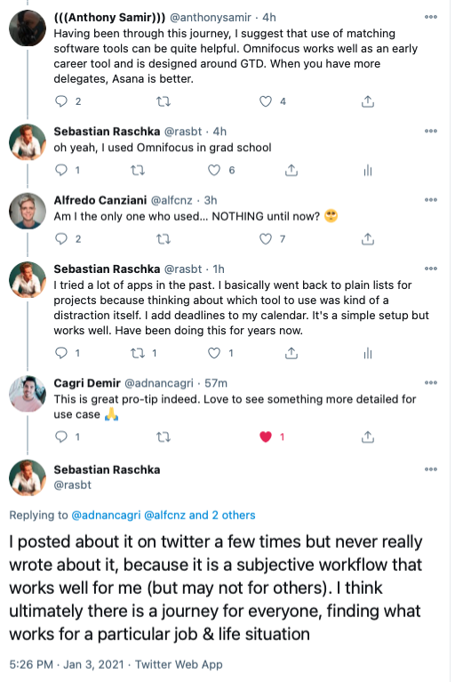
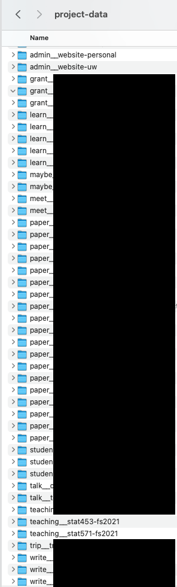
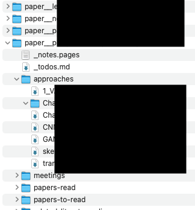
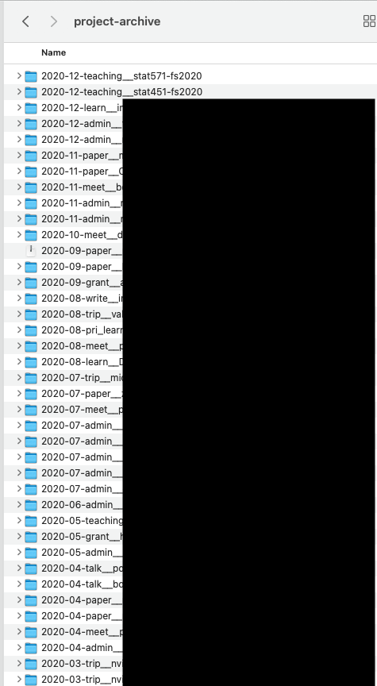
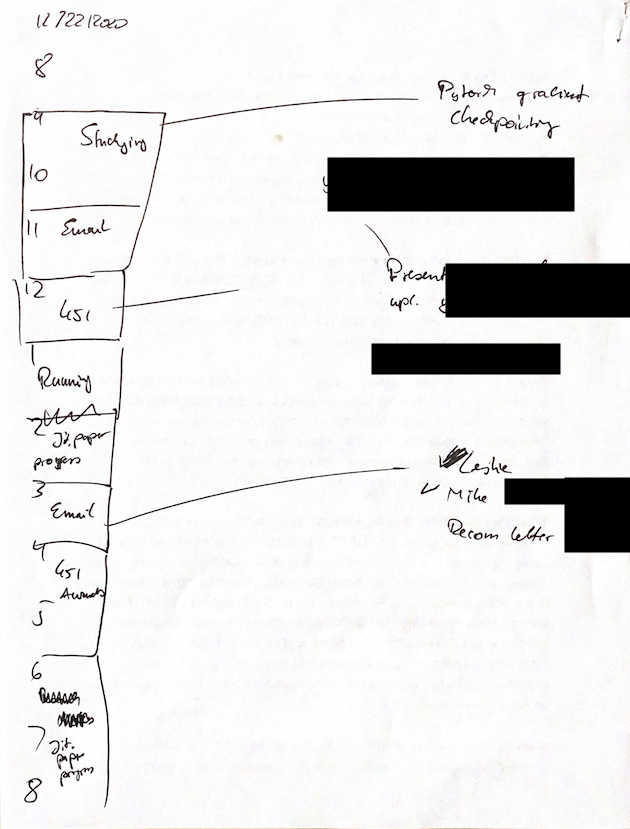

How I Keep My Projects Organized

[塞巴斯蒂安· 拉施卡](https://sebastianraschka.com/)

[博客](https://sebastianraschka.com/blog/index.html)[书籍](https://sebastianraschka.com/books.html)[研究](https://sebastianraschka.com/publications.html)[其他地方](https://sebastianraschka.com/elsewhere.html)[资源](https://sebastianraschka.com/resources.html)[软件](https://sebastianraschka.com/software.html)[教学](http://pages.stat.wisc.edu/~sraschka/teaching)  

  [\[RSS\]](https://sebastianraschka.com/rss_feed.xml)

# 如何保持我的项目井然有序

2021年1月3  
日 塞巴斯蒂安·拉施卡

**目录**

- [动机](#motivation)
- [项目文件夹](#project-folders)
- [项目存档](#project-archival)
- [每周回顾](#weekly-review)
- [每日待办事项列表和时间阻塞](#daily-todo-lists-and-time-blocking)
- [跨计算机同步项目数据](#syncing-project-data-across-machines)
- [备份](#backups)
- [研究论文](#research-papers)
- [长期票据](#long-term-notes)
- [结论](#conclusion)

  

* * *

  

## 动机

自从我2008年开始本科学习以来，我一直痴迷于生产力提示、笔记解决方案和待办事项列表管理。多年来，我尝试了很多很多的工作流和数百种（大部分是数字）工具，以保持我的生活、项目和笔记井然有序。

有时，我与朋友和同事交流想法，根据要求，我在Twitter上谈论了几次我的工作流程。在今天的2021年版讨论之后，我认为写一篇快速而非正式的博文是有意义的，如果有人再次询问它，可以更容易地阅读和快速:)。

总的来说，我的方法灵感来自大卫艾伦[的把事情做好](https://gettingthingsdone.com)。此外，它是一个主要是数字工作流程与一些笔和纸元素。经过多年使用专用工具和其他工作流的实验，我一直在使用它，没有重大更改或修改约四年了，它为我工作得很好。

就我个人而言，我的理念是避免订阅和专用工具将您锁定在特定的服务或生态系统中（这些服务或生态系统可能或可能几年后就不存在）。此外，由于我使用两台计算机，我的数据需要跨设备同步。另一个要求是，一切都应该很容易备份。

请注意，这个非正式的写主要是为了提供一个更详细的版本，我的方法"那些谁问"，如果你已经有一个良好的系统，我建议你坚持它。坚持使用一个系统可能是最重要的生产力建议，因为在寻求（不存在的）完美工具或工作流程时可能会浪费很多时间。

## 项目文件夹

从本质上讲，我的项目管理集中在一个所谓的"文件夹"，我保留我所有的活动项目。这些是我目前正在从事的项目。每个项目在文件夹中都有一个单独的文件夹，该文件夹的前缀为类别，例如，`project-data``project-data`

- `admin__`：各种行政事务（如我的网站，还有推荐信等）;
- `paper__`： 我目前正在处理的论文;
- `grant__`： 我正在努力申请;
- `learn__`： 我目前正在学习的东西 （书籍或在线课程）;
- `maybe__`： 对于可能很有趣， 但目前是分心的项目， 或者我可能想留在我的后头， 想回到以后的东西;
- ...
- `talk__`： 我要给的谈话;
- `trips__`：旅行相关材料，用于即将到来的旅行;
- `write__`：编写不是研究论文的项目（书籍、书籍章节或博客文章）。

在每个文件夹中，我保留与项目相关的文件，这些文件因项目的不同而不同。示例包括要阅读的文件、会议笔记、收据、数字和网络链接。例如，如果项目包括在 Overleaf 上协作编写，我会在主文件夹中包含一个到 Overleaf 项目的 Weblink。此外，每个文件夹都包含一个项目管理每个项目的待办事项列表。我在这些文件中添加有关到期日期的信息，并将其添加到我的日历（包括提醒）。

有时，我使用纯文本文件为待办事项列表。有时，如果我包含 LaTeX 方程或想要拖放图像或屏幕截图，我会使用标记文件页面文档。现在，我也经常使用 OneNote 页面，因为不错的复选框可以很容易地重新排序，然后在我的文件夹中包含指向 OneNote 页面的链接（一个缺点是备份可能成为问题 - 稍后将更多内容用于备份）。总的来说，我使用的工具是最适合使项目的待办事项列表。

稍后，我将解释更多有关如何使用这些待办事项列表的"每周回顾"和"每日待办事项列表和时间阻塞"部分。

## 项目存档

除了上述文件夹，我保留一个文件夹（回到我的学士论文在2011年）包含我完成的项目。`project-data``project-archive`

项目完成后，我会浏览文件夹内的项目文件夹，并确保我的计算机上有所有相关文件。例如，如果项目待办事项列表位于 OneNote 上，我会以 PDF 形式导出它，或者如果我将 Overleaf 用于协作编写项目，我会下载 LaTeX 源文件。然后，我使用完成的项目的年和月为前缀，然后移动到我的文件夹。`project-data``project-archive`

## 每周回顾

每周我回顾我的活动项目。通常，我每个星期天晚上花大约30-60分钟在这;有时， 我推迟它， 做第一件事星期一早上。在审查期间，我浏览我的项目文件夹，重点介绍项目的待办事项列表。我检查我前一周完成的项目，偶尔还会重新组织项目。从这些待办事项列表中，我每周编制一个待办事项清单，列出我想完成和想要完成的事情。`project-data`

虽然我也提到项目待办事项文件在一周内，这个每周待办事项列表是我给定一周的主要待办事项列表。我通常用它来制作我每天的待办事项列表，我使用时间阻止，我在下一节中对此进行解释。

通常，我打印我的每周待办事项列表，这样我就可以在它上涂鸦（用笔交叉的东西是奇怪的满足），并可以添加新的待办事项列表在列表的底部。除非是紧急的事情，我尝试做这些新待办事项列表项最后。

## 每日待办事项列表和时间阻塞

每天晚上，我查看我的日历和每周待办事项列表，以设计我来的第二天的工作计划。当我记错的时候，我认为我的时间阻塞方法受到卡尔·纽波特的《深层[习惯：计划你工作的每一分钟的重要性》的启发](https://www.calnewport.com/blog/2013/12/21/deep-habits-the-importance-of-planning-every-minute-of-your-work-day/)。

我用一张宽松的纸（我收集和扫描以后存档），并绘制出我的会议和事情，我想在那天工作。通常，我不严格坚持它，有时甚至取消项目，因为其他事情花了更长的时间或紧急的事情出现了。然而，有一个计划的好东西是，它给了我一个粗略的想法，什么是可行的在给定的一天，它帮助我保持期望可管理。

## 跨计算机同步项目数据

我喜欢在我的所有（两台）计算机上访问我所有的项目。（当我在校园和家庭办公室之间交替旅行时， 这是更重要的 Covid 前。为此，我使用的是 Microsoft OneDrive，但其他云同步服务可能同样有效。

在我的主计算机上，我的所有项目数据都离线可用。对于我的小存储笔记本电脑，我可以通过"按需文件"选项下载数据。我不工作/从移动设备，如我的iPhone和iPad - 我只使用前者导航，双因素身份验证，基本的手机功能，和后者的教学。但是，我假设这种云同步方法还允许从移动设备（例如，通过 OneDrive 应用）进行更多访问。

## 备份

我发现在文件夹结构中保留活动项目和存档项目会使常规备份的实现相对简单。我使用（也许太）许多备份解决方案来进行一些冗余。除了将项目数据放在云中之外，我使用 macOS 上的 TimeMachine 将计算机备份到物理磁盘[，使用 Arq](https://www.arqbackup.com)来创建其他带有时间戳的备份。此外，从去年开始，我复制我的活动项目和存档项目到SD卡，我保持在一个安全的位置。

我对于良好的备份的提示是演练假设方案：

- 我的公寓/房子被水淹没或烧毁;
- 我的电脑被盗或被毁;
- 我的办公室被水淹或烧毁。
- 如果云提供商 X 不可靠并使用我的数据， 会发生什么

如果您有在上述每个方案中恢复数据的计划，则您可能没问题。

## 研究论文

前面几节总结了我的核心项目管理工作流。关于研究论文，我通常保留，并保留每个项目特有的纸条。我不使用任何参考管理软件（我在某些时候尝试了它们，发现它们以某种方式限制或笨重）。文件浏览器的搜索功能通常非常适合在包含多个 PDF 的文件夹中按搜索词查找特定文档。此外，我发现每个项目的纸质笔记文档比向参考管理器本身添加注释更高效（这只是查找注释的另一个位置）。`papers-to-read``papers-read`

此外，我还保留一个主纸存档文件夹，我添加所有的文件和所有笔记。这是没有必要的， 但看到它成长多年让我感觉很好， :)。

## 长期票据

为了长期保存笔记（例如，通常有趣的论文花絮），我使用基于多库维基的个人[维基](https://www.dokuwiki.org/dokuwiki)。如果您已经为您的个人网站提供了一个网络服务器，这种方法是一个免费且经过验证的解决方案 \- 我不认为 DokuWiki 很快就会过时。

## 结论

请注意，我上面概述的工作流程是特别适合我的东西，但您的里程可能不同。我特别喜欢的是，它允许和启用

- 离线工作（有时，我喜欢关闭互联网，以提高焦点）;
- 跨设备进行简单和选择性同步（因为我有多台计算机）;
- 轻松备份（安心）。

也

- 没有强大的生态系统锁定（切换工具，甚至操作系统的未来不是问题）;
- 它基本上是免费的:);
- 它允许我使用特定的工具，每个项目，同时仍然保持组织和档案简单。

总的来说，我认为提高生产率的关键之一是找到一种最适合你并坚持下去的方法，通过不断切换事物和寻找更好的东西来避免焦虑。每5-10年左右重新评估一次方法可能:)。

© 2013-2021 塞巴斯蒂安·拉施卡