【技术调研】最强Node-RED初探总结_pdai的博客-CSDN博客_node red


# 【技术调研】最强Node-RED初探总结


[pdai](https://blog.csdn.net/sudadaipeng1) 2018-06-06 21:52:26 15990 <a id="blog_detail_zk_collection"></a>收藏 17 

分类专栏： [技术调研](https://blog.csdn.net/sudadaipeng1/category_7718492.html) 文章标签： [iot](https://so.csdn.net/so/search/s.do?q=iot&t=blog&o=vip&s=&l=&f=&viparticle=)

版权

最全的Java后端知识体系 https://www.pdai.tech, 每天更新中。

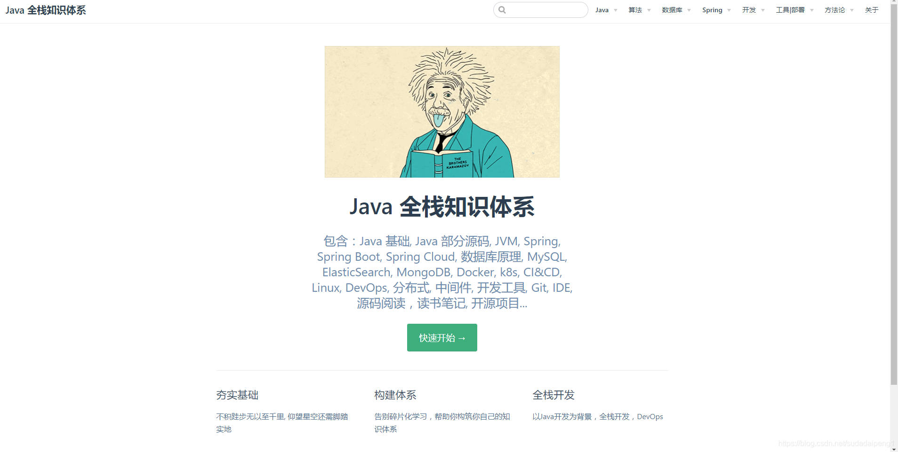

> 在某个项目中需要调研下node-red的功能，我大概花了三天时间研究了相关的官方文档，写了几个Demo总结了下node-red相关的功能。如需转载，请注明出处 https://www.cnblogs.com/pengdai/p/9143617.html -----2017年12月 @pdai

## <a id="t0"></a><a id="t0"></a><a id="_6"></a>内容目录

### <a id="t1"></a><a id="t1"></a>文章目录

- - [内容目录](#_6)
    - [Introduction](#Introduction_8)
    - - [Features](#Features_16)
        - - [Browser-based flow editing](#Browserbased_flow_editing_17)
            - [Built on Node.js](#Built_on_Nodejs_24)
            - [Social Development](#Social_Development_29)
        - [A first view example](#A_first_view_example_35)
    - [Installation](#Installation_46)
    - - [Install CentOS7](#Install_CentOS7_47)
        - [Install NodeJS](#Install_NodeJS_52)
        - [Install Node-RED](#Install_NodeRED_79)
        - [Run Node-RED](#Run_NodeRED_130)
    - [Demo](#Demo_181)
    - - [Demo1 - Hello world](#Demo1__Hello_world_182)
        - [Demo 2 - More flexible with functions](#Demo_2__More_flexible_with_functions_199)
        - [Demo 3 - Connect to MySQL](#Demo_3__Connect_to_MySQL_224)
        - [Demo 4 - HTTP Request + Import Flows](#Demo_4__HTTP_Request__Import_Flows_269)
        - - [HTTP endpoints](#HTTP_endpoints_275)
            - [Simple GET request](#Simple_GET_request_289)
        - [Demo 5 - MySQL + Restful](#Demo_5__MySQL__Restful_337)
    - [Q&A](#QA_352)
    - - [APIs provided by node-RED?](#APIs_provided_by_nodeRED_354)
        - - [Admin HTTP API](#Admin_HTTP_API_356)
            - [Runtime API](#Runtime_API_360)
            - [Storage API](#Storage_API_364)
            - [Editor UI Widgets](#Editor_UI_Widgets_368)
        - [How to change site port from 1880 to others?](#How_to_change_site_port_from_1880_to_others_375)
        - [How to use https?](#How_to_use_https_382)
        - [How to open auth?](#How_to_open_auth_400)
        - [How to open cors?](#How_to_open_cors_417)
        - [How to setup logging?](#How_to_setup_logging_429)
        - [How to hide the default UI node categories?](#How_to_hide_the_default_UI_node_categories_452)
        - [How manys settings could do in settings.js?](#How_manys_settings_could_do_in_settingsjs_461)
    - [Reference](#Reference_702)

## <a id="t2"></a><a id="t2"></a><a id="Introduction_8"></a>Introduction

> Node-RED is a visual tool for wiring the Internet of Things developed by IBM Emerging Technology and the open source community. Node-RED is a programming tool for wiring together hardware devices, APIs and online services in new and interesting ways.

It provides a browser-based editor that makes it easy to wire together flows using the wide range of nodes in the palette that can be deployed to its runtime in a single-click. Using Node-RED, developers wire up input, output and processing nodes to create flows to process data, control things, or send alerts.

For more details, please check below official site:
https://nodered.org/

### <a id="t3"></a><a id="t3"></a><a id="Features_16"></a>Features

#### <a id="Browserbased_flow_editing_17"></a>Browser-based flow editing

Node-RED provides a browser-based flow editor that makes it easy to wire together flows using the wide range of nodes in the palette. Flows can be then deployed to the runtime in a single-click.

JavaScript functions can be created within the editor using a rich text editor.

A built-in library allows you to save useful functions, templates or flows for re-use.

#### <a id="Built_on_Nodejs_24"></a>Built on Node.js

The light-weight runtime is built on Node.js, taking full advantage of its event-driven, non-blocking model. This makes it ideal to run at the edge of the network on low-cost hardware such as the Raspberry Pi as well as in the cloud.

With over 225,000 modules in Node’s package repository, it is easy to extend the range of palette nodes to add new capabilities.

#### <a id="Social_Development_29"></a>Social Development

The flows created in Node-RED are stored using JSON which can be easily imported and exported for sharing with others.

An online flow library allows you to share your best flows with the world.

### <a id="t4"></a><a id="t4"></a><a id="A_first_view_example_35"></a>A first view example

It works by allowing you to wire up web services or custom “nodes” to each other, or to things, to do things like:

- Send an email on a rainy weather forecast.
- Push sensor data to services like Twitter.
- Perform complex analysis on data with ease.


## <a id="t5"></a><a id="t5"></a><a id="Installation_46"></a>Installation

### <a id="t6"></a><a id="t6"></a><a id="Install_CentOS7_47"></a>Install CentOS7

- setup global proxy
- setup yum proxy
- yum update

### <a id="t7"></a><a id="t7"></a><a id="Install_NodeJS_52"></a>Install NodeJS

- Download latest nodejs - https://nodejs.org/en/download/
    
- Check this to install - https://www.cnblogs.com/8765h/p/4777746.html
    

```
`yum install wget
wget https://nodejs.org/dist/v8.9.1/node-v8.9.1-linux-x64.tar.xz
tar -xvf node-v8.9.1-linux-x64.tar.xz
ls
cd node-v8.9.1-linux-x64
cd bin
./node -v` 

- 1
- 2
- 3
- 4
- 5
- 6
- 7


```

Soft link to node and npm:

```
`ln -s /root/node-v8.9.1-linux-x64/bin/npm /usr/local/bin/ 
ln -s /root/node-v8.9.1-linux-x64/bin/node /usr/local/bin/` 

- 1
- 2


```

Check node command:

```
`node -v
npm -v` 

- 1
- 2


```

### <a id="t8"></a><a id="t8"></a><a id="Install_NodeRED_79"></a>Install Node-RED

> The easiest way to install Node-RED is to use node’s package manager, npm. Installing it as a global module adds the command node-red to your system path:

```
`sudo npm install -g --unsafe-perm node-red` 

- 1


```

Got error logs:

```
`npm ERR! code EPROTO
npm ERR! errno EPROTO
npm ERR! request to https://registry.npmjs.org/node-red failed, reason: write EPROTO 139688675866432:error:140770FC:SSL routines:SSL23_GET_SERVER_HELLO:unknown protocol:../deps/openssl/openssl/ssl/s23_clnt.c:825:
npm ERR!

npm ERR! A complete log of this run can be found in:
npm ERR!     /root/.npm/_logs/2017-11-20T06_43_01_981Z-debug.log` 

- 1
- 2
- 3
- 4
- 5
- 6
- 7


```

Check the issue and got this - http://blog.csdn.net/yypsober/article/details/51906616
So continue to config npm proxy:

```
`npm config set strict-ssl false
npm config set proxy http://10.193.12.222:63128
npm config set https-proxy=https://10.193.12.222:63128` 

- 1
- 2
- 3


```

But still got failed.

Then remove the global proxy and then set secure-ssl=false, you can update ~/.npmrc

```
`proxy=http://10.xxx.xxx.xxx:xxxxx/
strict-ssl=false
registry=http://registry.npmjs.org/` 

- 1
- 2
- 3


```

Continue to install node-red

```
`[root@node-red ~]# npm install -g --unsafe-perm node-red
npm WARN deprecated i18next-client@1.10.3: you can use npm install i18next from version 2.0.0
npm WARN deprecated nodemailer@1.11.0: All versions below 4.0.1 of Nodemailer are deprecated. See https://nodemailer.com/status/
npm WARN deprecated node-uuid@1.4.8: Use uuid module instead
/root/node-v8.9.1-linux-x64/bin/node-red -> /root/node-v8.9.1-linux-x64/lib/node_modules/_images/node-red/red.js
/root/node-v8.9.1-linux-x64/bin/node-red-pi -> /root/node-v8.9.1-linux-x64/lib/node_modules/_images/node-red/bin/node-red-pi
> bcrypt@1.0.3 install /root/node-v8.9.1-linux-x64/lib/node_modules/_images/node-red/node_modules/bcrypt
> node-pre-gyp install --fallback-to-build
[bcrypt] Success: "/root/node-v8.9.1-linux-x64/lib/node_modules/_images/node-red/node_modules/bcrypt/lib/binding/bcrypt_lib.node" is installed via remote
+ node-red@0.17.5
added 367 packages in 118.79s` 

- 1
- 2
- 3
- 4
- 5
- 6
- 7
- 8
- 9
- 10
- 11


```

### <a id="t9"></a><a id="t9"></a><a id="Run_NodeRED_130"></a>Run Node-RED

Run node-RED

```
`[root@node-red ~]# node-red
-bash: node-red: command not found
[root@node-red ~]# cd node-v8.9.1-linux-x64
[root@node-red node-v8.9.1-linux-x64]# ls
bin  CHANGELOG.md  etc  include  lib  LICENSE  README.md  share
[root@node-red node-v8.9.1-linux-x64]# cd bin/
[root@node-red bin]# ls
node  node-red  node-red-pi  npm  npx` 

- 1
- 2
- 3
- 4
- 5
- 6
- 7
- 8


```

Soft link to node-red:

```
`[root@node-red bin]# ln -s /root/node-v8.9.1-linux-x64/bin/node-red /usr/local/bin/` 

- 1


```

Run node-red:

```
`[root@node-red bin]# node-red
20 Nov 15:17:43 - [info]
Welcome to Node-RED
===================
20 Nov 15:17:43 - [info] Node-RED version: v0.17.5
20 Nov 15:17:43 - [info] Node.js  version: v8.9.1
20 Nov 15:17:43 - [info] Linux 3.10.0-693.5.2.el7.x86_64 x64 LE
20 Nov 15:17:43 - [info] Loading palette nodes
20 Nov 15:17:44 - [warn] ------------------------------------------------------
20 Nov 15:17:44 - [warn] [rpi-gpio] Info : Ignoring Raspberry Pi specific node
20 Nov 15:17:44 - [warn] ------------------------------------------------------
20 Nov 15:17:44 - [info] Settings file  : /root/.node-red/settings.js
20 Nov 15:17:44 - [info] User directory : /root/.node-red
20 Nov 15:17:44 - [info] Flows file     : /root/.node-red/flows_node-red.json
20 Nov 15:17:44 - [info] Creating new flow file
20 Nov 15:17:44 - [info] Starting flows
20 Nov 15:17:44 - [info] Started flows
20 Nov 15:17:44 - [info] Server now running at http://127.0.0.1:1880/` 

- 1
- 2
- 3
- 4
- 5
- 6
- 7
- 8
- 9
- 10
- 11
- 12
- 13
- 14
- 15
- 16
- 17
- 18


```

Close firewall and open site:

```
`systemctl stop firewalld
systemctl disable firewalld` 

- 1
- 2


```

Open http://10.192.29.241:1880
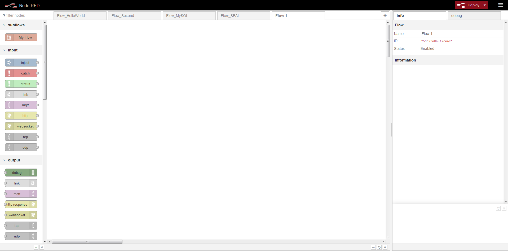

## <a id="t10"></a><a id="t10"></a><a id="Demo_181"></a>Demo

### <a id="t11"></a><a id="t11"></a><a id="Demo1__Hello_world_182"></a>Demo1 - Hello world

Create Flow


Add Input - Inject


Add Output - Debug

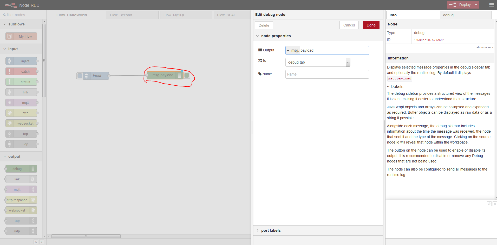

Deploy & Trigger to see result


### <a id="t12"></a><a id="t12"></a><a id="Demo_2__More_flexible_with_functions_199"></a>Demo 2 - More flexible with functions

Create Flow

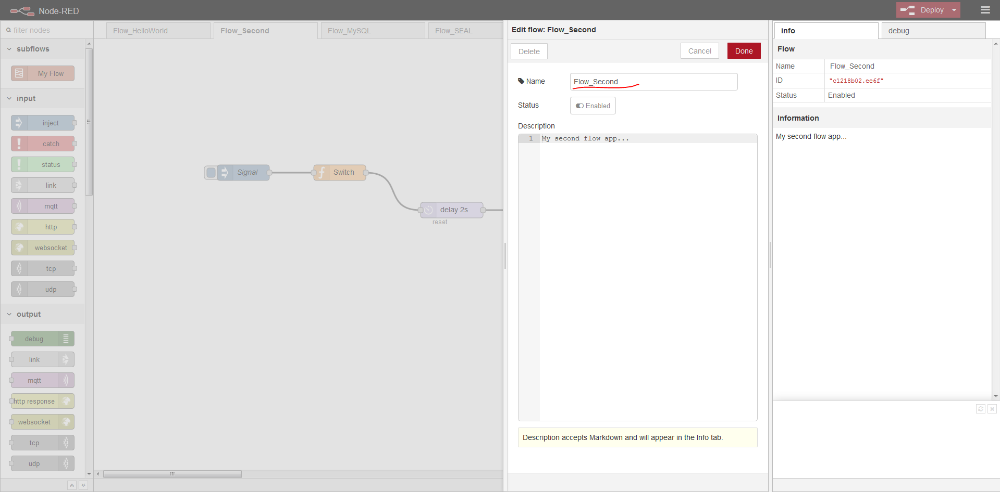

Add Input - Inject

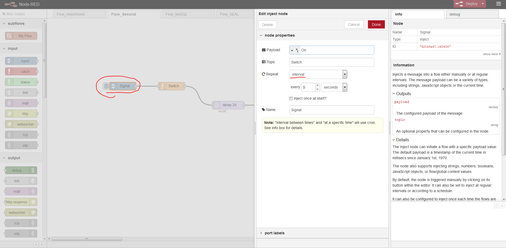

Add Function


Add Delay 2s


Add Output - Debug

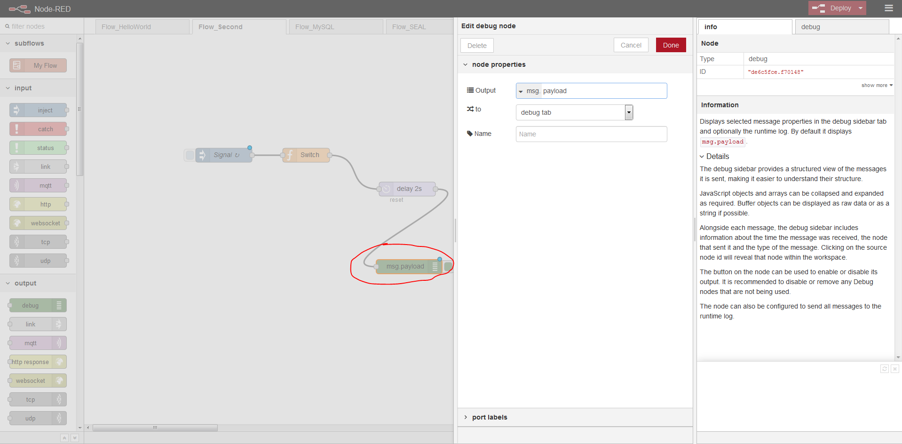

Deploy & Trigger to see result


### <a id="t13"></a><a id="t13"></a><a id="Demo_3__Connect_to_MySQL_224"></a>Demo 3 - Connect to MySQL

Create flow


Install mysql node

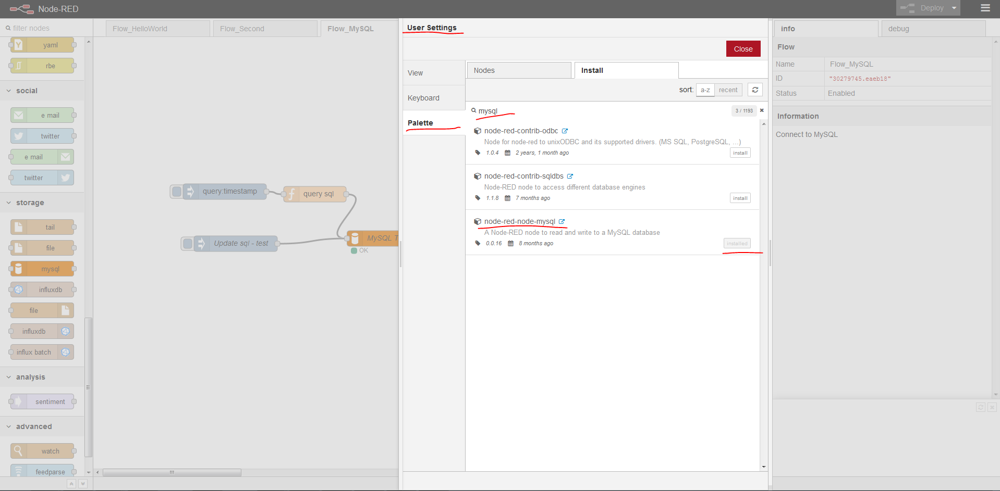

Setup mysql node - connection

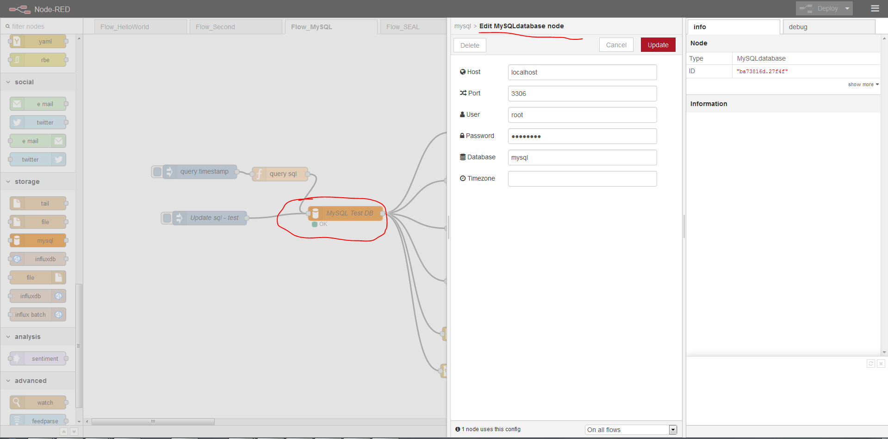

Setup mysql node - label


Added function msg.topic - for mysql query test

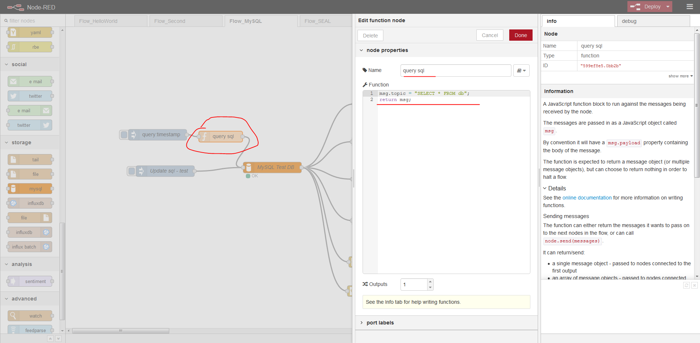

Debug output

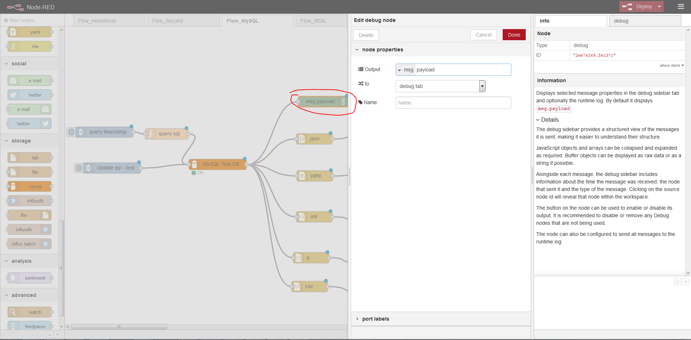

Json output

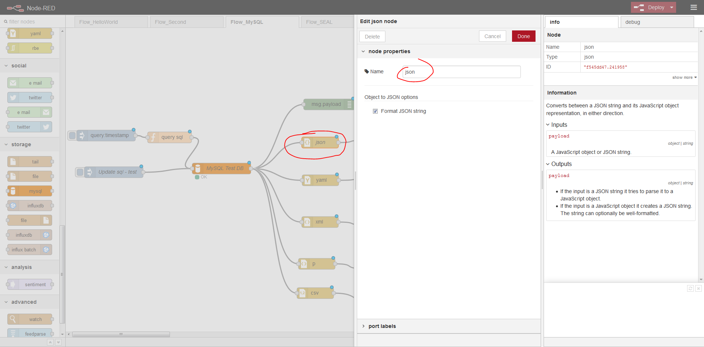

All other outputs

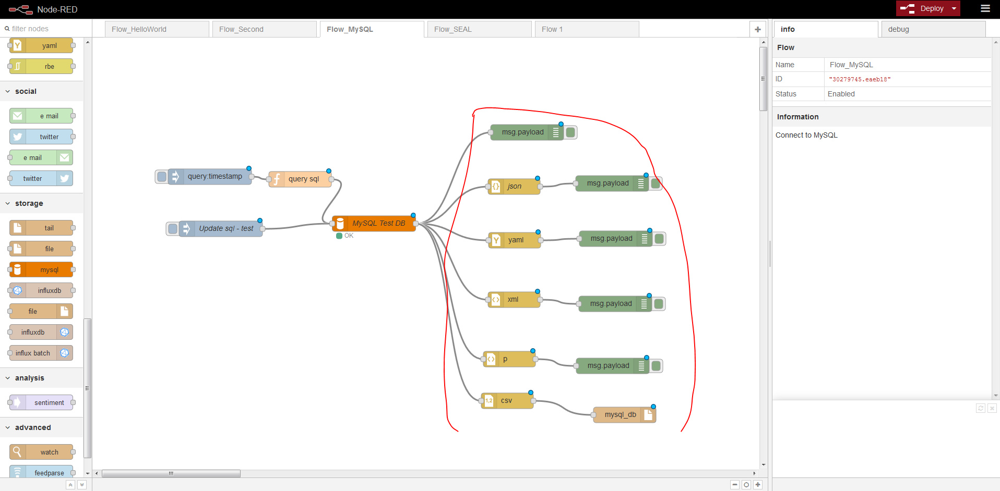

Added function msg.topic - for mysql update test

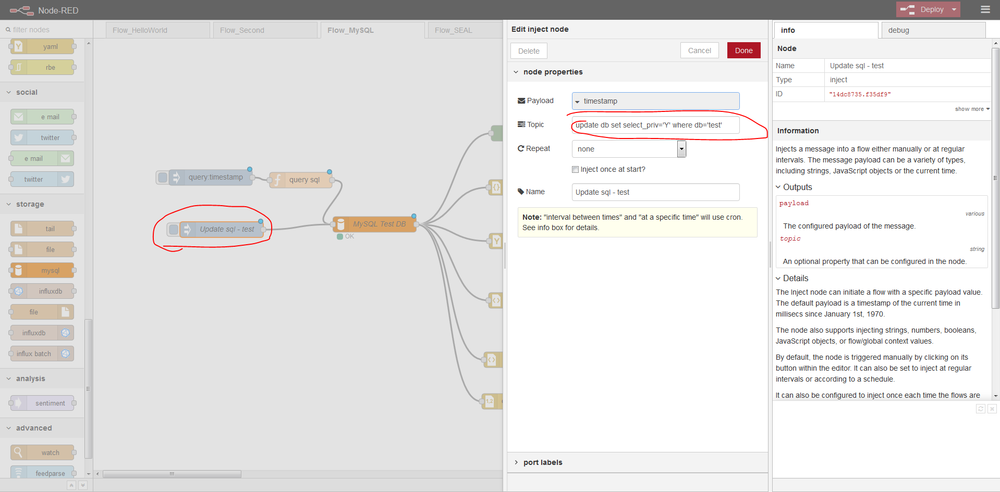

Run query result

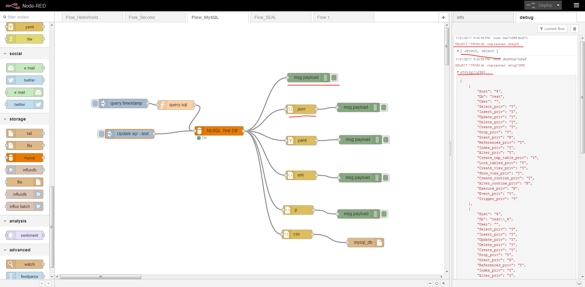

### <a id="t14"></a><a id="t14"></a><a id="Demo_4__HTTP_Request__Import_Flows_269"></a>Demo 4 - HTTP Request + Import Flows

> By using this, you could create an interface or html/json/xml page by dragging and setting flows:
> 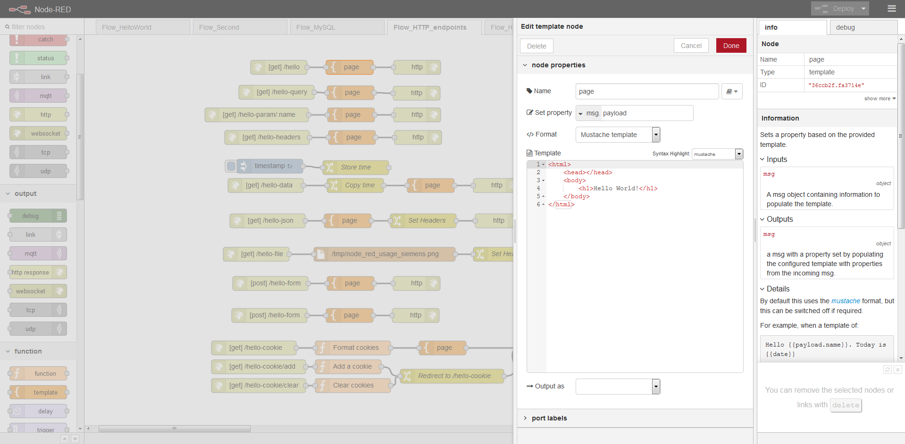

Contents: (from official site: https://cookbook.nodered.org/http/)

#### <a id="HTTP_endpoints_275"></a>HTTP endpoints

- Create an HTTP Endpoint
- Handle query parameters passed to an HTTP endpoint
- Handle url parameters in an HTTP endpoint
- Access HTTP request headers
- Include data captured in another flow
- Serve JSON content
- Serve a local file
- Post raw data to a flow
- Post form data to a flow
- Post JSON data to a flow
- Work with cookies
- HTTP requests

#### <a id="Simple_GET_request_289"></a>Simple GET request

- Set the url of a request
- Set the url of a request using a template
- Set query string parameters
- Get a parsed JSON response
- Get a binary response
- Set a request header

Create flow

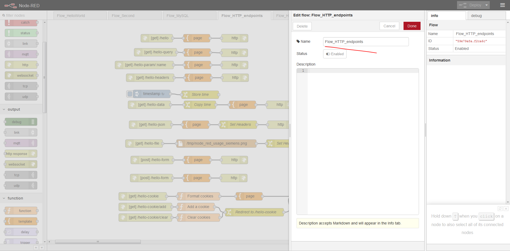

Import By Clipboard


First Hello http page demo:

```
`[{"id":"59ff2a1.fa600d4","type":"http in","z":"3045204d.cfbae","name":"","url":"/hello","method":"get","swaggerDoc":"","x":100,"y":80,"wires":[["54c1e70d.ab3e18"]]},{"id":"54c1e70d.ab3e18","type":"template","z":"3045204d.cfbae","name":"page","field":"payload","fieldType":"msg","format":"handlebars","syntax":"mustache","template":"<html>\n    <head></head>\n    <body>\n        <h1>Hello World!</h1>\n    </body>\n</html>","x":250,"y":80,"wires":[["266c286f.d993d8"]]},{"id":"266c286f.d993d8","type":"http response","z":"3045204d.cfbae","name":"","x":390,"y":80,"wires":[]}]` 

- 1


```

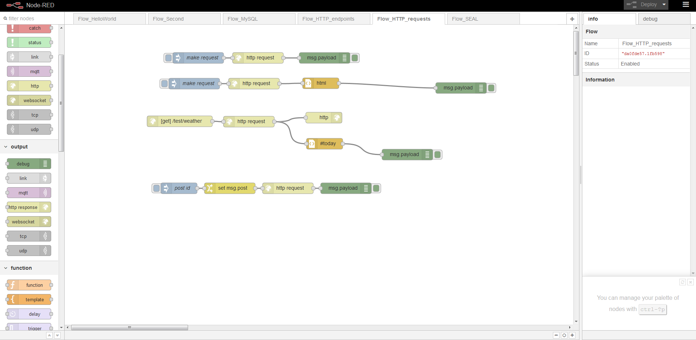

Then open url, you could got below page:


All other http request demo you could do same import actions, and see below flows; then you may check in separate http request/reponse:


> After you see http request usage, what you could do by using this?

- Create simple json or restFul interfaces by drag&drop flows; which we could mock data and mock page for front-end developers.
- Parse data from exist html page, and combined with other page/json/xml interfaces;
- Combined with the data strage, we could do add/modify/delete action from page to db;

### <a id="t15"></a><a id="t15"></a><a id="Demo_5__MySQL__Restful_337"></a>Demo 5 - MySQL + Restful

> Query data from mysql node, and provide restful interface:

Create Flow

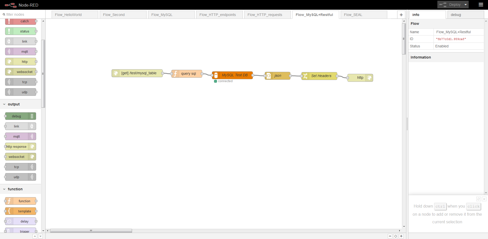

Provide restful interfaces:


## <a id="t16"></a><a id="t16"></a><a id="QA_352"></a>Q&A

### <a id="t17"></a><a id="t17"></a><a id="APIs_provided_by_nodeRED_354"></a>APIs provided by node-RED?

#### <a id="Admin_HTTP_API_356"></a>Admin HTTP API

This HTTP-based API can be used to remotely administer the runtime. It is used by the Node-RED Editor and command-line admin tool.

#### <a id="Runtime_API_360"></a>Runtime API

This API can be used when embedding Node-RED into another application.

#### <a id="Storage_API_364"></a>Storage API

This API provides a pluggable way to configure where the Node-RED runtime stores data.

#### <a id="Editor_UI_Widgets_368"></a>Editor UI Widgets

A set of jQuery widgets that can be used within a node’s edit template. Since 0.14

You may check below document:
https://nodered.org/docs/api/

### <a id="t18"></a><a id="t18"></a><a id="How_to_change_site_port_from_1880_to_others_375"></a>How to change site port from 1880 to others?

Change settings.js file:

```
`// the tcp port that the Node-RED web server is listening on
uiPort: process.env.PORT || 1880,` 

- 1
- 2


```

### <a id="t19"></a><a id="t19"></a><a id="How_to_use_https_382"></a>How to use https?

```
``// The following property can be used to enable HTTPS
// See http://nodejs.org/api/https.html#https_https_createserver_options_requestlistener
// for details on its contents.
// See the comment at the top of this file on how to load the `fs` module used by
// this setting.
//
//https: {
//    key: fs.readFileSync('privatekey.pem'),
//    cert: fs.readFileSync('certificate.pem')
//},

// The following property can be used to cause insecure HTTP connections to
// be redirected to HTTPS.
//requireHttps: true`` 

- 1
- 2
- 3
- 4
- 5
- 6
- 7
- 8
- 9
- 10
- 11
- 12
- 13
- 14


```

### <a id="t20"></a><a id="t20"></a><a id="How_to_open_auth_400"></a>How to open auth?

```
`// Securing Node-RED
// -----------------
// To password protect the Node-RED editor and admin API, the following
// property can be used. See http://nodered.org/docs/security.html for details.
//adminAuth: {
//    type: "credentials",
//    users: [{
//        username: "admin",
//        password: "$2a$08$zZWtXTja0fB1pzD4sHCMyOCMYz2Z6dNbM6tl8sJogENOMcxWV9DN.",
//        permissions: "*"
//    }]
//},` 

- 1
- 2
- 3
- 4
- 5
- 6
- 7
- 8
- 9
- 10
- 11
- 12


```

### <a id="t21"></a><a id="t21"></a><a id="How_to_open_cors_417"></a>How to open cors?

```
`// The following property can be used to configure cross-origin resource sharing
// in the HTTP nodes.
// See https://github.com/troygoode/node-cors#configuration-options for
// details on its contents. The following is a basic permissive set of options:
//httpNodeCors: {
//    origin: "*",
//    methods: "GET,PUT,POST,DELETE"
//},` 

- 1
- 2
- 3
- 4
- 5
- 6
- 7
- 8


```

### <a id="t22"></a><a id="t22"></a><a id="How_to_setup_logging_429"></a>How to setup logging?

```
`// Configure the logging output
logging: {
    // Only console logging is currently supported
    console: {
        // Level of logging to be recorded. Options are:
        // fatal - only those errors which make the application unusable should be recorded
        // error - record errors which are deemed fatal for a particular request + fatal errors
        // warn - record problems which are non fatal + errors + fatal errors
        // info - record information about the general running of the application + warn + error + fatal errors
        // debug - record information which is more verbose than info + info + warn + error + fatal errors
        // trace - record very detailed logging + debug + info + warn + error + fatal errors
        // off - turn off all logging (doesn't affect metrics or audit)
        level: "info",
        // Whether or not to include metric events in the log output
        metrics: false,
        // Whether or not to include audit events in the log output
        audit: false
    }
}` 


```

### <a id="t23"></a><a id="t23"></a><a id="How_to_hide_the_default_UI_node_categories_452"></a>How to hide the default UI node categories?

```
`// The following property can be used to order the categories in the editor
// palette. If a node's category is not in the list, the category will get
// added to the end of the palette.
// If not set, the following default order is used:
//paletteCategories: ['subflows', 'input', 'output', 'function', 'social', 'mobile', 'storage', 'analysis', 'advanced'],` 


```

### <a id="t24"></a><a id="t24"></a><a id="How_manys_settings_could_do_in_settingsjs_461"></a>How manys settings could do in settings.js?

```
``/**
 * Copyright JS Foundation and other contributors, http://js.foundation
 *
 * Licensed under the Apache License, Version 2.0 (the "License");
 * you may not use this file except in compliance with the License.
 * You may obtain a copy of the License at
 *
 * http://www.apache.org/licenses/LICENSE-2.0
 *
 * Unless required by applicable law or agreed to in writing, software
 * distributed under the License is distributed on an "AS IS" BASIS,
 * WITHOUT WARRANTIES OR CONDITIONS OF ANY KIND, either express or implied.
 * See the License for the specific language governing permissions and
 * limitations under the License.
 **/

// The `https` setting requires the `fs` module. Uncomment the following
// to make it available:
//var fs = require("fs");

module.exports = {
    // the tcp port that the Node-RED web server is listening on
    uiPort: process.env.PORT || 1880,
    
    // mysql reconnection time
    mysqlReconnectTime: 30000,

    // By default, the Node-RED UI accepts connections on all IPv4 interfaces.
    // The following property can be used to listen on a specific interface. For
    // example, the following would only allow connections from the local machine.
    //uiHost: "127.0.0.1",

    // Retry time in milliseconds for MQTT connections
    mqttReconnectTime: 15000,

    // Retry time in milliseconds for Serial port connections
    serialReconnectTime: 15000,

    // Retry time in milliseconds for TCP socket connections
    //socketReconnectTime: 10000,

    // Timeout in milliseconds for TCP server socket connections
    //  defaults to no timeout
    //socketTimeout: 120000,

    // Timeout in milliseconds for HTTP request connections
    //  defaults to 120 seconds
    //httpRequestTimeout: 120000,

    // The maximum length, in characters, of any message sent to the debug sidebar tab
    debugMaxLength: 1000,

    // To disable the option for using local files for storing keys and certificates in the TLS configuration
    //  node, set this to true
    //tlsConfigDisableLocalFiles: true,

    // Colourise the console output of the debug node
    //debugUseColors: true,

    // The file containing the flows. If not set, it defaults to flows_<hostname>.json
    //flowFile: 'flows.json',
    

    // To enabled pretty-printing of the flow within the flow file, set the following
    //  property to true:
    //flowFilePretty: true,

    // By default, credentials are encrypted in storage using a generated key. To
    // specify your own secret, set the following property.
    // If you want to disable encryption of credentials, set this property to false.
    // Note: once you set this property, do not change it - doing so will prevent
    // node-red from being able to decrypt your existing credentials and they will be
    // lost.
    //credentialSecret: "a-secret-key",

    // By default, all user data is stored in the Node-RED install directory. To
    // use a different location, the following property can be used
    //userDir: '/home/nol/.node-red/',

    // Node-RED scans the `nodes` directory in the install directory to find nodes.
    // The following property can be used to specify an additional directory to scan.
    //nodesDir: '/home/nol/.node-red/nodes',

    // By default, the Node-RED UI is available at http://localhost:1880/
    // The following property can be used to specifiy a different root path.
    // If set to false, this is disabled.
    //httpAdminRoot: '/admin',

    // Some nodes, such as HTTP In, can be used to listen for incoming http requests.
    // By default, these are served relative to '/'. The following property
    // can be used to specifiy a different root path. If set to false, this is
    // disabled.
    //httpNodeRoot: '/red-nodes',

    // The following property can be used in place of 'httpAdminRoot' and 'httpNodeRoot',
    // to apply the same root to both parts.
    //httpRoot: '/red',

    // When httpAdminRoot is used to move the UI to a different root path, the
    // following property can be used to identify a directory of static content
    // that should be served at http://localhost:1880/.
    //httpStatic: '/home/nol/node-red-static/',

    // The maximum size of HTTP request that will be accepted by the runtime api.
    // Default: 5mb
    //apiMaxLength: '5mb',

    // If you installed the optional node-red-dashboard you can set it's path
    // relative to httpRoot
    //ui: { path: "ui" },

    // Securing Node-RED
    // -----------------
    // To password protect the Node-RED editor and admin API, the following
    // property can be used. See http://nodered.org/docs/security.html for details.
    //adminAuth: {
    //    type: "credentials",
    //    users: [{
    //        username: "admin",
    //        password: "$2a$08$zZWtXTja0fB1pzD4sHCMyOCMYz2Z6dNbM6tl8sJogENOMcxWV9DN.",
    //        permissions: "*"
    //    }]
    //},

    // To password protect the node-defined HTTP endpoints (httpNodeRoot), or
    // the static content (httpStatic), the following properties can be used.
    // The pass field is a bcrypt hash of the password.
    // See http://nodered.org/docs/security.html#generating-the-password-hash
    //httpNodeAuth: {user:"user",pass:"$2a$08$zZWtXTja0fB1pzD4sHCMyOCMYz2Z6dNbM6tl8sJogENOMcxWV9DN."},
    //httpStaticAuth: {user:"user",pass:"$2a$08$zZWtXTja0fB1pzD4sHCMyOCMYz2Z6dNbM6tl8sJogENOMcxWV9DN."},

    // The following property can be used to enable HTTPS
    // See http://nodejs.org/api/https.html#https_https_createserver_options_requestlistener
    // for details on its contents.
    // See the comment at the top of this file on how to load the `fs` module used by
    // this setting.
    //
    //https: {
    //    key: fs.readFileSync('privatekey.pem'),
    //    cert: fs.readFileSync('certificate.pem')
    //},

    // The following property can be used to cause insecure HTTP connections to
    // be redirected to HTTPS.
    //requireHttps: true

    // The following property can be used to disable the editor. The admin API
    // is not affected by this option. To disable both the editor and the admin
    // API, use either the httpRoot or httpAdminRoot properties
    //disableEditor: false,

    // The following property can be used to configure cross-origin resource sharing
    // in the HTTP nodes.
    // See https://github.com/troygoode/node-cors#configuration-options for
    // details on its contents. The following is a basic permissive set of options:
    //httpNodeCors: {
    //    origin: "*",
    //    methods: "GET,PUT,POST,DELETE"
    //},

    // If you need to set an http proxy please set an environment variable
    // called http_proxy (or HTTP_PROXY) outside of Node-RED in the operating system.
    // For example - http_proxy=http://myproxy.com:8080
    // (Setting it here will have no effect)
    // You may also specify no_proxy (or NO_PROXY) to supply a comma separated
    // list of domains to not proxy, eg - no_proxy=.acme.co,.acme.co.uk

    // The following property can be used to add a custom middleware function
    // in front of all http in nodes. This allows custom authentication to be
    // applied to all http in nodes, or any other sort of common request processing.
    //httpNodeMiddleware: function(req,res,next) {
    //    // Handle/reject the request, or pass it on to the http in node by calling next();
    //    // Optionally skip our rawBodyParser by setting this to true;
    //    //req.skipRawBodyParser = true;
    //    next();
    //},

    // The following property can be used to verify websocket connection attempts.
    // This allows, for example, the HTTP request headers to be checked to ensure
    // they include valid authentication information.
    //webSocketNodeVerifyClient: function(info) {
    //    // 'info' has three properties:
    //    //   - origin : the value in the Origin header
    //    //   - req : the HTTP request
    //    //   - secure : true if req.connection.authorized or req.connection.encrypted is set
    //    //
    //    // The function should return true if the connection should be accepted, false otherwise.
    //    //
    //    // Alternatively, if this function is defined to accept a second argument, callback,
    //    // it can be used to verify the client asynchronously.
    //    // The callback takes three arguments:
    //    //   - result : boolean, whether to accept the connection or not
    //    //   - code : if result is false, the HTTP error status to return
    //    //   - reason: if result is false, the HTTP reason string to return
    //},

    // Anything in this hash is globally available to all functions.
    // It is accessed as context.global.
    // eg:
    //    functionGlobalContext: { os:require('os') }
    // can be accessed in a function block as:
    //    context.global.os

    functionGlobalContext: {
        // os:require('os'),
        // octalbonescript:require('octalbonescript'),
        // jfive:require("johnny-five"),
        // j5board:require("johnny-five").Board({repl:false})
    },

    // The following property can be used to order the categories in the editor
    // palette. If a node's category is not in the list, the category will get
    // added to the end of the palette.
    // If not set, the following default order is used:
    //paletteCategories: ['subflows', 'input', 'output', 'function', 'social', 'mobile', 'storage', 'analysis', 'advanced'],

    // Configure the logging output
    logging: {
        // Only console logging is currently supported
        console: {
            // Level of logging to be recorded. Options are:
            // fatal - only those errors which make the application unusable should be recorded
            // error - record errors which are deemed fatal for a particular request + fatal errors
            // warn - record problems which are non fatal + errors + fatal errors
            // info - record information about the general running of the application + warn + error + fatal errors
            // debug - record information which is more verbose than info + info + warn + error + fatal errors
            // trace - record very detailed logging + debug + info + warn + error + fatal errors
            // off - turn off all logging (doesn't affect metrics or audit)
            level: "info",
            // Whether or not to include metric events in the log output
            metrics: false,
            // Whether or not to include audit events in the log output
            audit: false
        }
    }
}`` 

-

## <a id="t25"></a><a id="t25"></a><a id="Reference_702"></a>Reference

https://nodered.org/docs/

http://developers.sensetecnic.com/guides-and-examples/

http://sensetecnic.com/use-case-fred-for-industrial-iot/

http://developers.sensetecnic.com/article/a-node-red-flow-to-monitor-the-weather/

https://acmemonitoringcorp.fred.sensetecnic.com/api/ui/#/0

显示推荐内容

-   <a id="is-like-span"></a>点赞 <a id="spanCount"></a>3 
- [评论 2](#commentBox) 
- 分享
- <a id="is-collection"></a>收藏 <a id="get-collection"></a>17 
- <a id="toolreward"></a>打赏
- 举报
- 关注
- 一键三连
    

<a id="commentBox"></a>

<a id="commentsedit"></a>


### 目录

1.  [内容目录](#t0)
2.  1.  [文章目录](#t1)
3.  [Introduction](#t2)
4.  1.  [Features](#t3)
    2.  [A first view example](#t4)
5.  [Installation](#t5)
6.  1.  [Install CentOS7](#t6)
    2.  [Install NodeJS](#t7)
    3.  [Install Node-RED](#t8)
    4.  [Run Node-RED](#t9)
7.  [Demo](#t10)
8.  1.  [Demo1 - Hello world](#t11)
    2.  [Demo 2 - More flexible with functions](#t12)
    3.  [Demo 3 - Connect to MySQL](#t13)
    4.  [Demo 4 - HTTP Request + Import Flows](#t14)
    5.  [Demo 5 - MySQL + Restful](#t15)
9.  [Q&A](#t16)
10. 1.  [APIs provided by node-RED?](#t17)
    2.  [How to change site port from 1880 to others?](#t18)
    3.  [How to use https?](#t19)
    4.  [How to open auth?](#t20)
    5.  [How to open cors?](#t21)
    6.  [How to setup logging?](#t22)
    7.  [How to hide the default UI node categories?](#t23)
    8.  [How manys settings could do in settings.js?](#t24)
11. [Reference](#t25)

  举报