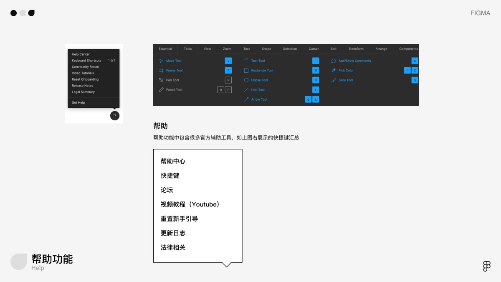
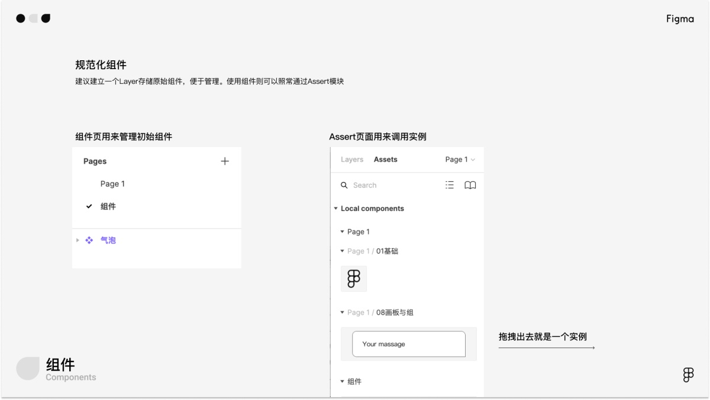

万字干货！写给小白的Figma全面入门手册 – Telegraph

# 万字干货！写给小白的Figma全面入门手册

[www.uisdc.com - 优设网 - Uisdc, 推荐](https://www.uisdc.com/figma-getting-started-manual)November 14, 2020

#### 全世界都在用Figma

不知道你们有没有这种感觉，仿佛有一天，很突然的，全世界都在使用Figma，一个软件从无人问津到现在的如日中天，用了不到3年，而现在，它不仅仅是当下的最优生产力工具，在疫情掀起的远程办公的风潮下，它更为我们揭示了未来设计协作的方式。事实正是如此，大批专业设计团队不惜成本尝试由传统设计软件（Sketch等）向Figma转型，只因他们于此看到了代表未来的生产力工具及协作方式。

我最初接触到Figma应该是在18年，Sketch霸占体验设计市场的阶段，当时大家对Figma的评价基本都是，还可以，但完全无法取代Sketch。如此判断的原因主要是Figma[产品设计](https://www.uisdc.com/tag/%e4%ba%a7%e5%93%81%e8%ae%be%e8%ae%a1)初期的体验、功能各方面都不尽如人意，而其远程共享协作的思路也略有超前，未能真正冲击到本地化协同的设计开发模式。

而从Figma的首席设计师（现已离职）Rasmus Andersson关于Figma的设计总结中，我了解到Figma真正开始产品的设计过程是在16年，Rasmus Andersson从16年就职Figma到2020年离开期间，参与了Figma从品牌到设计工具的所有设计工作。在这几年间，Figma始终坚持将共享协作作为其核心主旨，他们将Figma产品设计分为两个核心模块，其一是编辑器也就是生产力工具部分，其二则是协作模块，涉及到文件管理共享协作等内容。

Figma的一大亮点就是基于WEB平台开发，以支撑其在所有硬件产品，所有场景下使用。然后在Rasmus Andersson的推动下，他们最终仍然开发了客户端版本，最终结果也是使用客户端版本的用户确实高于WEB端用户。

总而言之，Figma是一个异军突起的新兴设计软件，适用于多平台，多系统，这保证了其在任何工作场景下（Windows or Mac）都能够作为设计团队的统一设计工具，基于WEB端开发的版本更可以满足异常场景下的设计需求，如回乡省亲身边没有带有设计工具的电脑，同时也解决了因本地硬件条件等限制造成的卡顿文件丢失等情况。另外在疫情检验下，其优秀的远程协同体验成为了自身壁垒，远超其他竞品，另外在国内某协同标注软件开始收费后，其价格也成为了一个合理的竞争力，远低于Sketch+Lanhu的价格。

#### 1\. 为什么大家都在转型Figma？

我在入职本家公司后，刚刚申请了正版Sketch（我司还是比较认可设计的价值，同时支持使用正版软件，不要酸不要酸），还没捂热，在一次设计中心的月会上，设计leader突然宣布大家要在一个月逐步转型迁移到Figma，事实上，一个设计中心全部转换软件，首先要考虑的是学习成本，及转型和迁移期间不可控的效率和设计输出质量等问题，另外一个关键点就是新的设计软件意味着一笔新的正版软件费用，而且是一笔很庞大的费用。涉及到这么多现实问题，必然不会是因为单纯的潮流趋势等理想型原因而转型，因为很难推动。因此我意识到，从利益相关者角度考虑，核心点只可能是Figma能够带来真正的效率提升（设计师），从长远看能为企业赚取更多的收益（企业），且综合来看能提供数倍的协作效率和协作质量（需求方上游和开发下游）。

我作为经历了上家公司Sketch+蓝湖的生产力模式到目前所在公司的Sketch+Sketch Measure的模式的设计师，应该对这个话题很有发言权，传统的依托于本地输出资源对接的方式，效率相较于线上共享、对接、协作的方式真的可谓天壤之别。

**协作效率**

以我的设计工作流程为例，我司使用谷歌全家桶进行项目管理，设计资源一般规范命名导出后上传至Google Drive统一管理，其优点在于文件管理规范化，从设计到开发皆置于一套线性工作流程中，输出物可溯源易管理，协作效率蛮不错，但当发生一点设计修改之后，整套输出物从设计稿到标注内容都要重新输出整理一份，并再次手动上传。这种偏传统的协作方式，尤其是设计输出的方式在长远来看不利于设计管理和上下游协作。一方面修改更新的成本较高，一方面容易造成版本混乱输出物混乱而导致实际产品实现结果的问题。

**设计维护**

版本维护是在进行复杂项目设计时必要的一项工作，修改了哪些内容，谁来修改的如何溯源，更新后的版本如何快速同步给上下游？这一点工作在传统设计协作模式中一般需要多个工具及多个协作行为来完成，如设计新版本-输出新的Design Draft-上传至同步工具（如Drive）-提醒上下游-更新源文件（设计组内）。而在Figma中，设计源文件、设计输出融合为一套内容。在源文件修改后可以快速自动同步给各方，一个Figma文件本身即是设计师对应的源文件，也是上游需要的预览稿Draft，更是下游开发需要的输出标注。维护成为无意识的自动化过程而不需要太多人力介入。

**价格与权限**

价格与权限方面，我只需要为大家展示免费版的权限即可，其中最关键的就是Viewers，在蓝湖收费后，设计师应该理解这个无限viewer意味着什么。这意味着你可以自由的分享设计稿给产品和开发而不用提心吊胆的计算Viewer的限制。这主要是针对独立设计师和小企业设计师，专业设计团队的话更多的是考虑产品效率，企业收益等问题，价格反而其次。

接下来步入正题，本篇文章初心就是帮助大家快速入门Figma，在这之前，我并没有去浏览其他作者所写的Figma相关的文章，我希望尽可能保证自己作为一个初学者的角色从0开始了解这样一款软件，并在这过程中梳理出一个更易于理解的教学方式，或者说陈述逻辑。最终我将正式教学部分分成了三个模块，基础功能介绍、进阶功能介绍、迁移准备。分别对应初学者最初接触搭建基础、进阶学习高级功能、正式迁移转变工具的三个阶段。

#### Figma基础介绍

#### 1\. Figma界面介绍

Figma基础界面与常规设计软件没有太多差异，有Sketch使用经验的用户几乎可以无缝衔接到Figma上。

**顶部导航栏**

顶部为导航栏，已打开的所有文档都会在这里展示，左侧Figma [icon](https://www.uisdc.com/tag/icon)为Home键，点击回到团队主页，右侧导航Tab可以通过快捷键Command+123切换，这里的快捷键和Sketch查看全部视图的快捷键相冲突。而在Figma中，查看全部视图的快捷键是Shift+1，查看目标视图到全图大小的快捷键为Shift+2。

**工具栏**

基础工具栏与Sketch几乎无任何区别，从左至右分别为，移动、画板、矩形工具、钢笔工具、文字工具、视图工具、评论。而右侧功能则倾向于导出协作类操作，如Share类似蓝湖上传标注的功能，播放键则是用于运行交互原型的入口。

**图层组件**

左侧为常见的图层导航栏，可通过顶部在图层和组件两个模块间切换，上图中展示了图层树中不同元素的缩略图样式，其中组件和实例比较特殊，简单理解，实例是组件的复制体，需要注意的是，组件不可逆，而实例是可以逆向为Grop的，也就是取消组件化。

**属性检查器**

**帮助功能**

#### 2\. Figma基础功能

**画板 Frames**

建立画板有两种常用方式。常规方式是通过快捷键F或点击工具栏画板工具来手动建立。另外一种比较自由的方式是基于选中元素创建画板。在圈中一组元素后，右键选项面板中有Frame Selection的选项和Grop Selection的选项，两者分别是建立画板和建立组，从这里也可以看出来，Figma中组Grop和画板Frame是相关性较大，较相似的概念，且在实际场景中，画板和组可以进行切换。

Frame包含Grop，Grop单纯的代表对一些元素的打包与整合，与常规设计软件中的组的概念无异，但Frame则更强调导出与自动布局、组件化等方面。例如你要将一个消息气泡组件化后，会发现其属性自动由Grop转化为Frame。

**文字工具和字体**

文字工具可以通过快捷键T快速唤醒，交互与PS近似，单击键入常规文字框，框选键入固定范围文字框。Figma的字体工具与Sketch差异点在于其共享样式，文字系统是一套设计系统的核心组成元素之一，而在Figma中，文字的样式被拆解为字体样式（涉及到文字字号、字族、字重）和颜色填充样式（颜色填充样式适用于所有元素）。

另外要提醒的一点是，Figma字距等属性默认使用百分比来界定，但它也支持常规的px形式，只需要在调整框键入你需要的值，如150%，或28px，系统会自动匹配到该类计算方式。

**投影与模糊**

属性检查器中的effect模块包含投影和模糊两部分。与Sketch完全一致，投影依靠XY和范围、透明度等属性来控制，背景模糊通过调整覆盖层Fill透明度控制，嗯，与Sketch完全一致。 在由Sketch迁移至Figma过程会出现投影还原问题，实际上是某个开关设置的问题，只需要取消勾选Clip content.

**布局栅格**

Figma的栅格可以很方便的在画板的属性检查器开启，寻找到Layout Grid并开启它，其中包含常用的栅格与网格两种规范方式。

**遮罩蒙版**

遮罩工具有两个入口，一是选中要运算的图形后，在顶部工具栏的中间区域点击遮罩工具，一是右键菜单中点击 Use as mask选项。

**颜色取色器**

**布尔运算**

#### 3\. Figma常用快捷键

这里只统计一些特殊的、容易与Sketch起冲突需要刻意记忆的、特别常用的快捷键。

**Shift+1 Shift+2**

常用的放大视图工具，适用于快速查看文件全览，及快速放大某个元素的场景。

**Z+鼠标左键**

按住Z快捷键，鼠标会转变为放大镜，此时单击放大视图，同时按住Option会缩小时图。拖拽一片区域则会放大该区域。

**Option+鼠标左键**

Figma的右侧属性检查器无法快捷hover在属性值上拖动（需要谨慎的将鼠标移动到属性icon上），此时可以按住Option再把鼠标Hover到属性框，此时便可以直接拖动调整数值。

**Cmd+G/Cmd+Option+G**

从内容打组/从内容新建画板，Figma中组和画板有很多重合的地方，与Sketch差异较大，组还是那个组，但画板可以嵌套画板， 后面会具体解释。

**Cmd+鼠标左键**

该操作可忽略画板内元素直接调整画板尺寸，适用于画板内元素未做自动布局处理，同时需要调整画板尺寸的场景，直接调整画板尺寸会使图形变形。

**Option+L**

该操作可以快速收起图层，在设计过程中使用频率较高，便于高效整理图层。点击空白区执行该命令会收起所有图层，点击某个组或某个画板会收起该组或画板。注意，点击单个图层或元素无效果。

**Shift+H & Shift + V**

左右翻转&上下翻转，快捷执行翻转操作，此功能使用场景较多，常规操作需要右键唤醒功能面板然后寻找到目标再执行命令，学会快捷键后可以大大提升翻转操作的效率。

**Shift+R**

显示隐藏标尺，使用Sketch的用户需要克服该快捷键的使用习惯，Sketch中该操作为Cmd+R。

**Control+G**

显示隐藏网格，实际上不仅仅是网格工具，该快捷键唤醒的是栅格工具集合，需要在右侧属性检查器进行调整，可从网格工具转化为栅格工具，默认是网格工具。

**如何复制形状属性**

与Sketch相比，Figma为了保证组件化和共享样式的细分程度，将图形的属性样式进行了更细致的拆分，如图形颜色、描边属性，字体字族、字体颜色等属性是分开处理的。因此无法像Sketch或PS那样一键复制所有属性，而是需要单独选择某个属性，然后复制。

因此在遇到样式相关的问题时，可以考虑使用共享样式来实现，这也是Figma官方期望设计师养成的习惯。

**Cmd+E**

扩展图形，在Figma中，图形布尔运算后会保留所有原始图形，在选择图形时经常会选择到布尔前的图形，影响工作效率，在确认图形不会进行二次编辑时，可以考虑直接Command + E将图形扩展为新图形。

如果记不住快捷键，可以右键在选项面板中选择“Flatten”进行扩展图形。

**Cmd+Shift+O**

扩展描边,在使用描边绘制Icon时，需要通过扩展描边来转为可编辑图形。

如果记不住快捷键，可以右键在选项面板中选择“Outline Stroke”进行扩展。

最后，需要查看所有快捷键只需要在右下角唤醒帮助功能，面板中第二个选项Keyboard Shortcuts就是快捷键演示。

#### 4\. Figma基础操作较Sketch差异点

从Sketch转型为Figma的初期，有很多基础操作方面的差异点会令人不适应，以下是一些常见的差异点，主要涉及一些基础操作，正因是最最底层的操作习惯，所以更加影响操作手感。建议通过刻意记忆（有意识的在操作时纠正），尽早转换习惯。

**拖动单个图层**

Sketch中按住Command点击图层并移动，是单独移动某个图层的操作，而在Figma中，按住Command点击并移动鼠标是框选操作。若想要强制选择某个图层并移动，正确的逻辑是，先按住Cmd点选图层，待出现选择框后，在直接使用左键拖动。概括来讲，Figma的操作逻辑中，首先选择图层，后续的操作默认是对该图形的操作。

**快速查看视图**

Sketch中Command+1，2 分别是查看全部视图，和放大某个视图，是我们常用的操作。 但在Figma中Command+123是切换不同文件tab,1对应tab1，2对应tab2，以此类推。而Shift+1 和Shift+2才是查看全部视图和放大某个视图（这个习惯操作要花很久来适应）

**滚轮放大**

当真恶心，滚轮放大和缩小视图正好与Sketch相反，这种争议就像头像应该用圆的还是方的一样，在Sketch与Figma同时使用的过渡阶段，该体验极其恶劣。

**复制图层/组**

在Sketch中，复制一组图层到另一个画板，在执行Cmd+V时，会将该组图层自动粘贴到你窗口的中心位置，也就是你操作区域的核心焦点处，或者粘贴到画板的中间区域，其复制粘贴有可预见的逻辑，且极其易用。

而在Figma中，尤其在实际工作场景中，你要复制一个元素到新的画板中，它粘贴的位置总是十分诡异，即便将操作界面放大，它也不会为你复制在操作区域的中心，而是复制在一个超级偏僻的位置，然后再由设计师自己移动。

目前我自己探索的解决方案就是，选择某个元素，使用Cmd+Shift+V，复制的位置会与你之前选择的元素相同。

**Frame可以互相嵌套**

根据Figma官方团队说明，他们基于前端思维确立了画板的逻辑，或者说框架(Frame),Frame是可以互相嵌套的，而在Sketch中画板内只可以有组，而不可能出现画板作为子内容的情况。

因此在Figma中，经常会出现你拖动一组内容（一个Frame）会发现它突然消失不见，或者突然出现在了另一层的情况，这是由于Figma中将一个较小的Frame拖动到一个较大的Frame范围内会自动另其归属于下方的Frame。在需要频繁拖动元素的场景下体验很差。解决方法是将Frame转为Grop组再去拖动，或者只通过键盘上下左右键及对齐工具来移动，千万不要使用鼠标拖动。

#### Figma进阶功能

#### 1\. 组件（components）

组件和实例：组件是母体，实例是复制体，组件可以删除和修改，不可逆向为组，实例不可直接编辑，但可以逆向为组，然后修改。没有一个固定位置用来存放组件，你最初组件化的那个组，就是唯一的组件母体，且组件不会被收起在一个组件页中，而是存在原本的位置。

组件和实例是分开的，简单理解就是，你最初设计的一个元素，通过Component功能打包为组件A，这个组件就是原始组件A，此时在左侧assert模块下就会存在一个固定组件(类似组件库模块)，当你从Assert模块中拖动出来一个新的组件A，或者从原始组件A复制一个新的组件A，这个新的组件A就是实例，实例可以被还原为组。

**我如何找到最初的组件？**

首先需要说明，Figma的组件管理方式很灵活，但相较于Sketch的确不够规范，这里仍建议设计师新建一个layers,以组件来命名，将原始组件都放置在这个页面，易于管理。

该Layer主要目的在于管理原始组件，例如当需要大批量修改组件时，切换到组件Layer快速修改，修改后快速映射到所有设计稿。

当需要调用组件时，则推荐使用官方提供的Assert模块，通过拖拽调用组件实例。

在实际工作场景中，我们需要从实例跳转到原始组件，以进行大批量效果修改时，可通过属性检查器中的组件icon快捷跳转至原始组件。

**实例操作**

在实际工作中，我们会遇到使用一个类似组件来建立新组件的场景，此时需要将组件逆向为组，然后进行编辑，在Figma中仅实例可以进行逆向，方法是右键，或者在属性检查器区域执行Detach instance命令。

当直接在当前正在操作的实例上进行少量变更后，可以通过覆盖功能将当前的属性同步给组件和所有实例。

方法是在右侧属性检查器执行Push Overrides to Main Components。

**组件库的使用**

如何上传和维护组件库？Figma的组件库系统极其友好，易于维护。设计师只需要将已经设计完成的组件系统和样式系统放置在一个文件中，然后就可以基于当前的文件已有的样式和组件直接建立共享组件库，只需要在Assert的Library入口进入组件窗口，通过组件库窗口中的上传（Publish）功能，完成上传，团队成员就能获得该组件库内容。

后续维护组件库的工作只需要在该文件上进行修改和完善，随后回到library窗口进行更新。当然，在你对组件库进行修改后，Figma会自动弹出快捷窗口以供你迅速更新组件库，这也不失为一种好办法。

当你更新组件库后，其他使用了该组件库内容的设计师会同步收到更新消息，且可以快速同步到最新版本，以保证设计一致性。

如何使用团队成员已上传的组件库?在Library窗口，团队已公开的组件库会以List的形式展示，设计师只需要点击你的目标组件库左侧的switch，即可唤醒该组件库，回到你的文件画板中，此时即可调用该组件库的内容，如组件、颜色样式、字体系统等。

想要快速查看组件库内的内容可以使用Option+2，快速调起Assert资源窗口，在左侧图层列表查看。

#### 2\. 响应式约束（constraints）

通过约束功能的官方定义我们更容易理解这个功能。首先要说明其限制条件，约束功能只有在Frame中才可以发挥作用，也只有Frame中的元素，才会展示Constraints工具。因此，官方定义其为：“允许你将设计元素固定在父框架的不同位置”，所以，请谨记约束功能以建立Frame为前提，而其主流使用场景就是构建流畅的布局以适应不同设备尺寸，即当设计师将Frame尺寸进行变更时，Frame内的元素会自动按照预先设定的规则固定位置。

但在真实场景下，响应式约束的功能并不局限于此，它更是可复用、可快速编辑组件的必要组成条件。Figma的Frame不同于Sketch的画板工具，可以互相嵌套且不会影响到复杂度产生墒增的问题，因此可以通过Constraints配合Frame组合成规范布局的组件系统，再加上我们后面要讲的Auto layout功能，可以构建出高自由度，可任意调用，且能够根据真实填充数据自动布局的超级组件，这样构建的组件一方面还原了真实场景下的设计效果，一方面大大减少了设计师重复性工作。

下面是响应式约束的不同条件及对应的效果。

响应式约束的常规案例。

#### 3\. 自动化布局（Auto layout）

自动化布局工具是制作复杂组件的核心技巧，与响应式约束搭配可以设计出高度自由可编辑的组件乃至半成品页面。

一般来说，我们谈到组件系统主要聚焦的是其规范一致性，设计资源管理等方面，但实际上，组件库在提升设计师效率，减少重复性工作方面能够发挥更强大的作用。常规组件调用后需要花费一定精力修改，但通过自动化布局工具设定好规则后，设计师能沉淀一整套可直接使用、根据内容填充物自动布局变化的超级组件，甚至是成熟的典型页面，可极大提升设计效率，减少在移动、复制、填充内容等基础操作上的时间浪费。

下面我实现了一个最简单的案例，再该search组件中需要填充真实数据以模拟真实场景下的样式，设计师只需要输入新的填充内容，组件内其他元素会自动匹配到对应的正确位置。

自动布局按照常规布局规则划分为三个属性，分别是左右空隙、上下空隙、元素间空隙。

当选中多个元素，执行Shift+A（建议熟悉快捷键提升效率）后，会为这些元素建立自动布局，规则可以在右侧属性检查区设定。

例如我需要建立一组横排的card，此时可以先设计好三个card，然后选中它们，执行Shift+A即可创建一组横排的自动布局（横排竖排根据你真实场景下元素的排列情况，也可以在右侧更改横排为竖排）。另外一种小技巧是，直接给一个card执行Shift+A命令，然后选中组内的card执行复制命名cmd+D，后复制出的每一个card也会按照预定规则排列。

如下图案例所示，元素与元素组合构成自动布局的组件，自动布局的组件组合则能构成更复杂的大兴组件乃至典型模块、典型页面。建议设计师快速掌握该技巧的方法是将其套入实际需求中，从提升设计效率，减少重复工作的出发点开始设计自己的典型组件模块。

#### 4\. 共享样式 （Style）

关于共享样式，从Sketch转型到Figma的同学应该再熟悉不过了，共享样式是组件库的核心构成之一，主要包括颜色、字体及各种样式效果。这里着重说明一下Figma共享样式与Sketch共享样式的差异。Figma中对样式进行了更为细致的划分，共包括颜色、字体、效果三类。

以颜色为例，Figma中颜色样式可自由运用到图形、描边、字体等各细分元素上面，无任何限制，可与各元素自由搭配。以字体为例，字体样式仅包括字体字号、字重、行高等字体本身的属性，不包括颜色，换言之，Font样式的颜色可以自由使用Color样式。

概括来讲，Sketch更注重常规理解下，组件系统的实际应用时的场景，如字体样式是由字体字族、字号、字重、行高、颜色所有属性一同构成的，而Figma强调更高的自由和编辑性，孰优孰劣无法一言蔽之，从严谨性和组件自我封闭完整性来讲，Sketch的要更好一些，但从组件自由度，组件嵌套组合的效率上来讲Figma要更好一些，所以关键在于设计师能否合理运用，快速掌握技巧并提高效率。

#### 5\. 交互原型

Figma的交互功能，在设计软件中我愿称之为最强，极简的操作逻辑以及优秀的实现效果使其在中小复杂度的交互场景下不逊色于专业UI[动效设计](https://www.uisdc.com/tag/%e5%8a%a8%e6%95%88%e8%ae%be%e8%ae%a1)软件。在FIgma的交互模式下能看到Principle的影子，其背后的设计逻辑高度相似，符合UI设计领域快速输出产品交互物的场景。

如下图所示，界面间的交互逻辑通过选择起始画板或其中的元素然后简单的连线即可完成。当然，如果设计师不满足于此可以在右侧属性检查器制作更精致的过度效果。Figma拥有者完善的交互手势可供设计师选择，如点击、hover、拖拽等。

然后是过渡效果，在这里我只推荐一种交互方式，那就是Smart Animate，一句话概括，Smart Animate复刻了Principle元素演变的逻辑，所以如果你是Principle的忠实拥趸，那在FIgma交互模式下你可以无缝代入到Principle的使用经验中。

除此之外，需要特殊说明的一个交互功能是弹窗交互Open Overly。使用该交互会调起一个覆盖层，适合弹窗类场景。方法如下图所示。Figma交互模块有很多功能，感兴趣的可以自行探索，而对于大部分设计师来讲，掌握最基础的Figma交互原型功能就已经能够让你的演示事半功倍了。

遗憾的是，每次演示只能演示一条流程。如下图所示，有编辑权限的设计师需要将播放功能固定到起始画板，演示模块会以此为当前交互线程的出发点。若你有多条交互线程，那只能手动调整起点进行演示了。

#### 5\. 输出

直接分享链接给对应的利益相关者即可。PM可以在视觉稿上直接评论，快捷沟通解决问题。开发可以切换到开发者模式查看切图标注。

#### 迁移

Sketch文件可以直接导入，基本无损，只需要处理一些异常问题。

Sketch原组件需要在Figma逻辑下重新整理和设计，但如果在迁移初期完全不会影响，如果你的需求中不涉及到大量Sketch的组件，可以直接把旧的设计稿拖到Figma，无缝连接。

#### 1\. 迁移中已知的常见问题

**图层遗失**

在Sketch有遮罩效果的图层（如一个矩形），转到Figma中，该矩形会转化为Figma的遮罩，而失去原本的矩形。可以理解为，Sketch中的遮罩保留了原本的矩形的属性，Figma中矩形转化为遮罩会失去原本的矩形。

**组或元素超或小于遮罩范围**

这种问题一般是由于组在迁移后被转化为画板，组会受到遮罩影响，而画板不会。只需要把画板转化为组——Grop-Frame（在右上方属性检查器那里调整）即可解决该问题。

**阴影显示异常**

原本Sketch中的组在Figma中转化为Frame，Frame会遮住弥散的阴影，只需要将Frame转化为组Grop即可。

#### 插件

Figma与Sketch一样有众多插件可以帮助设计师提升设计效率，甚至某些基础功能如等比缩放也需要插件帮助实现。

插件可以通过系统菜单中的Plugin来安装和调用。具体位置为Plugin-manage plugin。想要搜索新的插件只需要点开一个已安装插件，在插件详情页的顶部使用搜索工具来寻找目标插件。

下面列出了几个我最常用的插件。

**1\. Arrow Auto**

Arrow Auto是一个原型连线工具，能够快速在选中的元素、画板间连线，且可以自由选择线段两端的样式。由于Figma官方的交互连接线需要在Protype模式下才可以查看，存在无法覆盖的场景。

因此当设计师需要快速展示交互逻辑时，Arrow Auto是一个不错的选择，。除此之外，需要输出中低保真度原型的交互设计师和PM也可以使用它来快速构建MVP原型。

**2\. Time machine**

TIme machine是一款时间机器类插件，可以帮助设计师快速储存历史版本设计稿，并通过时间线命名。虽然Figma自带30天可追述历史版本的功能，但保存一份备份版文件还是有其必要性的。

设计师只需要选择对应的画板，执行plugin-TIme machine，就会自动生成一个以时间命名的Layer，用来存放历史备份。

**3\. Clean Document**

Clean Document是一款图层清理插件，可以帮助设计师快速清理隐藏的图层，解除单个图层的分组，批量规范图层命名等。设计师可以在插件页面中选择自己需要执行的清理工作，然后执行清理操作，期间需要花费一定时间，为了避免卡顿可以少量选中画板分批清理。

**4\. Scale**

Scale是一款等比缩放插件。由于Figma自带的等比缩放功能无法精确按照数值进行操作，因此当设计师需要对设计元素进行等比缩放时，需要适用该插件。

最后附上Figma新手入门手册链接，按需自取：[https://www.Figma.com3A1](https://www.figma.com/file/FLODPjuOYSH758AfprWOLM/Figma%E4%BB%8E0%E5%88%B01)

‏*Source* [www.uisdc.com](https://www.uisdc.com/figma-getting-started-manual)

Made by [@chotamreaderbot](https://telegram.me/chotamreaderbot?start=from_telegraph)