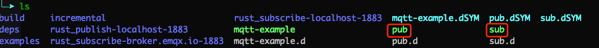
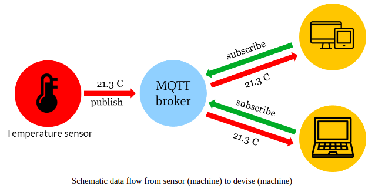

如何在 Rust 中使用 MQTT - 知乎

# 如何在 Rust 中使用 MQTT

[](https://www.zhihu.com/people/emqx-mqtt-broker)

[EMQX](https://www.zhihu.com/people/emqx-mqtt-broker)

全球领先的开源 MQTT 5 物联网消息服务器

[Rust](https://link.zhihu.com/?target=https%3A//www.rust-lang.org/zh-CN/) 是由 Mozilla 主导开发的通用、编译型编程语言。该语言的设计准则为：安全、并发、实用，支持 [函数式](https://link.zhihu.com/?target=https%3A//zh.wikipedia.org/wiki/%25E5%2587%25BD%25E6%2595%25B8%25E7%25A8%258B%25E5%25BC%258F%25E8%25AA%259E%25E8%25A8%2580)、[并发式](https://link.zhihu.com/?target=https%3A//zh.wikipedia.org/wiki/%25E6%25BC%2594%25E5%2591%2598%25E6%25A8%25A1%25E5%259E%258B)、[过程式](https://link.zhihu.com/?target=https%3A//zh.wikipedia.org/wiki/%25E7%25A8%258B%25E5%25BA%258F%25E7%25B7%25A8%25E7%25A8%258B)以及[面向对象](https://link.zhihu.com/?target=https%3A//zh.wikipedia.org/wiki/%25E9%259D%25A2%25E5%2590%2591%25E5%25AF%25B9%25E8%25B1%25A1%25E7%25A8%258B%25E5%25BA%258F%25E8%25AE%25BE%25E8%25AE%25A1)的编程风格。Rust 速度惊人且内存利用率极高。由于没有运行时和垃圾回收，它能够胜任对性能要求特别高的服务，可以在嵌入式设备上运行，还能轻松和其他语言集成。Rust 丰富的类型系统和所有权模型保证了内存安全和线程安全，让您在编译期就能够消除各种各样的错误。

[MQTT](https://link.zhihu.com/?target=https%3A//www.emqx.io/cn/mqtt) 是一种基于发布/订阅模式的 **轻量级物联网消息传输协议** ，可以用极少的代码和带宽为联网设备提供实时可靠的消息服务，它广泛应用于物联网、移动互联网、智能硬件、车联网、电力能源等行业。

本文主要介绍如何在 Rust 项目中使用 **paho-mqtt** 客户端库 ，实现客户端与 MQTT 服务器的连接、订阅、取消订阅、收发消息等功能。

## 项目初始化

本项目使用 Rust 1.44.0 进行开发测试，并使用 Cargo 1.44.0 包管理工具进行项目管理，读者可用如下命令查看当前的 Rust 版本。

```
~ rustc --version
rustc 1.44.0 (49cae5576 2020-06-01)
```

### 选择 MQTT 客户端库

paho-mqtt 是目前 Rust 中，功能完善且使用较多的 MQTT 客户端，最新的 `0.7.1` 版本支持 MQTT v5、3.1.1、3.1，支持通过标准 TCP、SSL / TLS、WebSockets 传输数据，QoS 支持 0、1、2 等。

### 初始化项目

执行以下命令创建名为 `mqtt-example` 的 Rust 新项目。

```
~ cargo new mqtt-example
    Created binary (application) `mqtt-example` package
```

编辑项目中的 `Cargo.toml` 文件，在 `dependencies` 中添加 `paho-mqtt` 库的地址，以及指定订阅、发布代码文件对应的二进制文件。

```
[dependencies]
paho-mqtt = { git = "https://github.com/eclipse/paho.mqtt.rust.git", branch = "master" }

[[bin]]
name = "sub"
path = "src/sub/main.rs"

[[bin]]
name = "pub"
path = "src/pub/main.rs"
```

## Rust MQTT 的使用

### 创建客户端连接

本文将使用 EMQ X 提供的 [免费公共 MQTT 服务器](https://link.zhihu.com/?target=https%3A//www.emqx.io/cn/mqtt/public-mqtt5-broker) 作为测试连接的 MQTT 服务器，该服务基于 EMQ X 的 [MQTT 物联网云平台](https://link.zhihu.com/?target=https%3A//cloud.emqx.io/) 创建。服务器接入信息如下：

- Broker: **[http://broker.emqx.io](https://link.zhihu.com/?target=http%3A//broker.emqx.io)**
- TCP Port: **1883**
- Websocket Port: **8083**

### 配置 MQTT Broker 连接参数

配置 MQTT Broker 连接地址(包括端口)、topic (这里我们配置了两个 topic )，以及客户端 id。

```
const  DFLT_BROKER:&str =  "tcp://broker.emqx.io:1883";  const  DFLT_CLIENT:&str =  "rust_publish";  const  DFLT_TOPICS:&[&str]  =  &["rust/mqtt",  "rust/test"]; 
```

### 编写 MQTT 连接代码

编写 MQTT 连接代码，为了提升使用体验，可在执行二进制文件时通过命令行参数的形式传入连接地址。通常我们需要先创建一个客户端，然后将该客户端连接到 `broker.emqx.io`。

```
let  host  =  env::args().nth(1).unwrap_or_else(||   DFLT_BROKER.to_string()  );    // Define the set of options for the create. // Use an ID for a persistent session. let  create_opts  =  mqtt::CreateOptionsBuilder::new()   .server_uri(host)   .client_id(DFLT_CLIENT.to_string())   .finalize();    // Create a client. let  cli  =  mqtt::Client::new(create_opts).unwrap_or_else(|err|  {   println!("Error creating the client: {:?}",  err);   process::exit(1);  });    // Define the set of options for the connection. let  conn_opts  =  mqtt::ConnectOptionsBuilder::new()   .keep_alive_interval(Duration::from_secs(20))   .clean_session(true)   .finalize();    // Connect and wait for it to complete or fail. if  let  Err(e)  =  cli.connect(conn_opts)  {   println!("Unable to connect:\n\t{:?}",  e);   process::exit(1);  } 
```

### 发布消息

这里我们总共发布五条消息，根据循环的奇偶性，分别向 `rust/mqtt`、 `rust/test` 这两个主题发布。

```
for  num  in  0..5  {   let  content  =  "Hello world! ".to_string()  +  &num.to_string();   let  mut  msg  =  mqtt::Message::new(DFLT_TOPICS[0],  content.clone(),  QOS);   if  num  %  2  ==  0  {   println!("Publishing messages on the {:?} topic",  DFLT_TOPICS[1]);   msg  =  mqtt::Message::new(DFLT_TOPICS[1],  content.clone(),  QOS);   }  else  {   println!("Publishing messages on the {:?} topic",  DFLT_TOPICS[0]);   }   let  tok  =  cli.publish(msg);     if  let  Err(e)  =  tok  {   println!("Error sending message: {:?}",  e);   break;   }  } 
```

### 订阅消息

在客户端连接之前，需要先初始化消费者。这里我们会循环处理消费者中的消息队列，并打印出订阅的 topic 名称及接收到的消息内容。

```
fn subscribe_topics(cli: &mqtt::Client)  {   if  let  Err(e)  =  cli.subscribe_many(DFLT_TOPICS,  DFLT_QOS)  {   println!("Error subscribes topics: {:?}",  e);   process::exit(1);   }  }    fn main()  {   ...   // Initialize the consumer before connecting.   let  rx  =  cli.start_consuming();   ...   // Subscribe topics.   subscribe_topics(&cli);     println!("Processing requests...");   for  msg  in  rx.iter()  {   if  let  Some(msg)  =  msg  {   println!("{}",  msg);   }   else  if  !cli.is_connected()  {   if  try_reconnect(&cli)  {   println!("Resubscribe topics...");   subscribe_topics(&cli);   }  else  {   break;   }   }   }   ...  } 
```

## 完整代码

### 消息发布代码

```
use  std::{   env,   process,   time::Duration  };    extern  crate  paho_mqtt  as  mqtt;    const  DFLT_BROKER:&str =  "tcp://broker.emqx.io:1883";  const  DFLT_CLIENT:&str =  "rust_publish";  const  DFLT_TOPICS:&[&str]  =  &["rust/mqtt",  "rust/test"];  // Define the qos. const  QOS:i32 =  1;    fn main()  {   let  host  =  env::args().nth(1).unwrap_or_else(||   DFLT_BROKER.to_string()   );     // Define the set of options for the create.   // Use an ID for a persistent session.   let  create_opts  =  mqtt::CreateOptionsBuilder::new()   .server_uri(host)   .client_id(DFLT_CLIENT.to_string())   .finalize();     // Create a client.   let  cli  =  mqtt::Client::new(create_opts).unwrap_or_else(|err|  {   println!("Error creating the client: {:?}",  err);   process::exit(1);   });     // Define the set of options for the connection.   let  conn_opts  =  mqtt::ConnectOptionsBuilder::new()   .keep_alive_interval(Duration::from_secs(20))   .clean_session(true)   .finalize();     // Connect and wait for it to complete or fail.   if  let  Err(e)  =  cli.connect(conn_opts)  {   println!("Unable to connect:\n\t{:?}",  e);   process::exit(1);   }     // Create a message and publish it.   // Publish message to 'test' and 'hello' topics.   for  num  in  0..5  {   let  content  =  "Hello world! ".to_string()  +  &num.to_string();   let  mut  msg  =  mqtt::Message::new(DFLT_TOPICS[0],  content.clone(),  QOS);   if  num  %  2  ==  0  {   println!("Publishing messages on the {:?} topic",  DFLT_TOPICS[1]);   msg  =  mqtt::Message::new(DFLT_TOPICS[1],  content.clone(),  QOS);   }  else  {   println!("Publishing messages on the {:?} topic",  DFLT_TOPICS[0]);   }   let  tok  =  cli.publish(msg);     if  let  Err(e)  =  tok  {   println!("Error sending message: {:?}",  e);   break;   }   }       // Disconnect from the broker.   let  tok  =  cli.disconnect(None);   println!("Disconnect from the broker");   tok.unwrap();  } 
```

### 消息订阅代码

为了提升使用体验，消息订阅做了断开重连的处理，并在重新建立连接后对主题进行重新订阅。

```
use  std::{   env,   process,   thread,   time::Duration  };    extern  crate  paho_mqtt  as  mqtt;    const  DFLT_BROKER:&str =  "tcp://broker.emqx.io:1883";  const  DFLT_CLIENT:&str =  "rust_subscribe";  const  DFLT_TOPICS:&[&str]  =  &["rust/mqtt",  "rust/test"];  // The qos list that match topics above. const  DFLT_QOS:&[i32]  =  &[0,  1];    // Reconnect to the broker when connection is lost. fn try_reconnect(cli: &mqtt::Client)  -> bool
{   println!("Connection lost. Waiting to retry connection");   for  _  in  0..12  {   thread::sleep(Duration::from_millis(5000));   if  cli.reconnect().is_ok()  {   println!("Successfully reconnected");   return  true;   }   }   println!("Unable to reconnect after several attempts.");   false  }    // Subscribes to multiple topics. fn subscribe_topics(cli: &mqtt::Client)  {   if  let  Err(e)  =  cli.subscribe_many(DFLT_TOPICS,  DFLT_QOS)  {   println!("Error subscribes topics: {:?}",  e);   process::exit(1);   }  }    fn main()  {   let  host  =  env::args().nth(1).unwrap_or_else(||   DFLT_BROKER.to_string()   );     // Define the set of options for the create.   // Use an ID for a persistent session.   let  create_opts  =  mqtt::CreateOptionsBuilder::new()   .server_uri(host)   .client_id(DFLT_CLIENT.to_string())   .finalize();     // Create a client.   let  mut  cli  =  mqtt::Client::new(create_opts).unwrap_or_else(|err|  {   println!("Error creating the client: {:?}",  err);   process::exit(1);   });     // Initialize the consumer before connecting.   let  rx  =  cli.start_consuming();     // Define the set of options for the connection.   let  lwt  =  mqtt::MessageBuilder::new()   .topic("test")   .payload("Consumer lost connection")   .finalize();   let  conn_opts  =  mqtt::ConnectOptionsBuilder::new()   .keep_alive_interval(Duration::from_secs(20))   .clean_session(false)   .will_message(lwt)   .finalize();     // Connect and wait for it to complete or fail.   if  let  Err(e)  =  cli.connect(conn_opts)  {   println!("Unable to connect:\n\t{:?}",  e);   process::exit(1);   }     // Subscribe topics.   subscribe_topics(&cli);     println!("Processing requests...");   for  msg  in  rx.iter()  {   if  let  Some(msg)  =  msg  {   println!("{}",  msg);   }   else  if  !cli.is_connected()  {   if  try_reconnect(&cli)  {   println!("Resubscribe topics...");   subscribe_topics(&cli);   }  else  {   break;   }   }   }     // If still connected, then disconnect now.   if  cli.is_connected()  {   println!("Disconnecting");   cli.unsubscribe_many(DFLT_TOPICS).unwrap();   cli.disconnect(None).unwrap();   }   println!("Exiting");  } 
```

## 运行与测试

### 编译二进制文件

执行以下命令，会在 `mqtt-example/target/debug` 目录下生成消息订阅、发布对应的 `sub`、`pub` 二进制文件。

```
cargo build
```



### 消息订阅

执行 `sub` 二进制文件，等待消费发布。


### 消息发布

执行 `pub` 二进制文件，可以看到分别往 `rust/test` 、`rust/mqtt` 这两个主题发布了消息。


同时在消息订阅中可看到发布的消息


至此，我们完成了使用 **paho-mqtt** 客户端连接到 [公共 MQTT 服务器](https://link.zhihu.com/?target=https%3A//www.emqx.io/cn/mqtt/public-mqtt5-broker)，并实现了测试客户端与 MQTT 服务器的连接、消息发布和订阅。

> 版权声明： 本文为 [EMQ](https://zhuanlan.zhihu.com/p/264181114/%20https://www.emqx.io/cn/) 原创，转载请注明出处。
> 原文链接：[https://www.emqx.io/cn/blog/how-to-use-mqtt-in-rust](https://link.zhihu.com/?target=https%3A//www.emqx.io/cn/blog/how-to-use-mqtt-in-rust)

发布于 2020-10-10

[物联网](https://www.zhihu.com/topic/19551271)

[Rust（编程语言）](https://www.zhihu.com/topic/19674381)

[MQTT](https://www.zhihu.com/topic/19804946)

### 推荐阅读

[<br># Hi， MQTT Version 5.0!<br>cuzzzzzz](https://zhuanlan.zhihu.com/p/37121056)[<br># 使用 MQTT + JSON 进行物联网通信<br>Alex Link](https://zhuanlan.zhihu.com/p/37133568)[# 物联网的基石-mqtt 协议初识<br>本文为看雪论坛优秀文章 看雪论坛作者ID：emqttx 随着 5G 时代的来临，万物互联的伟大构想正在成为现实。联网的 物联网设备在 2018 年已经达到了 70 亿\[^1\]，在未来两年，仅智能水电气表就…<br>看雪学院](https://zhuanlan.zhihu.com/p/158145940)[# 小仪rust的async/.await<br>从1.39版本开始，async/.await就进入stable了，可喜可贺。这里只是简单分享一下我的体会。 rust的标准库提供的socket，是同步模式的，也因此，很多第三方库也是同步模式的，例如http有rocke…<br>Jinhua Luo](https://zhuanlan.zhihu.com/p/105465306)

## 2 条评论

写下你的评论...

- [](https://www.zhihu.com/people/li-chang-yuan-80)
    
    [只爱一点点](https://www.zhihu.com/people/li-chang-yuan-80)2020-10-18
    
    好刚寻思着rust有没有mqtt的实现呢，这就来了。不错😊
    

- [](https://www.zhihu.com/people/li-chang-yuan-80)
    
    [只爱一点点](https://www.zhihu.com/people/li-chang-yuan-80)2020-10-18
    
    免得我搜了。