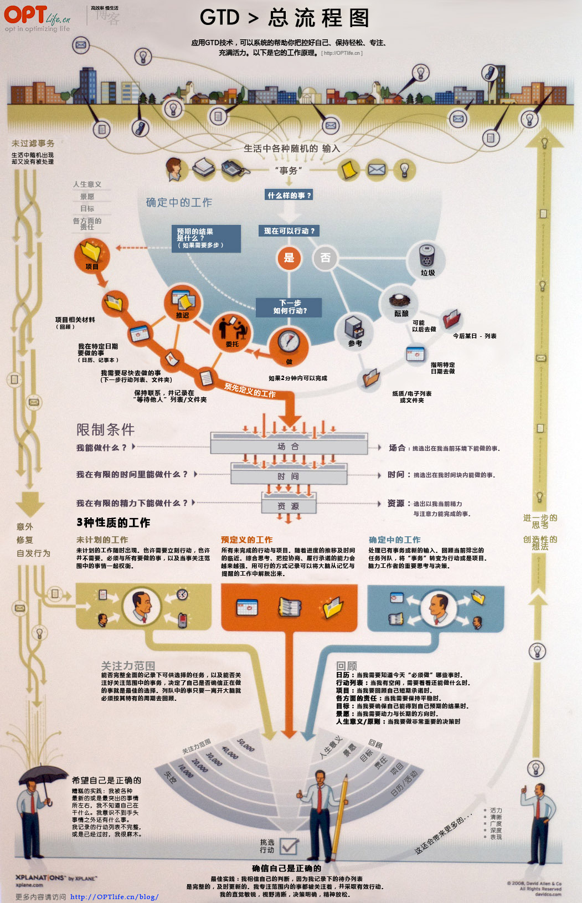
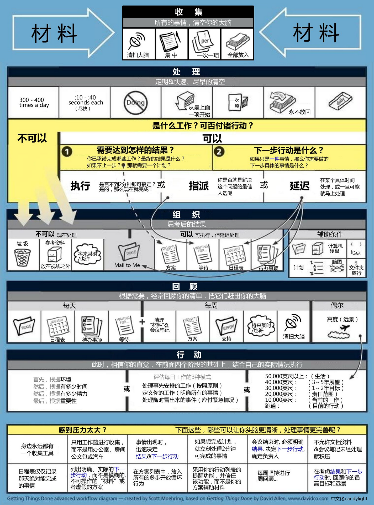

我的时间管理工具 · 构建我的被动收入

[构建我的被动收入](https://www.bmpi.dev/)

- [关于](https://www.bmpi.dev/about/)
- [学习](https://www.bmpi.dev/self/)
- [技术](https://www.bmpi.dev/dev/)
- [投资](https://www.bmpi.dev/money/)
- [个人项目](https://www.bmpi.dev/project/)
- [长期目标](https://www.bmpi.dev/goal/)
- [思考](https://tg.bmpi.dev)
- |
- [English](https://www.bmpi.dev/en/)

# 我的时间管理工具

2019-12-18 20:10 | 4437 字 | <a id="post-views"></a>4937 次阅读

[时间管理](https://www.bmpi.dev/tags/%E6%97%B6%E9%97%B4%E7%AE%A1%E7%90%86/) • [工具](https://www.bmpi.dev/tags/%E5%B7%A5%E5%85%B7/)

“一寸光阴一寸金，寸金难买寸光阴”[1](#fn:1)，“Time Is Money”[2](#fn:2)，这两句尽人皆知的名言，告诉了大家一个道理：穷不要紧，只要你有时间就行。虽然每个人的时间从单位上看都是一样长的，但单位时间的工作效率差异很大，不考虑智力和外部资源的因素，每个人管理时间的方式不同，是决定时间利用率重要的因素。

阿基米德说过：“给我一个支点，我可以举起整个地球。”，这是物理杠杆；期货投资中杠杆可达20倍，赢了会所嫩模，输了下海干活；既然杠杆这么美，有没有一种方法，可以提高我的时间利用率，间接达到时间杠杆的效果？当然有，这就是GTD。

## 什么是GTD?



GTD(Getting Things Done)[3](#fn:3)是一种时间管理方法，它可以帮你把生活中的大小随机事务系统化的制定成计划中的任务，解放你的大脑，帮助你更有效的去工作实现人生的目标。 让我们先回顾下平时的工作生活中大脑处理事情的过程：“某件很重要的事情，比如锻炼身体需要你每周选几天去运动，这是一件长期回报很高的目标。今天本来你需要去按计划运动，突然发生一件比较紧急但不重要的事情促使你放弃计划转而去解决这件急事，然后大概率你的计划被多件紧急不重要事情给毁了。”为什么经常会出现这种情况？因为我们的大脑在进化中就更偏向于处理急事而不是重要不紧急的事情，这是生存优先决定的，因为急事在短期可能对生活产生比较大的影响。但这却阻碍了很多重要却不紧急的长期计划目标的实现。长期目标需要按照计划来一步步推进，比如阅读习惯、写作习惯、记账习惯及很多重要技能的获得。



## GTD的流程

从GTD的工作流图中可以看到几个重要的组成部分：

1.  收集{各种生活/学习/工作事务} -\> 清空大脑
2.  处理{筛选出有效的可付诸行动的事务} -\> 识别任务
3.  组织{将事务组织成待办事项/项目/日程表/等待/未来可能做} -\> 制定目标
4.  检查{每日检查待办事项清单} -\> 提醒自己今日要做的事情
5.  行动{执行待办任务} -\> 集中精力完成任务
6.  回顾{每周/月回顾} -\> 从人生目标/长期目标/中短期目标/近期目标/当前任务的角度审视目标

“把所有事情都从你的脑袋里弄出来。在事情出现，而不是在事情爆发的时候,就做好相关行动的一系列决定。以合适的类别组织好你的项目的各种提醒以及下一步的行动。保持你的系统更新和完整，充分地检查，使你在任何时候都能信任你的对于你正在做（或者不做）的事情直觉的选择。”[4](#fn:4)

### GTD的问题

理想很美好，这套理论看起来可以帮助我们规划人生的方方面面，但是实际上很难执行下去。[5](#fn:5) 虽然难以执行，不过我还是努力使用GTD去形成时间管理的习惯，并做出了自己的时间管理工具v1版本[6](#fn:6)。

## 我的时间管理工具v1

在这个版本中我的工具组合：

1.  OneNote: 笔记系统，存储各类资料
2.  OmniFocus: GTD的实现，可以完成GTD的6大环节
3.  日历: 简单待办事项处理+通知

 

### v1存在的问题

1.  学习成本高。要把OmniFocus按照GTD的流程来实践是个困难的事情，要形成使用习惯也需要一定时间。
2.  操作灵活性差。在手机端将各类事项存入Inbox，然后转化成项目/任务/待办事项清单效率低，在电脑端操作也不灵活。
3.  购买成本高。OmniFocus的iOS版和Mac版本费用超千元。
4.  扩展性差。商业软件，不可能让你定制功能的。
5.  数据不是我的。某天OmniFocus的公司不在做这个软件的话，我数年的数据可能就没有了。数据对GTD这类长期使用的软件尤为重要，而且数据格式最好是通用的，不能只支持特定软件。

因为以上的问题，我的v1在使用一段时间后，OmniFocus就被我放弃了。

## 我的时间管理工具v2

在这个版本中我的工具组合：

1.  OneNote: 笔记系统，存储各类资料
2.  备忘录：GTD的局部实现
3.  日历: 简单待办事项处理+通知

### v2存在的问题

备忘录虽然在移动端操作方便，但是没有很好的组织功能、筛选功能、提醒功能、数据迁移不方便，尤其在创建很多项目的时候逐渐变得不灵活，所以这注定是个临时过渡方案。

## 我的时间管理工具v3

这是我目前采用的方案。在经历前两个版本后，我认为时间管理工具需要具备以下特点：

1.  学习成本低。操作成本不能太高，否则很难坚持很长时间的。所以一定要很快能上手。
2.  灵活度高。大部分的工具都考虑到使用手机端作为主要平台，但是手机天然有操作灵活性差的问题，电脑相比手机的效率肯定是很高的，所以工具应该以电脑操作为主，手机只需要辅助记录和提醒即可。
3.  可扩展性强。需要具备一定的定制能力，工具要开源的，可加入自己的功能。
4.  数据独立存储，纯文本格式，不依赖特定工具和平台，掌控到自己手中。

v3的工具组合：

1.  VSCode+插件（TODO++）
2.  GitHub
3.  日历

首先解释下为什么会是这个组合？作为一个开发，平日用到最多的就是编辑器。之所以选择VSCode，是因为他的生态比Emacs好，启动速度在安装很多插件后还是很快，插件开发简单，背靠微软大山，软件使用体验还是很不错的。刚好在里面有个有个Todo+[7](#fn:7)的插件，这个插件支持一种todo后缀的纯文本格式的文件，这种文件很容易新建一个待办事项，支持项目嵌套，使用快捷键标记待办事项状态，如下图所示：

当我找到这个插件时，经过一段时间使用，发现很适合做待办事项管理，但是有个问题就是这个插件在左侧的窗口不支持查看**正在做的事**，同时我希望能够看到标记为**重要事项但未开始**的待办事项。因为当我创建很多项目的待办事项时，很多项目的优先级并不高，我可能在未来某个时间去做，这些是我目前不关注的。我最关心的是当前正在做的事情，同时我也很关注那些人生目标中最重要但不紧急的事情，得时刻提醒我去回顾检查，不要把重要目标迷失在紧急不重要的事情中。

因为这个插件是开源的，所以我克隆了一份后加入了查看当前正在做与重要但未开始做的事情查看窗口，并发布为[Todo++](https://marketplace.visualstudio.com/items?itemName=mdw.vscode-todo-plus-plus)。

有了这个VSCode插件后我解决了在电脑端编辑待办事项的问题，这种方式足够灵活，你可以把自己的工作、学习、生活都以如下方式来管理：

```
.
├── self
│   ├── idea.todo
│   └── inbox.todo
├── study
│   ├── book.todo
│   └── 手工皮具学习.todo
└── work
    ├── project_a.todo
    └── project_b.todo

```

每个你关注的领域使用一份todo文件来管理，然后这个领域内你又可以拆分无数的项目，每个项目又可以无限拆分子项目，每个子项目最终拆解为一些可执行的待办事项，使用快捷键可快速标记这个待办事项的三个状态 **（started/done/canceled）** ，还可以使用 **@critical** 来标记任务是否重要。

```
项目B_1:
    ☐ 项目A_1_1 @started(19-12-17 20:45)
    ✔ 项目A_1_2 @done(19-12-17 20:45)

项目B_2:
    ☐ 项目A_2_1 @critical 
    ☐ 项目A_2_2 @low 

```

当你做完这些，可以立即在VSCode的左侧窗口看到那些任务正在做，哪些任务很重要但未开始做。

我还做了一个todo的模版库，使用这个模版创建自己的私有仓库：[todo_starter](https://github.com/bmpi-dev/todo_starter)。创建好后clone下来使用VSCode与TODO++插件即可开始使用了。

解决了电脑端的操作问题后，移动端有个很重要的功能就是提醒，如何能在手机端每天收到当前正在做的事情和重要但未开始做的事情？

为了解决这个问题，我开发了一个todo文件的parser库：[todo\_parser\_lib](https://github.com/bmpi-dev/todo_parser_lib)，这个库可以解析指定目录下的todo文件，筛选出当前正在做的事情和重要但未开始做的事情然后渲染成一个html文件。有了这个库后我们可以结合GitHub提供的Actions[8](#fn:8)功能，在每次我们push更新到仓库时，可以自动使用这个库渲染出html，然后给我们指定的邮箱发邮件来提醒。这个GitHub Actions的配置也放在了 **todo_starter** 这个模版库中了，你只需要在仓库settings->secrets中提供发送邮件的邮箱和邮件服务商的SMTP地址即可。配置如下：

```
name: schedule-email
on: 
  schedule:
    # * is a special character in YAML so you have to quote this string
    - cron:  '0 1 * * *' # Change this to your time
  push:
    branches:
      - master # Change this to your default branch
jobs:
  make-html-send-email:
    name: make-html-send-email
    runs-on: ubuntu-latest
    steps:
    - name: Checkout repository
      uses: actions/checkout@master
    - name: Set up Node.js
      uses: actions/setup-node@master
      with:
        node-version: 10.0.0
    - run: npm install -g todo-plus-parser
    - run: todo-plus-parser -i "./" -o "./out.html"
    - name: send-email
      uses: bmpi-dev/action-send-mail@master
      with:
        server_address: ${{secrets.MAIL_SMTP_SERVER}} # your send mail SMTP addr
        server_port: 465
        username: ${{secrets.MAIL_USERNAME}} # your send mail username
        password: ${{secrets.MAIL_PASSWORD}} # your send mail password
        subject: TODO++
        body: file://out.html
        to: ${{secrets.MAIL_TO}} # your receive mail
        from: ${{secrets.MAIL_FROM}} # your send mail username

```

我同时设置了定时任务，GitHub Actions会在每天的早上9点定时自动构建，然后发送邮件提醒你。由于数据是纯文本的，你可以把他放到任何地方（网盘、GitHub等）。最终的效果如下：

### v3的优点

1.  纯文本格式。很容易做一个parser去解析这种类yaml/python的缩进风格格式，同时也很容易编辑，使用任何编辑器都可以操作。当然最好使用VSCode与TODO++插件，这样会方便一些。
2.  灵活度高。可以随意的通过目录来区分不同领域，同时可以在单个文件中建立各种相关的项目，项目可以无限拆分。
3.  可扩展性强。比如你要扩展一个功能，加入**非重要但未开始做的**待办事项查看和提醒功能，这时候可以扩展VSCode插件和 todo\_parser\_lib 。还可以通过GitHub Actions等pipeline做自动化的任务处理，结合IFTTT可以玩出很多花样。
4.  数据私有。数据是你的，再也不需要依赖特定公司和特定平台了。
5.  免费。这一切都是免费的，除了耗费你一些时间。

### v3的使用场景

想象下每天早上你收到一份邮件提醒你今天该做哪些事及那些对你很重要但还没开始做的事情，时刻提醒你自己的重要目标。当有了一些新的要做的事情，打开电脑添加进去，推送到GitHub的云服务中，之后你的手机自动收到一份新构建成功的待办事项清单邮件。当你不在电脑旁的时候，又需要记录一些idea该怎么办？可以临时先记录到手机的备忘录中去，当有了电脑后，再重新整理进你的todo文件中。对于那些在特定时间发生的需要提醒的事件，直接加入到日历中去。

### v3的进一步构想

我们有了电脑端编辑TODO的工具，手机端只接受提醒可能还不够好，能不能搞个基于Telegram的Bot通知？能不能搞个App去支持手机端编辑？能不能搞个命令行的工具？当然是可以的，既然我们做出了parser，有了parser解析后的json数据，我们可以进一步基于json这种数据格式做进一步的处理。当我有了这个想法后，突然意识到肯定有人已经想到了并且做了，经过一番查找，最终找到了todotxt[9](#fn:9)。

虽然todotxt也是基于txt的时间管理工具，但是和我的需求还是不匹配，所以最终我还是搞了v3出来。

## Emacs ORG-MODE

提到To Do，不提Emacs的org实在说不过去。

> Org mode is for keeping notes, maintaining TODO lists, planning projects, and authoring documents with a fast and effective plain-text system.[10](#fn:10)

可以说Org是万能的，既可以做笔记，又可以做TODO，还可以规划项目，编写文档，这一切都是纯文本的！唯一的缺点，可能就是你需要掌握Emacs这个上古神器，同时可能还需要掌握上古语言elisp，这两座大山不好爬，吓跑了好多人，所以神器虽好，使用成本也不得不考虑，他不符合我学习成本低的要求。

#### *References*

1.  出自《增广贤文》 [↩︎](#fnref:1)
    
2.  [https://en.wikipedia.org/wiki/Time\_Is\_Money](https://en.wikipedia.org/wiki/Time_Is_Money) [↩︎](#fnref:2)
    
3.  [https://gettingthingsdone.com/](https://gettingthingsdone.com/) [↩︎](#fnref:3)
    
4.  [https://zh.wikipedia.org/wiki/%E5%B0%BD%E7%AE%A1%E5%8E%BB%E5%81%9A](https://zh.wikipedia.org/wiki/%E5%B0%BD%E7%AE%A1%E5%8E%BB%E5%81%9A) [↩︎](#fnref:4)
    
5.  [为什么GTD工具对于大部分人的结果都是无法坚持使用？](https://www.zhihu.com/question/24287111/answer/30106040) [↩︎](#fnref:5)
    
6.  [用GTD理念管理你的时间](https://zhuanlan.zhihu.com/p/21265727) [↩︎](#fnref:6)
    
7.  [Todo+](https://marketplace.visualstudio.com/items?itemName=fabiospampinato.vscode-todo-plus) [↩︎](#fnref:7)
    
8.  [Github Actions](https://github.com/features/actions) [↩︎](#fnref:8)
    
9.  [http://todotxt.org/](http://todotxt.org/) [↩︎](#fnref:9)
    
10. [https://orgmode.org/](https://orgmode.org/) [↩︎](#fnref:10)
    

本作品采用[知识共享署名-非商业性使用-禁止演绎 4.0 国际许可协议](http://creativecommons.org/licenses/by-nc-nd/4.0/)进行许可

## 相关文章推荐

- [VSCode插件开发小记](https://www.bmpi.dev/dev/vscode-plugin-development-notes/)
- [Parser黑魔法](https://www.bmpi.dev/dev/parser_black_magic/)

每月一份邮件，分享我对如何构建被动收入的思考、推荐文章及资源，欢迎订阅

[Wiki](https://wiki.bmpi.dev/) ⚔️ [Talk](https://talk.bmpi.dev/) ⚔️ [Portfolio](https://www.notion.so/mdw/e0ed086e701a4d0aaa4839d2c7aa62ea) ⚔️ [Money](https://money.i365.tech/)

[Affiliate](https://www.bmpi.dev/affiliate) ⚡️ [Tool](https://www.bmpi.dev/tool) ⚡️ [Link](https://www.bmpi.dev/link)

[Tags](https://www.bmpi.dev/tags) 👈 [Categories](https://www.bmpi.dev/categories) 👉 [Series](https://www.bmpi.dev/series)

© 2019 - 2021