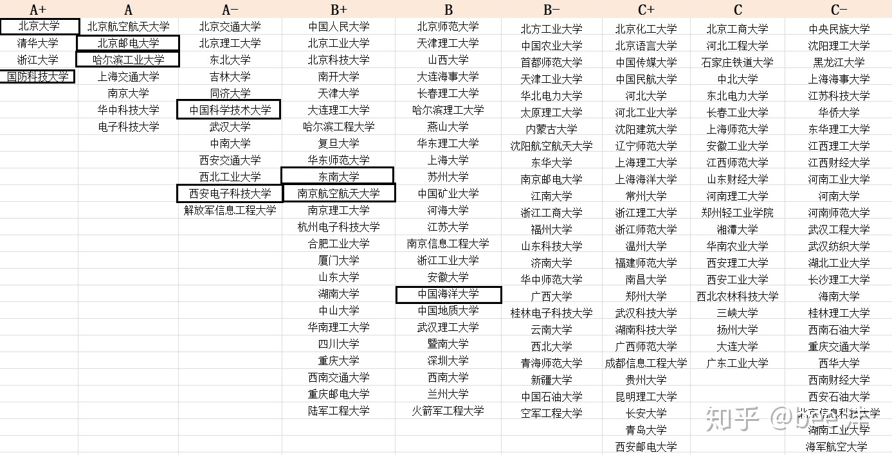
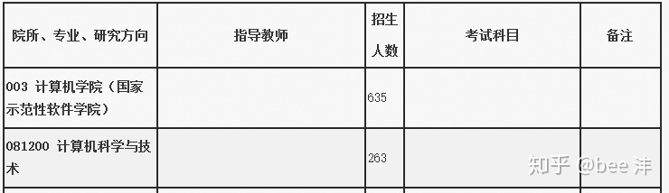
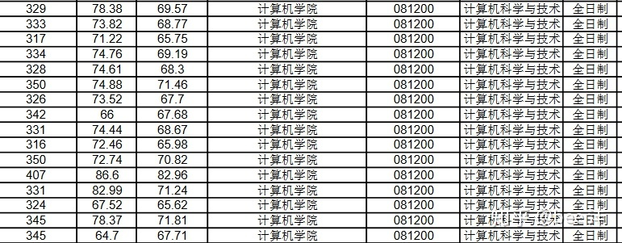
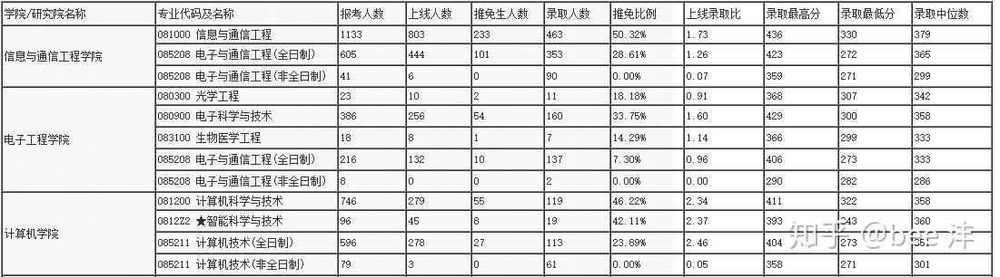
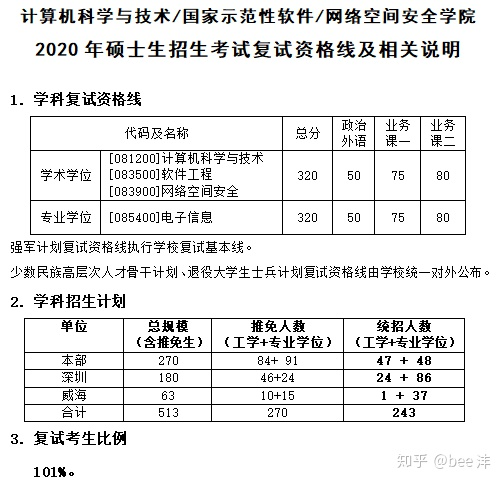
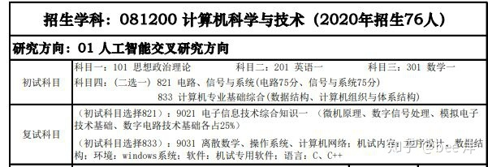
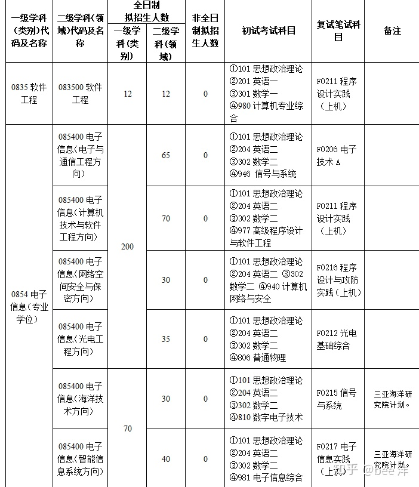

# 2022年计算机考研有什么性价比高的院校？

在推荐院校之前说一句，**计算机考研选择院校的时候不能只看学校的知名度、性价比**，一定要根据自己的基本情况去选择，否则选择性价比再高的学校考不上也是白给！

选择院校的时候可以参考学科评估结果：

**计算机专业跟其他专业一样，越是热门的院校越难进**，没有足够的实力和努力就别一昧的想着去冲清北复交，找一个自己能够考上性价比有高的学校要划算很多。

如果自己是跨考或者是不清楚自己的基础到底在那个水平，又想根据选择最适合自己的院校的话推荐去找一个专业择校的平台帮忙分析择校，绝对比自己瞎选择有用很多。我是二战成功上岸的，一战的时候就是因为学校的选择和专业课成绩的问题最后失利了，二战选了一个专业课辅导班，叫专业课透明计划，里面辅导专业课也赠送量身定制的择校服务，后面我也根据老师的推荐换了一所学校，也就是现在正在就读的大学。所以选择很重要，**我们做出的选择跟我们最后的结果是息息相关的**。

再来说说学校推荐吧

1、**A+类难度都高，相对而言**国防科技大难度比其他几所大学要低一些，对比清华计算机的神仙难度还是要轻松一点的。根据最新的更新信息来看，电子信息统考招生人数55人，计算机学硕方面统考招生人数只有几人，所以选择的时候要谨慎考虑一下具体选择那个方向。计算机专业课自主命题考821计算机专业基础，参考书目3本。

2、北大软微招生人数相比其他几个学校多，但是报名人数更多，**每年的爆炸几率都很高**，选择北大软微每年跟两千往上的人竞争，这竞争压力都不用说，复试成绩占30%，采取面试的形式，对于跨考生比较友好。

3、A类学校里北邮计算机是他们学校的王牌专业，专业实力和学校的名气都是很高的，**计算机学院招生人数多**，今年计算机学院拟招生人数635，相对来说机会非常的大。

下面是北邮20考研计算机考研拟录取名单的一部分，第一列是他们的初试分数线，**根据专业水平、报考人数、最后的录取分数这三样综合考虑**，北邮的计算机性价比是绝对的高。

  

4、哈尔滨工业大学20考研由于换了专业课复试线降低到320分，复录比101%，基本上是进了复试就能录取，22考研复试线很有可能会涨，但总体来说的性价比也还是不错的。

5、中国科学技术大学软院出了名的招生人数多，复试包括英语听说能力测试、笔试、机试和面试，复试占比50%，中国科大软院公共课英二数二，专业课408，复试线320，复试难度不算特别高，过线就稳。

更新，据说21考研中国科大软院炸得不能再炸了，竞争压力前所未有的大，22考研不知道会不会再次扩招，但22考研的同学最好还是谨慎选择。

6、西安电子科技大学人工智能学院计算机专业课833两门课，20考研复试分数线305，今年人工智能学院计算机科学与技术招生76人，竞争压力相比计算机科学与技术学院小。

7、东南大学复试线310，软院和网安招生人数都多，今年软院招生150人，网安招生167人。东南大学软院和网安专业课难度不高，竞争压力也算很大，复试不歧视双非，自身实力过硬就可以放心报考。

8、南京航空航天大学211、双一流大学，计算机复试线318，网安复试线292，网安专业进入复试的平均分321，计算机是他们学校的王牌专业，报考的话性价比还是不错的。

9、中国海洋大学电子信息专业的计算机方向和网安方向，计算机方向20考研复试线295，网安方向复试线264。电子信息专硕招生人数多今年招生200人，21考研计算机和网安方向拟招生人数共100人。公共课和专业课的难度都不大，如果是一心想考985院校但是又担心竞争压力的，这所学校可以去了解一下。

\--------------------------------分割线---------------------------

学长还是想说考研院校的选择还是要根据自己的实际情况起考虑，选择院校的时候多上点心，在后面考研复习的时候就少操点心。

**院校选择建议综合考虑几方面：**

**1、自身的基础**

公共课而言计算机大多数是英一、数一，部分学校会有英二和数二的组合，**英二和数二的难度肯定是要比英一数一要低的**，所以英语或者数学基础差的同学可以根据这个好好选择一下。

专业课方面计算机408的难度和热度不用说，**408的好处在于在一般情况下不用面对突如其来的换专业课**，复习408的考生也可以去盯一盯突如其来换成408的学校，很有可能捡漏，就拿去年武汉大学的例子，复试线290，就分数线和学校来说性价比绝对的高。

**专业课是学校自主命题的话参考书目一般和408也有很大的差别，**自主命题的好处之一就在于难度可能会比408要小，也有的学校专业课考试的参考书目是3本有的是2本，这种情况对跨考生就比较友好了。

**学校自主命题的话专业课的考试内容和408也有很大差别，**大家选择的时候注意把专业课的信息都收集好。就拿961来说，961专业课就少了一本数据结构，但是多了MIPS汇编语言和基于MIPS指令集的CPU。我当时复习的时候对多出来的这一块其实不是很熟，好在是有直系学长的辅导，复习的时候可以问学长专业课上面的问题，学长也会把他专业课复习的资料送给我，所以专业课这一块虽然是自主命题，但是复习起来的压力也不会很大。

**2、地区的选择**

**北上广肯定是考研的热门地区，还有很多一线城市的学校竞争压力也一样的大**，地区可能也是很多人的首选考虑，有的人是不愿意离家太远，有的是想找一个好城市长线发展，所以选择学校的时候院校的地理位置也可以作为一个因素，**根据自己的意愿综合考虑。**

**3、学校的专业实力**

**学校的专业实力越强考试难度越大，竞争压力也会越大。**选择在自己实力和基础之上的学校肯定是没有问题的，但是差距也还是不要太远，**清北复交没有非常强硬的实力就算看上去诱人也都是虚的，**学长曾经也做过清北复交的梦，但是最后现实还是残酷的。**还是那句话迷茫的同学完全可以找专业的人士帮忙择校**，我上面说的性价比高的学校也都是一般而言的，根据自己的实力去选择学校才能够找到对自己来说性价比最高的学校。

**院校信息我们也要去了解清楚，可以直接进入学校的官网上去看，招生人数、复试线、报录比这些东西都是我们参考的数据。**招生人数不是越多就越好考，就像上面说的北大软微，招生人数多，报名人数更多，机会一样很小。所以一定要把信息了解全面了再去决定。

最后学长还是想说，**院校的选择是我们考研的一部分，我们自身的努力才是最重要的一部分，**世界上没有真正的漏让你去捡，只有靠自身才是最有保障的事情。希望大家都能够顺利考上自己的理想院校！
