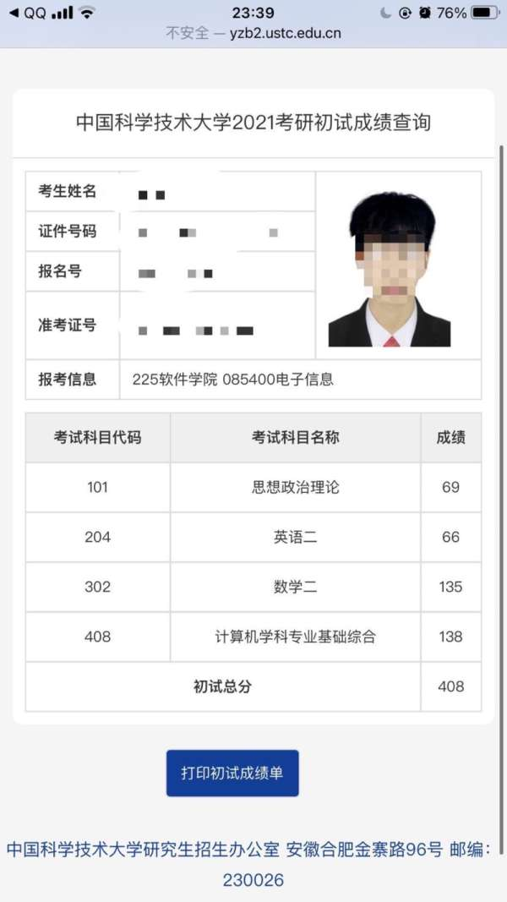
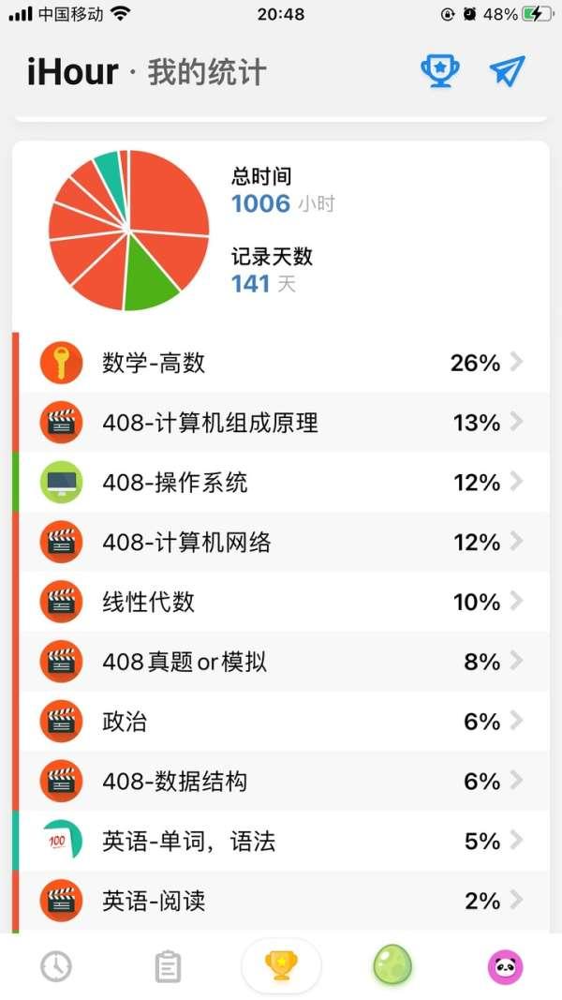
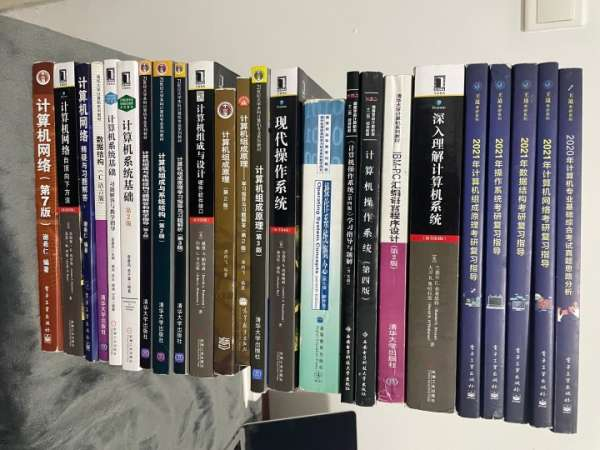
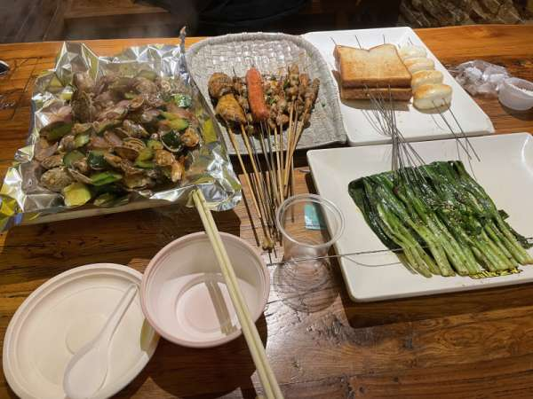
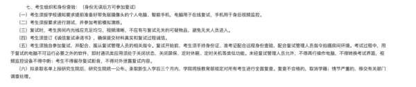
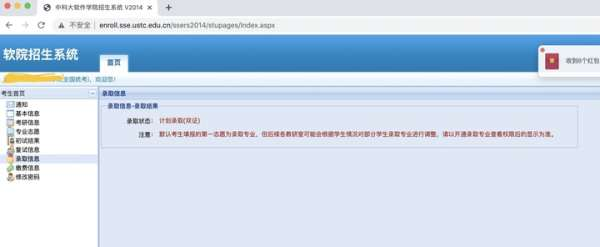
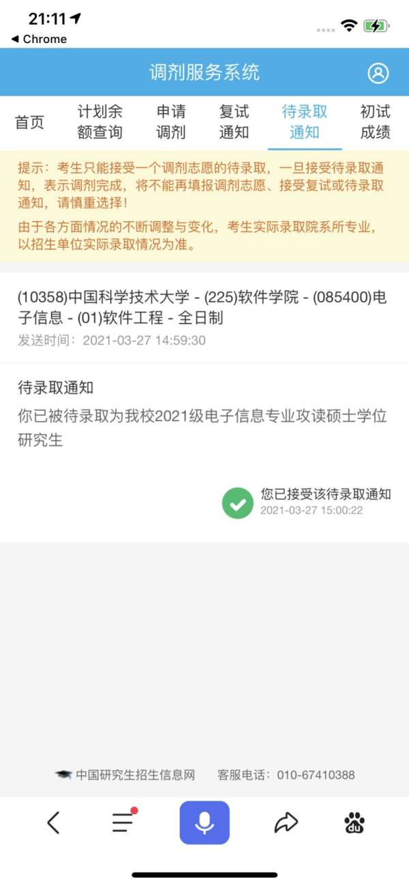

# 【408考研专业课138分】总分400+中-考研区-虎扑社区

前言：我是21年参加考研的考生，其中408单科分数为138分，在中科大软件学院初试4300+人里排名第二，成功上岸科软。写这篇帖子的原因很简单，很多22小伙伴来催更我写一篇经验贴，于是这篇帖子就来了。

  

先上图把：

408考了408，天选之人把（手动狗头）

一、个人基本情况简介

二、初试

三、复试

四、考研心态

五、结尾语

（想联系学长可以直接看文末）

* * *

一.个人基本情况简介 ：普通211 半科班（计算机相关专业），其中大一是生化环材里某学院，大二果断转专业跑路

数学：相关课程均绩在99（没啥用，考研的时候已经啥也不会了），408相关课程，数据结构93，操作系统，组成原理87（这俩老师真好啊。。。），计算机网络73  （其实这些课学完即忘，其实没啥参考价值）绩点大一大二，属于前10%，后面因为一些特殊原因，错过数学建模等关键保研比赛，编译原理，大学物理分数也很难看，确定保研无望后放飞自我，大三到现在应该属于前40%

英语：平时70+的均分，四级裸考过一次470+，六级裸考过一次没过

政治约等于完全没学过

复习总时长（有记录部分，7月份开始）：1006小时,其中408部分花费500+小时，7月份之前大概做了这些事：把408课本和王道看了看，数学看了看课本，英语背了些许单词，时间很零碎，7月份觉得在家效率不行，再这样下去要完蛋，于是跑到武汉在学校旁边租了个房子，直接回学校旁边租了个房子，期间去过付费自习室，整体还是从9月份开学后，去学校图书馆和自习室后效率慢慢提高。

择校：初始目标浙计，上交cs，10月份深感状态不行，并且错过了pat,人生观念有变，遂求稳跳车科软（21稳了个寂寞，炸穿地心可还行，还好定的目标高了一点点。）

二.初试408-数学-英语-政治

可以看看我的时间分布，软件是iHour可以看出，最后140天，我51%的时间花在了408，大概500小时出头，36%的时间花在了数学，英语政治加起来13%， 总有效复习时间按1500+小时去准备把（大概8，9个月），这样可以充裕一点，舒服一点。当然这不是我总共花费的时间，前面还零零碎碎有一些时间无法统计，时间也过于紧促，建议数学二和408都至少保证500+小时去学习，英语200+小时，政治150+小时，战线的话3，4月份开始较佳，不然每天如果全心投入8h以上去学习其实是一件很累的事情，不信大家可以试着统计一下有效时间，一旦注意力不集中就重新计时，不是坐在位置上磨时间。

408计算机专业基础综合因为个人粗略看过408的卷子之后，感觉408也是分大小年的，奇难偶易（相对难度），所以21年的我预判408会出得很难，所以在408上花了狠功夫，虽然今年相对以往难度有所下降。整个复习过程中，我的408复习时间甚至超过数学，因为我认为对于一个计算机专业的学生或者想进入计算机领域的学生来说，408四门课是基础中的基础，我本科并没有将这几门课学的多好，所以我想通过考研来弥补一下自己的专业基础，其次，如果没考上，408学好了对春招也是大有帮助的，所以我整体的信念是408值得我多投入一点。我考研过程搜了很多帖子，包括20年浙大计算机408单科状元恒少139分的帖子以及其他高分选手的帖子，综合一番后，我得出的结论是，408偏应试，良好的做题思维比如反代法可以解决不少问题，应该尽量简化问题。核心使用王道单科书+真题，课本在第一轮的时候我会详细看，毕竟感觉王道上说的还是不够仔细。对于黑书，我的态度是，感觉课本和王道都没说清楚，也找不到人问，可以挑相应的章节看看。黑书里只有自顶向下我是全部都看了的，相比谢希仁，我觉得这本书让我建立起了一个整体的概念，也很友好（当然部分章节超纲了还是得跳），做了一两个tcp，udp服务器的实验，感觉真的挺不错，不过迫于时间紧张，后面就没涉及书中代码了。当然，我现在回过头来看，王道或者谢希仁多过两遍，即使我看过黑书，也觉得不是很必须看黑书。用过的书，除了王道，其他基本用来当字典，想看的时候查一查：

408系列买家秀

主要用书（基本都完整看了一遍以上）：王道四本单科书，计算机操作系统（汤子瀛），计算机组成原理（唐朔飞），计算机网络（谢希仁），计算机网络-自顶向下方法，09～20年408真题

参考用书（用来当字典，看了部分章节）：深入理解计算机系统（csapp），计算机组成与设计-软硬件接口，操作系统概念（郑扣根译），现代操作系统 

补充资料：数据结构代码模版，pv金典，袁春风老师组原视频（其他的视频市面上的感觉一般，袁春风老师前408命题组组长，并且组原基本是决定你408高度的天花板，组原值得一看）。

 王道非常精简，类似精简笔记，好处是明晰重点，当然如果没基础或者基础不好，有的东西你只能看个似懂非懂，比如CSMA/CA,802.11这块，王道多少有点说的不太清楚。页表示意图中，页表项的编号在内存中实际上是不用存储的，页表单页连续存储，其中包含了页面的序号信息（类似数组下标），书中给的图并没又明确说明，容易引起歧义。诸如此类的小地方零散分布在王道里，但是总体来说使用王道针对408应试可以更为节约时间。天勤的话据说对跨考更友好，但是翻了一下，感觉这一块王道还是更成熟。可能有人会疑惑为啥没数据结构的书，数据结构你的目标是41/45的话，王道就够了，想拿满分，严书也没啥帮助，不如刷leetcode(当然，我觉得初试刷leetcode反应到408上，投入回报比极低），其他书相对考研性价比太低。模拟题的话市面上的质量都太低，但是模拟卷说真的不咋滴，没有做的欲望，不如再做一遍真题。

学习顺序：数据结构45分->计算机组成原理45分->操作系统35分->计算机网络25分。操作系统和组原换换也行。计网我觉得偏向于记忆，放在太前面，后期复习的时候也基本忘光了，可以放在最后。数据结构从入手角度来说，最简单，毕竟理解数据结构的基本思想还是比较easy，talk is cheap，408除了算法题不用show me the code,算法题的话通过几种常见的模版至少可以5分钟搞定，并且拿11/15分，何乐而不为？相比于追求最优解，有可能花费时间更长，写错了得到一个更低的分数，对于绝大大大多数人，没有必要，最优解底下练习就可以了，考试无脑暴力解，等到都做完了可以回来慢慢想最优解，确定了，再改成最优解，这无论是从心态上还是稳定上都合适。

数据结构使用王道基本就可以了，第一遍重点放在选择题，大题和代码相关的，可以略过，性价比太低，并且极为消耗时间，做做不写代码的应用题就行了。然后错了的题红笔在题号上打个小圈圈，方便后期快速复习。后期数据结构就非常快乐，主要针对一些容易遗忘的部分针对性复习，比如kmp,b树，b+树等，过的可以很快。第二轮，后面有空的时候再挑些算法题写写，遇到数组类型（不止是一维数组，今年的图用邻接矩阵二维数组存储，就两个for循环）或者单链表的题，for循环暴力。遇到树这种多叉链式结构递归暴力。不管是科班还是跨考，408需要的c/c++语法知识很少，两种暴力法都比较好掌握，相比追求满分要花的时间你可以权衡一下自己的精力是否足够。其次注意一些for循环的结束条件，数组下表从0开始等小细节，问题应该不大。408里从上面的图可以看到，我只花了50多个小时左右。但是我又刷过算法笔记，准备过pat，加之本科又学过，跨考的同学还是按100+小时的标准来准备把。

操作系统这一块，王道第一章容易分不清楚内中断，外中断的一些叫法，比如异常，中断，陷入这些东西可能你就是会觉得搞不清，需要逐步的梳理。第二章的pv操作在大题做完了，可以试试pv金典。第三章虚拟内存的作用和cache对比一下，虚拟地址到物理地址的映射过程要反复想清楚。文件，i/o偏向记忆。还是主要王道+汤子瀛课本基本也ok了，操作系统概念这本郑扣根老师翻译的书是我的本科教材，写的也很友好清楚，汤书换成这个也行，不过有些涉及具体的操作系统上代码，可以跳过。当然你时间充裕去看看现代操作系统那本书的页表，文件那块也不错，虽然从应试角度没必要。第一轮可以着重在选择题，第二轮把大题补上，王道大多数大题还是可以做一做的，这点和数据结构不同。

组成原理可以说是408里最难的一门课了，涉及软件硬件，一切要用到数字电路的地方你都可以忽略，不用试图搞懂，没有意义。只要知道用处以及怎么用就行了。比如乘法里你只要哪些部件有啥功能就行了，存储那块，你只要知道有怎么接板子就好了，至于具体的线路就不用纠结了。再就是中断，一定是计组的高频考点，i/o的几种方式，复试被院士问到中断的各个方面。其中王道里的一些组成原理的大题是可以跳过的，乘法除法可以跳过，浮点那节做做选择和真题。第一轮数据通路那里写节拍的大题也不用都做，挑挑几个经典做做就行，或者看看唐书的例题。乘除法考前看看。第二轮再根据情况做做第一轮没做的大题。有精力可以看看袁春风老师的计组书(相当于中文版软硬件接口)和网课以及袁老师最新的计算机系统基础（相当于中文版csapp)，时间足够的话，看完袁老师的计组你会觉得408计组也就那回事。

计算机网络，各层的原理和作用，核心是数据链路层，网络层和传输层。要记忆的东西很多，关键是把各层的协议有机的联系在一起。比如一个一个ip地址没有的主机访问

[www.zhihu.com](https://games.mobileapi.hupu.com/bplapi/security/redirect?link=http%3A%2F%2Fwww.zhihu.com)

的具体过程，这里面涉及到的所有协议，细节能讲清楚，你至少有8成的功力来对付计网了。（这个过程不同人可以说的程度不同，这里面最多可以包含的协议是超过10个以上，可以检查看看自己可以说出几个，能不能对应到具体的过程）。谢老师的书没啥毛病，不过我个人感觉读完自顶向下，知识体系更能有机结合一点，当然这是在看过王道和谢的书的基础上，多看两遍王道和课本，差别不大。还是那句话，黑书有精力可以看看，但是没必要。第一轮王道注重选择，大题第一轮也可以跟着做。第二轮就是主要注重条理了，尽量能把各章有机结合起来，建立一个整体的概念，不要过于割裂。后面就是对抗遗忘的过程了。

最后就是真题，及早接触。我建议第一轮搞完之后，就接触一下真题，可以先挑09～10年的做。可能第一轮的时候能力还不太够，但是这可以帮你了解408大题的题型分值分布，考察形式和内容，选择题的难度，这个十分重要。408没有说哪一章有那种你完全不会的题，但是408体系庞杂，概念繁多。想搞定408有两个难点，首先，概念多，有的概念你可能看书也觉得说的不明白。其次，知识体系庞大之后，知识容易混淆，缺乏条理。如果找到一个靠谱的人给你即时解答，效率会高很多。最后，我们要搞清楚，我们最终面对的是今年12月底的那张408试卷，这之间的所有努力是为了建立起清楚正确的知识体系，途中反复复习的目的如果要更有针对性一点的话，则是为了对抗遗忘。这些如果都做好之后，我想408 120的保底分数不是什么难事。至于更高的分数，需要时间，正确的方向，知识体系的牢固。

数学：别被本科成绩迷惑，踏踏实实做人。本科成绩大家参考参考就好，基本还是要重新学一遍。数学一直是蜜汁自信，毕竟大一数学期中考了全院第一，均绩99，概率论还拿了满分，以为自己在考研路上也会顺顺利利，实际上学完那点数学后，就算当初考的很高，也忘的不剩多少了，而且考研的难度还是比平常考试高一个level。不要高估自己的水平，也不要低估考研数学的难度，虽然21年是简单，但是偶数年考研数学的难度都还是很在线的，不到考试那一刻，谁也不知道卷子到底多难。前面一直在按数学一备考，后面的话又花钱买了一套数学二的书。2.用过的书（主要）：李范全书（粉书），李永乐全书，李永乐线性代数讲义（yyds），李永乐的660，考研真题07～20年，李林四套卷，李林八套卷，张宇四套卷，张宇八套卷一开始想着数学要奔着130+保底的，于是搜了很多140+的帖子来看，发现粉书被提到的有点多，大家都说难也都说好，就从它开始了我的数学复习。首先不建议大家过课本，课本和考研整体来说还是差的很远，容易抓不住重点。直接从复习全书开始，我在这上面浪费一个多月时间后悔死。其次，基础一般的人我真的建议不要直接上来怼李范全书，更推荐李永乐老师这样比较友好的全书，使用体验很不好，尽管你有一定水平后再来看李范全书会觉得它类型全，难度够，但是这本书中高档题目比较多，第一轮做的话，整体做起来还是挺不舒服的，很容易让你失去学习兴趣，可以第一遍用李林或者李永乐老师的书，后面想进阶了，再来怼李范全书。其实市面上比较主流的老师的书也基本都够用了。线代的话，无脑李永乐就好了，后期李范的书里一些矩阵计算的小trick倒是可以学一学。我是在学了一遍李正元的全书后感觉没太明白，只能再搞第二遍，这期间我看了下李永乐的全书，感觉如果最开始使用这本的话体验会好多。另外，真题巨重要，真题巨重要，真题巨重要。这里面体会真题的考察方向，比如数一微分方程大题不太会考应用题，数二微分方程就喜欢考大题，数二更偏向具体的计算等，没有题比真题性价比更高。比如数二里某些公式用到不止一次，比如求 

ln(x+\\sqrt{1+x^{2}}) 的导数， \\int{secxdx}=ln\\left| secx+tanx \\right|+C 这些公式都是出现不止一次的，可以多做做。3.看过的视频：其次是视频，说实话，我是喜欢看书+做题胜过看视频，我只零星看过几过几个视频，印象就是张宇确实喜欢讲段子，个人感觉有点浪费时间，当然也可以说使课堂不那么枯燥。李永乐老师每个步骤一步一步的来，踏踏实实。方浩，概率论讲的还行（不要问我为啥看概率论，最开始是准备考数一的。。），不过喜欢吹x，听的不是很舒服，而且吹自己是北大本科，实际不是，这算一个黑料，当然和教学水平无关。还有武衷祥老师，感觉算是体验最好的了，虽然也只看过一点点，感觉逻辑清晰，难度合理，讲话犀利干练。以上老师的视频，我看起来基本都要开1.5～2的倍速，不然感觉浪费时间，因为复习的有点晚，凡是语速慢的老师我都怕自己被浪费了时间，然后就是偶尔会b站上刷点小视频。今年数学二总体来说是简单，因为刷题不多，我花了2个小时才做完，后来一直在检查自己认为容易算错的题，结果错了3道简单的选择填空，出分135，可以说有点拉，在科软今年算是微微超过平均分把。尽早开始，保持一个不错的学习节奏，我今年整体分不算特别高的一个原因是，我到后期时间紧迫，基本只有复习数学和408的时间，英语政治近乎裸考，而且数学和408都挺吃时间，所以总体来说非常紧迫。一般4月开始复习我认为就是一个不错的时间了，不晚不早，越后的话时间越吃紧。4.模拟卷后期卷子很多，我买了一堆也没时间做。但是不管怎么样07～20的真题必做，模拟卷的话还是，李林老师优先，然后今年张宇的卷子也没有特别变态，也可以做一做，线代里有的题出得很不错，虽然今年线代出了个很简单的。张宇的卷子我建议大家不要过度恐惧，我也没做几套，因为根本没时间，但是我迅速看了几套卷子，题目+解题思路，挑着动手，感觉对起到见识新题型很有帮助，今年22大年，不管怎么样，卷子不会简单，建议做好打硬仗的准备，而且建议不要轻视现代，近几年偶数年的线代大题都很有区分度。5.补充用书 我数学也是看了很多帖子，把毛纲原的书也买来参考了，总体感觉还行，课本虽说不太推荐，线代课本同济的可以用来看看公式。还有就是有时间的话多做一点模拟卷，多刷点题，平时注意正确率和题量，我感觉就21这张试卷而言，我因为做题太少，导致计算出错，模拟卷做的也不够多，希望大家吸取这个教训，在时间允许的情况下，多做点模拟题和训练题。推荐复习顺序，第一轮7月份之前，全书搞定（有能力的话提前做一两张真题，评估一下自己的水平，第二轮就可以更又针对的复习），7～9月第二轮全书+做660题，9～10月中旬真题（做真题要趁早，不要藏着掖着），真题搞完之后，10月中旬～11月中旬结合真题反映的问题进行第三遍全书+660，最后进行各种模拟卷训练，期间有问题的地方在全书中定位，复习。数学一直到考试前都不能停，不然真的会手生，一定要每天动手算一算。上面的顺序你可以结合自己的情况调整，核心的目的就是不断的加固自己的知识体系，然后检测问题，再加固，达到对抗遗忘，扫清盲点的目的，这样再难的卷子分也不会低。

英语基本裸考

英语也是说来惭愧，因为想快速进入做题状态，就用了十天搞定考研词汇那本书，按照那个艾宾浩斯遗忘曲线，每天花三四个小时背，确实帮我快速进入了一个状态，后面做了个7，8篇阅读后就停住了，最开始做英语一感觉适应了，正确率大概四篇错3～5个，后面转英语二，室友一直奶我说英语二有手就行，80随便考，加之数学和408复习紧张，腾不出时间给英语，我就没复习了，结果笑嘻嘻。。。最后考场该觉每个题都不难，但是很别扭。。。准备不足把，66，只能说略微胜在性价比。今年很多人英语很多人都考到了80+，甩了我20分，我只能说我太菜了。。。毕业前争取把六级过了，后面再坚持多学点英语，把短板补上把，不然可能确实没法看了。。但是7月前还是花了些时间在英语上，真题为王，阅读可以跟唐迟。尽早开始，时间充裕的话英语二考个75+应该没啥问题，我今年花在英语上时间太少了，算是教训。

政治

用到的资料：肖秀荣精讲精练，1000题，徐涛冲刺背诵笔记，腿姐冲刺背诵手册，肖四，肖八徐涛马原部分的视频因为准备不充分，最后得分69，几乎一个星期，突出一个性价比把，政治大家随意看看就好，跳过也行，还是至少9月开始有计划的复习，最后也不用那么仓促。政治的话9月份如果有规律的开始就算可以了，当然你7月份开始也行。我在学政治的时候并没有很重视，因为我想把数学和408尽量往140+靠就会不错，事实上，政治的7.8分和数学7.8分并没有什么不同因为时间紧张，我到考试前一个星期都没怎么关心政治，最后一个星期几乎每天花费半天以上的精力在搞政治，甚至搞通宵，当然这最后弄的考试状态很差，影响了数学和408，最后一个星期开始搞怎么办呢，只能硬着头皮上，看小本子，腿姐的，徐涛的，对比着看，还把红果研的那个思维导图拿出来，花了两三天看，看完刷肖四选择（因为怕自己没时间做肖8，先刷肖四了），平均分第一套记得好像是21分，四套最高的一个29分，这时大概离考试大概就两三天了，然后继续搞肖八，从28慢慢可以做到30多了，因为肖四肖八还有些重复题，最好的一套做到了42分，最后估计初始选择题是35左右。 考前一天感觉选择题考场上应该不会做的太差，考前一天本来准备背背肖四，结果上午找身份证的时候发现身份证没了，跑了一天派出所，好在办了一个临时的，回到家已经是晚上了，你这个时候要我睡觉把，那是不可能睡得着的，谁敢不背肖四呢，没办法，咖啡喝着，b站搜索带背，硬是把肖四第一套背了，第二套也背了一点，考试最后因为写字慢了，思修勉强写完，时政没背到，因为不觉得会命中时政，结果肖大大沙疯了今年。没什么好说的，69，算是性价比把。

考前一定调整好一个状态，这可以帮你多拿很多分，我今年就是因为时间太紧迫，最后几天没怎么休息，状态很差。好在考完之后，感觉很稳，心态比较好（虽然最后才知道并不是很稳）。考完好像就去吃烧烤了，后面硬是玩了两个月到复试。

考完先吃顿烧烤爽爽

三 复试1.杂念：初始考完之后，数学没对答案之前是感觉有150，408感觉是140+应该问题不大，（实则都太大意数学135，408出分138），政治英语完全没有期待，两门130就行。对完答案之后给自己的估分也是至少有400把，应该问题不大。感觉是稳稳拿奖学金的那种，于是吃喝玩乐两个月。我们班上考科软建了一个小群，几个人的小分队，2月26号晚上某同学在群里首先在群里发了自己420+的成绩，另一个同学遂查分，也基本是420，我顿时紧张了起来，好家伙，不会我最低把。。。去查分，手机上因为浏览器原因还没查出来，电脑上查了之后出分，408，顿时有点感觉自己怎么这么菜。。。还好班上有另一个hxd给我兜底，虽然只低了我一分（笑嘻嘻，👴不是最低了），后来发现，科软英语均分79，政治74，就英语政治，我落后平均分快20了，还好408单科第二拉了我一手，不禁感叹今年是最密集的一届了把。。后面更戏剧的来了，400分首先突破了100个，随后某知名考研群的管理说拿m赌科软400破不了两百个，最后449个400惊艳了所有人。。。。 没办法，408大概排百分之40的样子，复试还是要准备了，老师也不能打了，还要准备kt。 科软的具体复试形式还是给的很晚，后来得知要考c++和数据结构，三天快速过了一下c primer plus,清华郑莉老师的c++程序设计，随后就疯狂刷牛客，群里牛客pk根本停不下来，我也是两天刷了700题，因为pk这东西居然上瘾，能p到忘了吃饭的程度，虽然这些最后都没有用，因为科软的机试题出得又惊艳了所有人。2.机试，复试（具体内容经人提醒后我已经删除

其中第五条要求不得对外泄露复试内容。所以具体的细节我不能写出来放在网络上。可以给出一点我的建议，比如大一大二的争取保研，保不了也尽量把成绩弄高点，不要听信GPA无用论之言，哪天你准备出国了呢？老师就是很看重你本科成绩呢？GPA无用论大多是自己已经完全不需要GPA的那批人，比如已经工作稳定，比如创业成功，不在普通的教育工作系统之内的人。复试完之后，比较平静，感觉录取没啥问题，就是奖学金感觉不确定。复试应该算扳回了一城，复试中基本老师问到的回答的还比较流畅，专业问题两个408范围内的开放性问题，可能是老师想下班给我放洪水了，不过听说院士组普遍好评，不会刁难人。复试结果出得很快，26面试结束，27中午还是下午就出了录取结果，研招网和学校系统基本同时出了。

唯一不好的就是名次出得太慢，大家都很期待自己是否有奖学金，出了🐎，成了新生群的最高频短语之一😅四、考研心态考研期间尽量让自己保持一个内心稳定的状态，如果暂时遇到客观环境上的困难，能解决的解决，不能解决的心态也要乐观，也不要一味的埋头读书，偶尔要与人交流一下，评估一下自己的能力，不要丧失与人交流的能力，一味考研容易自闭。如果发现自己很久没笑了，记得多笑笑，管他开不开心，先笑起来，身体行动上的变化会给自己心理上的正向暗示。记得身体与开心是最重要的，没什么比自己健康开心的体验自己的存在更重要，有负面想法要积极排除，即使暂时状态不好，也要相信人生是场马拉松，你的处境不是永远一成不变的，即使暂时逆风，钻野发育不要送，总有一天能翻盘，所以的困难都是暂时的，对困难和一些不好的事情有一种钝感，不过度渲染。不要过度压抑自己，期间最好要有让你值得期待的放松，可以是偶尔的一顿烧烤，可以是打一两场篮球，可以是去操场上跑跑步，开几盘王者lol,吃鸡，和朋友聚会，能让你在繁忙的生活里有所期待，多分泌一点多巴胺就不错。再就是考研期间别整什么幺蛾子，尽量老实一点。      如果是对于前面的话不能理解的同学，那恭喜你，心态很好，没遇到啥大困难或者心理调节能力很好，继续保持～

五、结尾语：不管考哪里，计算机考研已经逐渐高考化，即使你觉得十拿九稳了，也不要轻易放松。我参考科软20的分数，算上卷子变简单+热度上升，我也想不到今年会出449个400.所谓取高得中，取中得低，所以准备的时候尽量奔着高分去吧。还有就是如果考数二英二了，要报着必上的决心，因为调剂的时候，很多都是优先数一英一。选择>>努力，今年科软388倒霉蛋（400+还可能被卡单科），先研320幸运儿。当然我这里没有推先研的意思，毕竟今年说不定就炸了，只是说在热度还没起来的时候，大家可以理智一点知道自己想要什么，如果只是想要个985，211的文凭的话，不一定要盯着最热门的几所学校（比如北大软微，中科大软院，浙大计算机，中大计算机），最热门的专业（比如软工和计科），今年新开的人工智能，网安学院或者说工学院有很多美好的价格。最后，人生是一场马拉松，所谓一考定终身真的不至于。不要因为学历过度烦恼自己，今年感受到了很多所谓的双非同学不管是初试还是综合能力方面都很强。人的实力是动态变化的，只要你的加速度能一直大于周围的环境，你会慢慢收敛到你想去的地方，或早或晚（今年落榜的同学也不要因此否定自己）。加油～（觉得有用别忘了赞👍和分享呀，阿里嘎多～）

* * *

学长有大学四年家教经验，擅长教学，目前是新东方，文都等机构的408兼职老师～个人认为408内容庞杂，坑很多，如果有个人即时给你解答疑惑，突出重点可以少走很多弯路，这个对上岸帮助很大，所以现在还算清闲

诚心想找学长辅导或者答疑的话可以通过

公众号 宥嘉考研 来联系到学长

精力原因，名额有限，4.25前报名还有优惠，先到先得吧！（名额已经不多了～）
