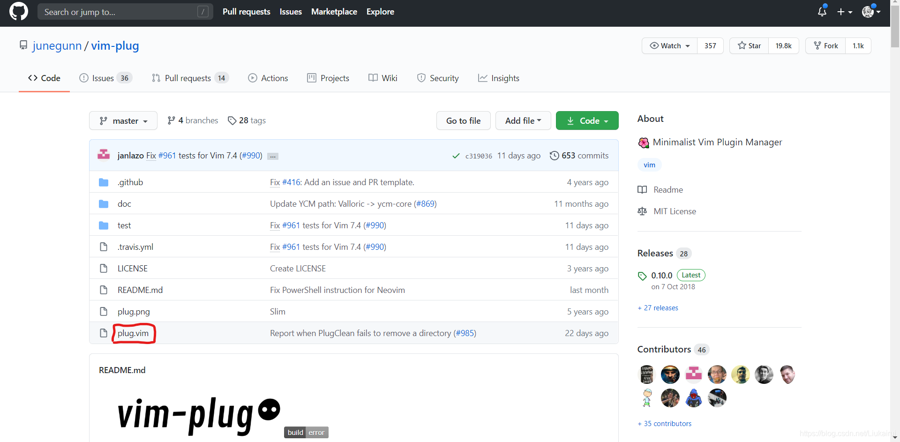
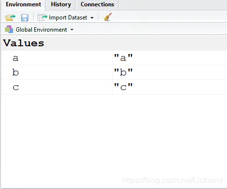

# Vim使用全指南 (环境配置，插件推荐，美化) (C++,Python,MarkDown,R...)

提示1：本文主要讲解了Windows下Vim的使用，配置，美化与使用Vim写C++,Python,MarkDown,R。其他语言的插件很不清楚

提示2：Vim是一款工具，使用Vim是为了加快您的Coding效率的，不要配置比使用的时间还长(虽然很好玩)

提示3：我想把这篇文章写的尽量的长，目的是帮助更多同学绕过Vim配置中的诸多天坑，请耐心观看，毕竟这要比你用一个星期去配置Vim来的快很多

提示4：Manjarol来的先读16节

### 目录

*   [0.为什么要写这篇文章](#0_12)
*   [1.Vim的简介](#1Vim_19)
*   [2.Vim的起源](#2Vim_27)
*   *   [2.1 Ken Thompson 写了一个行编辑器(Line Editor)](#21_Ken_Thompson_Line_Editor_41)
    *   [2.2 Bill Joy 写了一个文本编辑器](#22_Bill_Joy__82)
    *   [2.3 Bram Moolenaar 编写了 Vim](#23_Bram_Moolenaar__Vim_95)
*   [3.Vim的下载与安装(加入Vim到环境变量)](#3VimVim_109)
*   [4\. 认识与打开Vim](#4_Vim_124)
*   [5\. Vim基本的使用说明](#5_Vim_145)
*   *   [5.1 用Vim打开文件](#51_Vim_148)
    *   [5.2 Vim的四种模式](#52_Vim_151)
    *   *   [5.2.1Normal Mode](#521Normal_Mode_169)
        *   [5.2.2 Last line mode模式](#522_Last_line_mode_234)
        *   [5.2.3 Insert模式](#523_Insert_251)
        *   [5.2.4 Visual模式](#524_Visual_261)
    *   [5.3 宏录制](#53__284)
*   [6\. Vim的配置文件基本使用方法](#6_Vim_288)
*   *   [6.1 第一个Vim配置，行号](#61_Vim_291)
    *   [6.2 设置快捷键映射](#62__294)
    *   [6.3 安装插件管理器](#63__327)
    *   [6.4 尝试安装第一个插件](#64__345)
    *   [6.5 尝试卸载第一个插件](#65__367)
*   [7\. 基于问题解决的配置介绍](#7__372)
*   *   [7.1 关于gVim](#71_gVim_374)
    *   [7.2 为打开\`\_vimrc\`配置快捷键](#72__vimrc_378)
    *   [7.3 为Vim配置默认编码](#73_Vim_385)
    *   [7.4 为Vim配置代码高亮](#74_Vim_390)
    *   [7.5 将gVim的语言修改为英文方便使用](#75_gVim_397)
    *   [7.6\[直接写上\]向下兼容vi](#76vi_402)
    *   [7.7 在可视化下兼容鼠标](#77__411)
    *   [7.8 将缩进设置为空格](#78__415)
    *   [7.9 缩进配置为4空格](#79_4_420)
    *   [7.10 在空行末显示\`$\`](#710__426)
    *   [7.11 渲染Tab和空格](#711_Tab_431)
    *   [7.12 尽可能在滚动的时候留下几行](#712__435)
    *   [7.13 开启退格跨行退格](#713__442)
    *   [7.14 开启代码折叠](#714__448)
    *   [7.15 在三种模式下采用三种光标\[仅gVim\]](#715_gVim_455)
    *   [7.16 永远保留命令行](#716__461)
    *   [7.17 在重新打开文件后保留光标位置](#717__467)
    *   [7.19 自动缩进](#719__473)
    *   [7.20 设置字体\[仅gVim\]](#720_gVim_477)
    *   [7.21 隐藏gVim的四个滚动条](#721_gVim_484)
    *   [7.21 设置相对行号](#721__500)
    *   [7.22 突出显示选中的字符所在行列](#722__506)
    *   [7.23 自动换行](#723__511)
    *   [7.24 显示输入的命令(右下角)](#724__516)
    *   [7.25 输入命令的时候Tab显示提示](#725_Tab_520)
    *   [7.26 智能查找 高亮显示结果](#726___524)
    *   [7.27 复制粘贴到剪贴板](#727__532)
    *   [7.28 快捷保存 刷新](#728___538)
    *   [7.29 设置分屏](#729__548)
    *   [7.30 增加删除tabe标签](#730_tabe_576)
    *   [7.31 插入模式移动光标](#731__587)
*   [8\. 编译程序](#8__593)
*   [9\. 在插件介绍之前的准备](#9__664)
*   [10\. 通用插件的介绍](#10__694)
*   *   [10.1 输入法切换： xkb-switch](#101__xkbswitch_695)
    *   [10.2 Vim内部的todolist： undotree](#102_Vimtodolist_undotree_712)
    *   [10.3 Vim内部的文件树：NERDTreeToggle](#103_VimNERDTreeToggle_721)
    *   [10.4 Vim强大状态栏：Airline](#104_VimAirline_731)
    *   [10.5 多语言代码查错：ALE](#105_ALE_760)
    *   [10.6 代码自动注释：nerdcommenter](#106_nerdcommenter_821)
    *   [10.7 代码彩虹括号](#107__833)
    *   [10.8 自定义开始菜单](#108__871)
    *   [10.9 全语言代码自动补全](#109__894)
    *   [10.10 Vim自动括号补全](#1010_Vim_944)
    *   [10.11 Vim函数整理](#1011_Vim_953)
    *   [10.12 gVim界面透明](#1012_gVim_970)
*   [11\. 特定语言的插件介绍](#11__985)
*   *   [11.1 C/C++的插件](#111_CC_986)
    *   *   [11.1.1 自动格式化代码](#1111__987)
        *   [11.1.2 代码高亮](#1112__1001)
        *   [11.1.3 代码检查ALE](#1113_ALE_1016)
    *   [11.2Python的插件](#112Python_1019)
    *   *   [11.2.1 语言支持](#1121__1020)
        *   [11.2.2 代码检查ALE](#1122_ALE_1101)
    *   [11.3 LaTeX的插件](#113_LaTeX_1104)
    *   [11.4 MarkDown的插件](#114_MarkDown_1129)
    *   *   [11.4.1 MarkDown预览](#1141_MarkDown_1140)
        *   [11.4.2 MarkDown自动输入表格](#1142_MarkDown_1150)
    *   [11.5 R语言插件](#115_R_1171)
*   [12\. 处理ESC](#12_ESC_1227)
*   [13\. Vim 键位图](#13_Vim__1245)
*   [14\. 优秀的参考与学习资源](#14__1254)
*   [15\. 我的Vim配置](#15_Vim_1264)
*   [16 Vim 在Linux下的配置](#16_Vim_Linux_1744)

* * *

# 0.为什么要写这篇文章

由于依赖win下的很多软件，不方便直接切换到Linux，但是关于Win下的[vim](https://so.csdn.net/so/search?q=vim&spm=1001.2101.3001.7020)使用说明与参考太少了，自己摸索了一段时间，斗胆分享一下，还请老哥们指教  
以下是我目前的工作环境  
  


* * *

# 1.Vim的简介

Vim是从 vi 发展出来的一个文本编辑器。代码补完、编译及错误跳转等方便编程的功能特别丰富，在程序员中被广泛使用。他可以让你手不离键盘的完成鼠标的所有操作，同时vim不依赖上下左右方向键

简单的来说， vi 是老式的字处理器，不过功能已经很齐全了，但是还是有可以进步的地方。 vim 则可以说是程序开发者的一项很好用的工具。

Vim是一个开源项目，所以显然Vim是免费的，由于Vim具有诸多小弊端，逐渐演变出一些分支软件比如NeoVim，但是可能Bug有点多，而且如果您排除了一切问题正常使用了Vim，换用NeoVim只需把配置文件复制一份到NeoVim的安装目录下即可。同时Vim的原作者也在努力补短板，所以我们仍然建议您学习Vim

* * *

# 2.Vim的起源

> 以下内容摘自[开源中国](https://www.oschina.net/translate/where-vim-came-from)，不感兴趣可以跳过，但是我认为挺有趣的

我最近无意中发现一个名为Intel HEX的文件格式。据我所知，Intel HEX文件（使用.hex后缀）是通过将二进制文件变为十六进制数据来降低它的不可读性。明显它们由那些编写微控制器程序或者将数据刻录到ROM中的人使用。无论如何，当我首次使用Vim打开一个十六进制文件，我感到震惊。至少对我来说，这种文件格式非常深奥，但是Vim已经对其了如指掌。每行十六进制文件都分成不同区域——Vim已经先一步为每一个字段都标记了不同的颜色。set ft? 我敬畏地问道。filetype-hex，Vim得意地回答。

Vim无处不在。这么多人都在使用它，像对十六进制文件的支持并不值得惊讶。Vim是Mac OS的预装程序，而且在Linux世界广泛应用。它甚至对讨厌它的人来说都很熟悉，由于很多热门的命令行工具都默认让用户进入Vim，以至于那些未入门的人会被困到Vim中，这已经变成了一个热门问题。有一些主流网站，包括Facebook，当你按下j键之后，页面会滚到下面，而当按下k键则会滚到上面——Vim在数字文化中的广泛传播达到了意想不到的程度。

Vim仍然很神秘。例如，它不像React，每个人都知道它是由Facebook开发和维护的，Vim没有明确的作者。尽管它是如此的普遍和重要，却没有任何类型的委员会或组织来为Vim做决策。你可能花了几分钟来浏览Vim网站，但是却找不到关于谁创建了Vim或者为什么创造它的有效信息。如果你启动Vim时没有提供文件参数，你会看到Vim的启动信息，说的是Vim是由“Bram Moolenaar等人”开发的。但是没有更多信息。谁是Bram Moolenaar，他的神秘同盟都有谁？

当我们在提问的时候，也许更重要的是，为什么退出Vim需要输入:wq？没错，这是一个“写(write)”操作，后面还跟了一个“退出(quit)”操作，但是这并不是一个特别直观的惯例。谁来决定当复制文本的时候应该调用“复制命令（yanking）”？为什么:%s/foo/bar/gc是“查找并替换”的缩写？Vim的用法太随意了，看起来没有好好决策，但是它们到底源于何处？

情况往往如此，问题答案源自于古老的计算机构，贝尔实验室。从某种意义上来说，Vim只是一个软件——名为“wq文件编辑器”——的最新版本，它从Unix时代开始已经持续开发并完善。

## 2.1 Ken Thompson 写了一个行编辑器(Line Editor)

1966年，贝尔实验室骋请了 Ken Thompson。Thompson 刚刚在加州大学伯克利分校获得了电子工程和计算机科学硕士学位。在那里，他使用了一个叫 QED 的文件编辑器，这是为 1965 年至 1966 年间的伯克利分时系统编写的。1Thompson 抵达贝尔实验室后所做的第一件事就是为麻省理工学院兼容的分时系统重写了 QED。后来他为 Multics 项目编写了另一个版本的 QED。在此过程中，他扩展了程序，以便用户可以搜索文件中的行并使用正则表达式进行替换。2

Multics 项目，跟伯克利分时系统(Berkeley Timesharing System)一样，旨在创建一个商业上可行的分时操作系统，由麻省理工学院、通用电气和贝尔实验室之间协作进行。AT＆T 最终认为该项目前途堪忧而选择退出。Thompson 和贝尔实验室的研究员 Dennis Ritchie，当时没有访问分时系统的权限，失去了这种系统带来的“交互式计算感”，于是着手创建自己的版本，最终在 1969 年 8 月被称为 Unix 3。当时他的妻子和年少的儿子正在加里福尼亚度假，Thompson 将新系统的基本组件整合到一起，分配开发操作系统、shell、编辑器、汇编程序的时间为每周一项。4

编辑器被命名为 ed。它基于 QED，但不是一个完全的重新实现。Thompson 决定放弃某些 QED 特性。对正则表达式的支持被削减，因此只能理解相对简单的正则表达式。QED 允许用户通过打开多个缓冲区并同时编辑多个文件，但是 ed 同时只能使用一个缓冲区工作。而且 QED 可以执行一个包含命令的缓冲区，而 ed 则不会这样做。这些简化是需要的。Dennis Ritchie 表示，没有 QED 的高级正则表达式并“没有太大的损失”。5

ed 现在是 POSIX 规范的一部分，所以如果你有一个符合 POSIX 标准的系统，你可以将它安装到你的计算机上。这值得一试，因为许多 ed 的命令都是今天的 Vim 的一部分。举例来说，为了将缓冲区的内容写入磁盘，你需要使用 w 命令；为了退出编辑器，你需要使用 q 命令。这两个命令可以同时写到同一行 —— 即 wq。与 Vim 相似，ed 是一个模态编辑器；从命令模式进入输入模式，你可以使用插入命令（i），追加命令（a），或者修改命令（c），取决于你要怎样去改变你的文本。ed 也引入了 s/foo/bar/g 的语法，用来查找和替换，或者“替换”文本。

有这么多的相似之处，你可能认为一般的 Vim 用户使用 ed 也没问题。不过 ed 在其它一些重要方面却一点也不像 Vim。ed 是一个真正的行编辑器。它是在电传打印机的时代编写并广泛使用的。当 Ken Thompson 和 Dennis Ritchie 在 Unix 上进行编码时，他们看起来是这样的：  
  
ed 不允许你在打开的缓冲区中的其它行之间进行编辑和移动光标，因为每次对其进行更改时，ed 都需要重新打印整个文件。1969 年的 ed 还没有清空整个屏幕内容的机制，因为那时的屏幕是一张纸，而且所有需要被打印的将会使用墨水打印。如果有必要，你可以使用列表命令（l）告诉 ed 打印出一系列的行，但大部分时间你都在操作你看不到的文字。因此，使用 ed 有点像带着一个不怎么亮的灯在一所黑暗的房子里试图找到一条路径。你只能一次看到这么多，所以你必须尽力记住一切都在哪里。

这里有一个 ed 会话的例子。我已经添加了注释（在＃号之后的）来解释每一行的目的，如果这些注释被实际输入到了 ed，则不会将它们识别为注释，而且可能会出错：

```
[sinclairtarget 09:49 ~]$ ed
i                           # Enter input mode
Hello world!

Isn't it a nice day?
.                           # Finish input
1,2l                        # List lines 1 to 2
Hello world!$
$
2d                          # Delete line 2
,l                          # List entire buffer
Hello world!$
Isn't it a nice day?$
s/nice/terrible/g           # Substitute globally
,l
Hello world!$
Isn't it a terrible day?$
w foo.txt                   # Write to foo.txt
38                          # (bytes written)
q                           # Quit
[sinclairtarget 10:50 ~]$ cat foo.txt
Hello world!
Isn't it a terrible day?
```

正如你所看到的，ed 并不是一个很方

## 2.2 Bill Joy 写了一个文本编辑器

ed 对于 Thompson 和 Ritchie 来说已经足够用了。不过其他人觉得它很难使用，并因其成为 Unix 对新手来说很困难的一个特别典型例子而出名。6 1975年，一个叫 George Coulouris 的人在伦敦玛丽皇后学院安装的 Unix 系统上开发了 ed 的一个改进版。Coulouris 利用他在玛丽皇后学院得到的视频显示来编写他的编辑器。Coulouris 的程序允许用户在屏幕上编辑某一行，在这一行上进行码字（想像一下在一行上使用 Vim）。Coulouris 将他的程序称为 em，或者“普通人的编辑器”，这是他在 Thompson 访问了玛丽皇后学院后受到的启发，据说 Thompson 看到了 Coulouris 构建的程序，然后驳回了它，并说他在编辑的时候不需要看文件的状态。7

1976年，Coulouris 带着 em 到了加州大学伯克利分校，在这里，他在计算机学院度过了一个夏天。这距 Ken Thompson 离开加州大学伯克利分校到贝尔实验室工作已经整整十年。在加州大学伯克利分校，Coulouris 遇到了 Bill Joy，一个在伯克利软件发行版(BSD)工作的研究生。Coulouris 向 Joy 展示了 em，Joy 从 Coulouris 的源代码开始，开发了一个 ed 的改进版，被称为 ex，意思是“扩展的 ed”。ex 的 1.1 版本与1978年第一版 BSD Unix 捆绑在一起。ex 在很大程度上与 ed 兼容，但是它添加了两个模式：一个“open”模式，它可以进行单行编辑，就像在 em 中一样，还有一个“visual”模式，接管了整个屏幕，并启用了我们今天习惯的整个文件的实时编辑。便的交互式程序。

对于 1979 年发布的第二个 BSD 版本，引入了一个名叫 vi 的可执行程序，它只能在可视模式下打开 ex。8

ex/vi（以下称为 vi）定义了现在我们使用 Vim 的大多数规则，这些规则已经不是 ed 的一部分。Joy 使用的视频终端是 Lear Siegler ADM-3A，它有一个没有光标的键盘。取而代之的是在 h，j，k，和 l 键的地方绘制了一个箭头，这就是 Joy 在 vi 中使用这些键来移动光标的原因、ADM-3A 键盘上的退出键也是今天我们可以找到 tab 键的地方，它解释了如何为这样一个难以触及的键分配了一个与退出模式相同的操作。命令的前缀冒号“:”也是来自于 vi，在常规模式下（即运行 ex 后进入的模式）使用冒号“:”作为提示。这解决了关于 ed 的长期抱怨，曾经的 ed 在这种情况下是不会提示用户的。在可视模式下，保存和退出现在可以输入经典的“:wq”命令。“Yanking”和“puts”标记以及用于设置选项的 set 命令都是原始 vi 的一部分。今天我们在 Vim 中进行基本的文本编辑使用的功能大部分都是 vi 的功能。


vi 是除了 ed 之外唯一与 BSD Unix 捆绑在一起的文本编辑器。那时，Emacs 需要花费上百美元（在GNU Emacs之前），所以 vi 变得非常流行。但是 vi 是 ed 的直接后裔，这意味着没有 AT＆T 源码许可证就无法修改源代码。因此激励了一些人去创建 vi 的开源版本。STEVIE（VI爱好者的 ST 编辑器）出现于 1987 年，Elvis 诞生于 1990 年，nvi 出现于 1994 年。其中一些克隆的版本增加了额外的功能，如语法高亮和分割窗口。Elvis 尤其将它的许多功能都纳入到了 Vim 中，因为许多 Elvis 用户都为此做出了努力。

## 2.3 Bram Moolenaar 编写了 Vim

“Vim”，现在可称为“Vi Improved”(Vi改进版)，原来也被称为“Vi Imitation”（Vi模拟版）。与许多其它 vi 克隆版一样，Vim 的初衷是尝试复制 Vi，使其在不支持 Vi 的平台上使用。Bram Moolenaar，一位在荷兰芬洛一家复印公司工作的软件工程师，想要为他的全新 Amiga 2000 提供类似 vi 的东西。Moolenaar 已经习惯于在他的大学的 Unix 系统上使用 vi，现在已经熟练到“就像在使用他的手指”。10 因此，在 1988 年，使用现有的 vi 克隆版 STEVIE 作为起点，Moolenaar 开始开发 Vim。

Moolenaar 使用 STEVIE，是因为 STEVIE 之前曾出现在 Fred Fish 磁盘上。Fred Fish 是一名美国程序员每个月选择 Amiga 平台上最好的开源软件，放到一张软盘上并寄出。任何人都可以请求索取磁盘，而仅仅只需要邮费。STEVIE 的若干个版本在 Fred Fish Disk 上被发布。Moolenaar 使用的版本已在 Fred Fish Disk 256 上发布。11（令人失望的是，Fred Fish Disk 似乎与 Freddi Fish 无关）。

Moolenaar 喜欢 STEVIE，但是他很快发现缺少了许多 vi 命令。12 因此，对于 Vim 的第一个版本，Moolenaar 将 vi 兼容性作为他的首要任务。其他人编写了一系列 vi 宏，当通过正确的 vi 兼容编辑器运行时，可以解决随机生成的迷宫。Moolenaar 能够让这些宏在 Vim 中运行。1991年，Vim 首次发布于 Fred Fish Disk 591 中，被称为“Vi Imitation”。13 Moolenaar 添加了一些功能（包括多级撤消和编译错误的“quickfix”模式），这意味着 Vim 超越了 vi。但是 Vim 在 1993 年通过 FTP 发布 Vim 2.0 之前，一直保持着“Vi Imitation”的名字。

在各种互联网合作者的偶尔帮助下，Moolenaar 为 Vim 增加了一些稳定的功能。Vim 2.0 引入了对 wrap 选项的支持以及通过长行文本的水平滚动。Vim 3.0 增加了对分割窗口和缓冲区的支持，这一功能的灵感来自 vi，克隆了 nvi。Vim 现在还将每个缓冲区保存到交换文件中，以便编辑后的文本可以在崩溃中存活。Vimscript 首次亮相于 Vim 5.0，同时支持语法高亮。一直以来，Vim 的受欢迎程度都在增长。它被移植到 MS-DOS，Windows，Mac，甚至 Unix，在以上操作系统与原始的 vi 竞争。

2006年，Vim 被《Linux Journal》读者选为最受欢迎的编辑工具。14今天，根据 Stack Overflow 的 2018 年开发者调查，Vim 是最受欢迎的文本模式（即终端模拟器）编辑器，25.8％ 的软件开发者使用它（和 40％ 的系统管理员/DevOps 工程师）。15有一段时间，在20世纪80年代后期和整个20世纪90年代，程序员发起了“编辑器战争”，使得 Emacs 用户与 vi（以及最终的Vim）用户进行了对抗。虽然 Emacs 肯定还会继续发展，但有些人认为编辑大战已经结束，Vim 赢了。162018 Stack Overflow 开发者调查显示这是真的；只有 4.1％ 的受访者使用过 Emacs。

Vim是如何变得如此成功的？显然人们喜欢Vim所提供的功能。但我认为，Vim背后的悠久历史表明它拥有比其功能集更多的优势。Vim的代码库可以追溯到1988年，当时Moolenaar开始致力于此。另一方面，“wq文本编辑器” - 一个关于Unix风格的文本编辑器应该如何工作的更宽泛视角 - 可以追溯到半个世纪之前。“wq文本编辑器”有一些不同的具体表达方式，但部分归功于Bill Joy和Bram Moolenaar对后向兼容性的特别关注，随着时间的推移逐渐积累了好的想法。从这个意义上说，“wq文本编辑器”是运行时间最长、最成功的开源项目之一，享用了计算机世界一些最伟大的思想家的贡献。我不认为“初创公司 - 抛弃所有先例 - 并创造 - 破坏性 - 全新-软件”的发展方法必然是坏事，但Vim提醒世人：协作和增量方法也可以产生奇迹。

* * *

# 3.Vim的下载与安装(加入Vim到环境变量)

**请注意这里是第一个天坑**  
如果您在[Vim官网](https://www.vim.org/)的下载页面下载Vim for Windows，您大概率会下载到Vim32位版或者Vim 32与64均兼容版，如果下载的是这两个，您安装的时候会默认安装Vim32位版。这似乎不是问题，但是很多Vim插件是需要Python支持的，或者需要本地编译，如果您的Vim是32位的，64位Python是不会被正确识别并调用的。这会导致你必须安装很多python的版本，并且默认的必须是32位的(如果你默认的python也是32位的当我没说)  
所以我推荐你到这里下载Vim64位安装包[Vim-wim32-installer 项目-Github](https://github.com/vim/vim-win32-installer) 虽然这里写的是32，但是是有64位的安装包的，同时这是Vim官方的项目，请放心使用  
打开链接之后，在右侧找到并点击Releases，然后从上到下找到这样的一个链接  
  
点击：gvim\_X.X.XXXX\_x64.exe 64-bit installer，下载，恭喜你下载到了一个纯64位的Vim，同时在你安装的时候您也会看到写有(x64)  
  
之后的安装过程就简单多了，按照Vim的默认配置安装即可，与其他Windows应用一样只要一直下一步即可，**我不建议您修改安装路径1. Vim不大，不会占用您C盘很多空间(全部安装仅44MB) 2. 与大多数人的配置保持一致非常方便您询问与解决问题**

把Vim的安装路径加入环境变量(如果您不了解如何加入环境变量请自行百度，比较简单的一个操作) 尝试Win+R->cmd->vim试试是否加入环境变量成功，**如果成功打开请按窗口右上角的关闭按钮关闭cmd**

至此，您安装好了一个**64位的Vim**，这会为您探索Vim节省一天的配置Python与重装Vim的时间

* * *

# 4\. 认识与打开Vim

安装结束后，您会发现您的开始菜单中有好多Vim，而且名字都不一样  
  
他们的区别如下

1.  有g和没有g  
    gVim 是在windows下的Gui图形用户界面的的 vim (GUI Vim)，支持windows的一些快捷方式，支持鼠标操作  
    vim 是在windows下的类似linux vi 编辑的界面，只能用键盘操作  
    vim的操作指令同时适用于gVim
    
2.  Vim, Vim Diff, Vim Easy, Vim Read-only  
    Diff 是用来对比两个文件内容用的，直接打开挺没用的，不过直接拖2个文件到快捷方式上倒是可行；  
    Easy启动的时候是insert模式，适合普通windows用户的习惯；  
    Read-Only的用途：比如用read-only打开已经用vim打开过的文件，就不会提示让人烦躁的.swp文件存在的问题；
    

在此，您只需知道，我们暂时会使用Vim来入门，最后您会使用gVim编程，这是因为gVim在没有配置的时候比Vim还不方便操作

您可以打开Vim了，确实非常丑，似乎不是用来写代码的。如果您开启了声音，大概率的您会发现按动绝大多数按键，windows都会发出报错的声音(一个噔~)，而且什么都输入不进去…

试着按一下键盘的`i`键，你会发现您可以输入东西了，但是似乎只能输入，如何保存呢？如何关闭vim呢？您会发现除非直接按右上角的×，您甚至无法优雅的退出Vim，那就按右上角的×吧，连文件都没有保存

* * *

# 5\. Vim基本的使用说明

在这个阶段，您需要在Vim上做一些实践，但是可能大部分情况下都会使用右上角的×来关闭Vim，这一阶段的内容不需要保存，就这样放肆的强制关闭Vim吧，同时Vim的很多按键方式与其他编辑器不同，尝试去适应他，不要排斥，相信在您完成了本教程的配置，您的肌肉记忆就会形成，加油

## 5.1 用Vim打开文件

在cmd下输入vim + 路径即可，同时直接将文件拖动到快捷方式图标上也可以

## 5.2 Vim的四种模式

基本上 vim 共分为四种模式，分别是普通模式（Normal mode）、底行模式(Last line mode)、输入模式（Insert mode）和可视化模式（Visual mode）此处似乎与其他教程不一样，但是没有问题，只是分类不同而已。 四种模式的切换与作用如下

 

可视化系列模式

自动进入

按键i

按键ESC

按键:

按键ESC

v系列快捷键

按键ESC

小写v

大写V

CtrlV

普通可视化模式

可视化模式

可视化行模式

可视化块模式

启动

Normal模式

Insert模式

行末模式

### 5.2.1Normal Mode

这个模式一般用于浏览代码与进入底行模式输入命令，使用快捷键修改文章，这里仅仅介绍少量按键并讲解快捷键命令的组合原理，

| 快捷键 | 效果 |
| --- | --- |
| h 或 向左箭头键(←) | 光标向左移动一个字符 |
| j 或 向下箭头键(↓) | 光标向下移动一个字符 |
| k 或 向上箭头键(↑) | 光标向上移动一个字符 |
| l 或 向右箭头键(→) | 光标向右移动一个字符 |

用上面的按键你就可以上下浏览代码了，但是不建议使用方向键  
Vim中还有一些键位是进行**光标移动**的

| 快捷键        | 效果 |
| --- | --- |
| \[Ctrl\] + \[f\] | 屏幕『向下』移动一页，相当于 \[Page Down\]按键 (常用) |
| \[Ctrl\] + \[b\] | 屏幕『向上』移动一页，相当于 \[Page Up\] 按键 (常用) |
| \[Ctrl\] + \[d\] | 屏幕『向下』移动半页 |
| \[Ctrl\] + \[u\] | 屏幕『向上』移动半页 |
| + | 光标移动到非空格符的下一行 |
| \- | 光标移动到非空格符的上一行 |
| n < space > | 那个 n 表示『数字』，例如 20 。按下数字后再按空格键，光标会向右移动这一行的 n 个字符。例如 20< space > 则光标会向后面移动 20 个字符距离。 |
| M | 光标移动到这个屏幕的中央那一行的第一个字符 |
| L | 光标移动到这个屏幕的最下方那一行的第一个字符 |
| G | 移动到这个档案的最后一行(常用) |
| nG | n 为数字。移动到这个档案的第 n 行。例如 20G 则会移动到这个档案的第 20 行(可配合 :set nu) |
| gg | 移动到这个档案的第一行，相当于 1G 啊！ (常用) |
| n< Enter > | n 为数字。光标向下移动 n 行(常用) |

以上是光标移动命令，然后是**文档查询替换**命令

| 命令 | 作用 |
| --- | --- |
| /word | 向光标之下寻找一个名称为 word 的字符串。例如要在档案内搜寻 vbird 这个字符串，就输入 / vbird 即可！ (常用) |
| ?word | 向光标之上寻找一个字符串名称为 word 的字符串。 |
| n | 这个 n 是英文按键。代表重复前一个搜寻的动作。举例来说， 如果刚刚我们执行 /vbird 去向下搜寻 vbird 这个字符串，则按下 n 后，会向下继续搜寻下一个名称为 vbird 的字符串。如果是执行 ?vbird 的话，那么按下 n 则会向上继续搜寻名称为 vbird 的字符串！ |
| N | 这个 N 是英文按键。与 n 刚好相反，为『反向』进行前一个搜寻动作。 例如 /vbird 后，按下 N 则表示『向上』搜寻 vbird 。 |
| 使用 /word 配合 n 及 N 是非常有帮助的！可以让你重复的找到一些你搜寻的关键词！ |  |
| :n1,n2s/word1/word2/g | n1 与 n2 为数字。在第 n1 与 n2 行之间寻找 word1 这个字符串，并将该字符串取代为 word2 ！举例来说，在 100 到 200 行之间搜寻 vbird 并取代为 VBIRD 则： 『:100,200s/vbird/VBIRD/g』。(常用) |
| **:1,$s/word1/word2/g** 或 **:%s/word1/word2/g** | 从第一行到最后一行寻找 word1 字符串，并将该字符串取代为 word2 ！(常用) |
| **:1,$s/word1/word2/gc** 或 **:%s/word1/word2/gc** | 从第一行到最后一行寻找 word1 字符串，并将该字符串取代为 word2 ！且在取代前显示提示字符给用户确认 (confirm) 是否需要取代！(常用) |

最后是最常用的**增删改命令**

| 快捷键 | 作用 |
| --- | --- |
| x, X | 在一行字当中，x 为向后删除一个字符 (相当于 \[del\] 按键)， X 为向前删除一个字符( 相当于 \[backspace\] 亦即是退格键) (常用) |
| nx | n 为数字，连续向后删除 n 个字符。举例来说，我要连续删除 10 个字符， 『10x』。 |
| dd | 删除游标所在的那一整行(常用) |
| ndd | n 为数字。删除光标所在的向下 n 行，例如 20dd 则是删除 20 行 (常用) |
| d1G | 删除光标所在到第一行的所有数据 |
| dG | 删除光标所在到最后一行的所有数据 |
| d$ | 删除游标所在处，到该行的最后一个字符 |
| d0 | 那个是数字的 0 ，删除游标所在处，到该行的最前面一个字符 |
| yy | 复制游标所在的那一行(常用) |
| nyy | n 为数字。复制光标所在的向下 n 行，例如 20yy 则是复制 20 行(常用) |
| y1G | 复制游标所在行到第一行的所有数据 |
| yG | 复制游标所在行到最后一行的所有数据 |
| y0 | 复制光标所在的那个字符到该行行首的所有数据 |
| y$ | 复制光标所在的那个字符到该行行尾的所有数据 |
| p, P | p 为将已复制的数据在光标下一行贴上，P 则为贴在游标上一行！ 举例来说，我目前光标在第 20 行，且已经复制了 10 行数据。则按下 p 后， 那 10 行数据会贴在原本的 20 行之后，亦即由 21 行开始贴。但如果是按下 P 呢？ 那么原本的第 20 行会被推到变成 30 行。 (常用) |
| J | 将光标所在行与下一行的数据结合成同一行 |
| c | 重复删除多个数据，例如向下删除 10 行，\[ 10cj \] |
| u | 复原前一个动作。(常用) |
| \[Ctrl\]+r | 重做上一个动作。(常用) |
| . | 不要怀疑！这就是小数点！意思是重复前一个动作的意思。 如果你想要重复删除、重复贴上等等动作，按下小数点『.』就好了！ (常用) |

以上的增删改查命令有一定的命名规律，比如`y`是复制，然后复制什么没说，你用`yw`就是复制一个单词(word)，重复写一个命令就是对这个对行操作，例如`yy`就是复制一行，还可以`y+数字`，例如`y3`就是复制三行，还可以与其他命令组合比如`yG`就是从当前光标位置复制到文档最后，这样组合才可以让我们高效的使用Vim

### 5.2.2 Last line mode模式

我一直觉得这就是Vim的Normal模式，结果别人都觉得这是一个新模式，那就当他是个新模式吧  
你会发现在没有配置Vim的其他功能的时候，Vim的下面会写有一个Normal等，但是似乎下面还有一行，这一行是让你输入命令的，想要输入命令必须使用`\`或者`:`触发，`\`是用来查找内容的，严格说属于Normal模式，所以其实只有`:`开头的命令

| 命令 | 作用 |
| --- | --- |
| :w | 将编辑的数据写入硬盘档案中(常用) |
| :w! | 若文件属性为『只读』时，强制写入该档案。不过，到底能不能写入， 还是跟你对该档案的档案权限有关啊！ |
| :q | 离开 vi (常用) |
| :q! | 若曾修改过档案，又不想储存，使用 ! 为强制离开不储存档案。 |
| 注意一下啊，那个惊叹号 (!) 在 vi 当中，常常具有『强制』的意思～ |  |
| :wq | 储存后离开，若为 :wq! 则为强制储存后离开 (常用) |
| :w \[filename\] | 将编辑的数据储存成另一个档案（类似另存新档） |
| :r \[filename\] | 在编辑的数据中，读入另一个档案的数据。亦即将 『filename』 这个档案内容加到游标所在行后面 |
| :n1,n2 w \[filename\] | 将 n1 到 n2 的内容储存成 filename 这个档案。 |
| :! command | 暂时离开 vi 到指令行模式下执行 command 的显示结果！例如 『:! ls /home』即可在 vi 当中察看 /home 底下以 ls 输出的档案信息！ |

还有很多，但是都是特殊的命令，或者某一个插件特有的，这里不做介绍

### 5.2.3 Insert模式

插入模式是让你正常写代码的，注意的是，插入模式下hjkl的上下左右切换是失效的，可以用方向键，但是不建议，还是退出编辑模式在normal下改光标方便，进入插入模式的快捷键最常用的是`i`，还有如下的也可以

| 快捷键 | 作用 |
| --- | --- |
| i, I | 进入输入模式(Insert mode)： i 为『从目前光标所在处输入』， I 为『在目前所在行的第一个非空格符处开始输入』。 (常用) |
| a, A | 进入输入模式(Insert mode)： a 为『从目前光标所在的下一个字符处开始输入』， A 为『从光标所在行的最后一个字符处开始输入』。(常用) |
| o, O | 进入输入模式(Insert mode)： 这是英文字母 o 的大小写。o 为『在目前光标所在的下一行处输入新的一行』； O 为在目前光标所在处的上一行输入新的一行！(常用) |
| r, R | 进入取代模式(Replace mode)： r 只会取代光标所在的那一个字符一次；R会一直取代光标所在的文字，直到按下 ESC 为止；(常用) |

这一部分没什么好说的，因为没有快捷键(否则你打着打着代码就触发了什么快捷键)

### 5.2.4 Visual模式

可视化模式在很多文献中都没有介绍，但是是一个非常好用的模式，在这个模式下你可以用鼠标选择内容要选取一段文本，首先将光标移到段首，在普通模式下按 v 进入可视模式，然后把光标移到段末。 需要注意，光标所在字符是包含在选区中的

*   v 进入字符可视化模式
*   V 进入行可视化模式
*   Ctrl+v 进入块可视化模式  
    块选择在表格中删除指定列非常有用  
    用 v 命令进入的字符可视化模式（Characterwise visual mode)。文本选择是以字符为单位的。  
    用 V 命令进入的行可视化模式（Linewise visual mode)。文本选择是以行为单位的。  
    用 ctrl-V 进入的块可视化模式（Blockwise visual mode）。可以选择一个矩形内的文本。

使用鼠标或者hjkl即可选中字符/行/块，然后可以y，x…  
更有用的是对块批量操作，例如批量注释可以这么写  
**批量注释：**  
Ctrl + v 进入块选择模式，然后移动光标选中你要注释的行，再按大写的 I 进入行首插入模式输入注释符号如 // 或 #，输入完毕之后，按两下 ESC，Vim 会自动将你选中的所有行首都加上注释，保存退出完成注释。  
**取消注释：**  
Ctrl + v 进入块选择模式，选中你要删除的行首的注释符号，注意 // 要选中两个，选好之后按 d 即可删除注释，ESC 保存退出  
还可以在选择文字后输入`:`然后把你在平时这么用的就怎么写，注意按`:`会多出一些东西不要管他,例如

```
:A //这是一堆注释
```

然后Vim会根据你所写，先对每一样在Normal模式下使用`A`把光标移动到该行行尾，然后进入Insert模式输入`//这是一堆注释`对每一行都操作结束之后就会自动退出到Normal模式

具体的这个模式如何使用见[Vim可视化入门](https://linux.cn/article-10589-1.html)

## 5.3 宏录制

不怎么用，自己查吧

* * *

# 6\. Vim的配置文件基本使用方法

Vim不像其他的IDE会有一个图形化的配置界面，你需要将你需要的配置写到一个配置文件里面，Vim在启动的时候会读取这个文件，然后根据文件需要去配置Vim  
如果你在百度搜索Vim配置文件相关的内容，只会得到是一个叫做`.vimrc`的文件，但是就算全盘搜索也找不到他，为啥呢，`.vimrc`是Linux下的文件，win下的配置文件是`_vimrc`，于是你会发现在Vim安装目录和`C://User/你的用户名`下还有一个，我们使用自己用户名下的,如果没有的话就自己新建一个，这个不是因为你的Vim没安装，他就是没有

## 6.1 第一个Vim配置，行号

找到或者新建这个文件，右键选中用Vim打开，我们就打开了一个空的`_vimrc`文件，试着往里面写下`set number`，这个配置的意思是自动为添加行号，这样你写代码就可以在左边看到行号了  
按动`ZZ`(大写的)保存文件，然而行号并没有出来，这是因为我们没有"刷新配置文件",在Normal下输入命令`:source $MYVIMRC`然后你就可以看到行号了，至此你成功配置了第一个Vimrc

## 6.2 设置快捷键映射

但是这似乎比较麻烦，每次修改之后还要输入那么长的刷新保存，如果有个快捷键帮助我们就好了,我设置的快捷键是大写的R，也就是`Shift+R`，那么我们应该如何设置呢？首先要想好自己要设置的快捷键，不能与之前的快捷键相重合，还有快捷键的生效范围，是只有在Normal模式下生效还是在四个模式下都生效。例如我将大写`R`作为快捷键最好只在Normal下操作，否则在Insert模式下我输入大写的R就没法输入了，但是例如F5这样的快捷键从来不会与其他模式冲突我们就可以设置为全局的  
快捷键映射可以将一个组合键映射到一个命令，一个其他的组合键或者其他语法为

```
前缀+map 快捷键 映射结果
```

这里的前缀限定了map的作用范围是那几个模式，不写前缀默认是前缀n

*   nmap：只有在Normal模式下生效
*   vmap：只有在Visual模式下生效
*   imap：只有在Insert模式下生效
*   cmap：只有在行底命令的模式下生效
*   Xnoremap：X是前面的n/v/i/c，nore表示非递归的例如a被映射为了b，b被映射为了c，那么如果是递归的的话a就映射为了c

对于被映射与要映射的动作按键遵循以下写法

*   普通按键就直接写
*   Alt组合键写成`<A-X>`,例如Alt+S就是`<A-S>`
*   Ctrl组合键写成`<C-X>`,例如Ctrl+S就是`<C-S>`
*   FX写成`<FX>`，例如`<F5>`就是F5
*   四个方向键写成`<方向>`，例如`<LEFT>`就是方向左键
*   ESC就写成`<ESC>`
*   Leader键就写成
*   回车写成`<CR>`

关于leader键：  
Vim预置有很多快捷键，再加上各类插件的快捷键，大量快捷键出现在单层空间中难免引起冲突。为缓解该问题，而引入了前缀键`<leader>`。藉由前缀键， 则可以衍生出更多的快捷键命名空间（namespace)。例如将r键配置为`<leader>r`、`<leader><leader>r`等多个快捷键。前缀键默认为`\`  
但是在我的键盘上`\`太远了，于是我就把leader换成了空格，只需要如下的命令`let mapleader = "\<space>"`写在开头就完成了替换

针对上面的问题我们就可以把刷新配置文件映射成S，配置如下

```
map R :source $MYVIMRC<CR>
```

## 6.3 安装插件管理器

Vim好用就在于有大量插件供我们使用，这样我们可以自己配置自己喜欢的Vim，这里我们介绍插件管理器`Vim-Pluig`，同时我们一般的插件都是在GitHub上托管的，所以我们一般也是在GitHub上找插件，Vim的插件非常好识别，他使用的语言大多会写`Vim script`

1.  [下载Git](https://git-scm.com/)
2.  [打开插件管理器所在仓库](https://github.com/junegunn/vim-plug)
3.  下载如下文件并放入Vim的安装目录下的autoload  
      
      
    这样我们就完成了插件管理器的安装  
    之后我们开始尝试安装第一个插件  
    首先在vimrc中写下这样三行，他可以帮助插件管理器识别你要装那些插件

```
call plug#begin('~/.vim/plugged')

call plug#end()
```

以后只要是需要安装的插件我们只需要把地址写在里面就可以直接安装了

## 6.4 尝试安装第一个插件

我们先来尝试安装一个主题插件，就安装我自用的主题snazzy吧。  
首先我们找到[这个主题的GitHub库](https://github.com/connorholyday/vim-snazzy)  
那如何告诉插件管理器我要安装这个插件，这个插件的安装包在哪里呢？  
刚刚那个库的地址是  
https://github.com/connorholyday/vim-snazzy  
我们发现`https://github.com/`是GitHub的前缀，而插件管理器默认库在GitHub所以只要告诉插件`connorholyday/vim-snazzy`就可以了，于是我们只需要在哪两行代中间写上

```
Plug 'connorholyday/vim-snazzy'
```

即为

```
call plug#begin('~/.vim/plugged')
Plug 'connorholyday/vim-snazzy'
call plug#end()
```

完事，我们还要让插件管理器去安装它，只需保存并刷新配置文件，输入命令`:PlugInstall`回车，等他跑完进度条即可  
至此我们完成了第一个插件的**安装**  
但是似乎这个主题不能用，这么办呢，我们要告诉Vim我要应用这个主题，只要在配置文件最后写`colorscheme snazzy`，保存刷新配置文件即可，如果不行试试gVim

## 6.5 尝试卸载第一个插件

如果哪一天插件不想要了，可以卸载，方法很简单，要么删除插件安装的哪一行，要么把他注释掉(vim下的注释是`"`)，然后保存刷新配置文件，输入命令`:PlugClean`  
至此我介绍了Vim配置文件中常见的几种配置命令

* * *

# 7\. 基于问题解决的配置介绍

在这一节中我将介绍Vim的常用插件的使用与Vim常用概念功能的介绍，但是不包括对于编程语言的适配，**从现在开始请使用gVim代替Vim**

## 7.1 关于gVim

本来Vim用的好好的为什么要换gVim呢，因为vim是基于cmd/Powershell 对于背景色等等很多方面支持很差，所以开发了gVim  
打开gVim，但是比Vim还丑，将就看看，我们开始基于他美化与修改，不要选上面的菜单与工具，比较麻烦  
一下没有说明就是王配置文件直接写就好了

## 7.2 为打开`_vimrc`配置快捷键

配置vim每次都要打开\_vimrc,不如设置个快捷键让他打开

```
map rc : e $HOME\_vimrc<CR> 
```

很简单了，就是在Normal模式下按下`rc`，然后就打开了配置文件

## 7.3 为Vim配置默认编码

将编码设置为UTF-8，方便以后我们中文注释的Coding

```
set encoding=utf-8
```

## 7.4 为Vim配置代码高亮

最朴素的高亮

```
syntax on 
```

你会发现好像是有，但是不全，比如c++的`string`，这个到后面给C++配置的时候说

## 7.5 将gVim的语言修改为英文方便使用

```
language C 
```

## 7.6\[直接写上\]向下兼容vi

```
set nocompatible
filetype on
filetype indent on
filetype plugin on
```

## 7.7 在可视化下兼容鼠标

```
set mouse=a
```

## 7.8 将缩进设置为空格

```
let &t_ut=''
set expandtab 
```

## 7.9 缩进配置为4空格

```
set tabstop=4				
set shiftwidth=4
set softtabstop=4
```

## 7.10 在空行末显示`$`

win下似乎没有用

```
set list
```

## 7.11 渲染Tab和空格

```
set listchars=tab:▸\ ,trail:▫	
```

## 7.12 尽可能在滚动的时候留下几行

就是往下滚的时候除非到行尾，保证当前选中行至少是倒数第五行，向上同理

```
set scrolloff=5
```

## 7.13 开启退格跨行退格

```
set backspace=indent,eol,start	
```

## 7.14 开启代码折叠

```
set foldmethod=indent
set foldlevel=99
```

## 7.15 在三种模式下采用三种光标\[仅gVim\]

```
let &t_SI = "\<Esc>]50;CursorShape=1\x7"
let &t_SR = "\<Esc>]50;CursorShape=2\x7"
let &t_EI = "\<Esc>]50;CursorShape=0\x7"
```

## 7.16 永远保留命令行

```
set laststatus=2
```

## 7.17 在重新打开文件后保留光标位置

Win下似乎不可?

```
au BufReadPost * if line("''\"") > 1 && line("'\"") <= line("$") | exe "normal! g'\"" | endif.
```

## 7.19 自动缩进

```
set autoindent	
```

## 7.20 设置字体\[仅gVim\]

```
set guifont=Powerline_Consolas:h12:cANSI:qDRAFT
```

意思是用Powerline Consolas字体，字号12  
关于为什么一定用这个字体，如何下载见airline插件一节

## 7.21 隐藏gVim的四个滚动条

隐藏gVim的四个滚动条如果被激活了F2再次关闭

```
map <silent> <F2> :if &guioptions =~# 'T' <Bar>
		\set guioptions-=T <Bar>
		\set guioptions-=m <bar>
	\else <Bar>
		\set guioptions =T <Bar>
		\set guioptions =m <Bar>
	\endif<CR>
set guioptions-=m   "Hide Menu
set guioptions-=T   "Hide Tool-Bar
set guioptions-=r   "hide right scroll
set guioptions-=b   "hide buttom scoll
set guioptions-=L   "hide left scroll
```

## 7.21 设置相对行号

```
set number			
set relativenumber
```

## 7.22 突出显示选中的字符所在行列

```
set cursorline		
set cursorcolumn	
```

## 7.23 自动换行

```
set wrap
```

## 7.24 显示输入的命令(右下角)

```
set showcmd
```

## 7.25 输入命令的时候Tab显示提示

```
set wildmenu
```

## 7.26 智能查找 高亮显示结果

```
set hlsearch	
exec "nohlsearch"	
set incsearch	
set ignorecase		
set smartcase	
```

## 7.27 复制粘贴到剪贴板

注意的是我们的y和p只能在vim内部复制粘贴，想要复制粘贴到系统剪贴板需要用另一个命令，我把他换为`<leader>+y`,然后与y使用无异

```
vnoremap <Leader>y "+y
nmap <Leader>p "+p
```

## 7.28 快捷保存 刷新

这里用S保存但是要声明不适用于s

```
map S : w<CR>
map s <nop>
map Q :q<CR>
map R :source $MYVIMRC<CR>
noremap <LEADER><CR>  :nohlsearch<CR>
```

## 7.29 设置分屏

Vim下可以将窗口分为很多部分方便多代码同时调试，可以向上左下右扩展，但是命令有点长，我们直接写快捷键,`sp+h/j/k/l`就是分别向四个方向扩展

```
map spl :set splitright<CR>:vsplit<CR>
map sph :set nosplitright<CR>:vsplit<CR>
map spj :set splitbelow<CR>:split<CR>
map spk :set nosplitbelow<CR>:split<CR>
```

然后我们需要将光标在多个窗口间移动，设置快捷键，`Alt+h/j/k/l`是向四个方向移动光标

```
map <A-h> <C-w>h
map <A-j> <C-w>j
map <A-k> <C-w>k
map <A-l> <C-w>l
```

调整所在窗口的大小,`Alt++/_`是水平`+/-`,`Alt+-/=`是垂直的,自己看下在键盘上的位置就知道了

```
map <A-=> :vertical resize+5 <CR> 
map <A--> :vertical resize-5 <CR> 
map <A-+> :resize+5 <CR> 
map <A-_> :resize-5 <CR> 
```

转置窗口，左右边上下，上下变左右

```
map sv <C-w>t<c-W>H
map sv <C-w>t<c-W>K
```

## 7.30 增加删除tabe标签

Tabe是Vim中相当于浏览器的tab一样的东西  
分别是增加_2，切换_2，移动\*2

```
map tu :tabe<CR>
map tc :tabc<CR>
map tp :-tabnext<CR>
map tn :+tabnext<CR>
map tmn :-tabmove<CR>
map tmi :+tabmove<CR>
```

## 7.31 插入模式移动光标

```
inoremap <C-l> <Right>
```

* * *

# 8\. 编译程序

Vim不会自动识别并调用编译器的，所以我们要自己写一个小函数帮助我们调用编译器并编译  
我不清楚Vim的语言语法，反正看了看别人的照猫画虎写的  
F9会自动识别一部分语言并运行，成功会返回运行成功，否则给出错误信息。支持

*   C/C++（直接运行gcc/g++）
*   python (直接运行)
*   R (Rscript运行，不过正常使用不要用这个)
*   Markdown (需要插件)
*   vbs (直接运行)
*   LaTeX (我忘了这么写的了)

F10是用于C/C++调试的

```
map  <F9>  :w<CR>:call Run()<CR>
imap <F9>  <ESC>:w<CR>:call Run()<CR>
map  <F10> :w<CR>:call Debug()<CR>
imap <F10> <ESC>:w<CR>:call Debug()<CR>

func!  Debug()
    if expand("%:e") == "c" || expand("%:e") == "cc" || expand("%:e") == "cxx" || expand("%:e") == "cpp"
        exe ":setlocal makeprg=".'g++\ %\ -o\ %<\ -gstabs+'
        echohl WarningMsg | echo " compiling..."
        silent make
        exe ":!gdb %<"
        redraw!
        echohl WarningMsg | echo " Debug finish! :-)"
    else
        redraw!
        echo "Language not support! :-("
    endif
endfunc

func! Run()
    if expand("%:e") == "py"
        ! Python -u "%<.py"
        redraw!
        echohl WarningMsg | echo " Running finish! :-)"
    elseif expand("%:e") == "c" || expand("%:e") == "cc" || expand("%:e") == "cxx" || expand("%:e") == "cpp"
        echo " compiling..."
        :! g++ "%" -o "%<" && "%<.exe"
        redraw!
        echohl WarningMsg | echo " Running finish! :-)"
    elseif expand("%:e") == "r"
        exe ":! Rscript %"
        redraw!
        echohl WarningMsg | echo " Running finish! :-)"
    elseif expand("%:e") == "vbs"
        exe ":! %"
        redraw!
        echohl WarningMsg | echo " Running finish! :-)"
        redraw!
        echohl WarningMsg | echo " Running finish! :-)"
    elseif expand("%:e") == "md"
        :MarkdownPreview
        redraw!
        echohl WarningMsg | echo " Running on Chrome! :-)"
    elseif expand("%:e") == "tex"
        "<localleader>ll
        \\ll
        ":vimtex-compile
    else
        redraw!
        echo "Language not support! :-("
    endif
endfunction

```

* * *

# 9\. 在插件介绍之前的准备

我们需要一个3.6+的64bit的Python并加入环境变量（不做介绍）  
注意的是一定是要64位，在加入环境变量之后一定把这个环境变量放在最前面，如图  
  
原因是当你在cmd下输入python的时候，cmd会将环境变量**从上到下**检索python.exe,如果放在后面会导致系统先搜索了其他路径，而Microsoft Store中也有一个python，如果Microsoft Store的路径在python前面就会打开store让你安装那个应用。  
但是，如果你有多个python，例如要使用python2.X，或者必须使用python3.5作为默认的py怎么办呢？  
只需要手动为python指定路径，但是同时环境变量还是要加的，在`_vimrc`中加入

```
let &pythonthreedll='C:\Program Files (x86)\Python36-32\python36.dll'
let &pythonthreehome='C:\Program Files (x86)\Python36-32'
```

路径自己改，于是你的最上面就可以写你自己用的python了  
然后我们在vim中输入命令

```
:echo has(python3)
```

看到1就好了  
再输入

```
:python3 print("1“）
```

看到1说明成功调用  
这样你的python就弄好了，如果有显示0或者报错的建议也使用这个指定

```
let &pythonthreedll='C:\Program Files (x86)\Python36-32\python36.dll'
let &pythonthreehome='C:\Program Files (x86)\Python36-32'
```

还是不行卸载vim和py重装

* * *

# 10\. 通用插件的介绍

## 10.1 输入法切换： xkb-switch

有的时候我们用中文写了注释以后发现换到Normal之后还是默认中文，然后按`:`就是中文的`：`，`/`变成`、`，这会导致响起非常吵的报错声音，这个`xkb-switch`会在你从normal切换到insert之后记住你在normal下的输入语言，就算insert下是中文，切换到normal之后就变成了英文，切换到insert就有自动改为中文输入法  
**安装方法：**  
安装这两个插件

```
Plug 'lyokha/vim-xkbswitch'                 "neovim notsupport
Plug 'DeXP/xkb-switch-win'                  "neoivm norsupport
```

在此处[下载dll文件](https://github.com/DeXP/xkb-switch-win/releases)libxkbswitch64.dll  
然后复制进vim.exe同目录下  
在`_vimrc`中写下

```
let g:XkbSwitchEnabled     = 1
let g:XkbSwitchIMappings   = ['cn']
let g:XkbSwitchIMappingsTr = {'cn': {'<': '', '>': ''}}
```

## 10.2 Vim内部的todolist： undotree

安装插件

```
Plug 'mbbill/undotree'
```

配置`_vimrc`快捷键

```
map <F5> :UndotreeToggle<CR>
```

## 10.3 Vim内部的文件树：NERDTreeToggle

似乎有点老了，有一个更好的，但是我老是装不上  
安装插件

```
Plug 'preservim/nerdtree'
```

配置`_vimrc`快捷键

```
map ff :NERDTreeToggle<CR> 
```

## 10.4 Vim强大状态栏：Airline

Vim下面的状态显示确实有点捞，这个可以增强，但是会拖慢vim启动0.1s

安装插件

```
Plug 'vim-airline/vim-airline'
Plug 'vim-airline/vim-airline-themes'
```

`_vimrc`配置写入

```
"set ambiwidth=double                    " 设置为双字宽显示，否则无法完整显示如:☆
let g:airline_theme='bubblegum'		"Airline主题
let g:airline_powerline_fonts = 1
" 开启tabline
let g:airline#extensions#tabline#enabled = 1      "tabline中当前buffer两端的分隔字符
let g:airline#extensions#tabline#left_sep = ' '   "tabline中未激活buffer两端的分隔字符
let g:airline#extensions#tabline#left_alt_sep = '|'      "tabline中buffer显示编号
let g:airline#extensions#tabline#buffer_nr_show = 1      
" 映射切换buffer的键位
nnoremap [b :bp<CR>
nnoremap ]b :bn<CR>
```

会发现似乎和别人的不一样，有乱码，有空白，这是因为字体不兼容，安装powerline字体即可，安装方法如下：  
[下载](https://github.com/powerline/fonts)powerline打过补丁的字体，下载字体后选择所有字体右键，点击安装。  
然后`_vimrc`写下，`h12`可以自己改字号如`h15`

```
set guifont=Powerline_Consolas:h12:cANSI:qDRAFT
```

airline还可以与其他插件搭配在期中显示其他内容，例如ALE

## 10.5 多语言代码查错：ALE

这个不是很好装，尤其是C++，需要gcc等  
安装插件

```
Plug 'dense-analysis/ale'
```

在`_vimrc`写入，那几个emoji是自定义的  
❌换成你喜欢错误标志，用我的也行  
🔰换成你喜欢警告标志，用我的也行  
⚡换成你喜欢警告标志，用我的也行

```
"始终开启标志列
let g:ale_sign_column_always = 1
let g:ale_set_highlights = 0
"自定义error和warning图标
let g:ale_sign_error = '❌'
let g:ale_sign_warning = '🔰'
"在vim自带的状态栏中整合ale
let g:ale_statusline_format = ['✗ %d', '⚡ %d', '✔ OK']
"显示Linter名称,出错或警告等相关信息
let g:ale_echo_msg_error_str = 'E'
let g:ale_echo_msg_warning_str = 'W'
let g:ale_echo_msg_format = '[%linter%] %s [%severity%]'
"普通模式下，sp前往上一个错误或警告，sn前往下一个错误或警告
nmap sp <Plug>(ale_previous_wrap)
nmap sn <Plug>(ale_next_wrap)
"<Leader>s触发/关闭语法检查
nmap <Leader>s :ALEToggle<CR>
"<Leader>d查看错误或警告的详细信息
nmap <Leader>d :ALEDetail<CR>
"set statusline=%F%m%r%h%w\ [FORMAT=%{&ff}]\ [TYPE=%Y]\ [POS=%l,%v][%p%%]\ %{strftime(\"%d/%m/%y\ -\ %H:%M\")}\ %{ALEGetStatusLine()}
"cpp NOT C++
let g:ale_linters = {
\   'cpp': ['gcc'],
\   'c': ['gcc'],
\   'python': ['pylint'],
\}
```

这里C语言检查的编译器是gcc，想用clang的直接换就可以了  
  
如果需要在Airline显示自定义报错与警告数目则：  
打开`用户/.vim/plugged/vim-airline/autoload/airline/extensions/ale.vim and replace`  
搜索

```
let error_symbol = get(g:, 'airline#extensions#ale#error_
```

找到唯一的结果的哪一行，用`"`注释掉并换成

```
let error_symbol = get(g:, 'airline#extensions#ale#error_symbol', '😡')
```

最后那个emoji是报错数目的标志，可以自己换  
搜索

```
let warning_symbol = get(g:, 'airline#extensions#ale#warning_
```

找到唯一的结果的哪一行，用`"`注释掉并换成

```
let warning_symbol = get(g:, 'airline#extensions#ale#warning_symbol', '📛:')
```

最后那个emoji是警告数目的标志，可以自己换

## 10.6 代码自动注释：nerdcommenter

安装插件

```
Plug 'preservim/nerdcommenter'
```

`_vimrc`写下

```
map <C-m> <leader>cc
map <A-m> <leader>cu
unmap <CR>
```

## 10.7 代码彩虹括号

可以彩虹匹配`()`,`{}`,`<>`,`[]`，效果参考  
  
这是vscode彩虹括号的效果，一样，同时我提供了vscode配色的色标  
安装插件

```
Plug 'luochen1990/rainbow'
```

`_vimrc`写下

```
" 1. vscode defult 2. author defult 3. vscode show
"	\	'guifgs': ['#B21212', '#1B9CED','#FFFC00'],
"	\	'guifgs': ['royalblue3', 'darkorange3', 'seagreen3', 'firebrick'],
"	\	'guifgs': ['#C186BF', '#268EDB','#F79318'],
	let g:rainbow_conf = {
	\	'guifgs': ['#C186BF', '#268EDB','#F79318'],
	\	'ctermfgs': ['lightblue', 'lightyellow', 'lightcyan', 'lightmagenta'],
	\	'operators': '_,_',
	\	'parentheses': ['start=/(/ end=/)/ fold', 'start=/\[/ end=/\]/ fold', 'start=/{/ end=/}/ fold'],
	\	'separately': {
	\		'*': {},
	\		'tex': {
	\			'parentheses': ['start=/(/ end=/)/', 'start=/\[/ end=/\]/'],
	\		},
	\		'lisp': {
	\			'guifgs': ['royalblue3', 'darkorange3', 'seagreen3', 'firebrick', 'darkorchid3'],
	\		},
	\		'vim': {
	\			'parentheses': ['start=/(/ end=/)/', 'start=/\[/ end=/\]/', 'start=/{/ end=/}/ fold', 'start=/(/ end=/)/ containedin=vimFuncBody', 'start=/\[/ end=/\]/ containedin=vimFuncBody', 'start=/{/ end=/}/ fold containedin=vimFuncBody'],
	\		},
	\		'html': {
	\			'parentheses': ['start=/\v\<((area|base|br|col|embed|hr|img|input|keygen|link|menuitem|meta|param|source|track|wbr)[ >])@!\z([-_:a-zA-Z0-9]+)(\s+[-_:a-zA-Z0-9]+(\=("[^"]*"|'."'".'[^'."'".']*'."'".'|[^ '."'".'"><=`]*))?)*\>/ end=#</\z1># fold'],
	\		},
	\		'css': 0,
	\	}
	\}
let g:rainbow_active = 1
```

## 10.8 自定义开始菜单

安装插件

```
Plug 'mhinz/vim-startify'
```

想要修改默认样式改这里，写入配置文件，删掉注释，换成自己想要的

```
"let g:startify_custom_header = [
"            \ '+------------------------------+',
"            \ '|                              |',
"            \ '|    Still waters run deep!    |',
"            \ '|                              |',
"            \ '+----------------+-------------+',
"            \]
"let g:startify_custom_footer = [
"            \ '+------------------------------+',
"            \ '|     Keep an open mind!       |',
"            \ '+----------------+-------------+',
"            \]
let g:startify_files_number = 5
"let g:startify_custom_indices = map(range(1,100), 'string(v:val)')
```

## 10.9 全语言代码自动补全

这是Vim上被誉为最难安装的插件，做好肝一天的准备  
请严格按照我的方法安装

1.  安装插件

```
Plug 'ycm-core/YouCompleteMe'
```

2.  插入配置文件

```
set runtimepath+=~/.vim/plugged/YouCompleteMe
autocmd InsertLeave * if pumvisible() == 0|pclose|endif "离开插入模式后自动关闭预览窗口"
let g:ycm_collect_identifiers_from_tags_files = 1           " 开启 YCM基于标签引擎
let g:ycm_collect_identifiers_from_comments_and_strings = 1 " 注释与字符串中的内容也用于补全
let g:syntastic_ignore_files=[".*\.py$"]
let g:ycm_seed_identifiers_with_syntax = 1                  " 语法关键字补全
let g:ycm_complete_in_comments = 1
let g:ycm_confirm_extra_conf = 0                            " 关闭加载.ycm_extra_conf.py提示
let g:ycm_key_list_select_completion = ['<c-n>', '<Down>']  " 映射按键,没有这个会拦截掉tab, 导致其他插件的tab不能用.
let g:ycm_key_list_previous_completion = ['<c-p>', '<Up>']
let g:ycm_complete_in_comments = 1                          " 在注释输入中也能补全
let g:ycm_complete_in_strings = 1                           " 在字符串输入中也能补全
let g:ycm_collect_identifiers_from_comments_and_strings = 1 " 注释和字符串中的文字也会被收入补全
"let g:ycm_global_ycm_extra_conf='~/.vim/bundle/YouCompleteMe/third_party/ycmd/cpp/ycm/.ycm_extra_conf.py'
let g:ycm_global_ycm_extra_conf='~/.vim/plugged/YouCompleteMe/third_party/ycmd/cpp/.ycm_extra_conf.py'
let g:ycm_show_diagnostics_ui = 0                           " 禁用语法检查
inoremap <expr> <CR> pumvisible() ? "\<C-y>" : "\<CR>"
" 回车即选中当前项
nnoremap <c-j> :YcmCompleter GoToDefinitionElseDeclaration<CR>
" 跳转到定义处
let g:ycm_min_num_of_chars_for_completion=2                 " 从第2个键入字符就开始罗列匹配项
let g:ycm_key_invoke_completion = '<c-z>'
let g:ycm_semantic_triggers =  {
			\ 'c,cpp,python,java,go,erlang,perl': ['re!\w{2}'],
			\ 'cs,lua,javascript': ['re!\w{2}'],
			\ }
```

3.  下载安装`clang`与`cmake`并加入环境变量
4.  这是最麻烦的，如果有vs还好说，像我一样不喜欢vs的就很麻烦了，首先去项目的仓库找说明文档,找到这里  
      
    **这是一个天坑**  
    他会让你下载一个vs build tool 2017，但是目前人家用的是2019，忘了改了  
    您可以看到链接地址是https://visualstudio.microsoft.com/thank-you-downloading-visual-studio/?sku=BuildTools&rel=15  
    如果安装之后会显示需要vs buildtool 2019而不是2017，所以把网址最后的15改成16(这是vs2019的版本编号)  
    下载，安装，只选择这一个  
      
    安装包挺大的，建议安装到D盘  
      
    安装后打开插件安装地址，按住shift，右键，点击打开powershell  
    输入命令`Python install.py --all` 等待，很慢，而且网络要求高，自己懂，挂好软件，一次不行重新执行命令，编译结束之后就可以了  
    

## 10.10 Vim自动括号补全

安装插件

```
Plug 'Raimondi/delimitMate'
```

配置文件

```
Bundle 'Raimondi/delimitMate'
```

## 10.11 Vim函数整理

帮助你生成当前程序的所有函数和变量索引，F4激活  
安装插件

```
Plug 'vim-scripts/taglist.vim'
```

[下载ctags58.zip文件](http://ctags.sourceforge.net/)  
解压  
为解压目录添加环境变量  
配置文件

```
let Tlist_Use_Right_Window=1 
let Tlist_Inc_Winwidth=0 
let Tlist_File_Fold_Auto_Close=1
let Tlist_Exit_Onluwindow=1
map <F4> :TlistToggle<cr>         
```

## 10.12 gVim界面透明

安装插件

```
Plug 'vim-scripts/VimTweak'
Plug 'mattn/transparency-windows-vim'
```

[下载](https://github.com/mattn/vimtweak)vimtweak64.dll文件  
放到gvim.exe同路径下  
配置文件写入

```
:call libcallnr("vimtweak64.dll", "SetAlpha", 250)
```

最后的数字为200-255自助调节透明度，成功后需要刷新配置文件

* * *

# 11\. 特定语言的插件介绍

## 11.1 C/C++的插件

### 11.1.1 自动格式化代码

安装插件

```
Plug 'Chiel92/vim-autoformat'
```

`_vimrc`写下

```
et g:autoformat_autoindent = 0
let g:autoformat_retab = 0
let g:autoformat_remove_trailing_spaces = 0
noremap <F3> :Autoformat<CR>
let g:autoformat_verbosemode=1
```

### 11.1.2 代码高亮

安装插件

```
Plug 'octol/vim-cpp-enhanced-highlight'
```

配置文件

```
let g:cpp_class_scope_highlight = 1
let g:cpp_member_variable_highlight = 1
let g:cpp_class_decl_highlight = 1
let g:cpp_experimental_simple_template_highlight = 1
let g:cpp_experimental_template_highlight = 1
let g:cpp_concepts_highlight = 1
```

### 11.1.3 代码检查ALE

见前

## 11.2Python的插件

### 11.2.1 语言支持

安装插件

```
Plug 'python-mode/python-mode', { 'for': 'python', 'branch': 'develop' }
```

在`_vimrc`写下

```
"开启警告
let g:pymode_warnings = 0
"保存文件时自动删除无用空格
let g:pymode_trim_whitespaces = 1
let g:pymode_options = 1
"显示允许的最大长度的列
let g:pymode_options_colorcolumn = 1
"设置QuickFix窗口的最大，最小高度
let g:pymode_quickfix_minheight = 3
let g:pymode_quickfix_maxheight = 10
"使用python3
let g:pymode_python = 'python3'
"使用PEP8风格的缩进
let g:pymode_indent = 1
"取消代码折叠
let g:pymode_folding = 0
"开启python-mode定义的移动方式
let g:pymode_motion = 1
"启用python-mode内置的python文档，使用K进行查找
let g:pymode_doc = 1
let g:pymode_doc_bind = 'K'
"自动检测并启用virtualenv
let g:pymode_virtualenv = 1
"不使用python-mode运行python代码
let g:pymode_run = 0
"let g:pymode_run_bind = '<Leader>r'
"不使用python-mode设置断点
let g:pymode_breakpoint = 0
"let g:pymode_breakpoint_bind = '<leader>b'
"启用python语法检查
let g:pymode_lint = 1
"修改后保存时进行检查
let g:pymode_lint_on_write = 0
"编辑时进行检查
let g:pymode_lint_on_fly = 0
let g:pymode_lint_checkers = ['pyflakes', 'pep8']
"发现错误时不自动打开QuickFix窗口
let g:pymode_lint_cwindow = 0
"侧边栏不显示python-mode相关的标志
let g:pymode_lint_signs = 0
"let g:pymode_lint_todo_symbol = 'WW'
"let g:pymode_lint_comment_symbol = 'CC'
"let g:pymode_lint_visual_symbol = 'RR'
"let g:pymode_lint_error_symbol = 'EE'
"let g:pymode_lint_info_symbol = 'II'
"let g:pymode_lint_pyflakes_symbol = 'FF'
"启用重构
let g:pymode_rope = 1
"不在父目录下查找.ropeproject，能提升响应速度
let g:pymode_rope_lookup_project = 0
"光标下单词查阅文档
let g:pymode_rope_show_doc_bind = '<C-c>d'
"项目修改后重新生成缓存
let g:pymode_rope_regenerate_on_write = 1
"开启补全，并设置<C-Tab>为默认快捷键
let g:pymode_rope_completion = 1
let g:pymode_rope_complete_on_dot = 1
let g:pymode_rope_completion_bind = '<C-Tab>'
"<C-c>g跳转到定义处，同时新建竖直窗口打开
let g:pymode_rope_goto_definition_bind = '<C-c>g'
let g:pymode_rope_goto_definition_cmd = 'vnew'
"重命名光标下的函数，方法，变量及类名
let g:pymode_rope_rename_bind = '<C-c>rr'
"重命名光标下的模块或包
let g:pymode_rope_rename_module_bind = '<C-c>r1r'
"开启python所有的语法高亮
let g:pymode_syntax = 1
let g:pymode_syntax_all = 1
"高亮缩进错误
let g:pymode_syntax_indent_errors = g:pymode_syntax_all
"高亮空格错误
let g:pymode_syntax_space_errors = g:pymode_syntax_all
```

### 11.2.2 代码检查ALE

见前

## 11.3 LaTeX的插件

安装插件

```
Plug 'lervag/vimtex'
```

配置文件，F9运行，需要 `8. 编译程序`的代码

```
" Autocomprtr not realize
" F9 not drc
" add SumatraPDF Path
let g:tex_flavor='latex'
let g:vimtex_view_general_viewer = 'SumatraPDF'
let g:vimtex_view_general_options_latexmk = '-reuse-instance'
let g:vimtex_view_general_options
\ = '-reuse-instance -forward-search @tex @line @pdf'
\ . ' -inverse-search "' . exepath(v:progpath)
\ . ' --servername ' . v:servername
\ . ' --remote-send \"^<C-\^>^<C-n^>'
\ . ':execute ''drop '' . fnameescape(''\%f'')^<CR^>'
\ . ':\%l^<CR^>:normal\! zzzv^<CR^>'
\ . ':call remote_foreground('''.v:servername.''')^<CR^>^<CR^>\""'
set conceallevel=1
let g:tex_conceal='abdmg'
```

## 11.4 MarkDown的插件

我们需要如下插件，并且 **顺序不能变**

```
Plug 'dhruvasagar/vim-table-mode'
Plug 'godlygeek/tabular'
Plug 'mzlogin/vim-markdown-toc'
Plug 'plasticboy/vim-markdown'
Plug 'iamcco/markdown-preview.nvim', { 'do': { -> mkdp#util#install() } }
Plug 'ferrine/md-img-paste.vim' 
```

后面就不写安装插件了，需要配置的会在后面给出

### 11.4.1 MarkDown预览

配置结束之后请运行`:MarkdownPreviewToggel`激活一次就可以了  
配置写下

```
let g:vim_markdown_math = 1
let g:vmt_auto_update_on_save = 0
let g:mkdp_path_to_chrome = "C:\Program Files (x86)\Google\Chrome\Application"
let g:mkdp_markdown_css=''
```

`let g:mkdp_path_to_chrome = "C:\Program Files (x86)\Google\Chrome\Application"`这里改成Chrome的路径，必须是Chrome

### 11.4.2 MarkDown自动输入表格

用法是创建表格的时候输入`||+Esc`会自动补全`-`，后面写的表格长之后，前面的会加长

```
let g:table_mode_corner = '|'
let g:table_mode_border=0
let g:table_mode_fillchar=' '

function! s:isAtStartOfLine(mapping)
  let text_before_cursor = getline('.')[0 : col('.')-1]
  let mapping_pattern = '\V' . escape(a:mapping, '\')
  let comment_pattern = '\V' . escape(substitute(&l:commentstring, '%s.*$', '', ''), '\')
  return (text_before_cursor =~? '^' . ('\v(' . comment_pattern . '\v)?') . '\s*\v' . mapping_pattern . '\v$')
endfunction

inoreabbrev <expr> <bar><bar>
          \ <SID>isAtStartOfLine('\|\|') ?
          \ '<c-o>:TableModeEnable<cr><bar><space><bar><left><left>' : '<bar><bar>'
inoreabbrev <expr> __
          \ <SID>isAtStartOfLine('__') ?
          \ '<c-o>:silent! TableModeDisable<cr>' : '__'
```

## 11.5 R语言插件

我是直接学的这个  
如果想把Vim 打造成你R的IDE，至少得保证在Vim中能做3件事情

*   能写代码
*   可以运行当前代码
*   代码联想  
    为了让Vim拥有该功能，你需要装一个插件

```
Plug 'jalvesaq/Nvim-R'
```

用vimmyfile.R打开一个R脚本，输入\\rf就可以打开R的终端。可以用\\rq关闭终端  
  
当你能打开如上界面之后，那么我们可以学习一些常用操作了，如下

*   执行当前文件的所有代码: \\aa
*   执行整个函数: \\ff
*   执行所选内容: \\ss
*   执行当前行: \\l  
      
    [完整清单](https://github.com/jalvesaq/Nvim-R/blob/master/doc/Nvim-R.txt)  
    上面的操作都需要用\\作为前置符，为了减少操作，可以将一些常用操作进行映射, 修改"~/.vimrc" 添加如下内容

```
" 将执行当前行代码映射为 , 
nmap , <Plug>RDSendLine
" 将执行选择的多行代码映射为 , 
vmap , <Plug>RDSendSelection
" 将执行选择的多行映射并输出内容隐射为 ,e
vmap ,e <Plug>RESendSelection
```

**R全局变量窗口**  
Rstudio有一个专门的窗口展示目前的全局环境变量，如下图。  
  
而在vim中用\\ro 就可以启动这个功能  
  
vim里不同窗口的切换用 ctrl + w + h/j/k/l

**帮助文档窗口**  
写代码的时候，还需要经常的阅读文档，在Rstudio里有专门的窗口  
  
在Vim则是用\\rh查看帮助文档, 用 \\re查看示例  
  
**查看数据**  
还可以像Rstudio一样查看数据库中的内容，在对象上输入\\rv, 在Linux上需要先安装插件"chrisbra/csv.vim"  
  
**代码补全**  
代码补全依赖于一个更好的工具ncm-R, 但是安装起来特别的费劲，花了一个下午的时间都没有搞定，所以我放弃了。

**其他使用操作**

*   设置当前文件夹为工作目录: \\rd
*   输出运行结果作为注释: \\o
*   对变量summary() 对应 \\rs
*   对变量plot() 对应 \\rg (服务器端别想了)
*   查看一个变量的列名对应 \\rn
*   <- 的对应"\_"

* * *

# 12\. 处理ESC

正如你所发现，我们需要平凡的切换到Normal模式，但是Esc键离手太远了，但是离的近的CapLock又没啥用，所以思路是把CapLock映射为Esc，Esc映射到CapLock，但是CapLock这个键特别特殊，只有Windows自己可以捕获他被按下，其他所有软件都不行(从来没见过CapLock做快捷键的)，所以通过修改注册编辑表来实现  
将下面代码保存为 capslock2esc.reg：

```
Windows Registry Editor Version 5.00
[HKEY_LOCAL_MACHINE\SYSTEM\CurrentControlSet\Control\Keyboard Layout]
"Scancode Map"=hex:00,00,00,00,00,00,00,00,02,00,00,00,01,00,3a,00,00,00,00,00
```

注：上面不是互换，如果要互换，则用下面代码：

```
Windows Registry Editor Version 5.00
[HKEY_LOCAL_MACHINE\SYSTEM\CurrentControlSet\Control\Keyboard Layout]
"Scancode Map"=hex:00,00,00,00,00,00,00,00,03,00,00,00,3a,00,01,00,01,00,3a,00,00,00,00,00
```

还原按键时，只需要在注册表的路径(\[HKEY\_LOCAL\_MACHINE\\SYSTEM\\CurrentControlSet\\Control\\Keyboard Layout\])下，删除Scancode Map键即可。  
反正用惯巨好用。

* * *

# 13\. Vim 键位图

  
  
  
  


* * *

# 14\. 优秀的参考与学习资源

1.  [Vim中文社区](https://www.osvim.org/index.html)
2.  [Vim中国论坛](https://github.com/vim-china)
3.  [菜鸟教程](https://www.runoob.com/linux/linux-vim.html)
4.  [所需即所获：像 IDE 一样使用 vim](https://github.com/yangyangwithgnu/use_vim_as_ide)

好多都没保存，我慢慢补

* * *

# 15\. 我的Vim配置

```
"====================================
"===  Basic setting for vim use   ===
"====================================
set encoding=utf-8                  "Encoding UTF-8, to use Gvim correct
"let &pythondll=''                  "sup python just use same bit & ignore this
"let &pythonhome=''                 "Python 2&3 only choose 1
"let &pythonthreedll='C:\Program Files (x86)\Python36-32\python36.dll'
"let &pythonthreehome='C:\Program Files (x86)\Python36-32'
syntax on                           "hilight_base
let mapleader = "\<space>"          "change leader key
language C                          "Using English
set nocompatible                    "Compaty vi..
filetype on
filetype indent on
filetype plugin on
set mouse=a                         "Mouse enable
let &t_ut=''
set expandtab                       "Convent Tab to space
set tabstop=4						"Tab config
set shiftwidth=4
set softtabstop=4
set list							"Show '$' at cursor
set listchars=tab:▸\ ,trail:▫		"Show Tab & space
set scrolloff=5						"At least n row before/after cursor
set backspace=indent,eol,start		"Let Backspace cross row
set foldmethod=indent				"fold
set foldlevel=99
let &t_SI = "\<Esc>]50;CursorShape=1\x7"	"Theme of cursor
let &t_SR = "\<Esc>]50;CursorShape=2\x7"
let &t_EI = "\<Esc>]50;CursorShape=0\x7"
set laststatus=2					"Always show Status bar
"au BufReadPost * if line("''\"") > 1 && line("'\"") <= line("$") | exe "normal! g'\"" | endif.					"Save postion of cursor
set autoindent						"ident

"====================================
"===  editor  =======================
"====================================
set guifont=Powerline_Consolas:h12:cANSI:qDRAFT				"NeoVim not support
":call libcallnr("vimtweak64.dll", "SetAlpha", 250)
map <silent> <F2> :if &guioptions =~# 'T' <Bar>
		\set guioptions-=T <Bar>
		\set guioptions-=m <bar>
	\else <Bar>
		\set guioptions =T <Bar>
		\set guioptions =m <Bar>
	\endif<CR>
set guioptions-=m   "Hide Menu
set guioptions-=T   "Hide Tool-Bar
set guioptions-=r   "hide right scroll
set guioptions-=b   "hide buttom scoll
set guioptions-=L   "hide left scroll

set number			"row number
set relativenumber"relative row number
set cursorline		"hilight line cursor
set cursorcolumn	"hilight colum cursor
set wrap			"autowrap
set showcmd			"show point out
set wildmenu
set hlsearch		"search hilight
exec "nohlsearch"	
set incsearch		"real time search hilight
set ignorecase		"ignore text-transform
set smartcase		"smart text-transform

vnoremap <Leader>y "+y
nmap <Leader>p "+p
map rc : e $HOME\_vimrc<CR> 
map S : w<CR>
map s <nop>
map Q :q<CR>
map R :source $MYVIMRC<CR>
noremap <LEADER><CR>  :nohlsearch<CR>
map spl :set splitright<CR>:vsplit<CR>
map sph :set nosplitright<CR>:vsplit<CR>
map spj :set splitbelow<CR>:split<CR>
map spk :set nosplitbelow<CR>:split<CR>
map <A-h> <C-w>h
map <A-j> <C-w>j
map <A-k> <C-w>k
map <A-l> <C-w>l
map <A-=> :vertical resize+5 <CR> 
map <A--> :vertical resize-5 <CR> 
map <A-+> :resize+5 <CR> 
map <A-_> :resize-5 <CR> 
map sv <C-w>t<c-W>H
map sv <C-w>t<c-W>K

map tu :tabe<CR>
map tc :tabc<CR>
" Move around tabs with tn and ti
map tp :-tabnext<CR>
map tn :+tabnext<CR>
" Move the tabs with tmn and tmi
map tmn :-tabmove<CR>
map tmi :+tabmove<CR>
"jump ])}
inoremap <C-l> <Right>

"====================================
"=== Processer ======================
"====================================
map  <F9>  :w<CR>:call Run()<CR>
imap <F9>  <ESC>:w<CR>:call Run()<CR>
map  <F10> :w<CR>:call Debug()<CR>
imap <F10> <ESC>:w<CR>:call Debug()<CR>

func!  Debug()
    if expand("%:e") == "c" || expand("%:e") == "cc" || expand("%:e") == "cxx" || expand("%:e") == "cpp"
        exe ":setlocal makeprg=".'g++\ %\ -o\ %<\ -gstabs+'
        echohl WarningMsg | echo " compiling..."
        silent make
        exe ":!gdb %<"
        redraw!
        echohl WarningMsg | echo " Debug finish! :-)"
    else
        redraw!
        echo "Language not support! :-("
    endif
endfunc

func! Run()
    if expand("%:e") == "py"
        ! Python -u "%<.py"
        redraw!
        echohl WarningMsg | echo " Running finish! :-)"
    elseif expand("%:e") == "c" || expand("%:e") == "cc" || expand("%:e") == "cxx" || expand("%:e") == "cpp"
        echo " compiling..."
        :! g++ "%" -o "%<" && "%<.exe"
        redraw!
        echohl WarningMsg | echo " Running finish! :-)"
    elseif expand("%:e") == "r"
        exe ":! Rscript %"
        redraw!
        echohl WarningMsg | echo " Running finish! :-)"
    elseif expand("%:e") == "vbs"
        exe ":! %"
        redraw!
        echohl WarningMsg | echo " Running finish! :-)"
        redraw!
        echohl WarningMsg | echo " Running finish! :-)"
    elseif expand("%:e") == "md"
        :MarkdownPreview
        redraw!
        echohl WarningMsg | echo " Running on Chrome! :-)"
    elseif expand("%:e") == "tex"
        "<localleader>ll
        \\ll
        ":vimtex-compile
    else
        redraw!
        echo "Language not support! :-("
    endif
endfunction

"====================================
"=== Plug config ====================
"====================================
"------- xkb-switch --------
"copy dll to $VIM, and note bit
let g:XkbSwitchEnabled     = 1
let g:XkbSwitchIMappings   = ['cn']
let g:XkbSwitchIMappingsTr = {'cn': {'<': '', '>': ''}}

"------- ondotree ----------
map <F5> :UndotreeToggle<CR>

"------- NERDTreeToggle ----
map ff :NERDTreeToggle<CR> 

"------- Airline -----------
"set ambiwidth=double                    " 设置为双字宽显示，否则无法完整显示如:☆
let g:airline_theme='bubblegum'
let g:airline_powerline_fonts = 1
" 开启tabline
let g:airline#extensions#tabline#enabled = 1      "tabline中当前buffer两端的分隔字符
let g:airline#extensions#tabline#left_sep = ' '   "tabline中未激活buffer两端的分隔字符
let g:airline#extensions#tabline#left_alt_sep = '|'      "tabline中buffer显示编号
let g:airline#extensions#tabline#buffer_nr_show = 1      
" 映射切换buffer的键位
nnoremap [b :bp<CR>
nnoremap ]b :bn<CR>

"------- vim-autodormat ----
"python need
let g:autoformat_autoindent = 0
let g:autoformat_retab = 0
let g:autoformat_remove_trailing_spaces = 0
noremap <F3> :Autoformat<CR>
let g:autoformat_verbosemode=1

"------- nerdcommenter -----
map <C-m> <leader>cc
map <A-m> <leader>cu
unmap <CR>

" 1. vscode defult 2. author defult 3. vscode show
"	\	'guifgs': ['#B21212', '#1B9CED','#FFFC00'],
"	\	'guifgs': ['royalblue3', 'darkorange3', 'seagreen3', 'firebrick'],
"	\	'guifgs': ['#C186BF', '#268EDB','#F79318'],
"------- Rainbow -----------
	let g:rainbow_conf = {
	\	'guifgs': ['#C186BF', '#268EDB','#F79318'],
	\	'ctermfgs': ['lightblue', 'lightyellow', 'lightcyan', 'lightmagenta'],
	\	'operators': '_,_',
	\	'parentheses': ['start=/(/ end=/)/ fold', 'start=/\[/ end=/\]/ fold', 'start=/{/ end=/}/ fold'],
	\	'separately': {
	\		'*': {},
	\		'tex': {
	\			'parentheses': ['start=/(/ end=/)/', 'start=/\[/ end=/\]/'],
	\		},
	\		'lisp': {
	\			'guifgs': ['royalblue3', 'darkorange3', 'seagreen3', 'firebrick', 'darkorchid3'],
	\		},
	\		'vim': {
	\			'parentheses': ['start=/(/ end=/)/', 'start=/\[/ end=/\]/', 'start=/{/ end=/}/ fold', 'start=/(/ end=/)/ containedin=vimFuncBody', 'start=/\[/ end=/\]/ containedin=vimFuncBody', 'start=/{/ end=/}/ fold containedin=vimFuncBody'],
	\		},
	\		'html': {
	\			'parentheses': ['start=/\v\<((area|base|br|col|embed|hr|img|input|keygen|link|menuitem|meta|param|source|track|wbr)[ >])@!\z([-_:a-zA-Z0-9]+)(\s+[-_:a-zA-Z0-9]+(\=("[^"]*"|'."'".'[^'."'".']*'."'".'|[^ '."'".'"><=`]*))?)*\>/ end=#</\z1># fold'],
	\		},
	\		'css': 0,
	\	}
	\}
let g:rainbow_active = 1
"------- ALE ---------------
"if need change airline icon:
"   open ~/.vim/plugged/vim-airline/autoload/airline/extensions/ale.vim and replace
"   let error_symbol = get(g:, 'airline#extensions#ale#error_symbol', '😡')
"   let warning_symbol = get(g:, 'airline#extensions#ale#warning_symbol', '📛:')
"始终开启标志列
let g:ale_sign_column_always = 1
let g:ale_set_highlights = 0
"自定义error和warning图标
let g:ale_sign_error = '❌'
let g:ale_sign_warning = '🔰'
"在vim自带的状态栏中整合ale
let g:ale_statusline_format = ['✗ %d', '⚡ %d', '✔ OK']
"显示Linter名称,出错或警告等相关信息
let g:ale_echo_msg_error_str = 'E'
let g:ale_echo_msg_warning_str = 'W'
let g:ale_echo_msg_format = '[%linter%] %s [%severity%]'
"普通模式下，sp前往上一个错误或警告，sn前往下一个错误或警告
nmap sp <Plug>(ale_previous_wrap)
nmap sn <Plug>(ale_next_wrap)
"<Leader>s触发/关闭语法检查
nmap <Leader>s :ALEToggle<CR>
"<Leader>d查看错误或警告的详细信息
nmap <Leader>d :ALEDetail<CR>
"set statusline=%F%m%r%h%w\ [FORMAT=%{&ff}]\ [TYPE=%Y]\ [POS=%l,%v][%p%%]\ %{strftime(\"%d/%m/%y\ -\ %H:%M\")}\ %{ALEGetStatusLine()}
"cpp NOT C++
let g:ale_linters = {
\   'cpp': ['gcc'],
\   'c': ['gcc'],
\   'python': ['pylint'],
\}

"------- MarkDown ----------
"first use :MarkdownPreviewToggel  to wake Plug
let g:vim_markdown_math = 1
let g:vmt_auto_update_on_save = 0
let g:mkdp_path_to_chrome = "C:\Program Files (x86)\Google\Chrome\Application"
let g:mkdp_markdown_css=''

"------- MDTable -----------
"||+esc
let g:table_mode_corner = '|'
let g:table_mode_border=0
let g:table_mode_fillchar=' '

function! s:isAtStartOfLine(mapping)
  let text_before_cursor = getline('.')[0 : col('.')-1]
  let mapping_pattern = '\V' . escape(a:mapping, '\')
  let comment_pattern = '\V' . escape(substitute(&l:commentstring, '%s.*$', '', ''), '\')
  return (text_before_cursor =~? '^' . ('\v(' . comment_pattern . '\v)?') . '\s*\v' . mapping_pattern . '\v$')
endfunction

inoreabbrev <expr> <bar><bar>
          \ <SID>isAtStartOfLine('\|\|') ?
          \ '<c-o>:TableModeEnable<cr><bar><space><bar><left><left>' : '<bar><bar>'
inoreabbrev <expr> __
          \ <SID>isAtStartOfLine('__') ?
          \ '<c-o>:silent! TableModeDisable<cr>' : '__'

"------- LaTeX -------------
" Autocomprtr not realize
" F9 not drc
" add SumatraPDF Path
let g:tex_flavor='latex'
let g:vimtex_view_general_viewer = 'SumatraPDF'
let g:vimtex_view_general_options_latexmk = '-reuse-instance'
let g:vimtex_view_general_options
\ = '-reuse-instance -forward-search @tex @line @pdf'
\ . ' -inverse-search "' . exepath(v:progpath)
\ . ' --servername ' . v:servername
\ . ' --remote-send \"^<C-\^>^<C-n^>'
\ . ':execute ''drop '' . fnameescape(''\%f'')^<CR^>'
\ . ':\%l^<CR^>:normal\! zzzv^<CR^>'
\ . ':call remote_foreground('''.v:servername.''')^<CR^>^<CR^>\""'
set conceallevel=1
let g:tex_conceal='abdmg'

"------- YCM ---------------
set runtimepath+=~/.vim/plugged/YouCompleteMe
autocmd InsertLeave * if pumvisible() == 0|pclose|endif "离开插入模式后自动关闭预览窗口"
let g:ycm_collect_identifiers_from_tags_files = 1           " 开启 YCM基于标签引擎
let g:ycm_collect_identifiers_from_comments_and_strings = 1 " 注释与字符串中的内容也用于补全
let g:syntastic_ignore_files=[".*\.py$"]
let g:ycm_seed_identifiers_with_syntax = 1                  " 语法关键字补全
let g:ycm_complete_in_comments = 1
let g:ycm_confirm_extra_conf = 0                            " 关闭加载.ycm_extra_conf.py提示
let g:ycm_key_list_select_completion = ['<c-n>', '<Down>']  " 映射按键,没有这个会拦截掉tab, 导致其他插件的tab不能用.
let g:ycm_key_list_previous_completion = ['<c-p>', '<Up>']
let g:ycm_complete_in_comments = 1                          " 在注释输入中也能补全
let g:ycm_complete_in_strings = 1                           " 在字符串输入中也能补全
let g:ycm_collect_identifiers_from_comments_and_strings = 1 " 注释和字符串中的文字也会被收入补全
"let g:ycm_global_ycm_extra_conf='~/.vim/bundle/YouCompleteMe/third_party/ycmd/cpp/ycm/.ycm_extra_conf.py'
let g:ycm_global_ycm_extra_conf='~/.vim/plugged/YouCompleteMe/third_party/ycmd/cpp/.ycm_extra_conf.py'
let g:ycm_show_diagnostics_ui = 0                           " 禁用语法检查
inoremap <expr> <CR> pumvisible() ? "\<C-y>" : "\<CR>"
" 回车即选中当前项
nnoremap <c-j> :YcmCompleter GoToDefinitionElseDeclaration<CR>
" 跳转到定义处
let g:ycm_min_num_of_chars_for_completion=2                 " 从第2个键入字符就开始罗列匹配项
let g:ycm_key_invoke_completion = '<c-z>'
let g:ycm_semantic_triggers =  {
			\ 'c,cpp,python,java,go,erlang,perl': ['re!\w{2}'],
			\ 'cs,lua,javascript': ['re!\w{2}'],
			\ }

"------- Python-mode -------
"开启警告
let g:pymode_warnings = 0
"保存文件时自动删除无用空格
let g:pymode_trim_whitespaces = 1
let g:pymode_options = 1
"显示允许的最大长度的列
let g:pymode_options_colorcolumn = 1
"设置QuickFix窗口的最大，最小高度
let g:pymode_quickfix_minheight = 3
let g:pymode_quickfix_maxheight = 10
"使用python3
let g:pymode_python = 'python3'
"使用PEP8风格的缩进
let g:pymode_indent = 1
"取消代码折叠
let g:pymode_folding = 0
"开启python-mode定义的移动方式
let g:pymode_motion = 1
"启用python-mode内置的python文档，使用K进行查找
let g:pymode_doc = 1
let g:pymode_doc_bind = 'K'
"自动检测并启用virtualenv
let g:pymode_virtualenv = 1
"不使用python-mode运行python代码
let g:pymode_run = 0
"let g:pymode_run_bind = '<Leader>r'
"不使用python-mode设置断点
let g:pymode_breakpoint = 0
"let g:pymode_breakpoint_bind = '<leader>b'
"启用python语法检查
let g:pymode_lint = 1
"修改后保存时进行检查
let g:pymode_lint_on_write = 0
"编辑时进行检查
let g:pymode_lint_on_fly = 0
let g:pymode_lint_checkers = ['pyflakes', 'pep8']
"发现错误时不自动打开QuickFix窗口
let g:pymode_lint_cwindow = 0
"侧边栏不显示python-mode相关的标志
let g:pymode_lint_signs = 0
"let g:pymode_lint_todo_symbol = 'WW'
"let g:pymode_lint_comment_symbol = 'CC'
"let g:pymode_lint_visual_symbol = 'RR'
"let g:pymode_lint_error_symbol = 'EE'
"let g:pymode_lint_info_symbol = 'II'
"let g:pymode_lint_pyflakes_symbol = 'FF'
"启用重构
let g:pymode_rope = 1
"不在父目录下查找.ropeproject，能提升响应速度
let g:pymode_rope_lookup_project = 0
"光标下单词查阅文档
let g:pymode_rope_show_doc_bind = '<C-c>d'
"项目修改后重新生成缓存
let g:pymode_rope_regenerate_on_write = 1
"开启补全，并设置<C-Tab>为默认快捷键
let g:pymode_rope_completion = 1
let g:pymode_rope_complete_on_dot = 1
let g:pymode_rope_completion_bind = '<C-Tab>'
"<C-c>g跳转到定义处，同时新建竖直窗口打开
let g:pymode_rope_goto_definition_bind = '<C-c>g'
let g:pymode_rope_goto_definition_cmd = 'vnew'
"重命名光标下的函数，方法，变量及类名
let g:pymode_rope_rename_bind = '<C-c>rr'
"重命名光标下的模块或包
let g:pymode_rope_rename_module_bind = '<C-c>r1r'
"开启python所有的语法高亮
let g:pymode_syntax = 1
let g:pymode_syntax_all = 1
"高亮缩进错误
let g:pymode_syntax_indent_errors = g:pymode_syntax_all
"高亮空格错误
let g:pymode_syntax_space_errors = g:pymode_syntax_all

"------- vim-cpp-hilight ---
let g:cpp_class_scope_highlight = 1
let g:cpp_member_variable_highlight = 1
let g:cpp_class_decl_highlight = 1
let g:cpp_experimental_simple_template_highlight = 1
let g:cpp_experimental_template_highlight = 1
let g:cpp_concepts_highlight = 1

"------- Start -------------
"let g:startify_custom_header = [
"            \ '+------------------------------+',
"            \ '|                              |',
"            \ '|    Still waters run deep!    |',
"            \ '|                              |',
"            \ '+----------------+-------------+',
"            \]
"let g:startify_custom_footer = [
"            \ '+------------------------------+',
"            \ '|     Keep an open mind!       |',
"            \ '+----------------+-------------+',
"            \]
let g:startify_files_number = 5
"let g:startify_custom_indices = map(range(1,100), 'string(v:val)')

"------- Taglist -----------
"http://ctags.sourceforge.net/ to download ctags -> unzip -> add path
"add Plug Taglist from github mirror
let Tlist_Use_Right_Window=1 
let Tlist_Inc_Winwidth=0 
let Tlist_File_Fold_Auto_Close=1
let Tlist_Exit_Onluwindow=1
map <F4> :TlistToggle<cr>              

"===================================
"=== VIM-Plug ======================
"===================================
call plug#begin('~/.vim/plugged')
Plug 'lyokha/vim-xkbswitch'                 "neovim notsupport
Plug 'DeXP/xkb-switch-win'                  "neoivm norsupport
Plug 'vim-airline/vim-airline'
Plug 'connorholyday/vim-snazzy'
Plug 'preservim/nerdtree'
Plug 'mbbill/undotree'
Plug 'dense-analysis/ale'
Plug 'vim-airline/vim-airline-themes'
Plug 'Raimondi/delimitMate'
Plug 'Chiel92/vim-autoformat'
Plug 'preservim/nerdcommenter'
"Plug 'kien/rainbow_parentheses.vim'
Plug 'luochen1990/rainbow'
Plug 'godlygeek/tabular'
Plug 'mzlogin/vim-markdown-toc'
Plug 'plasticboy/vim-markdown'
Plug 'iamcco/markdown-preview.nvim', { 'do': { -> mkdp#util#install() } }
Plug 'ferrine/md-img-paste.vim' 
Plug 'lervag/vimtex'
Plug 'python-mode/python-mode', { 'for': 'python', 'branch': 'develop' }
Plug 'octol/vim-cpp-enhanced-highlight'
Plug 'mhinz/vim-startify'
Plug 'dhruvasagar/vim-table-mode'
Plug 'vim-scripts/taglist.vim'
Plug 'ycm-core/YouCompleteMe'
Plug 'vim-scripts/VimTweak'
Plug 'mattn/transparency-windows-vim'
call plug#end()

"===================================
"=== Theme =========================
"===================================
colorscheme snazzy 
```

同时可以访问我的GitHub上的[Vim配置文件备份项目](https://github.com/KairuiLiu/vimrc_backup)，上面还有文中所有的配置文件

* * *

# 16 Vim 在Linux下的配置

与Windows配置大体相同，略做修改，吧Vim-Plug下的有win的插件删除，直接安装，注意的是部分插件的配置方法不同

1.  catag 不必下载解压略，之家Pacman安装即可
2.  YCM 安装后进入Pluged - you… - 直接运行./install.py 不必下载VsBuild
3.  XKB插件 将`Plug 'DeXP/xkb-switch-win'`改为`Plug 'grwlf/xkb-switch'`安装，进入Pluged - xkb - 运行如下

```bash
mkdir build && cd build
cmake ..
make
```

```bash
sudo ldconfig
sudo make install
```

看起来就像是代码没写完，略去略一堆，但是实际上就是这样的  
4\. 字体设置那行删除掉  
5\. 滚动设置删除  
6\. Linux下切换ESC与CapsLock  
在~/.Xmodmap写入

```bash
! Swap caps lock and escape
remove Lock = Caps_Lock
keysym Escape = Caps_Lock
keysym Caps_Lock = Escape
add Lock = Caps_Lock
```

测试

```bash
exec xmodmap ~/.Xmodmap
```

可以的话还要加入自启动

1.  [KDE桌面的方法](https://blog.csdn.net/tmjdone/article/details/5627239)，当然直接autostart加入.sh即可
2.  i3wm的方法(后面会用到)  
    ~/.config/i3/config写入

```bash
exec xmodmap ~/.Xmodmap
```

* * *

谨记：Vim是一款工具，使用VIM是为了加快您的Coding效率的，不要配置比使用的时间还长

* * *

# 完结撒花~
