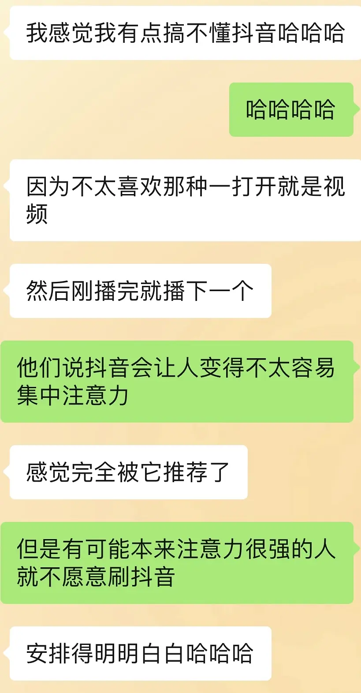

# 发现了几个关于学霸的规律

发现学霸身上有一些共同点，但是我学的是文科，不知道理科学霸是不是也适用🤔

1.不用或很少用抖音这种短视频软件。娱乐方式比起无目的地刷视频会选择看小说或者打游戏。

2.注意力集中。做一件事能长久沉浸在其中，不被外界干扰。

3.目标明确。大到填报志愿、考研保研、工作选择，小到论文设计、期末考试都有自己明确想要达到的目标，根据目标进行规划。

4.善于利用身边人脉。多问多打听，快速找到能帮助自己的人，并寻求他们的帮助。在别人需要帮忙的时候也会尽自己所能提供帮助，形成良性循环。

5.保持好奇心和思考能力。不会事不关己高高挂起，而是对所有的事物都保持好奇；能够注意到其他人想不到的地方，并付诸行动。

6.不管大事小事都认真对待or分辨什么事情对自己是重要的，在大事上百分百认真。

7.注重细节。比如吃完饭离开饭店之前查看是否落东西，提交论文之前反复检查等。有点小强迫 但是很注重细节。

8.善于观察。

9.体力好。睡得好吃得好，精力充沛。

关于不看短视频 我的学霸朋友现身说法👇

