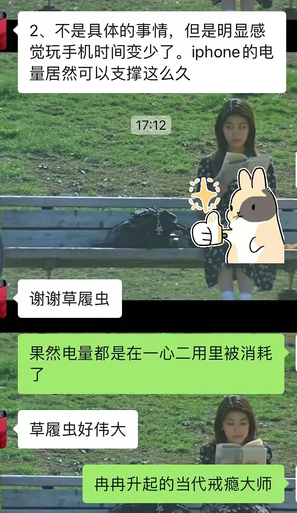

# 我发现了找回注意力的有效方法

我最近在放暑假，又不幸崴了脚只能在家静养，便致力于进行自我观察。

我发现自己无时无刻不在“一心二用”，上厕所，要拿手机进去看；吃饭的时候找个综艺看看；写东西时觉得耳朵空着也是空着，不如听点音乐；打扫卫生的时候，就找个播客听；工作时同样，如果打开文件卡顿，要马上找点东西来填补这段时间，但可能明明只是卡顿了一分钟。

诸如此类的生活每天都在重演。看似在重复利用时间，实则把时间叠起来用，效率极低。我曾以为难以长时间集中注意力是短视频的错，于是卸载了手机里的短视频软件（一定程度上起到了改善作用），但进入假期后愈发觉得远离短视频，治标而不治本。我依然无法长时间投入在正经事上，没了短视频，我的时间，我的注意力，依然稀碎。

最近我终于发现，难以集中注意力，或许是认知层面的问题。不知道大家上中学的时候有没有过“偷着玩”的经历？在那个年纪，畅快的玩是不被允许的，我时常会一边写作业，一边听歌；趁着上厕所拉屎的时间长，刷刷微博；学生时代的我有着深深的“时间焦虑”和“玩乐羞耻”。

而时至今日，我作为一名老师，已经可以享受假期，有了自由支配时间的权利，当着父母面玩手机、看剧也不会再受到批评，但时间焦虑和玩乐羞耻依然停留在我的潜意识里。我依然觉得：1、时间宝贵，得用来多干正事，但可以一心二用偷摸玩玩；2、花时间纯玩是不被允许的。

这导致我长时间处于玩也没玩好，学也没学好的状态。

在跟朋友聊这件事时，我萌生了一个想法，并将之命名为《草履虫计划》——就是像单细胞生物一样过极其简单的生活，绝不同时做两件事；吃饭就只吃饭；上厕所就只上厕所；玩的时候就纯玩；写文案就只写文案，耳朵空着就空着。

在朋友的响应下，草履虫计划开始实行，我也终于写完了拖延好久的开题报告。

与朋友的相互反馈节选

拿自己做实验真是有趣！

今日发现：原来我是有专注力的，原来耳朵空着脑子也没那么寂寞，原来手机电量可以撑很久，原来上大号只用两分钟。

我好像治愈了我自己的精神内耗，大家也可以诚邀朋友挑战一下草履虫计划。

—————————————————————

8.24更新

看到很多uu想要试试草履虫计划

我在豆瓣创建一个话题，大家可以一起打卡，名为：《草履虫计划实践基地》 （也可以点进我的主页找）
