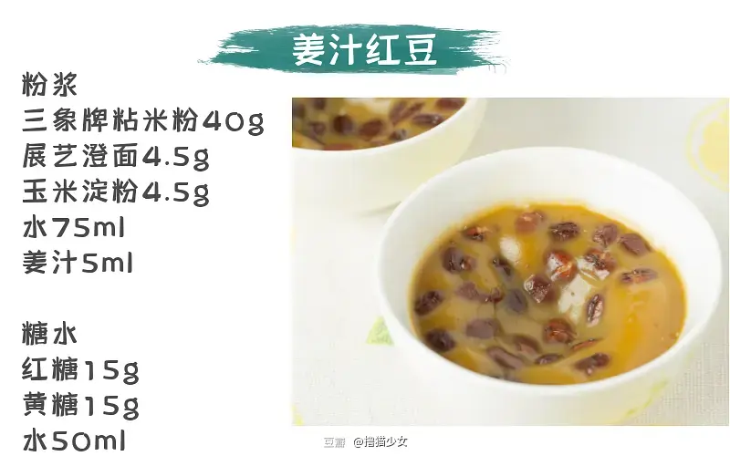

# 正宗传统「砵仔糕」应该是这样子！

说到「砵仔糕」，你有什么印象？

是不是这种？？？

作为一个广东土著告诉你

这种真的算不上「砵仔糕」

除了大家都有一只「砵仔」

我真的想不出有还什么相同之处

偏偏这种所谓「砵仔糕」

却日渐取代了传统「砵仔糕」的地位

越来越多人不知道传统「砵仔糕」的味道

更不知道它的历史

现在绝大部分水晶砵仔糕是用马蹄粉或者木薯粉为原料做的，那这样跟马蹄糕有什么区别呢？还有更普遍的就是各种人工色素+香精混合，预拌粉一开，搞定。这种抛离根本的创新，难听点说就是不伦不类。

不信搜搜网络上关于砵仔糕的菜谱，90%以上都是做那种非常简单的水晶砵仔糕，用木薯粉或者是马蹄粉混合而成。

广州现在能买到传统砵仔糕的地方已经不多了，北京路的一家估计吃货都知道。但是人超级多，而且因为人手生产力不高的问题，都是限量发售，卖完即止。买过一次味道是很不错，而且有传统味道，也有在传统基础上创新的味道。唯一最最最最最让人纠结的是，你必须在发售时间开始的时候去排队，不然你铁定吃不到。

本着求人不如求己的精神，我们决定自己去捣鼓配方。综合参考了正宗的台山砵仔糕做法，还有香港的老字号坤记糕点，各大博主，综合了好几款配方，试了8个配方，3种粘米粉，倒了一大盘砵仔糕，最后调整出今天推荐的制作配方。

希望你也可以在家享受到简单又美味的「砵仔糕」。

先上成品，可能比不上老字号的优秀出品，毕竟我们没有这个条件自己在家混合两种米然后再直接磨米浆。不过味道和口感也不差。

最后，为了提高大家的一次成功率，今天所有原料都会直接写出品牌，粘米粉我们试了3款，不同的粘米粉她的吸水率都不一样，这个直接影响到砵仔糕的口感，非常重要。

在网络上找到最最最古老的文献就是清朝咸丰年间的《台山县志》记载，当时的人以小钵做成米糊糕，以便外出工作时充饥，因而得名。以咸丰年间来算，砵仔糕的历史已经超过一百年。

传统的砵仔糕以黄糖、粘米粉等做成后，放在一个瓦制的小砵内蒸熟。吃的时候才把砵仔糕从小砵倒出来，以竹签穿起来吃。有的砵仔糕加入红豆；亦有砵仔糕以白砂糖制造，因而是白色的。刚蒸好的砵仔糕，口感暖、滑、香、绵。

砵仔糕热吃跟冷吃是两种不一样的口感和味道，新鲜出炉的砵仔糕口感会比较软糯，带有比较浓郁的米香味，而放凉后吃的砵仔糕，会更弹牙一点，口感更好，但是相对米香味就没有那么明显。

红豆是制作砵仔糕最常见的配料，无论是配椰汁，红糖原味，还是创新的抹茶味，红豆都非常百搭。

菜市场已经找不到最传统的瓦制砵仔，最后退而求其次选择了质地相对薄一点的陶瓷小碗，一只的容量大概是50ml。每一份粉浆，都可以做到3只这么大的砵仔糕。

红豆就根据个人的喜好适当增减都可以，喜欢超多红豆的话，可以适当多准备一点。

一碗靓仔的砵仔糕，红豆是要做到均匀分布，而不是只有表面或底面部分有。

要怎样做到红豆可以漂浮在粉浆中均匀分布？

除了很多人说的下红豆的时机要对，这里还有一个非常有用的小技巧，就是红豆处理好以后，放冰箱冷一晚上，把多余的水分彻底收干，这时候再用来做砵仔糕，蒸出来的砵仔糕，红豆就可以均匀分布在砵仔糕里面，保证每一口都能吃到红豆。

红豆质地比较硬，需要提前泡6-8小时。（天津的红豆比较好，有条件的可以选天津红豆）

泡好的红豆，倒去泡红豆的水，再加入适量的水，水量稍微浸过红豆一点就可以，我们是要把红豆原粒蒸软，而不需要蒸成红豆泥。

大火烧开水，水开后把红豆放到锅里面中火隔水蒸。

蒸40分钟之后，就可以加入白砂糖，搅拌均匀，蒸10分钟。粉浆里面都会加糖，不适宜加太多糖，不然吃起来就会很腻，而且会把米香味覆盖掉。

关火后，盖着盖子焖10分钟。

最后把红豆里面多余的水倒掉，拿出来放凉，放冰箱备用就可以。

4款砵仔糕，每一款的做法都是一样的

这里就大家示范原味红豆跟姜汁红豆的操作方法

每一份粉浆，可以做到3碗50ML容量大小的砵仔糕

红糖跟黄糖用刀切碎，方便溶糖水。糖不能整块下，不然需要很长时间才融化，这时候糖水就会因为高温而蒸发，整个比例就不对了。

切碎成这个样子就可以。你也可以直接买一整包的某古红糖粉。

准备一块姜，磨成姜蓉。我们比较喜欢姜的香味和辛辣的口感，我们用了15g的姜磨姜蓉挤出姜汁。

一般来说老姜水分更少，但是辣度更明显，而肉姜姜味没有那么明显，但是姜汁比较多，自己根据实际需要选择就好。（用料理机加点水打成姜蓉也是可以的）

用布包着挤出姜汁。

把粘米粉、澄面和玉米淀粉按比例放到碗里，加入水适量。不断搅拌，直至没有结块的面粉。这里要保证面粉都完全分散，如果有结块，蒸出来就不好吃。

这一步也是决定砵仔糕口味的关键。做姜汁口味，就加入姜汁；做椰汁口味，就加入椰浆；做巧克力口味，就加入巧克力粉。

这里还有一个地方要注意，椰浆的密度跟水的密度有明显的差别，所以椰浆的分量需要转换回来，不能直接用1:1的比例。除了椰浆，还有奶茶也是同样的道理，配方需要自己去多试几次才能获得最佳效果。

如果做巧克力口味，巧克力粉和3种面粉要提前混合均匀，再加水，这样不容易结块。

巧克力粉也是丰俭由人，但是不建议用代可可脂，吃起来一点香味都没有，徒有一个黑麻麻的颜色。有条件的可以选GODIVA的巧克力粉也不错，星爸爸的也可以，好时的这款也不差。平常还可以用来冲巧克力奶，做巧克力蛋糕或者是布朗尼，巧克力布丁也没问题。

粉浆开好后，就准备糖水。往糖粉中加入适量开水，搅拌至完全溶解，小火烧开。（这里用开水的目的是为了缩短加热时间，避免水分蒸发太多导致水的比例不对）

记得一定不能大火长时间煮，这个分量的砵仔糕粉浆并不多，只要水分稍微蒸发，粉浆的比例就会明显改变，会直接影响成品。

糖水的温度也很重要，糖水的温度太热就会直接煮熟米浆，做出来的砵仔糕就会变得口感很硬。但是糖水温度不够，做出来的砵仔糕就会过分软趴趴，甚至是粘口。

有温度计的同学，可以大概在85-90度左右离火，如果没有温度计，可以小火煮，煮到水稍微开始冒小泡就可以，不需要煮到100度沸腾。

糖水趁热倒入粉浆中。倒热糖水前，重新搅拌粉浆，避免粉浆分层。分2~3次倒入热糖水，一边倒，一边搅拌。

把砵仔放入蒸笼，加入适量红豆，大火蒸4分钟。预热砵仔，可以让粉浆受热更均匀，蒸出来的才会有一个小凹陷。

粉浆放置一段时间后会出现分层的现象，倒入砵仔前，一定要多搅拌几次，保证粉浆是均匀的。做巧克力口味的，倒好粉浆后可以加入1粒巧克力。

如果想整个砵仔糕都布满巧克力，可以选择将巧克力先敲碎，再撒到里面。

粉浆不需要倒太满，7-8成满就差不多。

大火蒸25~30分钟，具体时间根据砵仔大小确定，砵仔比较厚，比较大的话要适当蒸久一点。

蒸4分钟后，你会看到砵仔糕中间已经开始明显凹下去。

25分钟后，用竹签或牙签在最厚的地方戳下去。

拔出来如果没有沾着粉浆，就是完全熟透。

做好的砵仔糕，把表面的水倒掉。用风扇彻底吹凉，砵仔糕和砵仔就会很好分离，用竹签一挑就出来，而且完全不沾底。

砵仔糕最好就是新鲜吃啦，如果吃不完放冰箱的话，需要找一个密封的保鲜盒，3日内食完，时间太长口感就会变差。吃的时候，拿出来稍微蒸热一下再稍微放凉食就可以。

作为吃砵仔糕长大的人，我是很不想看着传统的砵仔糕没落，更不希望以后的小朋友吃到的都是这种完全没特色，徒有其表的「水晶砵仔糕」。

饮食文化，也是文化体系的一大重要组成部分，对于传统的饮食文化，我们更应该是取其精华去其糟粕，推陈出新，革故鼎新。而不是完完全全抛弃传统，只剩下一个躯壳，这种看似创新的创新，却是把最重要的根本丢弃。这种舍本逐末型的“创新”对传统文化是一种毁灭性的存在。

毕竟用个砵仔装住一碗“马蹄粉”你也不会认为他就是一个砵仔糕。

1.不同产地，不同牌子的粘米粉吸水度都不一样，所以如果你用的粘米粉跟我们用的牌子不一样的话，就需要灵活调整用水量。先试试我们的配方，然后再看看是需要加水还是减水。

2.红豆记得一定要提前浸泡6-8小时，但是不能泡过长时间。隔水蒸，不要直接水煮，直接水煮会让红豆沙都掉水里面，你的红豆就不完整了。最后红豆至少要冷藏6-8小时让多余水分完全蒸发。

3.砵仔的大小和厚度也会影响砵仔糕的蒸制时间，最准确判断砵仔糕有没有完全蒸熟的办法就是：用竹签或牙签在最厚的地方戳下去，拔出来如果没有沾着粉浆，就是完全熟透。

4.考虑到我们的日常口味和健康问题，配方的糖比例会比市面上零售的砵仔糕甜味要淡。一只砵仔糕虽然吃起来不会有很明显的甜味，不过里面已经足足有10克糖。小吃多滋味，多吃坏肚皮，吃太甜不健康啦~如果你真的很喜欢吃很甜的东西，就自己酌情根据实际情况自行增加糖的比例。

5.蒸好的砵仔糕要趁热把表面凝结的一层水倒掉，马上开个风扇吹凉，大概吹十分钟就可以脱模啦。温热吃跟冷吃，是两种不一样的口感，都可以试试。

6.如果需要详细购买链接，可以选择点击原文。只提供参考，自己买的时候多平台对比价格，哪里便宜买哪里。（在豆瓣看到文章的同学，请看评论第一条）

浏览更多甜品系列

[翻车三次才复刻成功的「清炖雪莲子桃胶」](https://www.douban.com/note/768974948/)

[冬天不能错过的独特滋味：陈皮红豆沙](https://www.douban.com/note/740687802/)

[广东妈妈的厨房秘密武器：糖水](https://www.douban.com/note/737999629/)

