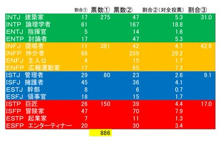
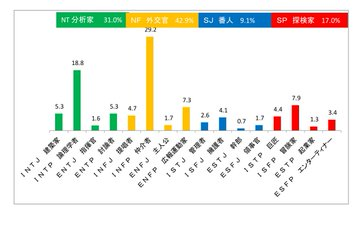
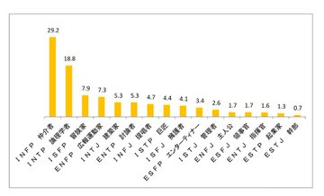
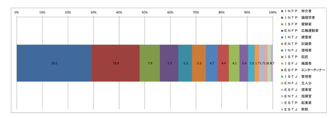
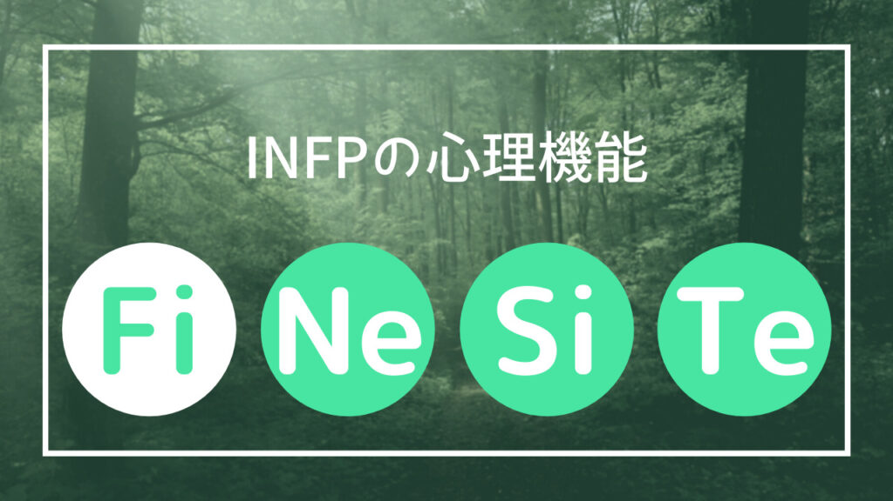

# 比其他任何地方都更深入地考虑INFP和ADHD的困难和共性|生活困难×MBTI

目次

1.  [INFP 和 ADHD 考虑因素简介](#toc1)
2.  [ADHD特征和INFP特征之间的相似之处](#toc2)
    1.  [多动症的共同特征](#toc3)
        1.  [不注意](#toc4)
        2.  [多动・冲动](#toc5)
            1.  [多动症的好处](#toc6)
    2.  [INFP的特征](#toc7)
    3.  [共同点和注意事项](#toc8)
3.  [INFP心理功能和多动症](#toc9)
    1.  [优势机能内向的感情(Fi)](#toc10)
    2.  [补助机能外向的直感(Ne)](#toc11)
        1.  [离题内向和多动症](#toc12)
    3.  [代替机能内向的感覚(Si)](#toc13)
    4.  [劣等机能外向的思考(Te)](#toc14)
        
        1.  [从INFP的心理功能看生活困难和优秀部分总结](#toc15)
        
4.  [如何利用 INFP 和 ADHD 的共同优势](#toc16)
5.  [概括](#toc17)

## INFP 和 ADHD 考虑因素简介

很突然，但是这次创作这篇文章的背景

・INFP 和 ISFP 文章是目前访问量最大的文章  
・本网站上的许多文章都是通过搜索与“ADHD”相关的关键字来阅读的

有两个数据。

从这些事实推断，许多以内向感觉（Fi）为主导功能的类型（INFP，ISFP）发现他们的性格类型与多动症之间存在某种关系，他们实际上被诊断为多动症。与其他类型相比，患有多动症或认为自己患有多动症的人更多。

另外，反转INFP和ISFP心理功能的ESTJ和ENTJ的文章访问量非常低，而IxFP的文章访问量是IxFP的20倍以上。这些类型。

另外，查看某个人在 Twitter 上收集的关于 ADHD 的问卷调查结果和类型，INFP 位居榜首，依次为 INTP、ISFP 和 ENFP。 ENTJ 的顺序。

[

CB

](https://twitter.com/CBydbbmpg?ref_src=twsrc%5Etfw%7Ctwcamp%5Etweetembed%7Ctwterm%5E948316865964662784%7Ctwgr%5Eb74f2eb2bb6316675f522d98a5caf4c8e5c45a08%7Ctwcon%5Es2_&ref_url=https%3A%2F%2Fminoritymbti.com%2Finfp-adhd-relathionship%2F)

·

[2017年12月26日](https://twitter.com/CBydbbmpg/status/945684353287200768?ref_src=twsrc%5Etfw%7Ctwcamp%5Etweetembed%7Ctwterm%5E948316865964662784%7Ctwgr%5Eb74f2eb2bb6316675f522d98a5caf4c8e5c45a08%7Ctwcon%5Es2_&ref_url=https%3A%2F%2Fminoritymbti.com%2Finfp-adhd-relathionship%2F)

[@CBydbbmpg \_](https://twitter.com/CBydbbmpg?ref_src=twsrc%5Etfw%7Ctwcamp%5Etweetembed%7Ctwterm%5E948316865964662784%7Ctwgr%5Eb74f2eb2bb6316675f522d98a5caf4c8e5c45a08%7Ctwcon%5Es2_&ref_url=https%3A%2F%2Fminoritymbti.com%2Finfp-adhd-relathionship%2F)

·

[跟着我们](https://twitter.com/intent/follow?ref_src=twsrc%5Etfw%7Ctwcamp%5Etweetembed%7Ctwterm%5E948316865964662784%7Ctwgr%5Eb74f2eb2bb6316675f522d98a5caf4c8e5c45a08%7Ctwcon%5Es2_&ref_url=https%3A%2F%2Fminoritymbti.com%2Finfp-adhd-relathionship%2F&screen_name=CBydbbmpg)

[回复 @CBydbbmpg ：](https://twitter.com/CBydbbmpg/status/945683941280722946?ref_src=twsrc%5Etfw%7Ctwcamp%5Etweetembed%7Ctwterm%5E948316865964662784%7Ctwgr%5Eb74f2eb2bb6316675f522d98a5caf4c8e5c45a08%7Ctwcon%5Es2_&ref_url=https%3A%2F%2Fminoritymbti.com%2Finfp-adhd-relathionship%2F)

\[4/4\]

[

*   ISTP 巨匠
    
    26%
    
*   ISFP 冒険家
    
    47.3%
    
*   ESTP 起业家
    
    7.3%
    
*   ESFP 艺人
    
    19.3%
    

150票 · 最终结果

](https://twitter.com/CBydbbmpg/status/945684353287200768?ref_src=twsrc%5Etfw%7Ctwcamp%5Etweetembed%7Ctwterm%5E948316865964662784%7Ctwgr%5Eb74f2eb2bb6316675f522d98a5caf4c8e5c45a08%7Ctwcon%5Es2_&ref_url=https%3A%2F%2Fminoritymbti.com%2Finfp-adhd-relathionship%2F)

[

CB

](https://twitter.com/CBydbbmpg?ref_src=twsrc%5Etfw%7Ctwcamp%5Etweetembed%7Ctwterm%5E948316865964662784%7Ctwgr%5Eb74f2eb2bb6316675f522d98a5caf4c8e5c45a08%7Ctwcon%5Es1_&ref_url=https%3A%2F%2Fminoritymbti.com%2Finfp-adhd-relathionship%2F)

[

@CBydbbmpg

](https://twitter.com/CBydbbmpg?ref_src=twsrc%5Etfw%7Ctwcamp%5Etweetembed%7Ctwterm%5E948316865964662784%7Ctwgr%5Eb74f2eb2bb6316675f522d98a5caf4c8e5c45a08%7Ctwcon%5Es1_&ref_url=https%3A%2F%2Fminoritymbti.com%2Finfp-adhd-relathionship%2F)

·

[跟着我们](https://twitter.com/intent/follow?ref_src=twsrc%5Etfw%7Ctwcamp%5Etweetembed%7Ctwterm%5E948316865964662784%7Ctwgr%5Eb74f2eb2bb6316675f522d98a5caf4c8e5c45a08%7Ctwcon%5Es1_&ref_url=https%3A%2F%2Fminoritymbti.com%2Finfp-adhd-relathionship%2F&screen_name=CBydbbmpg)

\[最终结果\] 感谢对多动症 MBTI 性格测试结果投票的 886 人，以及帮助传播信息的人。 结果显示在 4 张图像中。

[午前6:15 · 2018年1月3日](https://twitter.com/CBydbbmpg/status/948316865964662784?ref_src=twsrc%5Etfw%7Ctwcamp%5Etweetembed%7Ctwterm%5E948316865964662784%7Ctwgr%5Eb74f2eb2bb6316675f522d98a5caf4c8e5c45a08%7Ctwcon%5Es1_&ref_url=https%3A%2F%2Fminoritymbti.com%2Finfp-adhd-relathionship%2F)

[

390

](https://twitter.com/intent/like?ref_src=twsrc%5Etfw%7Ctwcamp%5Etweetembed%7Ctwterm%5E948316865964662784%7Ctwgr%5Eb74f2eb2bb6316675f522d98a5caf4c8e5c45a08%7Ctwcon%5Es1_&ref_url=https%3A%2F%2Fminoritymbti.com%2Finfp-adhd-relathionship%2F&tweet_id=948316865964662784)[

回复

](https://twitter.com/intent/tweet?ref_src=twsrc%5Etfw%7Ctwcamp%5Etweetembed%7Ctwterm%5E948316865964662784%7Ctwgr%5Eb74f2eb2bb6316675f522d98a5caf4c8e5c45a08%7Ctwcon%5Es1_&ref_url=https%3A%2F%2Fminoritymbti.com%2Finfp-adhd-relathionship%2F&in_reply_to=948316865964662784)

共有

[

阅读 1 条回复

](https://twitter.com/CBydbbmpg/status/948316865964662784?ref_src=twsrc%5Etfw%7Ctwcamp%5Etweetembed%7Ctwterm%5E948316865964662784%7Ctwgr%5Eb74f2eb2bb6316675f522d98a5caf4c8e5c45a08%7Ctwcon%5Es1_&ref_url=https%3A%2F%2Fminoritymbti.com%2Finfp-adhd-relathionship%2F)

每种类型的多动症发生率与访问该站点的次数之间存在相对明显的相关性。我决定写这篇文章是因为我认为可以更深入地了解类型之间的关系，心理功能，和多动症。

已经很久了，但是这就是介绍的全部内容。  
下一节开始讨论和讨论INFP和ADHD。

## ADHD特征和INFP特征之间的相似之处

首先简单介绍一下ADHD和INFP的特点，挑出我觉得两者共同的部分。

### 多动症的共同特征

#### 不注意

经常犯错、嗜睡、丢失东西、健忘、分心、无法完成任务、难以完成任务、难以组织、难以集中注意力、难以整理

#### 多动・冲动

疲劳、烦躁、坐不住、等不及、话多、打断开始说话、做事一时冲动、熬夜、拖延

##### 多动症的好处

独具匠心，善于思考，充满好奇心，感兴趣时表现出惊人的专注力，快速的判断力和行动力

### INFP的特征

・喜欢幻想  
・优柔寡断  
・非常内向  
・一脸茫然  
・我的头很吵  
\- 总是感觉或思考  
・谦虚温柔  
・好奇心旺盛  
\- 敏感细腻  
・对自己的价值观诚实  
・有深刻的内心世界观  
・极具创意  
\- 极具想象力和直觉  
・我不擅长自我表露  
・不喜欢太热闹的地方  
・珍惜个人  
・出乎意料的顽固的一面  
・高洞察力  
・常有异味  
·疲劳的  
・活动量低  
・看起来很幼稚  
对日常事物缺乏兴趣  
・日常生活中的笨拙  
・喜欢奇怪的东西  
・有独特的感觉  
・把你的一切都投入到你所爱的事情中

### 共同点和注意事项

如果你看一下 ADHD 和 INFP 的特征，我想你会发现两者之间有很多相似之处。  
尤其是谈到多动症的注意力不集中的特点，与INFP有很多相似之处。

好吧， **无法正确地完成“真实的日常任务” 。** 多动症的注意力不集中被认为等同于  
整理房间、按时完成任务、不忘任何事情以及专注于您正在做的事情等任务都与您的日常生活息息相关。

然而，对于像INFP这样生活在精神世界的人来说，正确地执行“真实的日常任务”的行为与那些可以轻松完成的人相比，会给他们的身心带来沉重的负担，这真的很重要。感觉像一件事。

首先，INFP是 **一种性格类型，无论是否多动症，都离不开注意力不集中的倾向** 。

反之，很多擅长正确做这些事情的人都具有S型和J型的特征，根据一种理论， **超过一半的人类被称为“SJ型”** 。

与大多数关注“日常生活、现实”的人相比，INFP 倾向于关注不同的部分，但它们是多动症的好处之一，“创意和强烈的好奇心”也可能是相关的。

然而，对于大多数现实主义者来说，INFP 经常看到的世界似乎“毫无意义”。  
无论INFP们多么沉迷于高级抽象的想法，全速转头，他们所看到的方向与大多数人如此不同，以至于他们常常无法从中找到价值。 .  
事实上，INFP 是被认为非常聪明的类型之一，只是与大多数人不同。

此外，INFP具有高度的创造力，很可能在艺术、哲学、发明、文学、社会学等领域得到高度评价，与其他类型相比，它被认为是相当高的。  
但是，换句话说，也很难得到大多数强调具体事物的人的公正评价，除非他们有音乐、绘画、书籍和标题等实实在在的成就。

换言之，INFP 倾向于对难以转化为具体事物的事物感兴趣，而想办法将脑中的事物转化为现实需要时间，容易负担过重。  
可以说是少数人的痛苦。

另外，这只是我的直觉，但INFP的ADHD往往表现出比粗心更弱的多动冲动，我觉得他们很容易被描述为从小就安静温柔的孩子。

因为它不会引起被认为是有问题的多动和冲动的特征所衍生的行为，即使生活有一些困难，也被忽视了。我认为有很多人属于“。

在下一节中，我将从心理功能方面解释为什么INFP具有上述特征，并考虑每种心理功能与ADHD特征之间的关系。

如果你想进一步了解INFP的性格和性格，请阅读下面的文章。

[

\[MBTI\] INFP 高贵的社会格格不入吗？ 描述你的性格和性格！ 考虑与 ADHD 和 ASD 的关系！

它还介绍了 INFP（MBTI 类型之一）的个性和性格，以及与 ADHD 和 ASD 等发育障碍的关系及其原因。

minoritymbti.com

2021.08.23

](https://minoritymbti.com/infp-personality-feature/ "[MBTI] INFP 高贵的社会格格不入吗？ 描述你的性格和性格！  考虑与 ADHD 和 ASD 的关系！")

## INFP心理功能和多动症

> **什么是心理功能**
> 
> 荣格所定义的判断， 接受信息的八种功能称为心理功能。  
> 决策的功能是 **“感觉（F）”** 和 **“思考（T）”** ， 信息接收的功能是 **“直觉（N）”** 和 **“感觉（S）”** 定义为 有内向型和外向型两种，一共八种。 尖酸刻薄。 在 MBTI 和类型论中， 根据这些心理功能的组合类型 我在分。 每种类型是 **“感觉（F）”“思考（T）”“直觉（N）”“感觉（S）”** 具有四种心理功能 四位的顺序是“主导功能”、“辅助功能”、“ 它被命名为“替代功能”和“劣等功能”。 还，” 主导功能和劣等功能，辅助功能和替代功能 被定义为一组截然相反的心理功能。  
> 主要功能是内向的类型◯◯以“I（ 内向）”， 反之，以外交◯◯为主导功能的类型以“E( 外向）”将是一个外向的人。

*   优势机能・・・内向的感情(Fi)
*   补助机能・・・外向的直観(Ne)
*   代替机能・・・内向的感覚(Si)
*   劣等机能・・・外向的思考(Te)

直截了当地说，外 **倾直觉 (Ne) 是一种心理功能，其特征与 ADHD 的特征非常相似** 。 而且，当然，相反的心理功能， **内向感觉（Si），具有远离多动症特征的特征** 。

INFP 在心理功能方面的简单表示是

**你的感受和价值观是最重要的（Fi）**  
  
**重点放在抽象信息上，例如事物的本质，在那里可以找到可能性，而不是具体信息（Ne）**  
  
**我有点不擅长做事和注意细节（Si）**  
  
**对赢得社会竞争、金钱、地位等不感兴趣，不善于寻求（Te）**

变成。  
老实说，我认为这是一种心理功能的组合，完全不适合生活在这个适者生存的现代社会。

顺便说一句，在日本社会作为所谓的“普通人”生活时，被认为工作相对有利的心理功能是

**（Te）** 外倾思维的理性判断和强度  
**外倾情感（Fe）** ：强调周围人感受的想法  
**Introverted Sensing (Si)** 脚踏实地的保守坚定  
**内向直觉 (Ni)的有目的的闪光** 超越

而这些都是INFP们不太了解或不擅长的事情。  
但是，有很多人擅长这些心理功能，但生活却相当困难，所以如果你能把它当作一种倾向，我将不胜感激。  
我的印象是内向直觉（Ni）是一种高峰的心理功能，可以根据环境轻松区分是王牌还是死牌。

也就是说，我认为这就是为什么 INFP 会发现生活异常困难的根源。  
**这意味着现代社会的环境与INFP的心理功能不匹配** 。

从这里开始，我将相当详细地解释与 ADHD 的关系，从 INFP 的主导功能开始。

### 优势机能内向的感情(Fi)

首先，我将解释作为主导功能的 Fi 与 ADHD 和社会失调之间的关系。

突然要跑题了，其实主导功能是那种类型的人最能处理的心理功能，所以那种人半无意识地使用它似乎太自然了。  
因此，我将在本文中对 Fi 进行简单的解释，所以如果你是 INFP，请再次回顾熟悉的 Fi。

如果用一个词来形容Fi，在海报的风格中，就是 **“真正的自我满足”** 。

由于 Fi 是内向的判断功能，因此以 Fi 为主导功能的 INFP 基本上会尝试为自己决定事物的价值。  
判断其价值的标准是纯粹的“自我感觉”，被认为是内向感觉的本质。

当被问及他们的感受时，具有主导 Fi 功能的 INFP 可能会觉得有些以自我为中心，但取决于你如何看待它，这实际上是真的，也恰恰相反。

以 Fi 为主导功能的类型有能力认真对待自己的情绪，因此他们可以将其扭曲为自己的优势，或者用他们提出的理论为其辩护。我经常讨厌关于 Fi 的“谎言”。

另外，INFP们往往有自己的道德感增加。  
Fi是健康环境下具有无限可能的心理功能，因为其精巧的价值标准进一步提升了人的道德感。  
不过Fi也是一种心理功能，会随着成长的程度而变化，是不是以自我为中心的行为的标准，所以要因人而异。

在 INFP 的情况下，他们使用一种心理功能来追求外倾直觉 (Ne) 的可能性，这是一种辅助功能，直到他们创建 Fi 的标准。它往往需要两倍的时间。  
但是，你花在它上面的时间越多，你的判断就越有可能变得非常深刻和真诚。  
绝大多数人都看不到INFP的深邃宇宙，这很不值一提，但一直面对Fi，才是INFP纯洁高尚的部分。

感性而理性，以自我为中心，自我批评，软弱而坚强，松散但真诚，消极但充满希望 **。有一个善良的本性** 。  
在该深度的中心是主要功能 Fi。

现实世界中经济活动的实际情况， **由于 Fi 的性质，有一个不幸的方面是很难观察和评估** 但这可能是 INFP 的灵感来源。 强的。

现在，这里的情况发生了一些变化。

内向者，因为 Fi 是他们的主要功能。 **毫不奇怪， INFP 被** 归类为

事实上，这种内向的性格被认为是与多动症密切相关的因素之一。  
因为，正如您从开头介绍的某个人进行的 Twitter 调查的结果中看到的那样  
**发现内向的人比外向的人更容易患多动症** 。

我已经考虑了一些可能的原因。

・因为内向的人不表达自己的想法和想法，他们更容易被差评。  
・有很多人本来是外向的，但由于从小发育障碍导致的失败而变得内向。  
・有一种理论认为，具有强烈 ADHD 特征的外向者不会被诊断出来，因为他们通常一开始并不觉得自己有麻烦。  
・有一种理论认为，性格内向的人往往比较敏感，他们经常去看精神科医生，而不仅仅是因为发育障碍，而且多动症经常在治疗其他疾病时被发现。

似乎每个原因都以复杂的方式交织在一起，导致内向者的多动症发生率很高。

坦率地说，我认为很多内向 **的人很难按照现代社会的主流价值观生活，** 而且我觉得内向的人与发育障碍之间有很好的相关性。  
当然，内向的人比较适合环境的突然变化，比如不出门防止感染新冠病毒，而且近年来网络环境已经司空见惯，外向的人比内向的人更容易生活。我觉得潮流正在慢慢改变。

另外，如果ASD/Asperger的自闭倾向强的话，和内向的人的相关性好像加深了，据说ASD和ADHD是矛盾的，每个特征都经常出现。感觉可以看出ADHD之间的关系和内向的人。

更详细地讨论这种内向和多动症 [我们将在后面的部分](#introvert) 。

现在，如果我们再次关注内倾情感 (Fi)，我们会发现具有主导 Fi 功能的人往往比具有相同情感功能外倾情感 (Fe) 的人更加个人主义。也有一些趋势可以看出。  
将 Fi 的善意视为个人而不是关心团队可能会有所帮助。  
另外，我觉得很多INFP都是善良的人，会打心底里关心“作为个体的人”，虽然他们倾向于自我惩罚，但他们很少攻击别人。因此，我认为这很容易在人与人之间的社交中留下良好的印象。

因为他们有自己的决策标准，所以外人很难看到INFPs决策的真实性，很容易让人觉得他们茫然。

另外，INFP还使用外向直觉（Ne），我接下来会介绍，谁擅长联想游戏，所以所谓的“普通人”很难理解。  
感觉就像已经深入内心的Fi，在Ne的影响下在我的脑海中无限扩张。  
INFP的内心世界是如此广阔，即使他们试图将自己的广阔原封不动地传达给外部世界，他们也很难做到这一点。

可以公平地说，INFP **容易注意力不集中，例如大脑过度活跃，因为他们通过结合 Ne 和 Fi 将注意力集中在头脑中** 。  
此外，考虑到发育障碍是谱系障碍和社会障碍，强化“难以被他人理解”特征的内向感觉（Fi）被认为与发育障碍密切相关。

Fi和ADHD的另一个可能的关系是， **人们由于社会适应能力低而更容易被认为患有发育障碍** ，而由于道德观念太高的困境， **他们更容易患上精神疾病。** .  
然而，这可能与发育障碍及其继发性疾病的可诊断性有关，而不是与 ADHD 特征本身有关。

现在，像 INFP 这样具有内向感觉 (Fi) 主导功能的类型将具有外向思维 (Te)，这是与他们的劣势功能相反的心理功能。  
对 Te 给出一个非常粗略的解释，它是一种基于客观理性做出决策的心理功能。

Te较弱的人之所以容易出现社会失调，是 **不觉得来自社会的容易理解的奖励（Te价值标准），例如金钱，以及** 他们 由他们所保障的社会群体结构的价值。 不匹配。 因为 它

INFP 的真正需求往往不能通过默默地努力获得晋升、地位、声望或大量金钱来满足。 而且INFP除了Fi之外，还有一个Ne的辅助功能，下一节会解释，所以他们的 **兴趣和品味往往会** 出类拔萃。

**从心理学的角度来看，INFP 不觉得工作很有吸引力是很自然的，** 我认为他们通常很难找到一个理由将宝贵的时间奉献给社会。

此外，由于 Te 是一种强烈目标导向的心理功能，Te 强的人往往机智，无论好坏，往往在规则范围内不择手段。  
从他们中的一些人的角度来看，INFP 的善良和脚踏实地的态度很可能可以作为一种工具，并经常利用他们。 有些人为了在群体中获得优势，会以坐骑式的方式展示他们的关系。

\*我们稍后会在 [Te部分](#thinking) 详细介绍劣势Te与社会失调的关系，请查看。

更 **很难放弃社会，让自己适应失业的生活。** 糟糕的是，INFP 们通常  
正如我在上面所写的，Fi 的高尚道德和对真理的坚忍使 INFP 不能轻松。

然而，在这种情况下，INFP 不想工作的感觉也是真实的，因此需要很长时间来审视他们并整合他们的 Fi 价值观。

INFP在巩固期间会暴露在冲突和痛苦中，持续的时间越长，他们就越精神疲惫。  
当这种情况发生时，患抑郁症的可能性就会增加，情况会变得更加严重，从而形成恶性循环。

INFP 隐约患上精神病的原因之一可以归结为他们的坚忍和高贵。  
INFP天生就是超级M，也可能是对自己超级S。

### 补助机能外向的直感(Ne)

首先，这一部分很长。 这是 ADHD 和 INFP 之间关系的重要心理功能。

正如我在之前的文章中经常提到的， **Ne 和 ADHD 被认为是密不可分的** 。 当然，有各种各样的人，所以我不能说Ne = ADHD。

Ne的特点如下

・抓图大局  
难以关注小数字和事实  
\- 创新的想法自然而然地浮现在脑海  
在看似无关的事物中看到联系  
・追求可能性而不是遵循惯例  
・各种信息在您的脑海中飞来飞去。  
\- 冲动和不安  
・看森林看不到树  
・注意散漫  
・我喜欢幻想  
・探究事情的原因  
・好奇且容易无聊  
・多方思考，增加选择  
・非常灵活  
・我不擅长缩小到一个，我优柔寡断  
・我不擅长详细管理任务  
・我不擅长做“恰到好处”的事情  
・动机和质量有随机性

它有一种非常 **“自由奔放”的** 感觉。

多动症患者和熟悉这些特征的人都会注意到，上述 **Ne特征在很多方面与多动症的注意力不集中、多动、冲动的特征和多动症的强项非常相似** 。我理解。

大图。原因之一。 **不管是好是坏，Ne 强的类型把握事物适当，花时间在脑海中玩弄模糊** 把握的

然而， **恰恰相反，它往往因此而牺牲了“社交整洁”** 。

例如，在工作情况下，除了少数例外，大多数人都被期望充当齿轮，安静地执行分配给他们的任务。  
有些人像INFP一样有很强的Ne，他们会问“为什么，为什么……？”有时因为不适合工作而显得格格不入。

然后，一些管理齿轮的人和同事  
“没关系，做眼前的事就行！你又傻又笨，还犯错！大家都可以正常做，你怎么就不能做！”  
可想而知，有些人会生气， **就算是在做那种工作，自然也很难被评价** 。

与其说是做需要做的事情的实际能力，Ne更倾向于想象性地理解和应用本质意义，并 **通过默默地完成交给他的任务来工作，在某些情况下，这是一种不利的心理功能** 。

您不能做大多数人认为理所当然的事情这一事实使您感到与发育障碍有亲和力。

内向直觉（Ni）和Ne一样有“不寻常的优势”，问卷结果显示N型ADHD的数量明显更高，所以 **N型和发育障碍有关系。** 我认为 将被拆分。

顺便说一句，内向感觉（Si）的性质，它是 Ne 的相反心理功能， **非常有利地发挥作用。** 在像“日本社会的普通成员”一样充当齿轮时  
INFP 在他们的替代功能（第三个）中有 Si，所以 [我稍后](#sensation) 也会解释。

” **Ne是自然而然地做普通大众做不到的事情的能力，这就是被评价为“创造力** 的点。  
据说，要求与周围人相同的价值观是日本比较独特的，而与众不同本来就有很多积极的意义。

现在，“发育障碍”被定义为相对和谱系障碍。 换句话说，没有严格的分界线，发育障碍的定义特征的本质被认为是“与大多数人相比很奇怪”。

Ne试图理解事物原因的好奇心和想象力在某种意义上是“正常的”，因为它们不“正常”。 **如上所述，** 很有可能，“作者认为。

事实上，在对ADHD和多次出现的类型的调查中，有 **一个相当有趣的结果，以Ne为辅助功能的NP类型（第二）几乎垄断了前几名。** という、なかなかに面白い結果も出ています。

内容与上图相同

以及它在整体中的份额

1位INFP(29.2%)  
2位INTP(18.8%)  
4位ENFP(7.3%)  
5位ENTP(5.3%)

这是一个惊人的60.6%。

**简单来说，60% 的 ADHD 很可能是 Ne 强的类型** 。  
从数据来看，似乎存在明显的相关性。

您可以从下面的链接中阅读解释 NP 类型个性的文章。

[

\[MBTI\] ENFP 是梦想中的冒险家吗？ 描述你的性格和性格！ 考虑与 ADHD 和 ASD 的关系！

它还介绍了 MBTI 类型之一 ENFP 的个性和性格，以及与 ADHD 和 ASD 等发育障碍的关系及其原因。

minoritymbti.com

2021.08.31

](https://minoritymbti.com/enfp-personality-feature/ "[MBTI] ENFP 是梦想中的冒险家吗？ 描述你的性格和性格！  考虑与 ADHD 和 ASD 的关系！")

[

\[MBTI\] ENTP 是喜欢挑战的骗子吗？ 描述你的性格和性格！ 考虑与 ADHD 和 ASD 的关系！

它还介绍了 MBTI 类型之一 ENTP 的个性和性格，以及与 ADHD 和 ASD 等发育障碍的关系及其原因。

minoritymbti.com

2021.08.25

](https://minoritymbti.com/entp-personality-feature/ "[MBTI] ENTP 是喜欢挑战的骗子吗？ 描述你的性格和性格！  考虑与 ADHD 和 ASD 的关系！")

[

\[MBTI\] INTP 是 NEET 资质高的圣人吗？ 描述你的性格和性格！ 考虑与 ADHD 和 ASD 的关系！

它还介绍了 INTP（MBTI 类型之一）的个性和性格，以及与 ADHD 和 ASD 等发育障碍的关系及其原因。

minoritymbti.com

2021.09.06

](https://minoritymbti.com/intp-personality-feature/ "[MBTI] INTP 是 NEET 资质高的圣人吗？ 描述你的性格和性格！  考虑与 ADHD 和 ASD 的关系！")

然而，这里出现了一个问题。  
**为什么与 ENxP（Ne 主导功能）类型相比，患有 ADHD 的 INxP（Ne 辅助功能）类型的人更多？**  
如果 Ne 与 ADHD 密切相关，那么在其主要功能中具有 Ne 的 ENxP 不会比 INxP 多吗？ 我觉得我会过得很好。  
这个问题的一个可能答案是内向者和外向者之间的区别。

#### 离题内向和多动症

首先，ENxPs和INxPs最大的区别在于外向和内向。  
根据之前问卷的结果，不仅是NP型，在所有类型中，内向者的占比都高于外向者， **提示ADHD与内向者之间存在某种关系增加。** ことが示唆されています。

正如我在上一节“内向情感（Fi）”中简要解释的那样，在讨论内向者与多动症之间的关系时，被认为重要的是“内向者特有的生活困难”。  
让内向者生活困难的是，他们 **比外向者更难被社会评价** 。

我想大家大概都有一个模糊的印象，外向的人容易理解，活泼，而内向的人，软弱成熟。  
实际上就是这样。

性格外向的人活跃且精力充沛，并且经常积极行动以完成工作（主要功能倾向）或感到受到刺激。  
另一方面，内向的人在安静的地方休息时会感到快乐和精力充沛（与主导功能相关的倾向），因此他们经常深入思考。

例如，以 Ne 为主导功能的 ENFP 和 ENTP 是外向的人，他们精力充沛地将他们在 Ne（主导功能）中提出的想法公之于众。  
它可能看起来充满活力和不安，因为方法是“说出你的想法”或“立即行动，让你的想法成为现实”。  
有这么多的行动，你可能会有更多的失败，但你更有 **可能创造成功** 。  
**如果你有很多输出，你就能得到别人的理解，而且** 看起来 **很多外向的人都能以某种方式融入社会** 。

另一方面，INFP和INTP都是以Ne为辅助功能的内向型，但这两种类型的心理功能分别以内向感觉（Fi）和内向思维（Ti）为主导功能。是要在自己内心被说服。  
Ne是这两种类型的辅助功能，基本上是作为自我满足的工具。  
让我们看看如何使用辅助功能 Ne，使用一个可能的 INFP 大脑示例。

INFP：（这工作很无聊……啊，这支笔看起来像光束军刀。如果我有光束军刀，我不知道我是否不必做这种工作......但是如果发生战争，我说不定马上就死了……不，他天赋异禀，说不定能以英雄的身份活下来……他很擅长游戏，说不定还能用得上……如果是这样的话，那就是有趣。我不想看到那个，我可以想到几个可以死的人，但是……不，我不应该想到那种东西……嗯。我觉得我已经好像在什么地方见过，如果发生大战争也不奇怪……说到战争，我不知道农村的老妇人怎么样了……隔了好久才看到她们（略……）  
哦，我犯了一个错误！ ！ "

这可能是一个极端的例子，但INFP的辅助功能Ne被 **用来在他们的脑海中为他们的主导功能Fi产生大量的幻想和可能性。有** 很多。  
但是，基本上你从外面根本看不到，而且你越是专注于自己的头脑，在现实世界中你就越会被视为茫然，犯更多的错误。  
我觉得INFP，尤其是ADHD的人，不自觉的会像例子一样思考，但其实 **大部分人的脑袋都比较安静，更要命的是，无聊** 。。。

内向的人通常对自己很满意，所以他们 **比外向的人更倾向于在自己之外行动** 。

因此，即使INxP在脑海中盘旋着与主导功能和Ne深度构建的创新思想和世界观， **它也经常以没有被评估而没有被发布到世界而告终。** ことが多々あるということですね。

如果你有一个世界难以理解的Ne，你输出的机会很少，也没有机会得到公平的评价，你往往会被认为是昏昏欲睡的，这可能是很自然的感觉。

那样的话，很多人自己在社会上生活可能会感到不舒服，被认为会出现“内向者特有的生活困难”。

很多人通过看ENxP和INxP的例子中表达内向和外向的句子可能已经注意到了，但是ENxP除了注意力不集中外，还强烈地感受到了冲动和多动，而INxP的内容是不是让你感觉更注意力不集中呢？多动症？

即使在 Ne 强的类型中， **行为外向的人也容易表现出冲动和多动，** 而 **头脑中做事的内向者往往会表现出注意力不集中的倾向。不是吗。** 在

顺便说一句， **据说多动和冲动会随着年龄的增长而消退，因此这也** 被认为是内向的多动症患者更常见的原因之一。  
粗心不会随着年龄的增长而消失。

好吧，诊断发育障碍的标准之一是“人和周围人的麻烦”。

也就是说，无论发育障碍的特征有多少 **，如果人没有遇到麻烦，就不能定义为** 发育障碍，可以说，性格内向的人是不可避免的。

这就是为什么有很多内向的人患有多动症的原因（考虑）。

下一节还将回到对心理功能和 ADHD 的考虑。

### 代替机能内向的感覚(Si)

替代功能是每种类型的四种心理功能中的第三种，因此它是一个 **“虽然有意识和功能，但很尴尬，不能说擅长它** ”的位置。

对于 INFP，内向感觉 (Si) 是一种替代功能。  
**Si 在谈论 INFP 和 ADHD 时也很重要，** 所以这一节会很长。

正如在另一节中多次提到的，Si

・与多动症密切相关的Ne完全相反的心理功能  
・只见树木不见森林  
・容易适应社会  
・保守的  
・以稳定为导向，以先例为导向  
・完美执行日常任务  
・从过去学习  
\- 抓细节  
・我喜欢例行公事  
・喜欢稳定地堆积起来  
・坚持到底  
・简单的工作很难出错  
・我不擅长意想不到的事情  
・关注规则和习俗  
\- 迟到或犯错的可能性较小  
\- 准确的时间感  
\- 善于管理日程和身体状况  
・有计划且认真  
・常識的  
・我不擅长抽象的东西  
・强调权威和数据  
\- 对微小的身体变化敏感  
・喜欢通过五种感官来感受  
・喜欢和往常一样，不喜欢变化

的特点，例如 **我有一个“稳重的人”** 。

Si使用他们经历过的感官和记忆，也就是说，他们具有将过去的数据与他们面前的事件进行比较的属性，因此他们相信过去已经备份的明确事实。  
结果，很容易表现出严肃和保守的一面，他们更喜欢传统的成功模式而不是新的方法。  
由于它是一种心理功能，与我在上一节中解释的 Ne 相反，它具有与 ADHD 典型的好奇和随机特征完全相反的氛围。

应该是这样，有 **数据显示，世界上S型的比例为75%，其中以Si为主要功能/辅助功能的SJ型比例约占人口的一半** ，总之, 它的特点是多数。它来自  
与多数人性格相反的类型比较少见，很容易被定义为发育障碍。

如果Si很强大，你更喜欢变化不大的稳定生活。  
坦率地说，我认为在现代社会的组织中工作时，大多数情况下它是一种有用的心理功能。  
有一种安全感，如果我把工作委托给Si强的人，他们一定会去做。强类型有很多。

另外，至少在日本大部分的团体中，如果 **你的Si弱，你很难成为“其余的人群”，** 所以你在团体中脱颖而出，无论好坏。

此外，正如你们中的一些人可能已经注意到的那样，拥有过多的 Si 特征与一些刻板的 ASD 特征之间似乎存在相当深的关系。  
你不觉得自闭症的行为刻板、难以改变、敏锐的感觉、注重细节、严格遵守规则等特征与Si相似吗？  
我们可以看到具有强烈常识的 Si 和发育障碍的 ASD 之间的关系，这不是很奇怪吗？  
  
以下是爱因斯坦的一些名言：

> 常识是十八岁所获得的偏见的集合。
> 
> 艾尔伯特爱因斯坦

常识没有绝对的标准。  
  
换言之，“常识行为”之所以诞生，是因为大多数人对事物的思考和感知方式是一致的，是一种得到大多数人支持的价值观。  
可以合理地认为 Si 本身的内容不是“常识”，而是因此而具有常识的一面。  
当然，与大多数人有不同感受和热情的人的 Si 可能不在“常识”的范畴内，这就是为什么强调 Si 方面作为 ASD 的一个特征。是的，你可以认为它作为一个结构。  
  
**从另一个角度考虑“常识”，社会和合作价值观是结果，其本质可能像爱因斯坦所说的那样极度自闭。**  
  
由于“与 ADHD 密切相关的 Ne”和与 ASD 密切相关的“Si”是相反的心理功能，因此在之前的发育障碍观点中认为“ADHD 和 ASD 不共存”。感觉可以通过我的心理机能看出原因。  
我们将在另一篇文章中进一步讨论。

好吧，让我们回到你身边。  
Si 对 INFP 来说不是很好，但他们暂时可以使用它。

的“认真度”，比如尽量按时做事，或者认真做家务 **因此，INFP往往具有一定** 。  
但是，由于我一开始并不擅长使用 Si，因此努力可能不会得到回报。  
Si 是 INFP 的替代功能，是 **一种心理功能，就像眼睛上方的凸起一样，即使不可避免地意识到它也** 很难使用。

那么，如果我用一个词来表达INFP的“Si，可以使用”和ADHD之间有什么样的关系， **可以表达为“它加速了生活的困难** ” 。

一个明显的例子是 **Fi 和 Si 的循环** 。

什么是循环? 每种类型都有一个特性，当它变得不健康时，通过使用替代功能而不是辅助功能来克服这种情况，MBTI 将其称为循环。  
所以，对于INFP来说，loops会使用Fi和Si，他们会 **比以往更加内向** ，“回忆过去，多愁善感” 。

如果我们能从过去得到一些提示来克服目前的情况就好了。我经常卡住。  
更何况INFP倾向于“对悲观的事情感兴趣”，所以 **Si回忆的过去往往是创伤等消极的事情，** 需要用细腻的Fi继续无休止的处理。

因此， **在循环结束时患上精神疾病的情况并不少见** 。  
在很多情况下，与 ADHD 相关的抑郁症会发展为继发性疾病，但似乎很多人都会经历这个循环。  
和INFP一样，以Si作为替代功能的INTP也有第二高的ADHD率，而且似乎替代功能Si可以说是一种心理功能，在循环时会给大脑带来沉重的负担。  
另外，正如迄今为止的解释中所提到的，INFP 由于与社会的关系，他们的生活往往会遇到各种困难，因此他们可能首先比其他类型更容易引起循环。

INFPs认为Si“增加生活难度”的另一个原因是  
简而言之 **，它的意思是“我不能忽视它”** 。

正如我之前提到的，对于 INFP 来说，替代功能 Si 就像他们眼中的一个驼峰，他们不禁意识到。  
如果 Si 定位在 ENFP 和 ENTP 等次等功能，他们可以在某种程度上假装没有看到它，说“我不感兴趣（谎言）”，但它是替代功能，所以这是不可能的。  
INFPs难以意识到Si的原因在于 **Si是社会中占多数的心理功能** 。

**意识到Si意味着你别无选择，只能进入不擅长它的大多数人（Si）的舞台。**

相信很多人都有过为某事感到不安的经历，但只是循规蹈矩，进入社会后做的不好。  
我周围的人都以 Si 的价值观生活，我在学校和家里都被教导要遵循他们。  
这感觉像是 INFP 和 INTP 的常见模式。  
简而言之 **，我们倾向于生活在多数人的世界中，因为尽管我们的优势与多数人不同，但我们将 Si 作为替代功能** 。

即使INFP生活在一个必须熟练使用Si的世界中，他们也很难展示自己的优势。 当然， **这也导致在大多数人的世界中发现适应不良，从而更容易接受 ADHD 诊断** 。

这样一来， **与 ENTP 和 ENFP 不同的是，无法“忽略并度过难关”是** INFP 和 INTP 生活困难，更容易被诊断出患有 ADHD 的原因之一。

然而，INFP 可能很难完美地控制他们的 Si，但当他们与 Ne 平衡时，他们应该有韧性来塑造他们的想象力。 据说30岁以后才逐渐掌握替代功能，这也是INFP被称为大器晚成的原因之一。  
  
在日常生活中有意识地调整 Si 和 Ne 的平衡可能是一个好主意。

### 劣等机能外向的思考(Te)

劣势功能是最有可能成为任何类型中最薄弱和最薄弱点的心理功能。  
可以说是这样的站立姿势，即使假装没看到也能认出存在。

INFP 的劣势功能是外倾思维 (Te)，这是一种心理功能，与他们的主要 Fi 功能相对应。  
对 Te 的一个简单解释是，它具有基于客观理性为目的做出判断的特性。  
  
因为它是一种强大的心理功能，在各种冲突中发挥着重要作用，所以它适用于涉及站在管理者和指挥官等人之上的工作。  
作为与Fi相反的心理功能，Te强调公平、效率、理论等客观标准，而 **忽略个人感受** 。

因此，Te的心理机能具有严谨而知性的氛围，擅长领导力和执行力，但另一方面，它也有无法接受自己的感受的缺点，因为它与Fi的力量相反。  
正因为如此，我不能诚实地表达自己的感受，有时我会用推理来证明它们的合理性，所以我在这方面非常情绪化。

现在，不用说 Te 基本上是 INFP 最挣扎的心理功能。  
看这个的INFP想要的东西和职位都是有客观价值观支持的，比如“挣钱”、“获得地位”、“夺权”、“为异性服务”，你不这么认为吗？  
  
这些都是 Te 值的例子，可以很容易地使用，但它们具有相当粗暴和狂野的气氛，有些人可能会觉得它们很恶心。  
当 INFP 卷入 Te 世界日益激烈的纠纷时，他们经常被用作垫脚石并受到不公平对待。

但是，到现在为止，人毕竟是动物，所以社会经济活动也有 **满足这些野蛮欲望的一面，** 这是不争的事实。  
比如你在公司里作为优秀的人力资源努力工作，到了一个不错的位置，你就更容易自动获得权力、收入、性地位，而且似乎 **社会本身就提供了这样的制度。是一面。** ような側面があります。

Te较弱的INFP的情况是 **社会が用意してある単純な価値観に沿った報酬に魅力を感じず、多数派にとっいての共通の目的に同調できないため、行動の動機付けに繋がらない**，他们不会被与社会为他们准备的简单价值观相一致的奖励所吸引，他们无法与大多数人的共同目标保持一致，这促使他们行动。可以想象，不会有。

换句话说， **工作的欲望从根本上不会产生。** 可以认为

当然，来自社会的劳动也有无价的回报，比如“欣赏”、“团结感”、“归属感”等。非常刺激的吸引力。  
为了满足INFP的真实需求， **需要创造和感受一种他们独有的“满足感”，而不是直接从社会那里得到什么** 。

出于这个原因，INFP **觉得他们不想长时间工作以获得金钱奖励或集体团结感。** 经常  
这么一说，但是对于INFP来说，要正常工作，就算考虑到他们的心理功能，也不是很划算……  
说实话，有很多INFP觉得自己宝贵的时间是浪费。

Te的价值标准是狂野而简单的，如果我敢说不好的话。  
不过， **对Te的价值观有所适应，也是社会大多数人定义的‘成人形象’的要求之一** 。

换句话说 **，最容易受到 Te 影响的 INFP 很可能会** 被社会视为幼稚，这也与多动症一致，后者往往被视为幼稚。  
  
成年INFP的Fi和Ne所创造的深邃精神世界，以及面对真实本性的心灵力量，相当“成人”，可以说是苍老了，但大多数却往往看起来像个孩子从角度来看。  
按照当今社会对“大人”的定义，硬币的正反面占绝大多数，所以只关注正面，可惜背面被视为劣等。嘿嘿。  
像INFP这种并不占多数的类型 **，心理成长的顺序和方向不同，** 可以认为他们很容易被现代社会误解。

大多数人认为 **根据一种理论，发育障碍患者的心理年龄据说是他们实际年龄的 0.6 倍，但这只是与** 的心理成长榜样相比，可能毫无意义。

INFPs如何根据自己的Te价值观与社会互动，可以说是他们能否将来自社会的奖励视为创造自己满足感的机会。  
但是，无论你说多少，似乎都有一个限制，因此 **对于患有 ADHD 的 INFP 来说，找到一份满足他们对 Ne 好奇心的工作** 可能很重要。  
如果你搜索适合多动症的工作，你经常会发现一个模糊的答案，“我适合做我感兴趣的工作。” Ne 的值不会激励人们工作，所以很好用Ne的好奇心是一种动力。

其实最好找个能满足Fi的工作，但是在现代社会一般的工作中 **而且能有效发挥作用的工作似乎少之又少。 INFP社会适应的一部分。** ，Fi并不是很适合“赚钱”，

坦率地说，INFP ADHD 认为，从长远来看，与其做一份不适合自己的工作，不如失业并磨练自己的内心。  
然而，正如我在 Fi 部分所解释的，INFP 也很难在道德、诚实和诚实情感之间制造冲突。  
**我个人认为，不应该强迫自己融入社会，而是应该从自己的世界与社会进行适度的外交，这样的想法会更容易、更舒服。**

##### 从INFP的心理功能看生活困难和优秀部分总结

\-对表面的东西不感兴趣  
・难有社会竞争精神  
・夹在深刻的情绪和想法之间，很容易自毁  
・难以表现出现实且容易理解的“东西”，容易被误解和低估  
・多数派の社会で必要とされる能力がない  
・優しいがゆえに分かっていても利用されることがある  
・優れている点や強みをなかなか理解されない  
・「その他大勢」を育てる教育方針と合わない  
・多数派とは成長の方向性や価値観などが違う  
・既然也有常识的一面，就无法穿透

## INFPとADHDに共通する強みを活かすには

これまで長々と結構ネガティブな内容を記述してしまいましたが、要所で主張していたようにINFPのADHDには強力な武器が確実に存在しています。

比如INFP的主导功能Fi和辅助功能Ne的组合可能没有意识到，但也有 **压倒性创造力的一面，总是在脑海中创造一些东西。** という一面もあります。  
“制造”不仅是指实际结合物质以创造具有形状的东西。

**思考在你脑海中自然展开的伦理、哲学和幻想是大多数人缺乏的能力，** 所以这是一个明显的优势。

但是，有一个问题是需要一些独创性才能将这种力量带到大多数人的世界中。  
**因为你是少数，你需要皈依多数人的世界，比常人要付出更多的努力** 。  
坦率地说，很难，因为有很多过程，我认为这是因为少数而造成的损失。  
我想很多患有多动症的INFP，因为生活的困难而绝望，可能忽略了这个转换过程的必要性。

这个转换工作到底是什么？ **简而言之，就是 output** 。  
抛开它是否真正被欣赏的问题，为了打开可能性，有必要以“可见的形式”将某些东西暴露在外面。

正如我在 Ne 部分提到的，ENFPs 和 ENTPs 外向者和 INFPs 和 INTPs 内向者有一个共同点，即他们的 Ne 强，并且患有 ADHD 的人比其他类型的人多。存在显着差异。  
从整体数据来看，与类似类型相比，患有多动症的内向者更多。  
**将内向者的深思熟虑与一点外向性相结合，开辟了很多可能性** 。

然而，外向是由过去的成功经验和自尊支持的，所以一些患有 ADHD 的 INFP 发现很难有意识地表现出我认为的外向。

你先 **有意识地尝试你的外向直觉（Ne） 。** 如果你是这样，我建议  
通过从多个角度重新审视自己的情绪和记忆，你可能会意外地看到事物好的一面，而颠覆自己某些东西的经历可能会带来自信。

## 概括

对于INFP和ADHD来说，质疑、妄想、探索可能性，自然会走得太远，他们可能没有意识到，但这是大多数人做不到的能力和力量。

**世界上认为理所当然或正常的标准，是由多数人决定的标准，自然是为了配合多数人优越的心理功能而制定的。**  
换句话说，展示社会上少数人，比如INFP和ADHD不擅长的能力是常态，所以如果你在竞技场上和其他人做同样的事情，你会感到自卑。这是很自然的。  
此外，弥补这一障碍的努力可能常常被大多数人认为是理所当然的。  
这部分是由于大多数人的心理功能，对于他们自己没有经历过的事件，这是一种微弱的天线。人们认为，人们自然而然地获得这种努力站立而不经历它的原因有很多，即使它叫做努力，它不会浮现在脑海中。

反之，如果现在的多数人中的一个人转生到一个充满少数人的异世界，那这个人的想象力不足，情感和思想的浅薄，就有可能偏离那个世界的“正常”标准。自然，它可能会被给出某种类似于发育障碍的诊断。 因为通常的立场是相反的。

**事实是，“正常”没有绝对的标准** 。

然而，与社会价值观不同 **的是，心理功能和类型之间并没有内在的优劣** 。  
各有优缺点，内置的心理功能就像是等价交换优劣势。  
所以， **不建议看不起或看不起与自己不同的大多数类型** 。  
基于自己与他人没有优劣之分的前提，重要的是要知道自己和他人的不同，要知道自己的善和他人的​​善，要有尊重他人的意识。对多样性的理解。

然而即便如此，INFP和ADHD作为社会中的少数群体，在现实中很可能会被社会忽视，到最后，我想他们往往会觉得生活很艰难。

所以，对于INFP、ADHD和社会上的其他少数人来说，我个人认为，以一个他们可以展示自己先天优势的环境为目标，而不是强迫他们遵守规范，可能会带来幸福。我认为  
**这是因为人们认为，调整与社会的距离感，即使走弯路，也会带来长久的对自己和他人的尊重和幸福** 。

但是因为从小在社会上一直是少数，所以也有人带着无数的伤疤活到了现在，学校和教育也变得更容易被大多数人理解了。小时候没学过。  
所以不知道大家能不能马上大显身手。

然而， **与社会格格不入的人往往是大器晚成的人** 。 当沉睡在你内心的巨大谜题完成后，你就能发挥出巨大的力量。  
况且，即使不是赚钱等社会意义上的成功，也有求道者之道，也有悟道之道，才能获得一颗能够充分肯定自己世界的平静无敌的心， **成功的形式不一** 。  
我支持你，这样你就可以在照顾好自己的同时绕道和休息来完成谜题。

这篇文章很长，但感谢您的观看。  
感谢您一直以来对我们网站的支持。
