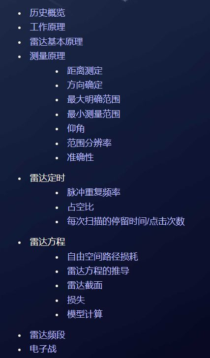
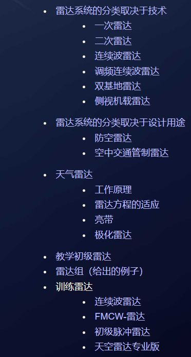
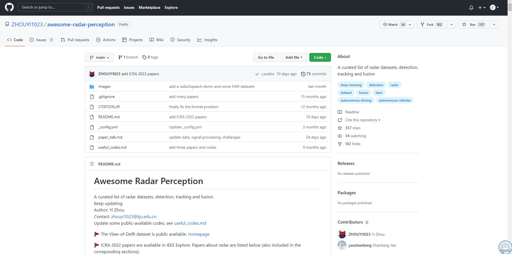
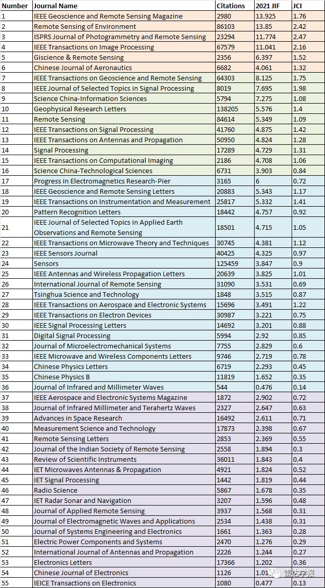
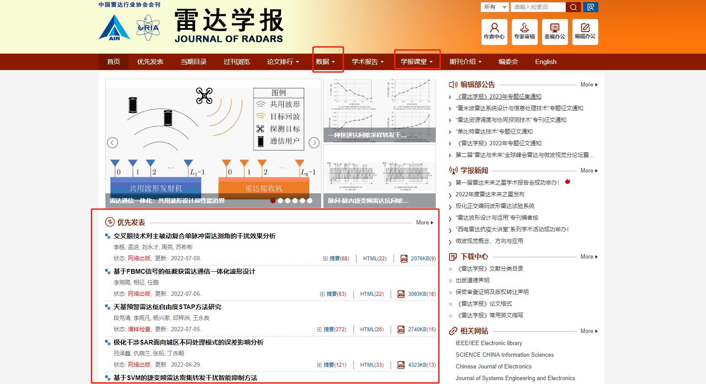
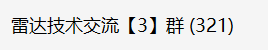
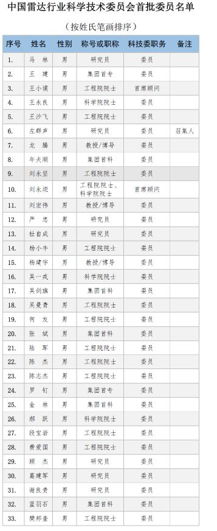

# 毫米波雷达图书

说明：依据不同的传感器，雷达通常有三种类型，即激光雷达、超声波雷达、电磁波雷达，一般“雷达”是指电磁波雷达，而其余两个均要带传感器的类型，**本文所讨论的“雷达”是电磁波雷达**。

本文将总结关于“**雷达学习**”方面的所有资料，包含理论学习、算法仿真、软件实现、论坛与交流空间。

## 一、雷达理论

### 1、雷达技术文章

  
（1）雷达教程网站（[Radartutorial](https://www.radartutorial.eu/04.history/hi04.en.html#this)）

外国人做的雷达教程网站，是纯英文网站，中文版的还在更新中，不过可以借助翻译软件翻译。这个网站的内容比较适合于雷达初学者，下面是部分内容的标题。

（2）[调皮连续波：调皮连续波：毫米波雷达传感器【专栏文章目录】（持续更新！）](https://zhuanlan.zhihu.com/p/433038999)

调皮哥自己写的专栏，不过我自己觉得内容有些杂，不系统，回头我会详细整理一版比较完整的雷达教程推送在我的公众号【调皮连续波】上，感兴趣可以关注。

（3）CSDN: [XXXXiaojie的博客\_CSDN博客-TI实战笔记,TI学习笔记,TI毫米波雷达详解领域博主](https://xxxxiaojie.blog.csdn.net/?type=blog)

CSDN上TI毫米波雷达领域博主，文章很不错。

（4）[lightninghenry的博客\_CSDN博客-TI毫米波雷达代码走读,雷达导论中级篇,雷达导论基础篇领域博主](https://blog.csdn.net/lightninghenry?type=blog)

CSDN上TI毫米波雷达领域博主，文章很不错。

（5）[雷达说的博客\_CSDN博客-Automotive radar 信号处理系列,雷达基础,基本概念领域博主](https://blog.csdn.net/Ray_radar)

CSDN：雷达领域博主。

（6）[叶融茶归](https://www.zhihu.com/people/yao-wei-wei-54)

知乎：雷达领域博主

（7）[qwe14789cn](https://www.zhihu.com/people/qwe14789cn)

知乎：雷达领域博主

（8）[雷达通信电子战](https://www.zhihu.com/people/RadarCommEW)

雷达通信电子战，公众号比较牛。

（9）[Github大佬收集的雷达资料](https://github.com/ZHOUYI1023/awesome-radar-perception)

### 2、雷达学习视频

（1）雷达原理-魏青（[雷达原理【83集】(魏青：西安电子科技大学)\_哔哩哔哩\_bilibili](https://www.bilibili.com/video/av40491265/)）

（2）[调皮连续波：学习资料 | TI毫米波雷达学习网站汇总（雷达初学者必须要知道）](https://zhuanlan.zhihu.com/p/517907333)

（3）雷达学报微信视频号直播讲座

（4）[（英文字幕）MIT雷达系统导论\_哔哩哔哩\_bilibili](https://www.bilibili.com/video/av331447834)

### 3、雷达论文检索

（1）知网检索

（2）sci-hub

（3）雷达学术期刊检索

图片来自：雷达学报公众号

### 4、雷达书籍

（1）[干货 | 这些雷达书籍，你需要收藏~（终极大汇总）](https://mp.weixin.qq.com/s/VAAEivmKgdRyCHLbjlmrpg)

（2）[雷达书籍库](https://mp.weixin.qq.com/mp/appmsgalbum?__biz=MzkxMTMwMTg4Mg==&action=getalbum&album_id=2370582201513394177#wechat_redirect)

## 二、算法仿真

### 1、雷达书籍中的仿真代码

详情请见“雷达书籍”中的相关书籍。

### 2、雷达算法开源代码

下面这些有的是免费开源的，有的是需要会员的，不过价格都还比较公道。

（1）Github\\Gitee

调皮哥个人建议诸位读者多上这两个开源网站学习，无论是代码还是论文，甚至是研究成果的技术文章，都有很多资料可以学习。其实自己通过自己的需求去检索相关的内容，可以快速获得自己想要的东西，不需要在询问别人了。

（2）虫虫源码（[雷达 - 虫虫源码 - 最好最专业的源码资源下载站 让bug不再是bug - bugma.cn](https://www.bugma.cn/index/tag/%E9%9B%B7%E8%BE%BE.html)）

（3）PUDN（[PUDN-363万+编程源码资料-联合开发网-pudn.com](https://www.pudn.com/)）

（4）CSDN（[CSDN - 专业开发者社区](https://www.csdn.net/?spm=1001.2101.3001.4476)）

我对CSDN的评价不是很高，内容很杂乱不说，且资源的质量不高，好多都是从别的地方扒过来的，有的还扒不全，更气人的是扒过来的开源资料在CSDN里面居然要收费，好气人。

（5）[freesourcecode.net](http://freesourcecode.net/)（[http://freesourcecode.net/](http://freesourcecode.net/matlabprojects/71364/circle-fit-in-matlab#.YspLtNpfiUl)）

该网站具有诸多信号处理算法的开源MATLAB代码。  
（6）MATLAB在线（[Matlab在线 - matlabol - 专业的matlab资源下载站](https://www.matlabol.com/)）

## 三、软件实现

### 1、DSP实现

### 2、FPGA实现

### 3、ARM实现

这部分内容暂且没有比较详细、具体的开源资料，后面遇到后分享给大家。

## 四、雷达论坛与交流空间

### 1.雷达学报（[雷达学报](https://radars.ac.cn/)）

雷达学报是国内雷达领域最专业的学术论坛网站，除了论坛网站之外，雷达学报还开办了微信视频号学术讲堂，分享最先进的雷达技术。同时，雷达学报还提供了很多雷达数据集、科普文章等资料。

### 2.雷达技术交流群

调皮哥为了满足雷达研究者的日常交流，特地建立了雷达技术交流群，欢迎感兴趣的读者进入。

### 3.中国雷达行业协会（[中国雷达行业协会](http://www.chinaradar.org.cn/)）

中国雷达行业科学技术委员会首批委员，雷达领域最牛的人物。

### **4.电子发烧友-雷达论坛（[雷达论坛 - 电子发烧友网](https://www.elecfans.com/zt/25756/)）**

### **5.**[毫米波雷达 - 毫米波&亚毫米波 - 微波射频网](https://www.mwrf.net/index.php?m=special&c=index&a=type&specialid=9&typeid=151)

### 6.[雷达的分类及雷达信号处理详解-射频/微波-与非网](https://www.eefocus.com/document/1700)

### 7.[科创 - 发展科技爱好，倡导科学理性](https://www.kechuang.org/)

### 8.[TI E2E support forums](https://e2e.ti.com/support/sensors-group/sensors/f/sensors-forum)

TI毫米波雷达e2e论坛，有关于雷达的问题可以在上面发问。

end~

好了本期的分享就到这里，感谢阅读，如果对你有所帮助，请帮我点个赞。

若还有没有总结出的，还请在评论区留言指出，谢谢大家。
