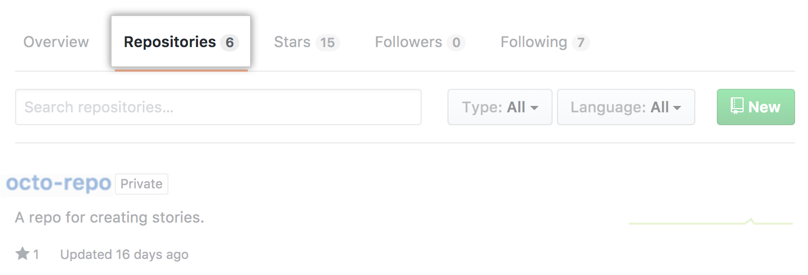
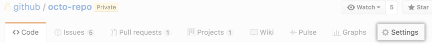
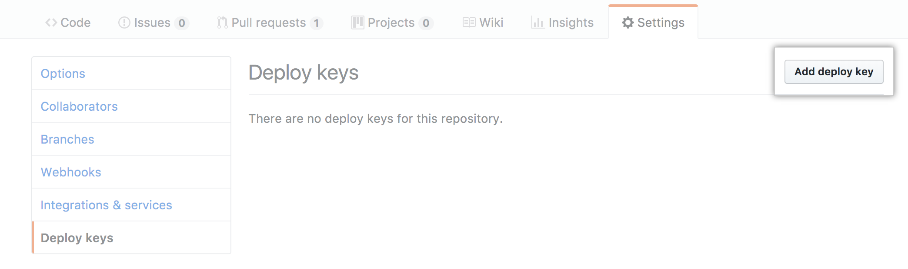
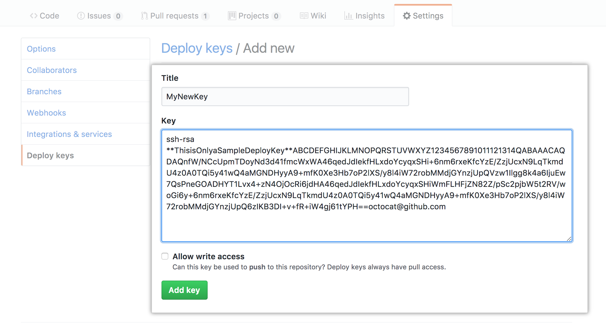
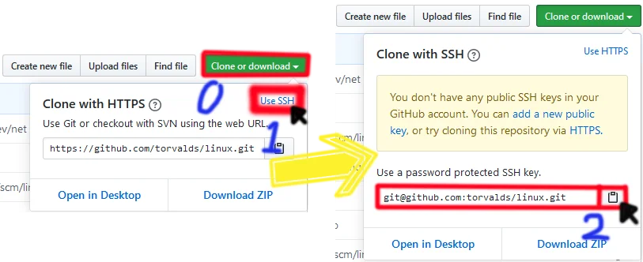

# 添加并使用Deploy Key拉取仓库内容

Deploy Keys(部署密鑰) 作为授予单个存储库的权限的密钥, 可以用作在服务器上(或本地) pull 拉取仓库的授权凭证. 如果在仓库中设置了写权限, 还可以修改仓库的内容. 仓库内容的 clone 目前可以使用 https(账号密码) 或是 ssh(rsa/ecddsa key)的方式.

我之前都一直使用 https 的方式完成 clone 操作. 原因之一是因为我总是觉得 SSH 不太安全. 毕竟对于大多数的情况, 仓库的权限都是读加写的, 但是如果是有了写入权限之后, 一旦密钥丢失或被盗取就可能遭遇风险. 因此我一直是用 https 的方式, 只要保护好密码, 不把密码弄丢, 问题就不大.

### 使用场景

最近我总算遇到了一个 Deploy Keys 的使用场景: 为服务器拉取 GitHub 上托管的网页.

我的这个网站的内容是托管在 GitHub 上的, 但如果我想让仓库变成私人仓库, 而继续使用 https 方式的话, 我每次拉取仓库都会要求输入一次账号和密码(因为异地登陆问题). 这样一来, 即使设置了 crontab 的自动操作, 但是因为需要每次都输入账号和密码, 导致不能正确拉取仓库. 为了解决这个问题, 我只能手动更新服务器上的仓库, 或者让仓库变为公开仓库.

但是这样显然不符合我的心意. 我既不想公开仓库, 也不想手动拉取. 这样一来, 我便试了试 Deploy Keys, 结果发现很适合. 因为仓库既不怕泄露了 SSH 密钥(只有读权限), 又能不公开仓库保持安全和优雅, 同时因为使用密钥就没有登录地点的问题, 就能完成自动拉取了.

### 部署密钥

_此部分内容为 [GitHub Developer - Deploy keys](https://developer.github.com/v3/guides/managing-deploy-keys/#deploy-keys) 的中文 翻译, 如果内容更新请看最新的指南._

您可以使用部署密钥（从SSH密钥授予访问单个存储库的权限）将项目从GitHub存储库启动到您的服务器。GitHub将密钥的公共部分直接附加到您的存储库中，而不是个人用户帐户，密钥的私有部分保留在您的服务器上。有关更多信息，请参见“ 交付部署”。

具有写访问权限的部署密钥可以执行与具有管理员访问权限的组织成员或个人存储库上的协作者相同的操作。有关更多信息，请参阅“ 组织的存储库权限级别 ”和“ 用户帐户存储库的权限级别 ”。

#### 优点

*   有权访问存储库和服务器的任何人都可以部署项目。
*   用户不必更改其本地SSH设置。
*   默认情况下，部署密钥是只读的，但是在将它们添加到存储库时，可以授予它们写访问权限。

#### 缺点

*   部署密钥仅将访问权限授予单个存储库。更复杂的项目可能有许多存储库要拉到同一服务器。
*   部署密钥通常不受密码短语的保护，因此如果服务器受到威胁，则可以轻松访问密钥。

#### 将SSH密钥添加到GitHub帐户

1.  在您的服务器上运行 ssh-keygen，并记住将生成的公用/专用rsa密钥对保存的位置。如果你不清楚如何部署密钥, 请跳转到文章的下一部分 [如何生成密钥](#%E5%A6%82%E4%BD%95%E7%94%9F%E6%88%90%E5%AF%86%E9%92%A5) .
    
2.  在任何GitHub页面的右上角，单击您的个人资料照片，然后单击您的个人资料。 
    
3.  在您的个人资料页面上，单击“ 存储库”，然后单击存储库的名称。 
    
4.  在您的存储库中，点击设置。 
    
5.  在边栏中，点击部署密钥，然后点击添加部署密钥。 
    
6.  提供标题，然后粘贴您的公共密钥。  _注: 添加的密钥为公钥(Public key) 文件后缀名为.pub. 公钥的位置与私钥所在目录一致._
    
7.  如果希望此键对存储库具有写访问权限，请选择“ 允许写访问权限”。具有写访问权限的部署密钥使部署可以推送到存储库。
    
8.  单击添加密钥。
    

### 如何生成密钥

`注: 此部分为` [部署密钥](#%E9%83%A8%E7%BD%B2%E5%AF%86%E9%92%A5) `关于密钥生成和使用的补充说明.`

_此部分内容为 [ssh-keygen](https://help.github.com/en/github/authenticating-to-github/generating-a-new-ssh-key-and-adding-it-to-the-ssh-agent#generating-a-new-ssh-key) 的中文 翻译, 如果内容更新请看最新的指南._

`注意: 此部分内容有分为 Mac/Windows/Linux 三类, 本处仅为` **Linux** `操作介绍. 若使用的是其他平台请点击上方连接.`

如果您還沒有SSH密鑰，則必須生成一個新的SSH密鑰。如果不確定是否已有SSH密鑰，請檢查現有密鑰。

如果您不想在每次使用SSH密鑰時都重新輸入密碼，則可以將密鑰添加到SSH代理中，該代理管理SSH密鑰並記住您的密碼。

#### 生成新的SSH密鑰

*   1.打開Git Bash。
    
*   2.粘貼以下文本，替換為您的GitHub電子郵件地址。
    
    ```plain
    $ssh-keygen -t rsa -b 4096 -C "your_email@example.com"
    ```
    
    使用提供的電子郵件作為標籤，這將創建一個新的ssh密鑰。
    
    ```plain
    > Generating public/private rsa key pair.
    ```
    
*   3.當系統提示您“輸入要在其中保存密鑰的文件”時，請按Enter。這接受默認文件位置。
    
    ```plain
    > Enter a file in which to save the key (/c/Users/you/.ssh/id_rsa):[Press enter]
    ```
    
*   4.在提示符下，鍵入一個安全密碼。有關更多信息，請參閱“使用SSH密鑰密碼短語”。
    
    ```plain
    > Enter passphrase (empty for no passphrase): [Type a passphrase]
    > Enter same passphrase again: [Type passphrase again]
    ```
    

#### 將SSH密鑰添加到ssh-agent

将新 SSH 密钥添加到 ssh-agent 以管理密钥之前，应检查现有 SSH 密钥并生成新 SSH 密钥。

*   1.在后台启动 ssh 代理。
    
    ```plain
    $eval "$(ssh-agent -s)"
    > Agent pid 59566
    ```
    
*   2.将 SSH 私钥添加到 ssh-agent。 如果您创建了不同名称的密钥，或者您要添加不同名称的现有密钥，请将命令中的 id\_rsa 替换为您的私钥文件的名称。
    
    ```plain
    $ssh-add ~/.ssh/id_rsa
    ```
    
*   3.[将 SSH 密钥添加到 GitHub 帐户](#%E5%B0%86SSH%E5%AF%86%E9%92%A5%E6%B7%BB%E5%8A%A0%E5%88%B0GitHub%E5%B8%90%E6%88%B7)
    

### 使用Deploy Key拉取仓库内容

现在进入仓库, 在 clone 的位置选择 SSH 方式克隆仓库试试吧.



1.  点击 Clone or Download
2.  默认是 HTTPS 方式克隆, 点击 Use SSH 切换
3.  点击复制类似 `git@github.com:torvalds/linux.git` 格式的链接
4.  在你的本地或是服务器上使用命令:

```plain
git clone git@github.com:torvalds/linux.git
```

BTW, 我只在我的一个仓库中加入了 SSH key, 因此当我想用 SSH 方式克隆 linux kernel 就出了警告(图中黄色部分). 请无视. 这里只是拿 [torvalds/linux](https://github.com/torvalds/linux) 举个例子, 顺便致敬一下 Linus Torvalds.

`注意: 只有用 SSH 克隆的仓库才能使用 Deploy Key. 如果你的仓库是使用 HTTPS 方式克隆的, 欲使用 Deploy Key, 请先删除仓库再重新用 SSH 方式重新克隆, 才能使用 Deploy Key.`

### 如果拉取失败的话

#### 文件權限很重要

GitHub要求私鑰的文件權限為600或400。請參見上面的示例密鑰。在此示例中，私鑰設置為400，而公鑰設置為600。

#### 私有倉庫

下面的解釋來自於我(Lawrence McDaniel) 個人的經驗。

您必須手動將新主機添加到〜/ .ssh / config中，以描述用於連接到私有GitHub存儲庫的身份驗證參數。SSH配置文件存儲的數據尤其涉及與您的私有存儲庫關聯的私有密鑰。以下是示例主機：

例如仓库克隆 SSH 信息为:

```plain
$git@github.com:torvalds/linux.git
```

該配置應該位於 `~/.ssh/` 中，但是您可能必須使用以下命令自己創建此文件：

```plain
$vim ~/.ssh/config
```

写入内容:

```plain
Host github.com
  HostName github.com
  User git
  IdentityFile ~/.ssh/id_rsa
  IdentitiesOnly yes
```

_注: Host 后的内容对应的是 git@`github`.com:torvalds/linux.git 的名字; HostName 对应内容为 github.com; IdentityFile 对应的是私钥的位置._

参考资料:

*   [GitHub Developer - Deploy keys](https://developer.github.com/v3/guides/managing-deploy-keys/#deploy-keys)
*   [GitHub Help - Generating a new SSH key and adding it to the ssh-agent](https://help.github.com/en/github/authenticating-to-github/generating-a-new-ssh-key-and-adding-it-to-the-ssh-agent#generating-a-new-ssh-key)
*   [Brando - GitHub Deploy Key 的使用](https://www.brando.dev/2019/02/27/GitHub-Deploy-Key-%E7%9A%84%E4%BD%BF%E7%94%A8/)
*   [Lawrence McDaniel - Search for: Deploy From a Private Github Repo](https://blog.lawrencemcdaniel.com/deploy-from-a-private-github-repo/)
