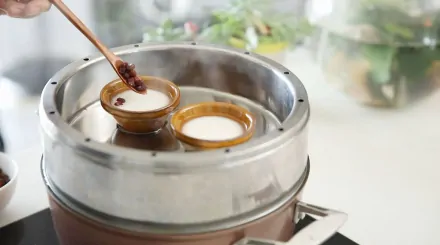

# 钵仔糕

收藏

[858](javascript:)

165

钵仔糕（Bowl Rice Pudding），是[广东](https://baike.baidu.com/item/%E5%B9%BF%E4%B8%9C?fromModule=lemma_inlink)省的地方特色传统糕点之一。

其主料是[粘米粉](https://baike.baidu.com/item/%E7%B2%98%E7%B1%B3%E7%B2%89/9019126?fromModule=lemma_inlink)或澄粉、[木薯淀粉](https://baike.baidu.com/item/%E6%9C%A8%E8%96%AF%E6%B7%80%E7%B2%89/726083?fromModule=lemma_inlink)，以爽滑可口、口味丰富著称。

钵仔糕可以分成两大类：老式钵仔糕和[水晶钵仔糕](https://baike.baidu.com/item/%E6%B0%B4%E6%99%B6%E9%92%B5%E4%BB%94%E7%B3%95/11063015?fromModule=lemma_inlink)。

老式钵仔糕在以前比较多，现在多见的是水晶钵仔糕。

中文名

钵仔糕

外文名

Bowl Rice Pudding

分    类

广东小吃，甜品小食，糕点，[粤菜](https://baike.baidu.com/item/%E7%B2%A4%E8%8F%9C/306654?fromModule=lemma_inlink)

口    味

甜、咸

主要食材

[粘米粉](https://baike.baidu.com/item/%E7%B2%98%E7%B1%B3%E7%B2%89/9019126?fromModule=lemma_inlink)，[澄面](https://baike.baidu.com/item/%E6%BE%84%E9%9D%A2/9484375?fromModule=lemma_inlink)，木薯淀粉，白糖，清水

特    点

爽滑可口、口味丰富

地    区

广东地区

种    类

老式钵仔糕、[水晶钵仔糕](https://baike.baidu.com/item/%E6%B0%B4%E6%99%B6%E9%92%B5%E4%BB%94%E7%B3%95/11063015?fromModule=lemma_inlink)

## 目录

1.  1 [菜品源流](#1)
2.  ▪ [典故传说](#1_1)
3.  ▪ [菜品发展](#1_2)

1.  2 [菜品制作](#2)
2.  ▪ [食材原料](#2_1)
3.  ▪ [制作方法](#2_2)

1.  3 [菜品种类](#3)
2.  4 [社会评价](#4)

## 菜品源流

[编辑](javascript:) [播报](javascript:)

### 典故传说

**起源一说**

[

食品图片(19张)

](https://baike.baidu.com/pic/%E9%92%B5%E4%BB%94%E7%B3%95/2162509/2920458875/109eb7ece2e9ce6b63d09fec?fr=lemma&fromModule=lemma_content-image&ct=cover "食品图片")传统的钵仔糕为[广东](https://baike.baidu.com/item/%E5%B9%BF%E4%B8%9C?fromModule=lemma_inlink)小吃之一。首创于广东省[台山县](https://baike.baidu.com/item/%E5%8F%B0%E5%B1%B1%E5%8E%BF?fromModule=lemma_inlink)，已有数百年的历史。

清朝咸丰间（公元1851—1861年）成书的《台山县志》载：“钵仔糕，前明士大夫每不远百里，泊船就之。”

其实，当时驰名者只一家，在华丰迂桥旁，河底有石，沁出清泉，其家适设石上，取以洗糖，澄清去浊，以钵盛而蒸之，非他人所用。

故后人采用钵仔来蒸糕之法一直传下来，成就如今的广东钵仔糕，以至风靡全国，甚则海内外。 \[5\] 

**起源二说**

 钵仔糕

钵仔糕是从[香港](https://baike.baidu.com/item/%E9%A6%99%E6%B8%AF/128775?fromModule=lemma_inlink)流行起来的一种小甜点，是广东特色传统小吃，是一种深受年轻人和小朋友喜爱的甜品，做出来的成品糕体晶莹雪白，表层油润光洁、细腻嫩滑，质爽软件而润滑、味甜洌而清香，吃起来有粘韧性(筋道)而不粘牙，且有多种风味可供选择，如:相思红豆味、草莓味、水蜜桃味、葡萄干味、香芋味、玉米味、苹果、[椰丝](https://baike.baidu.com/item/%E6%A4%B0%E4%B8%9D?fromModule=lemma_inlink)、[菠萝](https://baike.baidu.com/item/%E8%8F%A0%E8%90%9D?fromModule=lemma_inlink)等十几种口味。

钵仔糕因巨星[刘青云](https://baike.baidu.com/item/%E5%88%98%E9%9D%92%E4%BA%91?fromModule=lemma_inlink)和[袁咏仪](https://baike.baidu.com/item/%E8%A2%81%E5%92%8F%E4%BB%AA?fromModule=lemma_inlink)主演的《[新不了情](https://baike.baidu.com/item/%E6%96%B0%E4%B8%8D%E4%BA%86%E6%83%85/8649428?fromModule=lemma_inlink)》而一炮走红。

现今在全国各大城市已经开始流行，吃的人越来越多，卖的人也越来越多。

它晶莹剔透、爽滑可口、弹齿、不沾牙、时尚、口味丰富、适合各种年龄的消费人群。

**起源三说**

钵仔糕来自古代的农村，当时的人以[白米](https://baike.baidu.com/item/%E7%99%BD%E7%B1%B3?fromModule=lemma_inlink)磨浆制成的钵仔糕、[白糖糕](https://baike.baidu.com/item/%E7%99%BD%E7%B3%96%E7%B3%95?fromModule=lemma_inlink)等当甜品。原来以[瓦钵](https://baike.baidu.com/item/%E7%93%A6%E9%92%B5?fromModule=lemma_inlink)盛着，后来才演变成以碗仔盛，大一倍的钵仔糕。

### 菜品发展

传统老式[钵仔糕](https://baike.baidu.com/item/%E9%92%B5%E4%BB%94%E7%B3%95?fromModule=lemma_inlink)21世纪已经很少见了，街边看到的大多都是透明不那么厚实的[钵仔糕](https://baike.baidu.com/item/%E9%92%B5%E4%BB%94%E7%B3%95?fromModule=lemma_inlink)。传统[钵仔糕](https://baike.baidu.com/item/%E9%92%B5%E4%BB%94%E7%B3%95?fromModule=lemma_inlink)吃上去感觉更加地满足实在。

广州还有其他传统[钵仔糕](https://baike.baidu.com/item/%E9%92%B5%E4%BB%94%E7%B3%95?fromModule=lemma_inlink)的店面，当然，[钵仔糕](https://baike.baidu.com/item/%E9%92%B5%E4%BB%94%E7%B3%95?fromModule=lemma_inlink)并非广州独卖，澳门、香港等地也有出名的店铺。

## 菜品制作

[编辑](javascript:) [播报](javascript:)

### 食材原料

[水晶钵仔糕](https://baike.baidu.com/item/%E6%B0%B4%E6%99%B6%E9%92%B5%E4%BB%94%E7%B3%95?fromModule=lemma_inlink)制作简单易行，凡识字者详细阅读本资料，完全理解后即可制作成型，现将其配方与操作工艺介绍如下：

**一、原料：**

1、钵仔糕粉（在食品添加剂商店有售）；

2、水果浓浆（也可用浓缩果汁）；

3、[白砂糖](https://baike.baidu.com/item/%E7%99%BD%E7%A0%82%E7%B3%96?fromModule=lemma_inlink)；

4、洁净饮用水；

5、[绿豆](https://baike.baidu.com/item/%E7%BB%BF%E8%B1%86?fromModule=lemma_inlink)或[红豆](https://baike.baidu.com/item/%E7%BA%A2%E8%B1%86/7038?fromModule=lemma_inlink)等辅料。

**二、制作工具：**

1、[液化气](https://baike.baidu.com/item/%E6%B6%B2%E5%8C%96%E6%B0%94?fromModule=lemma_inlink)灶（节约成本也可用蜂窝煤炉）；

2、[铁锅](https://baike.baidu.com/item/%E9%93%81%E9%94%85?fromModule=lemma_inlink)；

3、[蒸笼](https://baike.baidu.com/item/%E8%92%B8%E7%AC%BC?fromModule=lemma_inlink)（如蒸馒头的普通蒸笼即可）；

4、塑料盒筐（送货可用装蛋糕用的普通塑料筐，售卖可用塑料盒盘）；

5、专用钵仔碗（可代购）；

6、有嘴的水壶与塑料盆桶等盛装容器。

**三、配方：**

以钵仔糕粉500克（1斤）为例，白砂糖100-150　克（2-3两），如制绿豆或[红豆糕](https://baike.baidu.com/item/%E7%BA%A2%E8%B1%86%E7%B3%95?fromModule=lemma_inlink)需250-300克左右，水1100克（2.2斤）或1200克（2.4斤），水果浓浆10克（有果味即可），现举例如你第一次试验：可用钵仔糕粉50克（1两），白砂糖10--15克（2-3钱），水110克，水果浓浆1克。

*   
*   

玉米钵仔糕

### 制作方法

*   **做法一**
    

**所需食材**

粘米粉25g，澄米粉10g，木薯粉75g，清水240g，细砂糖75g，芒果肉适量，百香果肉适量，蔓越莓干适量，干桂花适量，红豆适量。 \[6\] 

**制作步骤**

| 
步骤

 | 

具体操作

 | 

步骤图

 |
| --- | --- | --- |
| 

步骤1

 | 

百香果对半切开，取其果肉。

 | 

 |
| 

步骤2

 | 

芒果果肉对半切开，去皮去核，切粒备用。

 | 

 |
| 

步骤3

 | 

蔓越莓干切成小块。

 | 

 |
| 

步骤4

 | 

桂花干温水泡开，冲洗干净，捞起备用。

 | 

 |
| 

步骤5

 | 

粘米粉、澄面粉、木薯粉分别加入碗中混合均匀，加入140g的清水搅拌至无粉粒的粉浆。

 | 

 |
| 

步骤6

 | 

锅中倒入细砂糖和140g的清水加热，用勺子搅拌至完全融化并煮腾。

 | 

 |
| 

步骤7

 | 

把煮沸的糖水迅速倒进粉浆中与粉浆搅拌均匀，把生浆烫成熟浆。

 | 

 |
| 

步骤8

 | 

用刷子在砵仔碗內刷点色拉油，以便脱模。

 | 

 |
| 

步骤9

 | 

将切好的芒果果肉、冲洗干净的桂花和百香果果肉放入碗中。

 | 

 |
| 

步骤10

 | 

倒入粉浆，并轻轻搅拌均匀。

 | 

 |
| 

步骤11

 | 

水烧开后后放上钵仔，大火蒸至10分钟后转小火再蒸15分钟。这样蒸出来的钵仔糕表面才是平整的，不会有明显的凹洞。

 | 

 |
| 

步骤12

 | 

由于蜜豆和蔓越莓干容易沉底，所以先将粉浆倒入碗中。

 | 

 |
| 

步骤13

 | 

水烧开后后放上钵仔。

 | 

 |
| 

步骤14

 | 

大火蒸至碗中中间凹陷，將中间凹陷部分填入紅豆和蔓越莓干，再继续蒸10-12分钟至熟。

 | 

 |
| 

步骤15

 | 

完全蒸熟后，拿出来放凉后就可以脱模食用了。

 | 

 |
| 

步骤16

 | 

成品图

 | 

 |

*   **做法二**
    

**制作步骤**

| 
步骤

 | 

具体操作

 |
| --- | --- |
| 

步骤1

 | 

把原料按比例配方称好，先取配方中三分之一的水烧开搅拌溶化白砂糖，待凉后与余下的三分之二的水混匀后，倒入装有钵仔糕粉的容器中，边倒边搅拌，直至完全搅拌均匀为止，然后加入极少量的水果浓浆或浓缩果汁搅匀即成粉浆待用。如制作绿豆或红豆糕可不加果味。

 |
| 

步骤2

 | 

在制作钵仔糕粉浆前，应在蒸笼的铁锅内放适量水烧开。蒸笼中放上钵仔碗，锅中水烧开后关微火待用。

 |
| 

步骤3

 | 

把配好的钵仔糕粉浆再搅拌后立即装入有嘴的手提水壶中，迅速倒入[蒸笼](https://baike.baidu.com/item/%E8%92%B8%E7%AC%BC?fromModule=lemma_inlink)中各个钵仔碗内，每个钵仔碗内倒入八成满，中途应抖动、晃动水壶，以免壶中粉浆沉淀。每个蒸笼中的钵仔碗装完粉浆后，即可加蒸笼盖用中小火，一笼大约蒸15分钟左右，两笼大约20分钟左右，三笼大约25分钟，四笼大约30分钟，五笼大约35分钟。 \[4\] 

 |

*   **做法三**
    

**食材准备**

粘米粉六两，澄面三两，红豆六两，片糖八两，水四杯。

**制作步骤**

| 
步骤

 | 

具体操作

 |
| --- | --- |
| 

步骤1

 | 

红豆用清水浸三小时后，隔水蒸淋。

 |
| 

步骤2

 | 

粘米粉与澄面混合，以筛隔匀。徐徐加入1杯半清水开成糊状。

 |
| 

步骤3

 | 

片糖以2杯半清水煮溶后，与红豆一同加入粉糊中拌匀。

 |
| 

步骤4

 | 

将准备好水粉糊倒入已扫油之碗内，猛火蒸二十分钟即成。 \[1\] 

 |

 钵仔糕

*   **做法四**
    

**西米钵仔糕**

**食材准备**

[粘米粉](https://baike.baidu.com/item/%E7%B2%98%E7%B1%B3%E7%B2%89?fromModule=lemma_inlink)160克，糖140克，西米30克，清水1又1/4杯，椰汁1杯。

**制作步骤**

| 
步骤

 | 

具体操作

 |
| --- | --- |
| 

步骤1

 | 

将椰汁及1/4杯水混合加入粘米粉中搅和成稀浆；

 |
| 

步骤2

 | 

将一杯清水及糖溶慢慢撞入粉浆中；

 |
| 

步骤3

 | 

西米用水煮至半透明，然后在冷水中稍微冲洗；

 |
| 

步骤4

 | 

将西米加入米浆拌匀；

 |
| 

步骤5

 | 

小碗先蒸热然后加入粉浆蒸6分钟即可。

 |
| 

步骤6

 | 

凝结成水晶状。（如在夏天食用，可放进冰箱冷冻效果更佳！） \[1\] 

 |

*   
*   
*   
*   
*   
*   
*   
*   
*   
*   
*   
*   
*   

西米水晶钵仔糕

*   **做法五**
    

**食材准备**

[粘米粉](https://baike.baidu.com/item/%E7%B2%98%E7%B1%B3%E7%B2%89?fromModule=lemma_inlink)100克、糯米粉半汤匙、澄面粉75克、[砂糖](https://baike.baidu.com/item/%E7%A0%82%E7%B3%96/4567310?fromModule=lemma_inlink)或[红糖](https://baike.baidu.com/item/%E7%BA%A2%E7%B3%96/26808?fromModule=lemma_inlink)100克、水二杯约500毫升、浸透红豆三汤匙、油少量、竹签数支 。

**制作步骤**

<table log-set-param="table_view" data-sort="sortDisabled"><tbody><tr><td width="76" height="30">
步骤
</td><td width="644" height="30">
具体操作
</td></tr><tr><td width="76" height="30">
步骤1
</td><td width="644" height="30">
红豆置沸水内用慢火煮透沥干候用
</td></tr><tr><td width="76" height="30">
步骤2
</td><td width="644" height="30">
将粉料筛匀，用半杯水拌匀成稠糊
</td></tr><tr><td width="76" height="30">
步骤3
</td><td width="644" height="30">
将余下之1.5杯水煮沸，加入砂糖或红糖煮溶，趁热撞入粉浆中，搅成滑粉浆。
</td></tr><tr><td width="76" height="30">
步骤4
</td><td width="644" height="30">
体仔扫油，将粉浆倒入钵仔内至九分满,加入<a target="_blank" href="https://baike.baidu.com/item/%E7%BA%A2%E8%B1%86/7038?fromModule=lemma_inlink" data-lemmaid="7038" data-log="text" referrerpolicy="no-referrer" rel="noopener noreferrer">红豆</a>，用大火蒸20分钟后取出，稍候片刻才用竹签挑出即可。
</td></tr><tr><td width="76" height="30">
步骤5
</td><td width="644" height="30">
凝结成水晶状。（如在夏天食用，可放进冰箱冷冻效果更佳！） [1]<a class="sup-anchor" name="ref_[1]_119846" data-log="text" data-mx-warn="Empty URL">&nbsp;</a>
</td></tr></tbody></table>

 钵仔糕

*   **做法六**
    

**蜜豆钵仔糕**

**所需材料**

主料：钵仔糕粉

辅料：清水、细砂糖、[自制蜜豆](https://baike.baidu.com/item/%E8%87%AA%E5%88%B6%E8%9C%9C%E8%B1%86?fromModule=lemma_inlink)

**制作步骤**

| 
步骤

 | 

具体操作

 |
| --- | --- |
| 

步骤1

 | 

钵仔糕粉加一半清水调成粉浆.

 |
| 

步骤2

 | 

糖加另一半清水煮成糖浆.

 |
| 

步骤3

 | 

两种浆趁热混合,形成生熟粉,防止粉浆沉淀.

 |
| 

步骤4

 | 

倒入钵仔碗中,洒上[蜜红豆](https://baike.baidu.com/item/%E8%9C%9C%E7%BA%A2%E8%B1%86?fromModule=lemma_inlink).

 |
| 

步骤5

 | 

开火上锅,大火蒸8-10分钟呈透明色.

 |
| 

步骤6

 | 

凉后用牙签转一圈,脱模即可. \[2\] 

 |

*   **做法七**
    

**玉米钵仔糕**

**所需材料**

主料：[澄粉](https://baike.baidu.com/item/%E6%BE%84%E7%B2%89?fromModule=lemma_inlink)40克，[红糖](https://baike.baidu.com/item/%E7%BA%A2%E7%B3%96?fromModule=lemma_inlink)50克，[玉米](https://baike.baidu.com/item/%E7%8E%89%E7%B1%B3/18401?fromModule=lemma_inlink)适量

调料：[水](https://baike.baidu.com/item/%E6%B0%B4?fromModule=lemma_inlink)250毫升

**制作步骤**

| 
步骤

 | 

具体操作

 |
| --- | --- |
| 

步骤1

 | 

用100ML清水开粉（澄面和马蹄粉一起）。

 |
| 

步骤2

 | 

另外将剩下的150ML的热水加红糖煮开，然后倒入之前弄好的粉浆中。

 |
| 

步骤3

 | 

加上预先煮熟的玉米，放入模中，大约蒸15分钟左右就OK啦 \[3\] 

 |

*   
*   
*   
*   
*   

钵仔糕

## 菜品种类

[编辑](javascript:) [播报](javascript:)

钵仔糕品种有：红豆、绿豆、哈密瓜、菠萝、巧克力、香蕉、水蜜桃、草莓、百香果等等。

## 社会评价

[编辑](javascript:) [播报](javascript:)

以款式多样和口感“烟韧”著名的钵仔糕，和大多数美食一样都有一些独特的意义。

“烟韧”这个粤语词除了形容食物有韧性不易断，还有一层意思，那便是用来形容情侣的恩爱、亲密。所以钵仔糕也成了情侣拍拖时常吃的小吃。

[词条图册

更多图册

](https://baike.baidu.com/pic/%E9%92%B5%E4%BB%94%E7%B3%95/2162509?fr=lemma)

参考资料

*   1    [钵仔糕的做法](https://baike.baidu.com/reference/2162509/eab8m_Fhn6NCJUTXvwrSuZBtgdXp05s51JhtxCsME1zamL4aJxa_yGsNw6rqV3rM_7_NyHOWthDEkLxBohaw8ITB-ZvI_nz09aHyB6zg2K4Q)  
*   2    [蜜豆钵仔糕做法](https://baike.baidu.com/reference/2162509/9de2ZJduURYnb2WTD38VUtbrW90TNVKmkaNdpvmfUBLDyRZ4VH9DyMIkF3rY1z6-lEF-v-tuxCYdjJwT5nmFkIPf_wnJc_8)   ．豆果网\[引用日期2013-09-26\]
*   3    [玉米钵仔糕](https://baike.baidu.com/reference/2162509/780baqVQlEIwS57XWPv7hoqLazAGkodfOok6h3DK0PgnRV5J7hhWiKl434Pl2M75e5FO-DtZsYUJ7ckZrB9qfmjm_b0XfwIa8FM)   ．美食杰\[引用日期2014-04-09\]
*   4    [钵仔糕的制作配方和工艺](https://baike.baidu.com/reference/2162509/a3a7QNl53hWehkQ6iI7IpseK_dwV2S6CtHpS87Vg6oU7DfZ51y4fA70FRy-uwVb_n8sMSINjkNRDqEt9CnzDL5zgTKq3LSTUK_bbWefdKKRhpgw)   ．中国吃网\[引用日期2013-06-17\]
*   5    [钵仔糕的由来](https://baike.baidu.com/reference/2162509/cb1cPdAYQ4QDiPky4NGxuFkK4KzsxmkxCMPFoMYmOC18FUKX0MHEmgdATja5IKDC0JWoKXLsPVM3cJha83dLO4TfhFy6IZ6IlZdYgC7YLLptSg)  
*   6    [钵仔糕怎么做](https://baike.baidu.com/reference/2162509/57fc1w1PrS8ozeVGH2RzfJZmt3rcN-zlhz91nGdZ7mzqYiMbF1QKzDfoe8DiLUzJpt8hQBpHbkShhx8hIB0ACCii-ANft21aZw)   ．豆果美食\[引用日期2021-03-18\]
