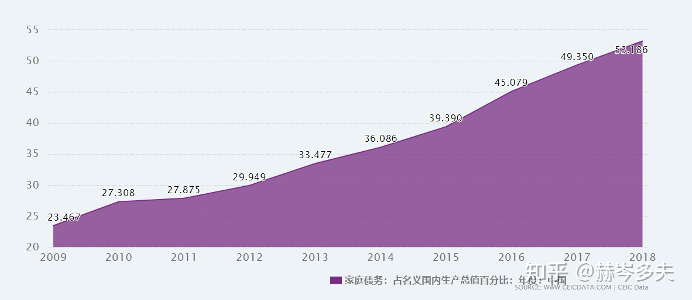
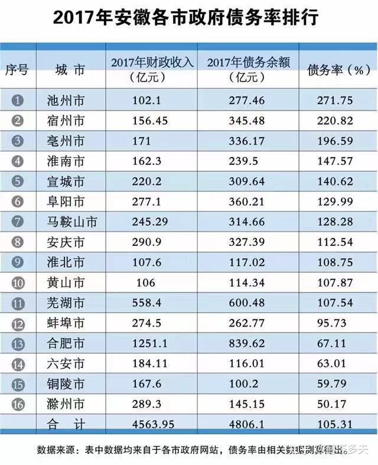
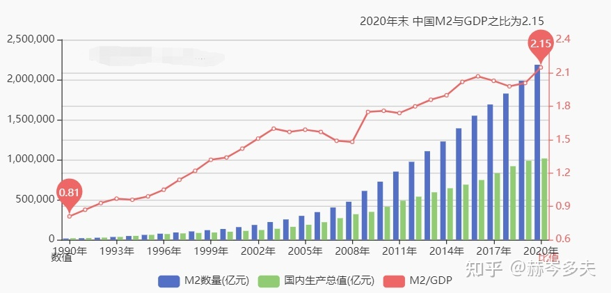
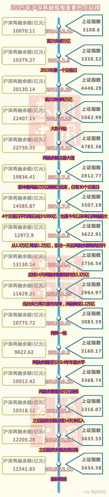
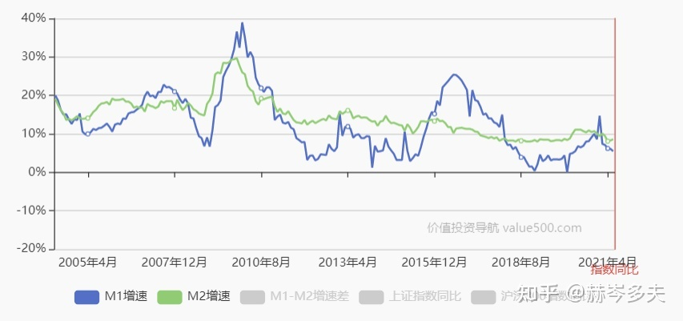
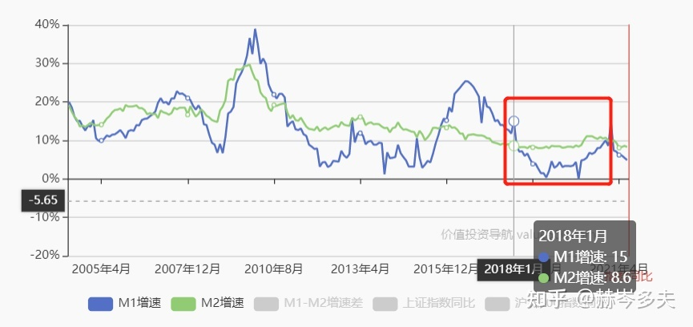

**前文：**本人工作至今已十余年，目前在一家国营贸易型企业，同时为该企业的二级单位负责人。我本人是工科出身，经济学（尤其是宏观经济学）并非是我的专长。但由于从事铁矿石、钢铁行业多年，是中国经济中广大基层工作者的其中一员，不可避免的和各位一样都对中国经济的真实情况产生了极大的兴趣，因此在同事、朋友及领导的帮助下，辅助以网上大量的资料和数据，通过自己的思考和推理产生了一些谬论，供各位看官指正。需要指出的是，本文不可避免的会有一些和你认知中的中国经济情况并不相符的观点，还请各位能够冷静看待。**如果你认为我错了，请你指出我的具体错误并帮助我改正；如果你认为我正确，但你并不爱听，也请你手下留情，慢点举报。**毕竟忠言逆耳利于行，良药苦口利于病，**我和你一样都希望中国经济能够蓬勃发展**，老百姓和打工人都能够生活的蒸蒸日上。但想实现这个目标，讳疾忌医、鸵鸟政策是不行的。首先我们得知道问题在哪，才谈得上改正。**2008年国际金融危机后的中国策略**想要搞清楚当前中国经济的情况，我不得不先要科普一下中国经济的前世今生。由于我本人参加工作在2008年，而2008年恰恰是中国经济的一个重要分水岭，因此我将首先通过2009年发生在中国经济系统中的大事——四万亿刺激政策，来给各位观众老爷们梳理一下中国经济自2009年以来的发展动能。在2009年中国发生了一件尽人皆知的事件，由于2008年国际金融危机的发生，中国经济在08年四季度受到了严重的冲击：进出口总值出现负增长、第二产业的增长率下降到了6.1%的低位、同时第三产业也出现明显回落，增长率来到了7.4%。在政府工作报告中对此次危机明确指出：**这场危机来势之猛、扩散之快、影响之深，百年罕见。**中国经济的GDP增速在08年四季度下降了4个百分点，形势不容乐观。为了避免中国经济“硬着陆”，中国推出了进一步扩大内需、促进经济平稳较快增长的十项措施。初步匡算，实施这十大措施，到2010年底约需投资4万亿元，这就是所谓的“四万亿刺激政策”的发生背景。为了避免行文枯燥，影响各位阅读，这十大措施我不一一罗列了。简而言之，主要的措施都是在政府主导的工程投资领域的重大举措。如果玩过Paradox公司出品的Victoria系列游戏，可以把他看作是国家资本主义政府的投资行为，而践行这些投资行为需要的资金大约就是4万亿。这里我要引入**第一个想讲的概念：四万亿从来不止是四万亿**。所谓的四万亿刺激计划是一个象征，他代表了中国的货币政策更加的激进，发行量从这一年开始也显著增加。我们来看一张表格：年份当年末M2指标值（亿元）当年发行货币量（亿元）2007年40.34万亿5.79万亿2008年47.52万亿7.18万亿2009年61.02万亿13.50万亿以上数据是公开数据，可以互联网上随意搜到，欢迎各位核实。换句话说，自2009年四万亿刺激政策推出以后，整个中国的金融体系在国家的鼓励和支持下，辅以央行的多种政策工具，全年发行的货币量超过了07年和08年的总和，更远远超过了四万亿刺激计划中的数据。在这里我不会做基础经济学知识的科普，默认所有阅读本文的读者都对经济学的知识有一定基础认知。因此如上文所述，2009年可谓是中国“货币超发元年”，不断扩张的货币从2009年起刺激着中国经济蓬勃发展，大量落后的城市基础设施得到了改善，高铁的建设也改善了原本并不太方便的省际交通，因国际金融环境恶化而面对危机的中国制造业也得到了流动性的注入，扛过了最困难的时候。在现实生活中认识我的人都知道，我从不批评2009年的四万亿刺激政策，政策出台对于当时的中国经济来说是必要和合理的，结果来看也达到了该政策设计的初衷。我想表达的是**第二个问题，即自2009年起不断超发和扩张的货币政策，最终都流向了哪里**。在陈述这个问题之前，我要先阐述一个基础观点，即**现代货币总量的扩张（即老百姓所谓的“印钞”），本质是信用的扩张**。我通过一个例子来详加说明：假设有A、B、C三家企业同时向银行申请贷款，毫无疑问银行要审核三家申请企业的资质情况。根据最终审查结果，A企业得到了最高分85分，B企业稍差但也有70分，C企业被银行认为经营情况不佳，仅仅得到了60分。在2009年以前，假设该银行规定70分以下得企业银行不得对其批复贷款（当然，实际并不是这么简单的一刀切，我仅为说明而简化举例），那么上述例子里A、B两家企业可以得到银行批复的贷款，并且A>B，而C企业很不幸没有获得贷款。但在2009年后，由于前文所述全年的货币总供应量提升了，这意味着商业银行从央行获得了更多的的货币。对银行来说，货币是负债，贷款是资产。现在货币供应多了，如果没有更多的资产去匹配负债，银行自己的资产负债率就会提升。但是符合前文银行“70分标准”的企业总量不多（甚至因外部环境的变化变得更少了），所以银行不得不降低门槛，要么将评分标准放宽，要么将允许贷款的分数线降低，以便向企业提供更多的贷款。这个评分标准降低的过程，意味着银行愿意承担比以前更大的风险，也就是**银行的风险偏好提高了**，同时也意味着**社会的整体信用得到了扩张**（以前没信用的变有信用，以前低信用的变高信用）。在明白这个概念以后，我们再来做一个假设。假设读者你是某家银行的行长，你的下属向你汇报有A、B、C三家企业来向你申请贷款，其中A企业是某央企的二级公司，B企业是某著名头部房地产公司，C企业是某著名制造企业，你会给谁更多的贷款呢？  根据银行的审贷原则，申请贷款的企业要么银行认为该企业完全没有风险，对其进行无抵押贷款；要么提供抵押物（或者其他企业的担保，等价于抵押物）来进行抵押贷款。根据这个原则我们来看这三家企业：A企业作为央企，背后有国家信用做背书，毫无疑问在【信用】的金字塔上处于塔尖的为止；B企业是著名房地产开发商，他虽然是一家民企，但是他拿他的土地和开发的房产做抵押。听起来这两样抵押物都是很棒的，不仅贬值的可能性极低，而且流动性很强，想要出手随时可以出手；C企业则很遗憾，他提供的抵押物是他的厂房、设备。作为一家银行的负责人，你并不太了解产业，在你看来这些设备虽然是德国进口的，但和废铁无异。这么一梳理结果似乎就很明确了，如果每一个金融从业者都是对自己负责的，那他毫无疑问**首选央国企，其次是能够提供有价值抵押物的房地产企业，最后才轮到制造业和其他无法提供有价值抵押物的企业**。在信用体系里，房地产行业是最特殊的，因为只有**房地产行业天然生产信用**。他的产品就是最好、最强的抵押物。也正因此，超发的天量货币向着国央企和房地产企业汹涌流去，就是非常自然的事情了。同样的一组数据可以证明这个观点：年份当年土地成交总金额（万亿元）2008年0.962009年1.592010年2.71以上数据同样来源于网络，是公开的数据，如有疑问请自行查阅。通过以上数据毫无疑问可以看到，正是因为有着天量货币的加持，房地产企业才可以从2009年起疯狂的跑马圈地，土地成交金额也因此水涨船高。而随着房地产行业的蓬勃发展，上至建筑设计、钢材水泥需求、建筑施工、物流运输；下到家电装修、物业服务、餐饮商业等领域都因此获得了更多的订单。而政府财政收入随着土地出让金猛涨而产生了显著的增加，加之政府通过城投公司、地方政府融资平台等方法利用国家信用同样获得了大量的资金（后文会讲到），各地政府变得更有余力去投资基础设施项目，这同样给与上述各行业更广阔的业务机会。可以说2009年起，**政府的基础设施投资以及房地产行业成为了中国经济回到正轨并快速增长的双驱动引擎**，围绕这两个引擎，整个中国的经济活动变得更加频繁，2008年的金融危机也得到了克服，重新走上了蓬勃发展的道路。第一部分暂且到这里，如果有人看，接下来我会来讲述中国经济第二和第三个周期，即2011年至2019年的情况。欢迎大家多提宝贵意见。**2. 货币扩张产生的隐忧**2009年是中国“货币超发元年”，大量货币流入市场的好处相信不用我赘述，其对经济的刺激作用是各位读者实打实能够感受得到的。在这第二部分的开始，我想讲讲**货币超发带来的副作用**。第一点就是中国整体**债务率的上升**。社会整体流通的货币的扩张，本质上是融资人在承诺支付一定利息的前提下，以未来的收入做抵押，提前支出这部分未来的收入（当然这个过程取决于融资人在金融机构的信用，这和我们之前说的“信用的扩张”并不矛盾）。拿房地产行业举例子，在整个商品房开发的过程中，所有的企业都只是货币扩张的二传手。开发商向银行借钱，购地、建设、营销最后完成销售，就可以实现货币的回笼最终偿还给银行（当然这是极端理想情况，请勿抬杠）。只有一个环节是**未来的真正透支者**，那就是——**商品房的购买者**。购买者通过银行按揭贷款的形式，向银行透支了20至30年不等的未来收入，实际上房地产开发商向银行的借款化整为零，通过一个个商品房按揭合同转嫁给了商品房的购买者，并由他们最终承担起了货币扩张的重担。这里我要用家庭收入占GDP比重来说明居民负债对货币超发究竟有多大。如下图所示，家庭债务在过去的12年里占GDP的比重越来越高。我数据仅仅节选到了2018年（因为数据库到期了，哈哈），而同样的数据到2021年已经超过了60%以上。同样的情况也发生在政府主导的投资上。政府以未来的财政收入作为担保，在愿意支付一定利息的前提下，提前支出了未来的收入用来进行基础设施建设。可能各位读者无法想象在“货币超发元年”的2009年至2011年这三年里，地方政府举债有多么的容易和无序，大量的货币通过地方政府成立的一个个融资平台流向了地方政府，并转化为了今天日新月异的城市建设。客观的说，这种野蛮生长确实起到了促进各地经济发展的作用。在这里我必须要指出，我虽然通过家庭负债率和政府负债率两个角度，描述了2009年以后中国债务率整体上升的情况，但我始终**不认为债务率上升是一个问题**。有投资经验和企业管理经验的读者一定能够明白，适度的举债对于公司和财产的保值增值是可以起到事半功倍的作用的。**有问题的是过度举债**，而这很不幸恰恰发生在了当时的中国。家庭和个人的过度举债相信不用我赘述，各位读者在质疑这点的时候请摸一摸自己被房贷和按揭掏空的，干瘪的六个钱包，想想自己年轻时种种小布尔乔亚的理想和爱好以及自己目前骨感的现实就能理解过度举债的副作用。比过度举债更可怕的是他带来了一种恶性循环：随着房价的起飞，商品房不仅满足了中国人自古以来的“安家置业”的美好愿望，同时也成为了全社会最好的投资品。越来越多的人选择举债购房，这不仅锁死了中国家庭未来的部分可支配收入，同时也带动了房地产价格的快速上涨；而房价快速上升，使得商品房作为抵押物的价值越来越高，银行也越来越倾向于将资金通过各种途径配置给房地产发商；开发商获得了更多的资金，整个房地产行业的投资和经营就会更活跃；最后也就更吸引新的投资者来透支未来，替开发商偿还银行的债务。在这个循环中，**家庭、社会和经济被房地产行业深度绑定，整个中国经济对房地产的依存度也就越来越高**。同样的问题出现在地方政府的基础设施投资上，而且这个问题更加严重。建设这些值得我们为自己家乡骄傲的基础设施项目同样需要支付建设资金，按各地政府原有的财政收入能力，不是所有的地方政府都有能力同时开启这么大规模的建设的。因此自2009年起，几乎是所有的地方政府都通过各种地方投融资平台，以政府的财政收入作为担保，获得了大量的流动性。但很显然，一个家庭、一个企业或是某地政府的举债能力是有上限的，他不可能无限抵押未来的收入。设想一下，你目前接掌了某省美丽的某地级市，发现上一任市长已经把90年以后的财政收入都抵押出去了，并且让这座美丽的城市旧貌换新颜。你作为新任市长，如果你不建设，你肯定在老百姓的口碑中获得一个“不作为，不如上任市长”的评价；你建设吧，你既不是张麻子，你也没有汤师爷。在现实中，大部分的“你”最终的选择是无奈的抵押了第91年的财政收入，指望这个击鼓传花游戏能够延续到你的下一任。上图为安徽各地级市2017年的负债情况，相信可以说明我的上述观点。而这还只是地方政府的显性地方债，隐性地方债在表中不仅未统计，而且也无法统计。现在我恳请各位读者稍微离题一下，思考一个其他方面的问题：**为什么我们总说教师、公务员工资收入待遇极低，但多年过去迟迟得不到改善？** 当你想明白这个问题，相信你就能够理解我想表达的**超发货币带来的第一个副作用——过度举债**了。最后我还是想说，**让子弹飞真不愧是非物质文化遗产**。除了过度举债，货币过度超发带来的第二个副作用，就是由于**国内信用体系的不健全**，导致**经济运行过程中的损耗增加**。我们首先站在银行的角度来思考贷款的流向问题，对于银行来说，申请贷款企业的行业细分实在是太细碎了，作为银行从业者来说想要完全了解产业、评价贷款企业的优劣和经营情况不仅非常困难，而且要耗费大量的时间去学习，沉淀和积累甚至是试错。但紧迫的宏观经济形势，没有给银行留下足够的时间。在这种情况下，强抵押物（房产）和强信用（国家信用）就像一个吸铁石一样，把银行和开发商为代表的强抵押，以及国央企、政府为代表的强信用结合到了一起，并让他们成为了货币扩张的主要受益者之一。实事求是的说，马云曾经对**我国银行系统“做的是当铺买卖”**的评价，应该是切中了我国金融系统的痛点之一。在这里我们抛开开发商为代表的强抵押企业不谈，仅谈谈国央企。相信所有有国央企工作经验的读者都有和下文类似的体验，国央企其实在09年之后一下子获得这么多资金，自己也是蒙圈的，而与大量资金同步到来的是水涨船高的任务。子弹多了，却不知道靶子在哪，而1231的考核节点一天天逼近。与此同时，社会上需要使用资金却苦于无信用，无抵押（或低抵押）的企业有很多。在以上情况下两者迅速结合到了一起：国企在获得资金后将资金二次放贷给了需要的企业，自己通过赚取息差的方式获得收益；而需要使用资金的企业，则通过缴纳保证金的形式，从国企获得了资金杠杆的加持，以跟上整个社会流动性大幅扩张的外部形式。两者各取所需，各得起利，表面上看是一种双赢的行为，但实质上并不是如此。如果整个金融系统的信用体系中没有国家信用这个强磁极，本来有很多企业是可以通过银行进行直接融资，并支付较低的融资成本的。现实却与之恰恰相反，但这些企业的融资需求不会改变，被迫接受了国央企做“资金的二道贩子”，支付远高于银行贷款利率的融资成本。除了国央企以外，大量的“资金掮客”也应运而生（国企本质上也充当了这一角色）。这些掮客对于银行主要起一个保险丝的作用，银行只直接对这些掮客，由掮客再向细分市场提供资金。一旦细分市场的贷款出现问题，则由这些掮客想办法为银行兜底。关于资金掮客的问题，在之后的资管新规和非标环节中我还会详细讲到。以上这种行为，事实上将商业银行和真正资金的需求端硬生生的割裂了，形成了央行、商业银行外的**影子银行**，影子银行在充当保险丝的同时自己也挣取了大量的息差，最终不仅**增加了经济活动的流转环节，并蚕食了真正进行社会经济活动的企业的利润。**我本人09年-14年期间的主要工作就是在公司的安排下从事影子银行的业务，见证过影子银行的诞生，繁荣和最终被国资委抑制。这部分的内容，各位读者如果有兴趣可以在评论区留言或是给我发私信，我可以做更细致的讲解。货币过度超发带来的**第三个，也是最后一个副作用，就是最终会因为边际效益的递减作用而让货币经济无法执行**。货币就像是成瘾品。在使用的最开始，他能起到立竿见影的效果，让你马上进入迷幻状态。但随着你身体对成瘾品逐渐适应，慢慢的你就需要越来越多的剂量来达到第一次的刺激效果。而货币也是同样情况，你的企业投资了一百万获得了十万的收益，收益率10%。但假设你扩大到一亿投资，你企业的人员规模和管理规模也被迫同步扩大，内部的损耗也因此增加；不仅如此，由于其他投资者也看到了获益机会，整个市场的竞争也变得更加激烈（即内卷也因此开始），最终结果就是你不一定能保持10%的收益率，获得一千万的收益，这就是**边际效益的递减作用**。除了边际效益的递减因素外，**投资效率不高**也在加速这个过程。在这里尽管我不是很想，但我还是不得不用政府的投资行为来举例子。请各位读者回想一下在过去的十年中你老家日新月异的变化，很遗憾的是，并不是每一笔政府投资都是有收益的。比如你老家新建的图书馆，文化广场等等，**很多政府项目其实是有公益性质**的，本身并不产生投资收益。但是如前文所述，这些投资所花的资金都是通过对未来财政收入的抵押而提前透支的，地方政府仍然需要每年为这些没有收益的项目还本付息；另一方面，即使是部分有投资收益的项目，也有可能因为**对投资收益的判断错误而产生亏损**。比如就是被广为称颂的高铁和地铁项目，很多人不知道的是其实全国大部分地铁线路都是亏损的，而且金额还不小；而高铁除了几条主要线路（比如京沪、京广等）也鲜有收益。这些表面光鲜的建设的本金全部是靠未来收入抵押获得的，而项目本身不仅没有收益，反而还需要财政收入去填补项目本身的亏损，地方政府不得已只能抵押更多的收入来换取当期的资金以继续维持新的投资甚至是填以前的坑。我们**通过M2总量和GDP的比值**来对第三个问题进行总结。想象一下读者你和另一个同事分别负责两家公司，考核指标只有营业收入这一项。起始资金相同的情况下，谁的效率越高，谁年底的营业收入就越高，考核结果就越好。M2/GDP，顾名思义指每拉动单位GDP所需要的货币数量。结合前文，我们有理由相信这个数据反应了一个经济体的经济效率。截至2020年年末，中国的M2/GDP比值达到2.15的新高。而同期美国的M2余额为19.18万亿美元，GDP总额为20.9万亿美元，M2/GDP比值为1.09。这是什么概念？相当于中国每一块钱的货币供应，只撬动了不到五毛钱的GDP；而美国每一美元可以撬动1.09美元的GDP。即使不考虑和美国的M2/GDP差距（因为美元作为世界结算货币有天然优势），和自己09年的情况横向对比，数据结果也是不乐观的。由于前述原因，我们整个经济体的经济效率在过去的十年中下降明显，变得更加依赖货币超发带来的刺激无法自拔。通过这个数据，相信各位读者应该也能够理解，**单纯的比较中国各省之间的GDP总量，或是不同国家之间的GDP总量，其实意义并不是特别大**。到这里，第二部分**货币扩张政策的隐忧**就结束了。总结一下，隐忧主要是三方面：一是过度扩张的货币让家庭、政府和企业过度负债，锁死了政策的调整空间，并对货币扩张变得更加依赖；二是由于信用体系的不健全或是畸形，大量资金掮客应运而生，增加了经济运作的损耗；三是由于投资效率不彰以及边际效益的递减作用，整个经济体的效率变得非常低下。接下来我会对中国经济在09年后的几个关键节点——2014年、2018年，以及过程中发生的重大事件做出简单的介绍。**3. 2014至2016年中国经济的危机和新的货币扩张政策**在2009年至2013年期间，我们不仅成功克服了2008年国际金融海啸的不利影响，还取得了举世瞩目的经济成就，相信各位读者对此比我更熟悉、更自豪，在此我就不做过多赘述了。但是，在中国经济过去五年（2009年至2013年）的高速发展过程中，大量效率低下的投资项目和呆坏账被表面繁荣掩盖，但用一句已经被说烂了的话来形容，**只有潮水褪去才知道谁在裸泳**。希望各位读者不要认为我是在危言耸听，因为决策层其实比大多数人都更早意识到了这个问题。根据决策层原有的意图，中国同样要逐渐退出激进的货币政策，把一些产能严重过剩，经济活动严重过热的行业里的泡沫刺破，把水分挤出，实现经济的健康良性发展。这个过程，按监管层原有的设想是一个缓慢的软着陆过程，要用新的动能去替换原有的动能，确保中国经济能够连续增长。当然现实往往不会按照政策制定者的意图发展，虽然政策制定者有意逐渐收紧货币供应，但在经济热潮下货币的需求量是不会配合的，因此**另一个潘多拉魔盒——非标业务**在2013年被打开了。非标业务培养了一批资金掮客，整个中国的流动性因为非标业务把内部损耗提升到了一个新的高度，并将在未来的2018年将深刻影响整个中国金融市场，这里先按下不表。而外部国际环境的复杂变化，也打乱了政策制定者原有的部署：大宗商品价格暴跌，美国退出量化宽松政策，新兴国家市场出现债务危机，全球经济活动频率降低，都严重冲击着国内市场的信心，使中国的股市、汇率出现了大幅度的波动，并进而影响了金融系统的情绪，让整个国内的传统行业、实体经济承受着巨大的压力。至2014年第三季度，数据显示情况已经非常严峻了：**我们首先来看中国经济增长的最强大的动能：投资。**固定资产投资方面，2014年三季度全国固定资产投资（不含农户）同比名义增长10.9%，增速比二季度回落0.3个百分点，创下近15年以来的新低。在政府投资之外，**另一项投资数据在当期的表现也不甚理想**：2014年三季度，全国房地产开发企业土地购置面积14116万平方米，同比下降32.1%，降幅进一步扩大。土地购置面积，是衡量中国房地产投资未来趋势的先行指标，该指标的下跌，意味着市场未来的房地产投资意愿在持续走弱。其次，中国GDP增长的另一架马车：**进出口，受国际货币形势的变化和汇率的变化影响也表现不佳**：当期全国进出口2.04万亿元，同比下降9.7%。其中，出口1.2万亿元，下降6.1%；进口0.84万亿元，下降14.3%。在数据之外，全国各地方陆续开始爆发债务危机，随着“击鼓传花”游戏的鼓点逐渐减慢，整个市场都开始担忧名为坏账的花最后会落在自己的手上，从而加剧了市场的恐慌。其中**10中钢债**的违约就具有典型性，符合我前文所说的中国经济隐忧中的所有特点。而我们今天回顾2014年，往往称其为**“中国债务违约元年”**。
[中钢债务危机背后：民企挤占百亿现金流_财经_腾讯网​finance.qq.com/a/20140925/003452.htm​finance.qq.com/a/20140925/003452.htm](https://finance.qq.com/a/20140925/003452.htm)

[传中钢欠债百亿，还有一周到期的10中钢债能好吗？www.laohucaijing.com/Www_detail/index/16242/www.laohucaijing.com/Www_detail/index/16242/](http://www.laohucaijing.com/Www_detail/index/16242/)
在前文我们提到了，货币的扩张需要信用的扩张来配合，货币和信用就像是两个共生关系的生物，缺少任何一方都无法实现刺激经济的目的。但在前述2014年的经济环境中，出于对未来的担忧，信用率先退潮了。每一家金融机构都恐惧自己是下一个“10中钢债”的债权人，都在争先恐后的从实体经济中退场确保自己的安全。我本人从09年负责的一家山西的钢铁企业，就在2014年春节后因为I**马赛克**B**马赛克**的抽贷而破产（当然，他老板比谁都清楚自己企业的情况，早就提前把财产转移了）。银行收紧了信用额度并不意味着银行停止对市场提供流动性，只是银行对于风险的偏好变得更低，对抵押物的质量或是数量提升了。提到2015年，还有一个不得不提的就是融资融券对股市带来的冲击。我用网上找的一张图来说明两融业务在2014年至2016年的变化情况，而对于两融业务来说不是我的专长领域，我思前想后，就不在此班门弄斧了。以上凡此种种都在让整个社会的信用处于收缩的周期。吴秀波和林永健的《黎明之前》里有一句话，失败的连锁反应往往是加速发生的，这句话用在经济发展上也是如此。面对如此现实，政策的制定者不得不放弃原有的“挤泡沫，软着陆”的想法，重新走上放水的老路。从图中可以看到，中国的M1增速自2013年以后一直在下降，而M2增速在2008年后迎来了历史极值（接近30%的年增速），而在这之后呈现缓慢的下降态势。各位读者可以看到M2的增速自2009年以后其实一直处于缓慢的下降过程，中间偶有波动幅度也不慎太大。但在2015年12月前后M1的增速突然起飞，这也就是**2016年的放水不同于以往的地方——他直接绕过了皮下组织，直接向静脉注射成瘾品**了。在当时，政策制定者的当务之急是必须恢复市场的信心，避免信用进一步收缩让中国经济走进衰退周期。而阻止更多的企业——尤其是已经绑架中国经济的房地产企业和地方债规模已经失控的地方政府爆发债务危机是避免信用坍塌的重要一步。因此，像2009年一样仅靠中央财政发力，推出规模宏大的基建项目的是不够的，这轮放水的核心目的还是帮助已处于债务危机边缘的地方政府，房地产企业化解存量库存，让这些企业重新周转起来，而**棚户区改造的货币化安置**是一个重要手段。货币化安置，**等于直接向已经一潭死水的三线以下城市的房地产市场注入了强心针**，你原有的房子被拆了，新房还没有建设完成，给了你一堆货币，你总不能住宾馆住到房子盖好吧？而恰巧2016年之后的几年是中国棚户区改造建设最为疯狂的几年。因此如果各位读者一直关注全国的房地产价格，应该可以回忆起来中国房价从2016年开始迎来了第二次起飞，真正让普通老百姓完全不可能购房的涨价就是从这时候开始的。政策制定者的这一次放水决定是否正确，我认为我并没有能力进行评价，毕竟我和各位读者任何一个人掌握的信息都是非常有限的，不能准确了解当时中国经济面临的究竟是什么险恶局面，也就不能对这轮放水做过多苛责。但是毫无疑问的是，全国的房地产开发商和各级政府因为这轮放水消化了部分前期失败的投资，化解了存量库存，延迟了债务危机爆发的时间，并重新获得了开发新业务的子弹。就他们自己的感受来说，**“击鼓传花的鼓点突然又变得更快，更清晰了”**。而中国经济因为中央政府重新使用货币刺激经济，再次克服了本来应该到来的危机，守住了GDP增长率7%的底线。**4. 中场休息——寻找中国经济新增长点的尝试**尽管我对于2016年这轮新的货币刺激不置可否，但我们还是应该梳理一下从2013年新一届政府组建后整体的政策思路。应该承认，自2013年新的政府班子组建以来，政策制定者始终对于投资、房地产拉动中国经济的“传统模式”有着清醒的认识，绝大部分政策的制定都是围绕着**让投资和房地产行业软着陆**，同时将中国经济的引擎切换到新的行业或是领域的**时间换空间政策**。这里我想重点谈一谈后者，也就是政策制定者关于中国经济新引擎的探索。在过去的八年里的探索都包括哪些呢？ 我斗胆帮助各位读者梳理、回忆一下过去八年里的一些重要经济决策：首先是13年9月，上海自贸区正式挂牌成立，至2020年**全国已经有21个自贸区**；2014年9月在夏季达沃斯论坛上提出的**“大众创业、万众创新”**；隔年，在2015年2月国家**推进“一带一路”建设工作领导小组**正式成立；5月，引发**《中国制造2025》**方案；紧接着同年9月，**《关于促进互联网金融健康发展的指导意见》**颁布；包括“新四大发明”在内的**“科技创新引领新发展”**口号…… 以上种种，有些看似虚头八脑无从下手，有些被人广为诟病，有些一度成为我们中国人的骄傲，但本质都是政策制定者对于新发展动能的探索，以及试图将货币向房地产以外行业引导的尝试。即使一些被人广为诟病的政策，我个人认为也是无可厚非的。其实在过去十年来总有一些中国百姓本着朴素的爱国热情，批驳一些国外经济学家对于中国经济的悲观预测。但就我浅薄的认知来看，过往的发展模式出问题就是早晚的事，毕竟王权没有永恒，古往今来全世界也没有一直保持增长的经济体。过去十年没有问题不代表未来十年就没有问题；过去十年没有问题不代表我们的政策制定者在过去十年没有多次挽狂澜于既倒，扶大厦与将倾的果断决策。因此任何对新模式的探索，我认为都是有必要的。**既然是探索，那么犯错误也总是难免的。**可能有些读者希望我多谈谈“错误”，出于对我辛勤耕耘的本回答和我本人还算幸福的正常生活的爱惜，我不想也不能谈太多。但是同样出自我浅薄的认知，至少直到今天我们仍然没有摆脱国家投资和房地产开发这两个压在我们肩膀上沉甸甸的枷锁，这是后话暂且不表。但外部环境的变化，以及内部杠杆扩张的速度都是政策制定者无法预期的，在巨大的压力下，维持社会和经济体系的稳定成为了更急迫的需求，因此才有2016年中国新的一轮货币扩张政策。在当年度的**降低首付比例、棚改货币化安置、发放购房补贴、税收优惠**等一系列政策的影响下，2016年房地产去库存效果显著，截止当年11月全国房地产库存量已经连续9个月下降。本已处于违约边缘的房地产企业再次得到了输血，并开始了新一轮的扩张——这次的扩张的是三线以下城市，最终让全国再也没有低房价的伊甸园。而政府债务率也在资金加持下得到了很好的控制，至少暂时到期的债务全部得到了清偿，新的投资项目也在上马，看似中国经济又一次走上了快速增涨的轨道上。但是今天回头观看，本段开始时所陈述的政策制定者的根本目的——时间换空间，始终没有改变。给心肌梗死的病人打了一针吗啡并不意味着以后每次你犯病都有成瘾品在边上伺候着，2018年一场新的风暴就要出现。**5、新的风暴：非标业务与资管新规征求意见稿的推出**在这里首先要说一个在2010年至2018年期间几乎每个成年人都知道、参与的金融活动——**银行理财**。这期间可谓是银行理财的黄金年代，著名的口号**“你不理财，财不理你”**就诞生在这段时间，银行理财的总规模也从2012年的5.58万亿增加到2016年末的33.64万亿。在此期间，各种类型的理财产品层出不穷，特点就是**收益固定、保本**。很多读者可能并不清楚银行理财对于银行究竟有什么意义，也不清楚为什么2018年以后固定收益类理财产品为什么逐渐消失了，接下来我将逐一回答这两个看似和百姓日常息息相关，但本质上决定了中国经济命脉的问题。在这里首先要解释一下**非标的概念**。债务分为标准化债务和非标准化债务，所谓**标准化债务指**满足等分化、可交易、信息披露充分、集中登记、公允定价和在国务院同意设立的交易所进行交易的债务；相对应的非标准化债务就是不满足以上条件的其他债务，最典型的就是在2010年至2018年期间风靡中国的**固定收益类公募资管产品**，比如公募银行理财和资金信托计划。在这篇长文的开始我们提到过银行大致的对外贷款流程，也就是标准化债务形成的过程。虽然在09年以后社会整体信用是扩张的，但仍然并不是所有的企业都能很轻易的从银行得到贷款（或者叫做标准化债务）。这里边有企业本身的信用问题，有国家宏观政策调控原因（比如17年以后的房地产行业），不一而足。但中国经济当时仍在高速增涨的轨道上，这些企业只要能够获得资金，收益仍然可以覆盖相对高企的融资成本，这就给了非标准化债务的出现和快速增涨提供了客观条件。除此之外，非标准化债务对于银行来说还有**规避巴塞尔协议和资本充足率的重要意义**。考虑到过多的专业词汇对读者的阅读体验影响，这里就不深入展开介绍资本充足率和巴塞尔协议了，有兴趣的读者可以自行百度查阅。简单来说，**首先**各位读在银行用来购买理财的资金是不进银行的资产负债表的，因此银行可以自由利用这部分资金而不用考虑资本充足率的限制。**其次**，在2018年以前理财资金的去向并不是穿透式管理的（不追究最终用款人），因此只要简单的嵌套一两个资金掮客，这笔资金的去向就是完全合规的。**最后**，理财资金的受众都是无法通过标准化融资来获得资金的企业，这些企业为了保证自己的流动性往往愿意接受高额的资金成本。三者共同作用，就能解释为什么银行宁可付出比同期存款利息高的多的费用，也要千方百计的忽悠各位读者去购买他们的理财产品。看似读者购买银行的理财产品获得了5%-7%的高额固定回报，但在最疯狂的年代，银行和他们的通道轻易的挣取了高额的利息差，而通过非标准化债务融资的企业也由此稳定了现金流并通过投资获得了足够偿付以上成本的收益，是一个老百姓、银行、通过非标融资的企业皆大欢喜的结局。围绕银行理财的天量业务需求，白手套、资金掮客们蜂拥而至，充当着银行和实际融资企业之间的保险丝、安全垫。这些资金掮客的存在不仅推高了非标产品的融资成本，大量的权力寻租和腐败行为也在肆意增生。这个看似美好的多赢童话，随着前文提及的货币扩张产生的问题逐一暴露，而变得愈发现实。实际融资企业由于中国经济的整体增速放缓，边际效益递减的作用，以及整个经济体内部损耗的增加，投资回报率慢慢无法覆盖非标债务高额的融资成本，**呆账坏账因此形成**，但由于银行这部分资金并不纳入资产负债表（属于表外业务），**风险并没有被真实暴露**。而本应被“房住不炒”严格调控限制的**房地产企业仍然可以轻松的依靠非标融资获得输血**，受严格控制的地方政府也可以轻松**绕过严格控制的显性地方债规模**，通过城投公司或是其他非标融资方式拿到资金继续着各地的“锦标赛”。2016年以后，随着新的一轮货币扩张导致中国政府，家庭和企业的债务率再次抬头，16年所面临的呆坏账问题导致的系统性金融风险不但没有解除警报，反而形势更加严峻。因此对非标监管就越发变得迫在眉睫，这也就是2018年针对非标融资的资管新规推出的背景。经过2017年底的意见征求稿后，2017年11月，**《关于规范金融机构资产管理业务的指导意见（征求意见稿）》（以下简称“资管新规”征求意见稿）**正式公布，他的核心内容主要分为以下几方面：**1、打破刚性兑付**：银行如果要推出理财产品，根据资管新规的要求被禁止承诺保本付息，也就是说银行不得再为客户的本金或收益兜底，通过告诉投资者任何投资都有风险来缩小理财规模；**2、防止期限错配**：比如你买某银行理财产品的期限是1年，但银行理财将你的钱投资到另一个产品的期限是2年，这就是明显的期限错配。禁止期限错配的意义在于**打破固有的资金池，**换句话说，以后只允许一个萝卜（一个理财产品）一个坑（对应一个投资人），不允许把萝卜统一放在一个大锅里随用随盛。**3、打击资金掮客和通道业务**：在原有模式下，假设A银行从央行拿到一笔钱，原本应该贷款给企业，但实际过程中它借给B银行-C信托-D券商-实体经济，资金在金融业内空转，过程中大大抬高了资金价格，加重了实体经济的负担，让边际效益天花板到来的更早。根据资管新规的要求，从银行到最终用款企业之间的业务结构被大大简化，不仅**打击了挣取息差的掮客**，同时也让**穿透式监管变得更加容易**，对于具体行业（说的就是你，房地产）的调控措施会变得更有效。**4、将银行的表外业务回归表内**：以上三点都是为了此条服务的，资管新规的最核心目的是将以前银行的表外业务拉回到表内，拉回到银保监会的监管范围内，受坏账率、资本充足率和存款准备金率等指标的约束，从而**避免金融风险爆发让中国经济硬着陆**。资管新规征求意见稿（于2017年11月发布）的出现无异于在金融市场上扔下了一枚重磅炸弹，如果各位读者能够耐心看到这里，我相信一定能够明白一个道理，即某项政策可能出发点是好的，但很可能因为现实的困难而推行不下去。资管新规在推出伊始即面临这样的窘境：首先，经历了多年发展的银行表外业务一夕之间让银行转回表内就有些不现实。姑且不论**银行的资本充足率和存款准备金率是否满足扩张表内业务的要求**（这两项还可以通过扩充资本、降低准备金率来实现），单就从实际用款企业来说，以前靠非标输血，愿意承担动辄月息1分（月利息1%）以上融资成本的企业，**他要是能走标准化融资谁愿意靠非标输血呢**？ 不恰恰就是因为通过标准化债务他拿不到钱，才被迫走的非标吗？其次，打击资金掮客和通道业务出发点是好的，但客观上两者也给银行起了隔离风险、充当保险丝和安全垫的作用，在这个过程中**银行从业者的业务能力和管理意愿快速退化**。根据资管新规的要求，银行被要求对投资对象进行直接管理，无异于一个之前备受呵护从未踏入社会的苏联儿童，现在直接给他发了一把枪让他去斯大林格勒抵抗德意志国防军第六集团军。最后，整个中国经济也将因为资管新规面临巨大的考验。各位读者可以假想一下自己是一位靠非标债务融资输血的企业主，没有资管新规的情况下每年非标债务到期后再重新续一笔同等金额的，对自身企业的影响不会太大，即使是有一定的时间差也可以靠过桥资金妥善衔接。但资管新规的推出，让你到期的非标债务必须转成标准化债务。如果转不了，你只有两条路可选：**违约或承受现金流的硬损失。**可以想见未来整个中国经济将面临大量债务违约的压力，经济韧性面临空前挑战。在这样对未来的悲观预期和巨大不确定性下，中国经济迎来了关键性的2018年。**6、诸神的黄昏：2018年后信用债违约的常态化**可能各位读者觉得我有些危言耸听，我们先用一组数据来回顾一下2014年至2020年信用债违约的情况：年份违约信用债个数违约信用债总金额2014年1015.59亿元2015年33114.94亿元2016年80222.41亿元2017年1648.02亿元2018年117888.33亿元2019年122715.37亿元2020年77656.21亿元通过以上表格也可以证实我们前文的结论，2014年开始整个经济活力开始下降，信用违约风险开始暴露，在2016年迎来了短期高点。但得益于当年大量的货币扩张政策，2017年信用债违约从数量到金额都出现了明显下降，而资管新规征求意见稿在2017年底的推出直接让2018年全年信用债违约金额超过了2014年至2017年总和的两倍，可以说**2018年是中国的信用债违约元年**。在严厉的资管新规下，整个中国经济再一次迎来了信用的拐点。由一个循环向另一个循环切换，在新的循环下，流动性受资管新规管制**无法按原有路径流入信用较差的企业**——>**这些企业被迫尝试从非标融资向标准化融资转型**——>在此过程中这些企业的**流动性出现问题，信用债出现违约**——>违约后**信用评级降低**——>这些企业的**标准化融资失败，陷入危机**——>金融机构对市场更加担忧，**加强对标准化融资的审核**——>**更多的企业标准化融资失败**…… 从而形成了一个**负面的连锁反应。**另一组数据明确反应了2018年至2019年整个中国经济信用快速收缩的现象：2018年1月起，M1和M2增速出现了长达两年的剪刀差