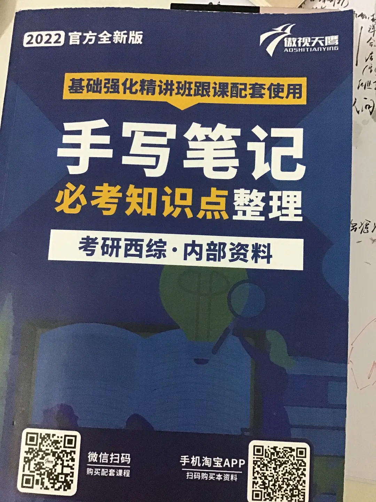

没想到有一天我也会写背书的帖子😂。

今年楼主准备考研，前三个月才磨磨蹭蹭看专业课，近十天才开始背诵，记录一下如何背一本应付考试的书，短时间内不容易遗忘，做题比较顺利。

整体框架思路是不断重复默写。

1.首先准备考试大纲，一本相关考试资料的书，最好是考试重点啥都给你标出来。

根据考纲分门别落罗列好重点，这样自己就不用整理并且翻来覆去找。

没有的话就根据近几年真题总结具体出题方向，总结归纳知识点。

考前几月集中背诵不能找大部头来为难自己，能少则少。

© 版权所有

2.拿出一打白纸，一枝红笔黑笔，红笔圈关键字，黑笔准备默写。

（1）手机暂时扔到一边，打开书本，红笔圈关键字，一个字即可。

补充：关键字的目的是让你在比较短的时间内熟悉文本，脑内残余印象。

再再补充：

圈关键字的方法：一般来说，考试无非考的定义，名词解释，运用等。

某某例子证明什么，某某跟某某有什么相同、不同，某某出了问题可以用什么某某解决，某某体现其中的一点等等。

根据以上思路去圈关键字，不要贪多，抓住重点。

了解出题方式，灵活运用。

（2）圈完开始默写，看一行，盖住知识点，标数字，直接默写下关键字跟后面的字眼。

补充：默写格式没有专门限制，标数字是为了辅助记忆，标个ABC也行的，适当使用符号。

主要技巧是写下关键字的同时心中必须要对后面的内容有数，不是照抄，一定是能写下来关键字、可以不写关键字但是记得内容。

一个大知识点下分小知识点：

如主楼所示肺气肿这页：

大标题写：

1:类型

小标题写：

1:中央，慢支，中扩，周不扩

2.周腺远，周扩，瘢肺

3.全腺小叶，两扩

依此类推。

人的记忆容量有限，逐字逐句背下来太难了，不是天才且又没那么多时间，集中精力的时间又有限，还是个学渣……就只能想办法减少字数了，都是背，这样精简字数后背一页的时间可以背两页，一本五百多页逐字逐句都可能考的知识点，精简到二百五十多页能减少多少脑细胞的死亡。

（3）重复一整页，看完不能马上写出来并且有错误的重新订正默写。

有的一眼看完并不能马上写出来，多看几次，多写几次，直到能默出来为止。

看一行，默一行。

一行结束接下行，不断重复执行操作直到默完一整页。

迟迟默不准的，看一眼，继续写，默写到完全正确为止。

（4）拿出一页单独的纸抄写关键字。

默完了，抄写关键字。

此时经过（1），（2），（3），步骤的执行，心里相当熟悉知识点，所以写关键字基本扫一眼就知道后面的内容。

（5）晚上拿出半小时或一小时回忆默写。

仍旧写关键字跟后面的字眼，写完订正，睡前翻一翻默写的东西然后睡觉。

（6）放平心态，浪。

© 版权所有

© 版权所有

3.一天大概花四个小时背诵，五天或一周可背完一本。

两三天内不容易遗忘，做题大概扫完就知道答案，缺点是背完脑子会很痛，有点抓狂但又有种莫名的爽感。

据楼主背完的经验看，背完一本得休息一下，并且一轮背诵时间至多不超过四十分钟，当天背完绝对不想再碰。

PS：最关键的一步是默写的过程，排序次要。

能写就一定会背。

背关键字的目的在于减少记忆讯息量，更少的时间背更多的东西，抛弃芜杂。

只圈一个关键字是在后期的过程中哪怕只记得前面一个字，仍然可以通过默写识记积累的经验补足。

记少记精不记多。

（1）四十分钟指的是从开始背到你觉得累的时间段，背了一轮休息后可以来上第二轮，第三轮。

（2）背诵时间集中精力长短因人而异。

（3）背诵时间计算一定是高度集中精力默写，不被任何东西打扰的。

不是一边听手机放歌一边默写，能记住但是效果会打折扣。

（4）前期背得慢，后期因为熟悉速度会加快，不用担心背不完，放平心态，稳住。

11月4日补充：有友人反应背得快忘得也快的问题。

那啥，重复是记忆它老母，一遍过完会忘记，但是重复第二次第三次基本会越记越快，越记越牢。

只需多重复，多看，多写。

11月12日:评论下有人求做视频，楼主挠破脑袋勉强做了个文字精简版。

对着镜头说话演示实在无能，随便看看。主要还是看文字描述。

https://share.api.weibo.cn/share/261580819.html?weibo_id=4702654398202915

4.再再再补充：有不少跟楼主一样是医学狗啊……补充一点楼主对考试心态的想法。（学霸绕道）

楼主是个学渣，社会摸爬滚打几年后被生活教育，认为还是得有门手艺吃饭，于是屁颠屁颠回本专业考研了。

准备的时间晚，10月份才决定考研，中间各种心态崩溃，后来慢慢调整过来。

首先不论考不考得上，先稳住心态，只要不考数学，一切好说，考前的任何垂死挣扎都是有用的。

考不过没关系，大不了明年再来一年，就当是今年攒经验。

不要想着放弃，这不还有五十多天，背背重点，刷刷单词，哪怕只有一点也可以。

坚持到最后的人就已经是个胜利者，一时的得失成败不决定你的整段生命，而是某个阶段没有按照你意愿规划的别种答案。

人生不可能事事遂意，也未必总是逆境，但稳住心态，明白考试就只是一场考试，考的是知识储备量，失败了也真的没啥。

再者，万一呢？万一踩上线了呢？万一就是那个少数呢？偏偏那个人就是你或我呢？

虽然大多不可能，但是不要熄灭那点希望的火焰。

放平一些，累了就躺一下，吃些好吃的，玩一会儿手机，没有关系的。

只要前进，慢慢走也没关系。

但是一定要走，不要真的不去看，不去学习。

不把宝贵的时间浪费在对结果的怀疑跟焦虑上，那还真不如单纯玩手机看视频来得快乐。

要以行动击败焦虑，怀疑。

5.最后的补充，有人问英语这法子怎么用，那再更新一下（仅适用于学渣背单词）

（1）找一本书：由大量待背单词组成句子的书，书要薄，带有中英文的单个单词解释。

厚了心理压力太大遭不住，薄了连续背上两个月也能背完。

如这种（不是软广，就它最便宜，才9.9，楼主目前靠前几月的工资养活自己，能省则省）

用阅读真题也可以，但一个个查单词去浪费时间，后期冲刺时间大部分应该留给专业课。

© 版权所有

（2）熟读单词数遍，圈要背的单词，开始默写整个句子。

起初只能零散写一两个，看一遍英文中文，直接默写。

默错多看几遍，用手抄一下单词，找找手感，或者嘴头默念，然后默写。

默写到整句正确为止。

重复一整页的所有句子，直至全部默写完。

一天一版大概七八个句子，耗费二十分钟至半小时。

有时间多背一点，没时间少背一点。

（3）晚上或者任何时间段复习看看单词就可以。

上厕所，洗脸刷牙，随手翻一翻，因为句子记得很熟所以背单词毫无压力。一天记十来二十个也不浪费很大力气。

（4）上哔哩哔哩搜索真题英语短语的视频，从05年到20年都有，一年的短语视频大概是两分多钟，楼主背专业课背烦了会用它来磨磨耳朵，顺带拿出笔听写，然后抄成便签贴在各个角落，刷牙时看一下，梳头发看一下，总之不要特地拿很长的时间去搞英语单词背诵，背单词适合零散时间。

6.如果姐妹要问政治的话，楼主今年的还没开始，打算直接上真题跟肖四肖八。

毕业的第一年随大流逃避工作选择考研，结果心情每天丧逼，叹气当头，也没好好准备，专业课惨败，政治考了75，没看任何视频课，纯粹刷1000题跟背肖四肖八。

姐妹可以选择性借鉴楼主当时的做法。

（1）刷完选择题后仔细阅读书本后的答案解读，错误的用红笔圈出来，然后多看多对比，这一步很重要，要多花时间。

（2）大题直接肖四肖八，字写工整一点。

按数字标写答案，马原跟哲学最好写，某某题干中的某某事体现某某观点，什么物质的同一性，事物处在运动变化之中，意识反作用于物质等等等，把想到的全部堆上去。

然后写措施，万能金句，实事求是，用辩证的观点看问题等等。

备考的姐妹应该比我这个还没看的都熟……😂

7.😂，写完了，楼主沉沦书海去了。

希望考试的姐妹们都顺利上岸！心想事成！

来自 [豆瓣App](https://www.douban.com/doubanapp/app?channel=from_group_topic)

[投诉](javascript:void(0))

​                        

​            [                 ](javascript:void(0);)